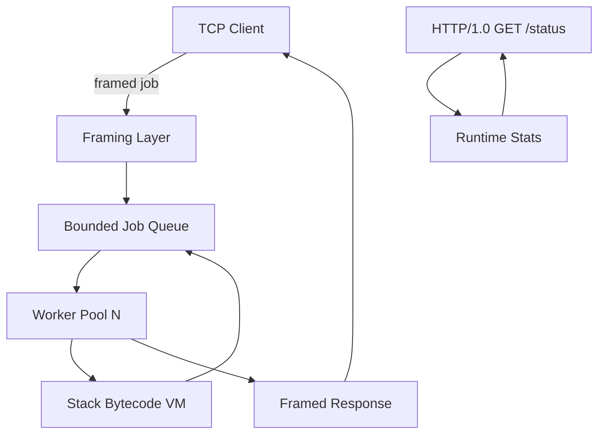

# Concurrent Runtime and Protocol Workbench

## One-Line Purpose

Integrate the CS mechanism labs into a **local workbench**: framed TCP jobs execute **toy bytecode** on **bounded worker pools** with **backpressure**, expose **HTTP/1.0 status**, and ship **failure-mode demos**—without databases, frameworks, or containers.

## Status

`building` — documentation active; implementation in [[01-Computer-Science/code/README|code labs]].

## Document Map

| Document | Purpose |
| --- | --- |
| [[01-Computer-Science/projects/Concurrent Runtime and Protocol Workbench/Planning\|Planning]] | Scope, milestones, risks |
| [[01-Computer-Science/projects/Concurrent Runtime and Protocol Workbench/Requirements\|Requirements]] | Functional and non-functional requirements |
| [[01-Computer-Science/projects/Concurrent Runtime and Protocol Workbench/Architecture\|Architecture]] | System shape and major components |
| [[01-Computer-Science/projects/Concurrent Runtime and Protocol Workbench/Database\|Database]] | N/A — explicit non-goal |
| [[01-Computer-Science/projects/Concurrent Runtime and Protocol Workbench/API\|API]] | Framed TCP + HTTP interfaces |
| [[01-Computer-Science/projects/Concurrent Runtime and Protocol Workbench/Deployment\|Deployment]] | Local run and CI path |
| [[01-Computer-Science/projects/Concurrent Runtime and Protocol Workbench/Security\|Security]] | Threat model for local-only scope |
| [[01-Computer-Science/projects/Concurrent Runtime and Protocol Workbench/Testing\|Testing]] | Verification strategy |
| [[01-Computer-Science/projects/Concurrent Runtime and Protocol Workbench/Monitoring\|Monitoring]] | Metrics and health signals |
| [[01-Computer-Science/projects/Concurrent Runtime and Protocol Workbench/Engineering Journal\|Engineering Journal]] | Session logs |
| [[01-Computer-Science/projects/Concurrent Runtime and Protocol Workbench/Debug Diary\|Debug Diary]] | Bug investigations |
| [[01-Computer-Science/projects/Concurrent Runtime and Protocol Workbench/Known Issues\|Known Issues]] | Open defects and debt |
| [[01-Computer-Science/projects/Concurrent Runtime and Protocol Workbench/Lessons Learned\|Lessons Learned]] | Durable takeaways |
| [[01-Computer-Science/projects/Concurrent Runtime and Protocol Workbench/Postmortem\|Postmortem]] | Incident retrospectives |
| [[01-Computer-Science/projects/Concurrent Runtime and Protocol Workbench/Ideas\|Ideas]] | Future directions |
| [[01-Computer-Science/projects/Concurrent Runtime and Protocol Workbench/Roadmap\|Roadmap]] | Phased delivery |
| [[01-Computer-Science/projects/Concurrent Runtime and Protocol Workbench/ADR/0001-framing-protocol\|ADR-0001]] | Framing protocol decision |
| [[01-Computer-Science/projects/Concurrent Runtime and Protocol Workbench/ADR/0002-concurrency-model\|ADR-0002]] | Concurrency model decision |

## Context

Learners completing the CS mini projects need a **capstone-shaped integration** that mirrors production boundaries: length-prefixed messages on TCP, a worker queue with saturation behavior, a bytecode execution path, and a minimal observability surface (HTTP status). The workbench stays deliberately small—stdlib and Node core modules only.

## Goals

- Accept framed job messages over TCP and return framed results
- Execute submitted bytecode on the stack VM with explicit error propagation
- Route work through a bounded buffer and fixed worker count (backpressure)
- Serve `GET /status HTTP/1.0` with queue depth and worker saturation
- Demonstrate CRC failure, queue full, and VM fault paths
- Maintain TypeScript and Python parity in [[01-Computer-Science/code/README|code labs]]

## Non-Goals

- **Databases** — no persistence layer; in-memory only
- **Web frameworks** — raw sockets and hand-written HTTP/1.0
- **Containers / orchestration** — local process only
- **Distributed consensus** — single-node workbench
- **Production authentication** — loopback-trust model; no OAuth/TLS ops

## Tech Stack

- **Languages:** TypeScript (Node), Python 3 (stdlib)
- **Runtime:** Node.js ESM, CPython
- **Data stores:** None (in-memory queues and counters)
- **Messaging:** Custom length-prefixed TCP framing + CRC32
- **Infra:** Local dev + CI unit/integration tests

## Architecture Snapshot



## How to Run Locally

Implementation is composed from labs under `01-Computer-Science/code/`. Run the full paired test suites:

### TypeScript

```bash
cd 01-Computer-Science/code/typescript
npm install
npm test
```

### Python

```bash
cd 01-Computer-Science/code/python
python -m unittest discover -s tests -v
```

Module map: `framing` + `vm` + `runtime` + `netdemo` compose the workbench. Extend with a thin `workbench.ts` / `workbench.py` orchestrator when wiring the long-lived server (see [[01-Computer-Science/projects/Concurrent Runtime and Protocol Workbench/Roadmap|Roadmap]] P1).

## Acceptance Checklist

- [ ] Requirements in [[01-Computer-Science/projects/Concurrent Runtime and Protocol Workbench/Requirements|Requirements]] are measurable
- [ ] ADR-0001 and ADR-0002 document framing and concurrency choices
- [ ] Security scope acknowledges local-only trust (no prod auth)
- [ ] Testing covers happy path, CRC reject, queue saturation, VM fault
- [ ] HTTP `/status` returns queue depth and worker count
- [ ] Both language test suites pass in CI
- [ ] Failure-mode demos documented in [[01-Computer-Science/projects/Concurrent Runtime and Protocol Workbench/Testing|Testing]]

## Related Notes

- [[01-Computer-Science/projects/Binary Protocol Lab/README|Binary Protocol Lab]]
- [[01-Computer-Science/projects/Stack Machine/README|Stack Machine]]
- [[01-Computer-Science/projects/Concurrency Zoo/README|Concurrency Zoo]]
- [[01-Computer-Science/projects/Socket Workshop/README|Socket Workshop]]
- [[01-Computer-Science/code/README|Computer Science Code Labs]]
- [[01-Computer-Science/README|Computer Science]]
- [[Projects/README|Projects]]
