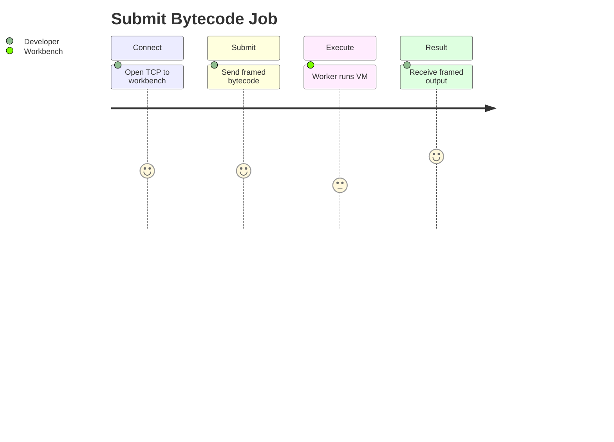

# Requirements — Concurrent Runtime and Protocol Workbench

## Actors

| Actor | Goals |
| --- | --- |
| Developer | Submit bytecode jobs, inspect status, learn failure modes |
| Test harness | Automate parity checks across TS and Python |
| Workbench process | Execute jobs fairly, reject overload, report health |

## Functional Requirements

| ID | Requirement | Priority | Acceptance criteria |
| --- | --- | --- | --- |
| FR-001 | Accept TCP connections on configurable loopback port | must | Client connects; server accepts |
| FR-002 | Decode length-prefixed CRC32 frames | must | Valid frame parsed; bad CRC rejected with error frame |
| FR-003 | Enqueue decoded jobs in bounded buffer | must | When full, reject with `queue_full` error |
| FR-004 | Worker pool executes bytecode via stack VM | must | Valid program returns VM output in response frame |
| FR-005 | Propagate VM faults without crashing server | must | `VmError` mapped to `vm_fault` response |
| FR-006 | Respond with framed JSON or binary envelope | must | Client can decode response without ambiguity |
| FR-007 | HTTP/1.0 `GET /status` returns JSON stats | must | Body includes `queue_depth`, `workers`, `capacity` |
| FR-008 | Failure-mode demos documented and testable | should | CRC bad, queue full, div-by-zero each reproducible |

## Non-Functional Requirements

| ID | Category | Requirement | Measurement |
| --- | --- | --- | --- |
| NFR-001 | Latency | Single job on idle server | Completes under 100 ms in local tests |
| NFR-002 | Availability | Bad job isolation | Server accepts next job after VM fault |
| NFR-003 | Security | Local trust boundary | Binds 127.0.0.1 by default; no secrets in repo |
| NFR-004 | Observability | Status endpoint | Fields documented in [[01-Computer-Science/projects/Concurrent Runtime and Protocol Workbench/API\|API]] |
| NFR-005 | Maintainability | Dual-language parity | Both test suites green on same vectors |

## User Journeys

## Edge Cases

- Partial frame arrives across multiple `read()` calls
- Empty payload frame
- Maximum-length payload at cap
- Client disconnects mid-job
- All workers busy; queue at capacity
- Duplicate connect storms during test parallelization

## Explicit Non-Requirements

- Persistent job storage or replay
- Multi-tenant isolation
- TLS, OAuth, API keys
- Horizontal scaling across machines
- Container images or Helm charts

## Traceability

| Requirement | Architecture component | Test case |
| --- | --- | --- |
| FR-002 | Framing codec | `test_framing` CRC mismatch |
| FR-003 | BoundedBuffer | `test_runtime` tryPush saturation |
| FR-004 | Stack VM | `test_vm` assemble/run |
| FR-005 | Worker wrapper | Planned integration test |
| FR-007 | HTTP parser | `test_runtime` parse/format |
| FR-008 | Demo scripts | [[01-Computer-Science/projects/Concurrent Runtime and Protocol Workbench/Testing\|Testing]] |

## Related Documents

- [[01-Computer-Science/projects/Concurrent Runtime and Protocol Workbench/Planning|Planning]]
- [[01-Computer-Science/projects/Concurrent Runtime and Protocol Workbench/Testing|Testing]]
- [[01-Computer-Science/projects/Concurrent Runtime and Protocol Workbench/Security|Security]]
