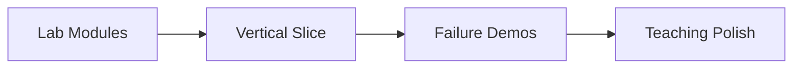

# Roadmap — Concurrent Runtime and Protocol Workbench

## Current Phase

**P0 complete** — lab modules and documentation active. **P1 in progress** — integration slice.

## Phases

| Phase | Outcome | Exit criteria |
| --- | --- | --- |
| P0 | Isolated labs + docs | Mini-project READMEs; code tests green |
| P1 | TCP job round-trip | Integration test; optional long-lived server |
| P2 | Failure demos | CRC, queue_full, vm_fault scripted |
| P3 | Curriculum hooks | Exercises link to workbench scenarios |

## Now / Next / Later

### Now

- Portfolio documentation set (this folder)
- ADR-0001 framing, ADR-0002 concurrency

### Next

- Long-lived workbench process (`workbench.ts` / `workbench.py`)
- Streaming frame decoder with partial reads
- HTTP `/status` wired to live counters

### Later

- VM instruction budget (see [[01-Computer-Science/projects/Concurrent Runtime and Protocol Workbench/Ideas|Ideas]] I-001)
- Optional hex-dump debug CLI
- Capstone interview question set

## Completed

| Item | Date | Notes |
| --- | --- | --- |
| Code labs scaffold | 2026-07-21 | bits, framing, utf8, float, vm, parser, runtime, netdemo |
| Mini-project docs | 2026-07-21 | Five labs under `projects/` |
| Portfolio doc set | 2026-07-21 | Full template instantiation |

## Related Documents

- [[01-Computer-Science/projects/Concurrent Runtime and Protocol Workbench/Planning|Planning]]
- [[01-Computer-Science/projects/Concurrent Runtime and Protocol Workbench/Ideas|Ideas]]
- [[01-Computer-Science/projects/Concurrent Runtime and Protocol Workbench/Known Issues|Known Issues]]
