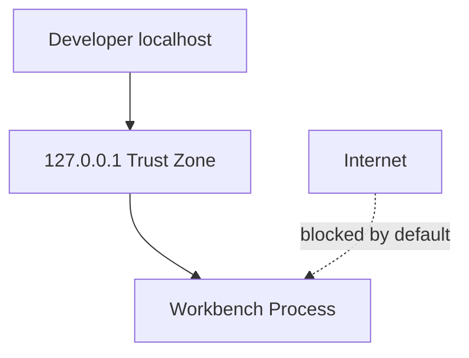

# Security — Concurrent Runtime and Protocol Workbench

## Trust Boundaries

Production authentication, TLS, and WAF are **explicit non-goals**. This document defines the **local lab threat model** only.

## Assets

| Asset | Sensitivity | Location |
| --- | --- | --- |
| Bytecode job input | Low (user-supplied lab data) | TCP frame payload |
| VM execution | Medium (DoS via infinite loop if added) | Worker process |
| Status metrics | Low | HTTP `/status` |

## Threat Model (STRIDE-oriented)

| Threat | Example | Mitigation |
| --- | --- | --- |
| Spoofing | Remote client pretends to be admin | Bind `127.0.0.1` only by default |
| Tampering | Bit flip on wire | CRC32 detect (not prevent adversary) |
| Repudiation | Unknown job submitter | No audit log (accepted) |
| Information disclosure | Status leaks queue depth | Acceptable on localhost |
| Denial of service | Huge length field | Max frame size cap before alloc |
| Elevation of privilege | N/A | No auth surface |

## Controls

- **Authentication:** None — do not expose beyond loopback
- **Authorization:** N/A
- **Encryption in transit:** None — use TLS track for production patterns
- **Encryption at rest:** N/A — no database
- **Secrets management:** No secrets
- **Input validation:** Frame length cap; JSON schema check; VM timeout (future)
- **Dependency scanning:** Standard npm/pip hygiene in CI
- **Audit logging:** Optional stdout trace for demos

## Abuse Cases

- Attacker on same machine connects if bound to `0.0.0.0` — **misconfiguration**; document safe defaults
- Malicious bytecode exhausts CPU — mitigate with instruction budget (Ideas backlog)
- Memory exhaustion via max length — enforce `MAX_FRAME_BYTES` before buffer alloc

## Incident Response Hooks

- **Who is paged:** N/A (educational project)
- **Evidence:** Test logs, framed hex dump
- **Customer notification:** N/A

## Checklist

- [x] Least privilege: loopback bind default
- [x] No secrets in repository
- [x] Frame size bound documented in ADR-0001
- [ ] Instruction budget for VM (future hardening)

## Related Documents

- [[01-Computer-Science/projects/Concurrent Runtime and Protocol Workbench/API|API]]
- [[01-Computer-Science/projects/Concurrent Runtime and Protocol Workbench/Deployment|Deployment]]
- [[01-Computer-Science/projects/Concurrent Runtime and Protocol Workbench/ADR/0001-framing-protocol|ADR-0001]]
