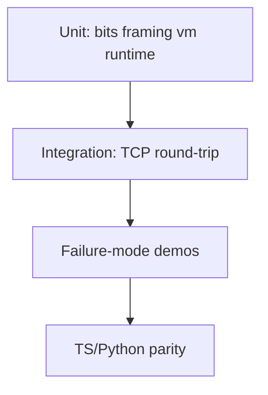

# Testing — Concurrent Runtime and Protocol Workbench

## Strategy



## Test Pyramid Targets

| Layer | Goal | Notes |
| --- | --- | --- |
| Unit | Fast feedback on each lab module | Vitest + unittest in [[01-Computer-Science/code/README\|code labs]] |
| Integration | Framed job over loopback TCP | Extend `netdemo` pattern |
| Contract | JSON job/response schema | Shared fixtures |
| E2E | Full workbench process | Roadmap P1 long-lived server |
| Non-functional | Queue saturation timing | Local only |

## Critical Paths to Cover

1. Happy path: `(2+3)*4` bytecode → output `[20]`
2. CRC mismatch → `crc_mismatch` error frame
3. Queue full → `queue_full` without blocking client forever
4. VM div-by-zero → `vm_fault`
5. HTTP `/status` fields match in-memory queue state

## Failure-Mode Demos

| Demo | Setup | Expected |
| --- | --- | --- |
| Bad CRC | Flip last byte of frame | Decode error / error response |
| Queue full | `capacity=1`, submit 2 jobs without consumer | Second reject |
| VM fault | Bytecode with `DIV` by zero | `vm_fault` message |
| Partial frame | Send only length prefix | Decoder waits or errors cleanly |

## Run Commands

### TypeScript

```bash
cd 01-Computer-Science/code/typescript
npm install
npm test
```

### Python

```bash
cd 01-Computer-Science/code/python
python -m unittest discover -s tests -v
```

Current coverage: `tests/labs.test.ts` and `tests/test_labs.py` exercise all composing modules (`bits`, `framing`, `vm`, `parser`, `runtime`, `netdemo`).

## Data and Fixtures

- Bytecode vector: `assemble([(PUSH,2),(PUSH,3),ADD,(PUSH,4),MUL,PRINT,HALT])`
- JSON job wrapper examples in [[01-Computer-Science/projects/Concurrent Runtime and Protocol Workbench/API|API]]
- CRC test vectors shared between languages

## Definition of Done for a Change

- [ ] Both language test suites pass
- [ ] Failure modes asserted, not only happy path
- [ ] API.md updated if wire format changes
- [ ] ADR updated if architectural decision changes

## Related Documents

- [[01-Computer-Science/projects/Concurrent Runtime and Protocol Workbench/Requirements|Requirements]]
- [[01-Computer-Science/projects/Concurrent Runtime and Protocol Workbench/API|API]]
- [[01-Computer-Science/projects/Concurrent Runtime and Protocol Workbench/Known Issues|Known Issues]]
