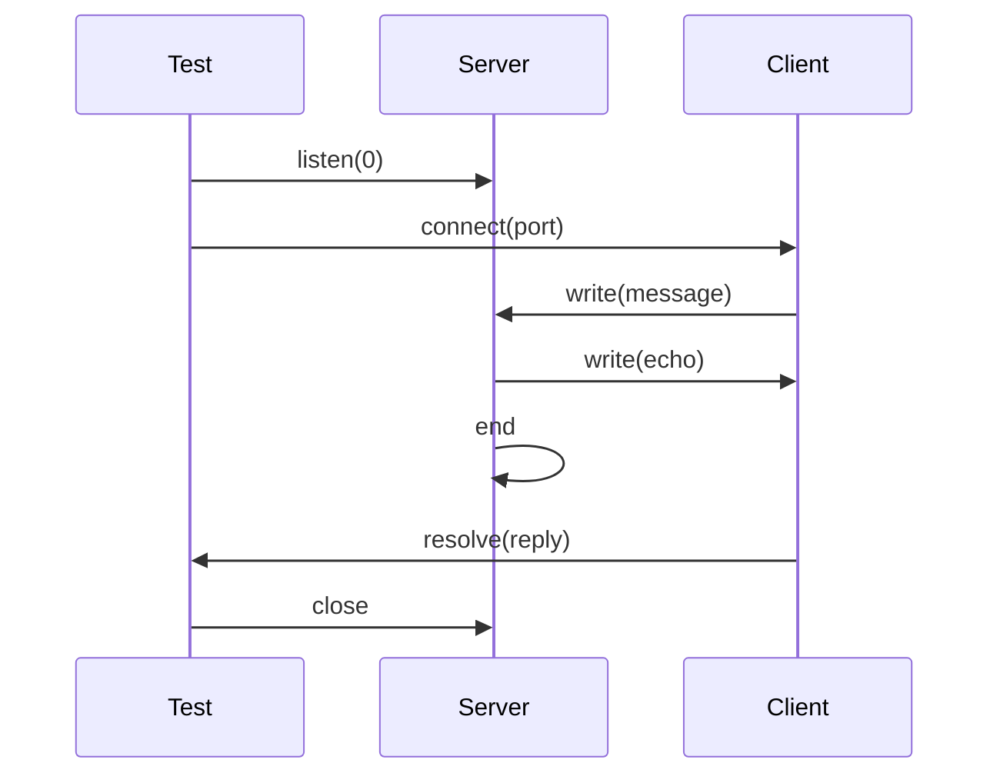
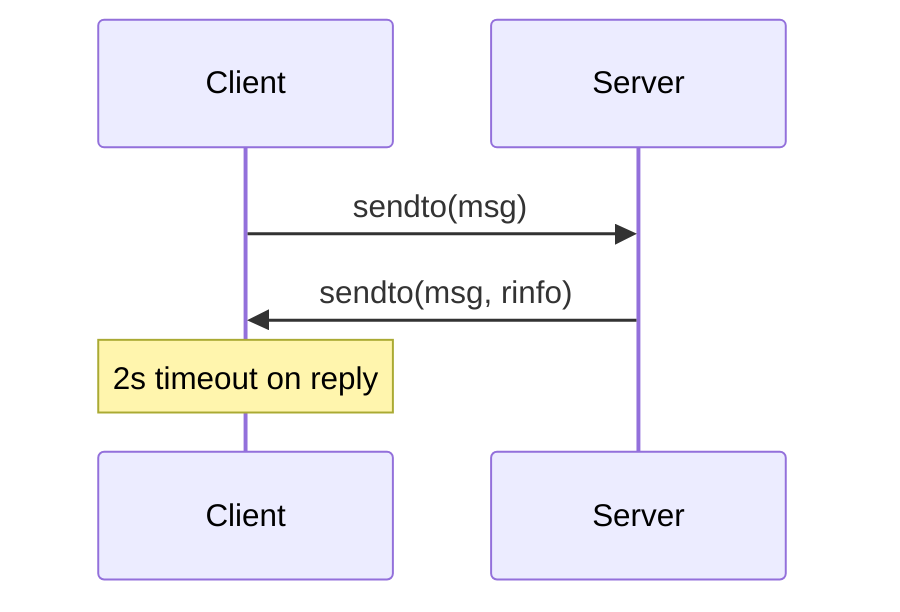
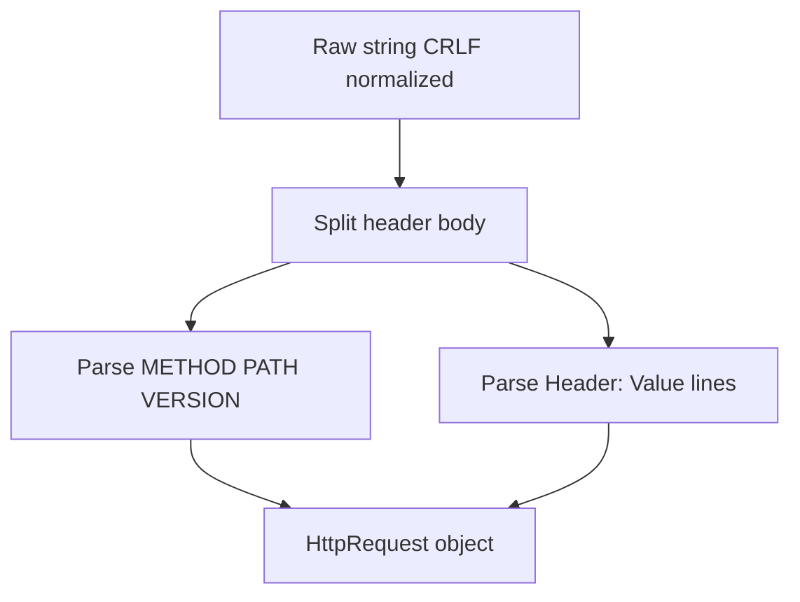
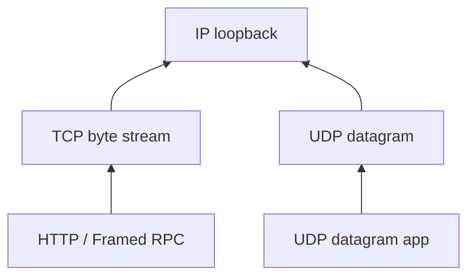

# Architecture — Socket Workshop

## TCP Echo Lifecycle

## UDP Echo Lifecycle

## HTTP/1.0 Parser Scope

Supported for lab purposes:

- Request line: `GET /path HTTP/1.0`
- Headers terminated by blank line
- Response: status line + optional body string via `format_http_response`

Not in scope: chunked transfer, persistent connections, trailing headers.

## Layer Placement

## Related Documents

- [[01-Computer-Science/projects/Socket Workshop/README|README]]
- [[01-Computer-Science/code/typescript/src/netdemo.ts|netdemo.ts]]
- [[01-Computer-Science/code/python/seb_cs/netdemo.py|netdemo.py]]
