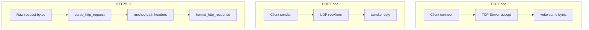

# Socket Workshop

## Purpose

Wire up **TCP and UDP echo servers**, parse a minimal **HTTP/1.0** request, and format status-line responses—all without frameworks. You will bind ephemeral ports, exchange bytes over loopback, and see how application protocols sit on stream and datagram transports. This is the foundation for the portfolio workbench’s framed TCP protocol and status interface.

## Prerequisites

- [[01-Computer-Science/04-Processes-and-Execution/Processes|Processes]]
- [[01-Computer-Science/04-Processes-and-Execution/System Calls|System Calls]]
- [[01-Computer-Science/07-Networking-Fundamentals/Layered Network Models|Layered Network Models]]
- [[01-Computer-Science/07-Networking-Fundamentals/Sockets Programming Model|Sockets Programming Model]]
- [[01-Computer-Science/07-Networking-Fundamentals/TCP|TCP]]
- [[01-Computer-Science/07-Networking-Fundamentals/UDP|UDP]]
- [[01-Computer-Science/07-Networking-Fundamentals/HTTP as a Protocol|HTTP as a Protocol]]

## Architecture



See [[01-Computer-Science/projects/Socket Workshop/Architecture|Architecture]] for lifecycle detail.

## Acceptance Criteria

- [ ] `tcpEchoOnce("ping")` returns `"ping"` over loopback
- [ ] `udpEchoOnce("pong")` returns `"pong"` within timeout
- [ ] `parse_http_request` extracts method, path, version, and headers from a minimal GET
- [ ] `format_http_response(200, "ok")` includes `HTTP/1.0 200 OK` status line
- [ ] Servers bind port `0` and clean up sockets after each test
- [ ] TypeScript and Python suites pass `test_netdemo` and HTTP cases in `test_runtime`
- [ ] You can explain TCP stream vs UDP datagram semantics for echo

## Run and Test

| Language | Source modules | Tests |
| --- | --- | --- |
| TypeScript | `code/typescript/src/netdemo.ts`, `code/typescript/src/runtime.ts` | `tests/labs.test.ts` |
| Python | `code/python/seb_cs/netdemo.py`, `code/python/seb_cs/runtime.py` | `tests/test_labs.py` |

### TypeScript

```bash
cd 01-Computer-Science/code/typescript
npm install
npm test
```

### Python

```bash
cd 01-Computer-Science/code/python
python -m unittest discover -s tests -v
```

## Trade-offs

| Choice | Benefit | Cost |
| --- | --- | --- |
| Ephemeral ports in tests | No port conflicts | Slightly slower test setup |
| HTTP/1.0 only | Simple status interface | No chunked encoding, HTTP/2 |
| One-shot echo servers | Isolated tests | Not long-lived production server |
| Loopback-only defaults | Safe CI | Does not exercise real NIC paths |

## Engineering Reflection Prompts

1. Why can a single `read()` return half an HTTP header?
2. What happens if UDP echo reply goes to the wrong port?
3. How would you add a connection timeout on TCP accept?
4. Compare blocking echo vs event-loop echo for 10k connections.
5. Where would TLS terminate relative to your HTTP parser?

## Related Notes

- [[01-Computer-Science/projects/Socket Workshop/Architecture|Architecture]]
- [[01-Computer-Science/projects/Binary Protocol Lab/README|Binary Protocol Lab]] — frames ride on TCP byte streams
- [[01-Computer-Science/projects/Concurrent Runtime and Protocol Workbench/README|Concurrent Runtime and Protocol Workbench]]
- [[01-Computer-Science/07-Networking-Fundamentals/Sockets Programming Model|Sockets Programming Model]]
- [[01-Computer-Science/code/README|Computer Science Code Labs]]
