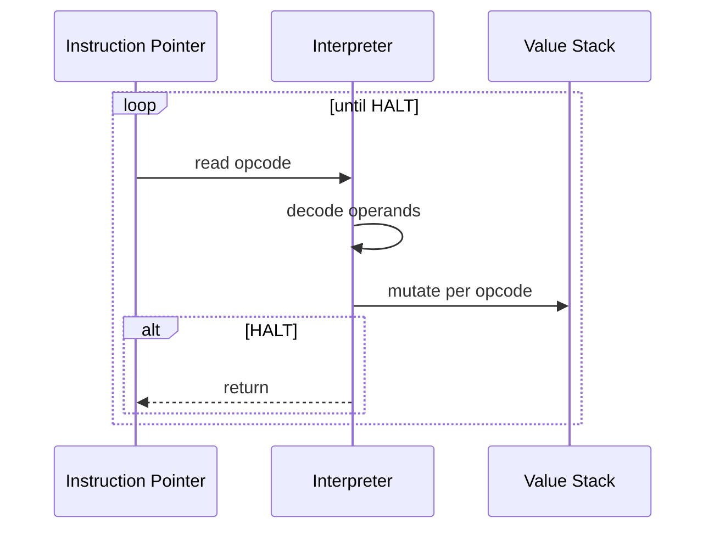

# Architecture — Stack Machine

## Opcode Map

| Opcode | Value | Operands | Effect |
| --- | --- | --- | --- |
| `PUSH` | 1 | u16 immediate | Push 16-bit signed value |
| `ADD` | 2 | — | Pop b, a; push a+b |
| `SUB` | 3 | — | Pop b, a; push a−b |
| `MUL` | 4 | — | Pop b, a; push a×b |
| `DIV` | 5 | — | Pop b, a; push trunc(a/b); error if b=0 |
| `PRINT` | 6 | — | Append stack top to output trace |
| `HALT` | 7 | — | Stop; return stack and output |

## Execution Loop

## Parser Pipeline

The FSM helper (`transition`) is orthogonal—used to model connection states alongside parsing exercises in [[01-Computer-Science/08-Languages-and-Computation/Finite State Machines|Finite State Machines]].

## Failure Modes

| Event | Detection | User-visible behavior |
| --- | --- | --- |
| Stack underflow | `stack.length < required` | `VmError: stack underflow` |
| Truncated PUSH | IP past end mid-operand | `VmError: truncated PUSH` |
| Unknown opcode | default switch branch | `VmError: unknown opcode N` |
| Missing HALT | IP reaches end | `VmError: program ended without HALT` |

## Related Documents

- [[01-Computer-Science/projects/Stack Machine/README|README]]
- [[01-Computer-Science/code/typescript/src/vm.ts|vm.ts]]
- [[01-Computer-Science/code/python/seb_cs/vm.py|vm.py]]
