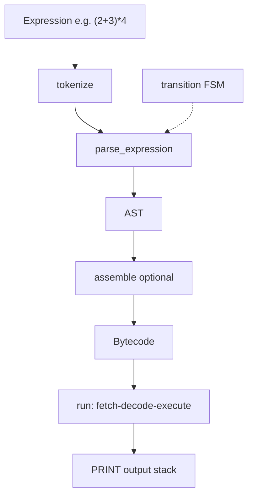

# Stack Machine

## Purpose

Implement a **toy stack bytecode virtual machine** and a minimal expression front-end (tokenizer, parser, FSM transition helper). You will assemble opcodes, run a fetch-decode-execute loop, and observe stack underflow, division-by-zero, and unknown-opcode failures. This is the same architectural skeleton behind JVM, CLR, WebAssembly, and Lua—stripped to integers and seven opcodes.

## Prerequisites

- [[01-Computer-Science/02-Machine-Model/Fetch Decode Execute|Fetch Decode Execute]]
- [[01-Computer-Science/02-Machine-Model/CPU and Instruction Set Architecture|CPU and Instruction Set Architecture]]
- [[01-Computer-Science/03-Memory-and-Addressing/Stack and Heap|Stack and Heap]]
- [[01-Computer-Science/08-Languages-and-Computation/Finite State Machines|Finite State Machines]]
- [[01-Computer-Science/08-Languages-and-Computation/Grammars and Parsing|Grammars and Parsing]]
- [[01-Computer-Science/08-Languages-and-Computation/Compilers Interpreters and Virtual Machines|Compilers Interpreters and Virtual Machines]]

## Architecture



See [[01-Computer-Science/projects/Stack Machine/Architecture|Architecture]] for opcode map and VM loop detail.

## Acceptance Criteria

- [ ] Opcodes `PUSH`, `ADD`, `SUB`, `MUL`, `DIV`, `PRINT`, `HALT` execute correctly on a value stack
- [ ] `assemble([(PUSH,2),(PUSH,3),ADD,(PUSH,4),MUL,PRINT,HALT])` yields output `[20]`
- [ ] `eval_expr(parse_expression("(2+3)*4"))` returns `20` without bytecode
- [ ] Division by zero and stack underflow raise explicit `VmError` / equivalent
- [ ] FSM `transition("closed","connect")` returns `"connecting"`
- [ ] TypeScript and Python test suites pass `test_vm` and `test_parser`
- [ ] You can single-step one opcode and predict stack contents

## Run and Test

| Language | Source modules | Tests |
| --- | --- | --- |
| TypeScript | `code/typescript/src/vm.ts`, `code/typescript/src/parser.ts` | `tests/labs.test.ts` |
| Python | `code/python/seb_cs/vm.py`, `code/python/seb_cs/parser.py` | `tests/test_labs.py` |

### TypeScript

```bash
cd 01-Computer-Science/code/typescript
npm install
npm test
```

### Python

```bash
cd 01-Computer-Science/code/python
python -m unittest discover -s tests -v
```

## Trade-offs

| Design | Benefit | Cost |
| --- | --- | --- |
| Stack ISA | Compact instructions, easy codegen | Deep stacks, no registers for locals |
| Direct AST eval | Faster to ship | Skips bytecode teaching path |
| 16-bit immediate on PUSH | Simple encoding | Limited constant range |
| Integer-only arithmetic | Predictable semantics | No float edge cases in VM |

## Engineering Reflection Prompts

1. What would you add to support local variables without a register file?
2. How does your VM loop map to hardware fetch-decode-execute?
3. Where would you insert a verifier pass before executing untrusted bytecode?
4. Compare stack vs register VMs for code size and dispatch overhead.
5. How would you add a `CALL` opcode and return stack?

## Related Notes

- [[01-Computer-Science/projects/Stack Machine/Architecture|Architecture]]
- [[01-Computer-Science/projects/Concurrent Runtime and Protocol Workbench/README|Concurrent Runtime and Protocol Workbench]] — executes bytecode jobs
- [[01-Computer-Science/08-Languages-and-Computation/Bytecode and JIT Compilation|Bytecode and JIT Compilation]]
- [[01-Computer-Science/code/README|Computer Science Code Labs]]
