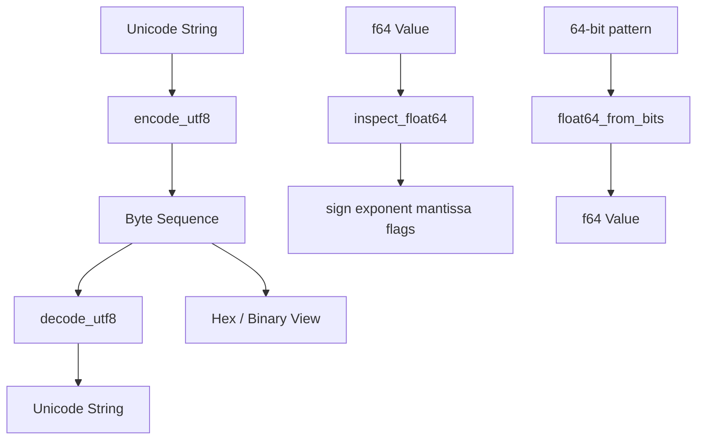

# UTF-8 and Float Inspector

## Purpose

Make **text and floating-point representation visible**. Implement a strict UTF-8 codec that rejects malformed sequences (overlong encodings, truncated multibyte runs) and an IEEE-754 double inspector that decomposes values into sign, exponent, mantissa, and special-case flags. Production bugs in billing, search, and financial code often trace to encoding or float semantics—this lab builds the inspection habits that catch them early.

## Prerequisites

- [[01-Computer-Science/01-Information-and-Representation/Bits Bytes and Information|Bits Bytes and Information]]
- [[01-Computer-Science/01-Information-and-Representation/Number Systems|Number Systems]]
- [[01-Computer-Science/01-Information-and-Representation/Character Encoding|Character Encoding]]
- [[01-Computer-Science/01-Information-and-Representation/Floating Point|Floating Point]]
- [[01-Computer-Science/01-Information-and-Representation/Integer Representation|Integer Representation]]

## Architecture



## Acceptance Criteria

- [ ] `encode_utf8` / `decode_utf8` round-trip BMP and supplementary characters (`A`, `¥`, `€`, `😀`)
- [ ] Decoder raises `Utf8Error` on overlong sequences (e.g. `C0 AF`) and truncated continuations
- [ ] `inspect_float64(1.0)` reports sign `0`, exponent `1023`, and correct mantissa bits
- [ ] Negative zero is detected (`sign=1`, `is_zero=true`)
- [ ] `float64_from_bits` reconstructs the original value from inspected bits
- [ ] Both language implementations pass shared test vectors in `test_utf8` and `test_float`
- [ ] You can manually predict UTF-8 byte length for a mixed ASCII/CJK string

## Run and Test

| Language | Source modules | Tests |
| --- | --- | --- |
| TypeScript | `code/typescript/src/utf8.ts`, `code/typescript/src/float.ts` | `tests/labs.test.ts` |
| Python | `code/python/seb_cs/utf8.py`, `code/python/seb_cs/float_inspect.py` | `tests/test_labs.py` |

### TypeScript

```bash
cd 01-Computer-Science/code/typescript
npm install
npm test
```

### Python

```bash
cd 01-Computer-Science/code/python
python -m unittest discover -s tests -v
```

## Trade-offs

| Approach | Benefit | Cost |
| --- | --- | --- |
| Strict UTF-8 decode | Prevents smuggling and mojibake cascades | Rejects some legacy “lenient” inputs |
| Manual float bit layout | Deep IEEE-754 understanding | Duplicates `struct` / `DataView` in prod |
| Code-point iteration | Correct for BMP+supplementary | Differs from grapheme-cluster UX |
| Throw on invalid bytes | Fail-fast pipelines | Requires explicit error handling at boundaries |

## Engineering Reflection Prompts

1. Why does `strlen("é")` differ between UTF-8 and Latin-1 in C?
2. When is `-0.0 === 0.0` true in JavaScript, and when does the distinction matter?
3. How would you enforce UTF-8 at an API gateway without breaking binary uploads?
4. What happens to `0.1 + 0.2` and how would your inspector explain the result?
5. Design a log field that stores text safely for mixed-language user agents.

## Related Notes

- [[01-Computer-Science/01-Information-and-Representation/Character Encoding|Character Encoding]]
- [[01-Computer-Science/01-Information-and-Representation/Floating Point|Floating Point]]
- [[01-Computer-Science/projects/Binary Protocol Lab/README|Binary Protocol Lab]] — framed JSON uses UTF-8 payloads
- [[01-Computer-Science/code/README|Computer Science Code Labs]]
- [[01-Computer-Science/README|Computer Science]]
