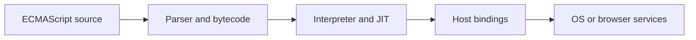
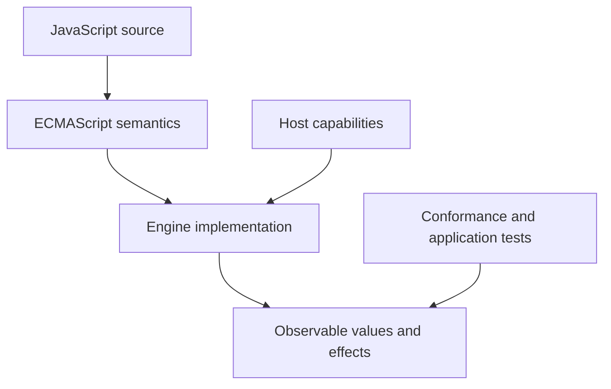
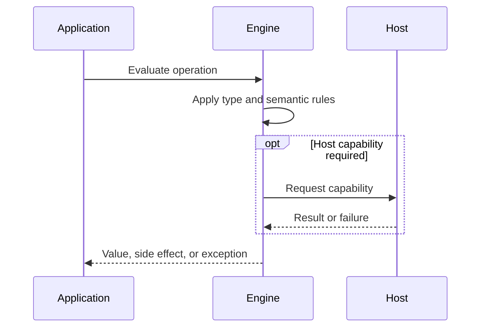

# ECMAScript Engines and Host Runtimes

## Overview

A JavaScript deployment is a stack, not one monolithic runtime. ECMAScript specifies values and execution; an engine implements those rules; a host supplies capabilities and scheduling policies. Keeping these layers separate prevents portability, security, and performance mistakes.

The first-principles question is: **what invariant must a runtime preserve, and what observable behavior follows from that invariant?** This note answers that question before introducing convenience rules.

## Learning Objectives

- Explain the concept without relying on framework terminology.
- Predict edge cases from ECMAScript semantics.
- Separate language rules from engine representation and host policy.
- Select production practices based on explicit trade-offs.
- Verify claims with executable JavaScript in [[02-JavaScript/code/README|JavaScript code labs]].

## Prerequisites

- [[01-Computer-Science/08-Languages-and-Computation/Compilers Interpreters and Virtual Machines|Compilers, Interpreters, and Virtual Machines]]
- [[02-JavaScript/00-Orientation/Why JavaScript Exists|Why JavaScript Exists]]

## Difficulty

`intermediate`

## Estimated Time

2 hours reading, 90 minutes exercises, and 3–6 hours for the mini project.

## History

ECMAScript standardized competing browser dialects beginning in 1997. SpiderMonkey, JavaScriptCore, V8, and Chakra demonstrated different implementations of the same specification. Node.js embedded V8 with libuv and server APIs, proving that an engine can serve multiple hosts.

History matters because compatibility constraints explain behavior that would otherwise look arbitrary. A production engineer must know which behavior is guaranteed by ECMAScript and which behavior is only a current implementation strategy.

## Problem It Solves

The same expression should have the same language meaning across vendors, while browsers, servers, shells, and embedded devices need different powers. A specification/engine/host boundary permits semantic portability without forcing every environment to expose the same capabilities.

### First-Principles Questions

1. What information exists before the operation starts?
2. Which distinctions must remain observable afterward?
3. Which conversions or side effects are permitted?
4. Where can the operation fail, and is that failure synchronous?
5. Which layer—specification, engine, or host—owns the guarantee?

## Internal Implementation

- The specification uses abstract operations such as ToPrimitive and execution contexts; engines realize them with native data structures.
- Engines tokenize, parse, emit bytecode or machine code, profile execution, optimize hot paths, and garbage-collect unreachable objects.
- A realm owns intrinsics such as Array.prototype; values from another realm can fail identity-based checks.
- Hosts define module loading, timers, event loops, I/O, and global bindings such as window or process.
- Host APIs cross a trust boundary into native code and may have lifecycle and cancellation rules absent from ECMAScript.

Engines may optimize representation aggressively, but optimization must preserve specified observable behavior. Internal tags, pointers, NaN-boxing, bytecode, and inline caches are implementation techniques, not portable API contracts.



## Mermaid Diagrams

### Responsibility Boundary



### Evaluation Sequence



## Examples

### Minimal Example

```javascript
const sample = { value: 1 };
const alias = sample;
console.log(alias === sample);
console.log(typeof sample);
```

The example isolates identity and runtime classification. It should be run before adding framework state, network I/O, or transpilation.

### Production-Shaped Example

```javascript
export function describeHost(globalObject = globalThis) {
  return Object.freeze({
    hasDOM: typeof globalObject.document === "object",
    hasProcess: typeof globalObject.process === "object",
    hasFetch: typeof globalObject.fetch === "function",
    engineAgnosticClock: typeof globalObject.performance?.now === "function"
      ? () => globalObject.performance.now()
      : () => Date.now(),
  });
}

console.log(describeHost());
```

Production-shaped code validates assumptions, makes failure visible, and avoids depending on unspecified engine details. Copy this example into [[02-JavaScript/code/README|JavaScript code labs]] and add tests for boundary values.

## Trade-offs

| Dimension | Upside | Downside | When it matters |
| --- | --- | --- | --- |
| Semantics | Multiple engines improve standards accountability | Requires a precise mental model | API design |
| Compatibility | Host differences reduce write-once assumptions | Legacy behavior remains observable | Multi-runtime software |
| Operations | Feature detection is more robust than user-agent or engine detection | Additional validation and tests | Production boundaries |

### When to Use

- Use the language feature when its semantics match the domain invariant.
- Use explicit conversion or validation at untrusted and serialized boundaries.
- Prefer the simplest representation that preserves every required distinction.

### When Not to Use

- Do not use implicit behavior merely to save a line of code.
- Do not expose engine-specific representations as application contracts.
- Do not infer security, ownership, or validation guarantees from convenient syntax.

## Exercises

1. Classify Promise, fetch, setTimeout, and process.nextTick by layer.
2. Compare globalThis keys in a browser worker and Node.js.
3. Create an iframe value and test instanceof Array versus Array.isArray.
4. Design an adapter exposing one clock API in two hosts.
5. Add table-driven tests for empty, nullish, extreme, and wrong-type inputs.
6. Explain one result by naming the relevant abstract operation rather than saying “JavaScript is weird.”

## Mini Project

**Prompt:** Build a runtime-capability reporter that emits structured JSON in browsers and Node.js without engine-name checks.

Deliver a README, automated tests, input contracts, error examples, and a short performance or compatibility note. Link the implementation from [[02-JavaScript/code/README|JavaScript code labs]].

## Portfolio Project

**Prompt:** Create a portable task runner with host adapters, cancellation, conformance tests in two engines, and an architecture decision record.

Treat this as a production artifact: define scope and non-goals, include architecture and sequence Mermaid diagrams, automate tests, record trade-offs, and provide operational diagnostics.

## Interview Questions

1. What does ECMAScript specify?
2. What responsibilities belong to an engine versus a host?
3. What is a realm?
4. Why can instanceof fail across iframes?
5. How would you make a library portable across browser and Node.js?

### Stretch / Staff-Level

1. Which parts of this behavior are normative, and which are engine freedom?
2. How would you migrate a large codebase that relied on the most dangerous edge case?
3. Design observability that detects failures without logging secrets or high-cardinality raw values.

## Common Mistakes

- Saying V8 is Node.js; Node.js embeds V8 and adds a host.
- Assuming setTimeout, fetch, or console are required by ECMAScript.
- Using instanceof across realms without considering distinct intrinsics.
- Depending on engine optimization heuristics as correctness guarantees.

The common pattern is accidental loss of information: collapsing distinct states, assuming structural equality, or allowing an implicit conversion to choose policy. Make that policy explicit.

## Best Practices

- Document supported hosts and versions.
- Probe capabilities at the narrowest boundary.
- Wrap host APIs behind adapters for tests and portability.
- Use standards tests and multiple engines for portable libraries.
- Treat native host calls as fallible asynchronous operations.

### Production Checklist

- Validate values when they enter the process, worker, request, or module boundary.
- Pin supported runtime versions and test against the compatibility matrix.
- Prefer deterministic errors over silent fallback.
- Add regression tests for every edge case described in this note.
- Measure before applying engine-specific performance advice.
- Keep sensitive decisions on trusted infrastructure.
- Document serialization, equality, mutation, and absence semantics in public APIs.

## Summary

A JavaScript deployment is a stack, not one monolithic runtime. ECMAScript specifies values and execution; an engine implements those rules; a host supplies capabilities and scheduling policies. Keeping these layers separate prevents portability, security, and performance mistakes. The practical skill is not memorizing isolated outputs; it is deriving behavior from value categories, abstract operations, identity, and host boundaries. Production code then narrows permissive language behavior into explicit domain contracts.

## Further Reading

- [https://tc39.es/ecma262/](https://tc39.es/ecma262/)
- [https://html.spec.whatwg.org/multipage/webappapis.html](https://html.spec.whatwg.org/multipage/webappapis.html)
- [https://nodejs.org/api/globals.html](https://nodejs.org/api/globals.html)
- [ECMAScript Language Specification](https://tc39.es/ecma262/)
- [MDN JavaScript Guide](https://developer.mozilla.org/en-US/docs/Web/JavaScript/Guide)

## Related Notes

- [[01-Computer-Science/08-Languages-and-Computation/Bytecode and JIT Compilation|Bytecode and JIT Compilation]]
- [[01-Computer-Science/03-Memory-and-Addressing/Garbage Collection Models|Garbage Collection Models]]
- [[02-JavaScript/00-Orientation/JavaScript Program Lifecycle|JavaScript Program Lifecycle]]
- [[01-Computer-Science/08-Languages-and-Computation/Compilers Interpreters and Virtual Machines|Compilers, Interpreters, and Virtual Machines]]
- [[02-JavaScript/00-Orientation/Why JavaScript Exists|Why JavaScript Exists]]
- [[02-JavaScript/code/README|JavaScript code labs]]
- [[02-JavaScript/README|JavaScript]]

## Progress Checklist

- [ ] Explained the concept from first principles
- [ ] Recreated both Mermaid diagrams from memory
- [ ] Ran and modified the JavaScript examples
- [ ] Documented trade-offs and non-goals
- [ ] Completed all exercises
- [ ] Built the mini project with tests
- [ ] Practiced interview questions aloud
- [ ] Followed prerequisite and dependent wiki links
