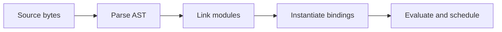
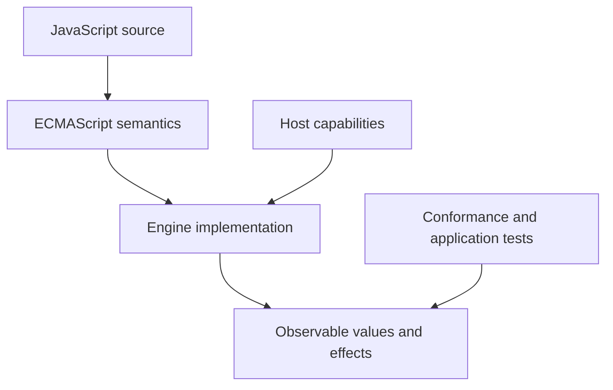
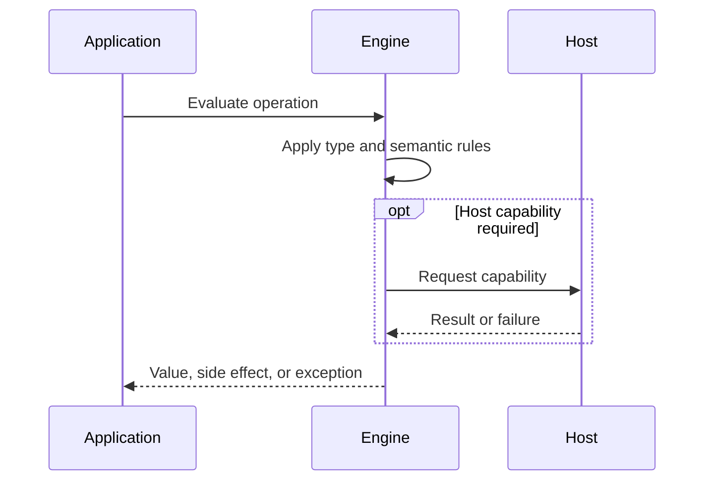

# JavaScript Program Lifecycle

## Overview

A JavaScript program passes through acquisition, decoding, parsing, linking, declaration instantiation, evaluation, scheduling, and eventual cleanup. Execution is therefore more than reading statements from top to bottom.

The first-principles question is: **what invariant must a runtime preserve, and what observable behavior follows from that invariant?** This note answers that question before introducing convenience rules.

## Learning Objectives

- Explain the concept without relying on framework terminology.
- Predict edge cases from ECMAScript semantics.
- Separate language rules from engine representation and host policy.
- Select production practices based on explicit trade-offs.
- Verify claims with executable JavaScript in [[02-JavaScript/code/README|JavaScript code labs]].

## Prerequisites

- [[01-Computer-Science/08-Languages-and-Computation/Grammars and Parsing|Grammars and Parsing]]
- [[02-JavaScript/00-Orientation/ECMAScript Engines and Host Runtimes|ECMAScript Engines and Host Runtimes]]

## Difficulty

`intermediate`

## Estimated Time

2 hours reading, 90 minutes exercises, and 3–6 hours for the mini project.

## History

Early interpreters parsed small scripts directly. Larger applications drove bytecode, JIT tiers, modules, source maps, streaming compilation, code caches, and sophisticated garbage collectors. ES modules made linking and asynchronous module evaluation observable parts of startup.

History matters because compatibility constraints explain behavior that would otherwise look arbitrary. A production engineer must know which behavior is guaranteed by ECMAScript and which behavior is only a current implementation strategy.

## Problem It Solves

Without a lifecycle model, developers misdiagnose syntax errors as runtime failures, expect imports to behave like textual inclusion, confuse declaration creation with initialization, and measure only execution while ignoring network and parse costs.

### First-Principles Questions

1. What information exists before the operation starts?
2. Which distinctions must remain observable afterward?
3. Which conversions or side effects are permitted?
4. Where can the operation fail, and is that failure synchronous?
5. Which layer—specification, engine, or host—owns the guarantee?

## Internal Implementation

- Source bytes are decoded as text before lexical grammar can produce tokens.
- Parsing builds an AST and rejects syntax errors before evaluation of that script or module.
- Module loading constructs and links a dependency graph before evaluation; top-level await can make evaluation asynchronous.
- Declaration instantiation creates bindings; lexical declarations remain uninitialized until evaluated.
- Calls create execution contexts and stack frames; host callbacks schedule later jobs.
- Reachability, not block exit, determines when garbage-collected storage becomes reclaimable.

Engines may optimize representation aggressively, but optimization must preserve specified observable behavior. Internal tags, pointers, NaN-boxing, bytecode, and inline caches are implementation techniques, not portable API contracts.



## Mermaid Diagrams

### Responsibility Boundary



### Evaluation Sequence



## Examples

### Minimal Example

```javascript
const sample = { value: 1 };
const alias = sample;
console.log(alias === sample);
console.log(typeof sample);
```

The example isolates identity and runtime classification. It should be run before adding framework state, network I/O, or transpilation.

### Production-Shaped Example

```javascript
// lifecycle-demo.mjs
console.log("module: evaluating");

export async function boot({ signal }) {
  const response = await fetch("/config.json", { signal });
  if (!response.ok) throw new Error(`config: ${response.status}`);
  const config = await response.json();
  queueMicrotask(() => console.log("microtask after boot continuation"));
  return Object.freeze(config);
}

const controller = new AbortController();
boot({ signal: controller.signal }).catch((error) => {
  console.error("startup failed", { cause: error });
});
```

Production-shaped code validates assumptions, makes failure visible, and avoids depending on unspecified engine details. Copy this example into [[02-JavaScript/code/README|JavaScript code labs]] and add tests for boundary values.

## Trade-offs

| Dimension | Upside | Downside | When it matters |
| --- | --- | --- | --- |
| Semantics | Early parsing catches syntax failures before side effects | Requires a precise mental model | API design |
| Compatibility | JIT optimization improves steady state but adds warm-up and memory costs | Legacy behavior remains observable | Multi-runtime software |
| Operations | Dynamic import reduces initial work but moves failure into an asynchronous path | Additional validation and tests | Production boundaries |

### When to Use

- Use the language feature when its semantics match the domain invariant.
- Use explicit conversion or validation at untrusted and serialized boundaries.
- Prefer the simplest representation that preserves every required distinction.

### When Not to Use

- Do not use implicit behavior merely to save a line of code.
- Do not expose engine-specific representations as application contracts.
- Do not infer security, ownership, or validation guarantees from convenient syntax.

## Exercises

1. Predict output order among synchronous code, queueMicrotask, and setTimeout.
2. Introduce a syntax error into an imported module and observe which side effects run.
3. Draw binding states for let before and after its declaration.
4. Measure cold and warmed execution separately.
5. Add table-driven tests for empty, nullish, extreme, and wrong-type inputs.
6. Explain one result by naming the relevant abstract operation rather than saying “JavaScript is weird.”

## Mini Project

**Prompt:** Build a lifecycle tracer that records module load, initialization, microtasks, tasks, and teardown with monotonic timestamps.

Deliver a README, automated tests, input contracts, error examples, and a short performance or compatibility note. Link the implementation from [[02-JavaScript/code/README|JavaScript code labs]].

## Portfolio Project

**Prompt:** Create a plugin loader with dependency graph validation, dynamic import, startup budgets, cancellation, telemetry, and graceful teardown.

Treat this as a production artifact: define scope and non-goals, include architecture and sequence Mermaid diagrams, automate tests, record trade-offs, and provide operational diagnostics.

## Interview Questions

1. What happens before the first JavaScript statement executes?
2. How does module linking differ from evaluation?
3. What is declaration instantiation?
4. Why can cold-start and steady-state performance differ?
5. When is an object eligible for garbage collection?

### Stretch / Staff-Level

1. Which parts of this behavior are normative, and which are engine freedom?
2. How would you migrate a large codebase that relied on the most dangerous edge case?
3. Design observability that detects failures without logging secrets or high-cardinality raw values.

## Common Mistakes

- Believing hoisting means source text is moved.
- Assuming parse, module link, and runtime errors have the same recovery path.
- Benchmarking a hot loop without accounting for warm-up and deoptimization.
- Leaving startup fetches without cancellation or error telemetry.

The common pattern is accidental loss of information: collapsing distinct states, assuming structural equality, or allowing an implicit conversion to choose policy. Make that policy explicit.

## Best Practices

- Budget network, decode, parse, compile, and execute separately.
- Keep module top levels deterministic and light.
- Catch and classify startup failures at the application boundary.
- Use dynamic import at intentional latency boundaries.
- Release listeners and abort pending work during teardown.

### Production Checklist

- Validate values when they enter the process, worker, request, or module boundary.
- Pin supported runtime versions and test against the compatibility matrix.
- Prefer deterministic errors over silent fallback.
- Add regression tests for every edge case described in this note.
- Measure before applying engine-specific performance advice.
- Keep sensitive decisions on trusted infrastructure.
- Document serialization, equality, mutation, and absence semantics in public APIs.

## Summary

A JavaScript program passes through acquisition, decoding, parsing, linking, declaration instantiation, evaluation, scheduling, and eventual cleanup. Execution is therefore more than reading statements from top to bottom. The practical skill is not memorizing isolated outputs; it is deriving behavior from value categories, abstract operations, identity, and host boundaries. Production code then narrows permissive language behavior into explicit domain contracts.

## Further Reading

- [https://tc39.es/ecma262/#sec-ecmascript-language-scripts-and-modules](https://tc39.es/ecma262/#sec-ecmascript-language-scripts-and-modules)
- [https://tc39.es/ecma262/#sec-execution-contexts](https://tc39.es/ecma262/#sec-execution-contexts)
- [https://html.spec.whatwg.org/multipage/webappapis.html#event-loops](https://html.spec.whatwg.org/multipage/webappapis.html#event-loops)
- [ECMAScript Language Specification](https://tc39.es/ecma262/)
- [MDN JavaScript Guide](https://developer.mozilla.org/en-US/docs/Web/JavaScript/Guide)

## Related Notes

- [[01-Computer-Science/08-Languages-and-Computation/Bytecode and JIT Compilation|Bytecode and JIT Compilation]]
- [[01-Computer-Science/03-Memory-and-Addressing/Garbage Collection Models|Garbage Collection Models]]
- [[02-JavaScript/00-Orientation/Strict Mode|Strict Mode]]
- [[01-Computer-Science/08-Languages-and-Computation/Grammars and Parsing|Grammars and Parsing]]
- [[02-JavaScript/00-Orientation/ECMAScript Engines and Host Runtimes|ECMAScript Engines and Host Runtimes]]
- [[02-JavaScript/code/README|JavaScript code labs]]
- [[02-JavaScript/README|JavaScript]]

## Progress Checklist

- [ ] Explained the concept from first principles
- [ ] Recreated both Mermaid diagrams from memory
- [ ] Ran and modified the JavaScript examples
- [ ] Documented trade-offs and non-goals
- [ ] Completed all exercises
- [ ] Built the mini project with tests
- [ ] Practiced interview questions aloud
- [ ] Followed prerequisite and dependent wiki links
