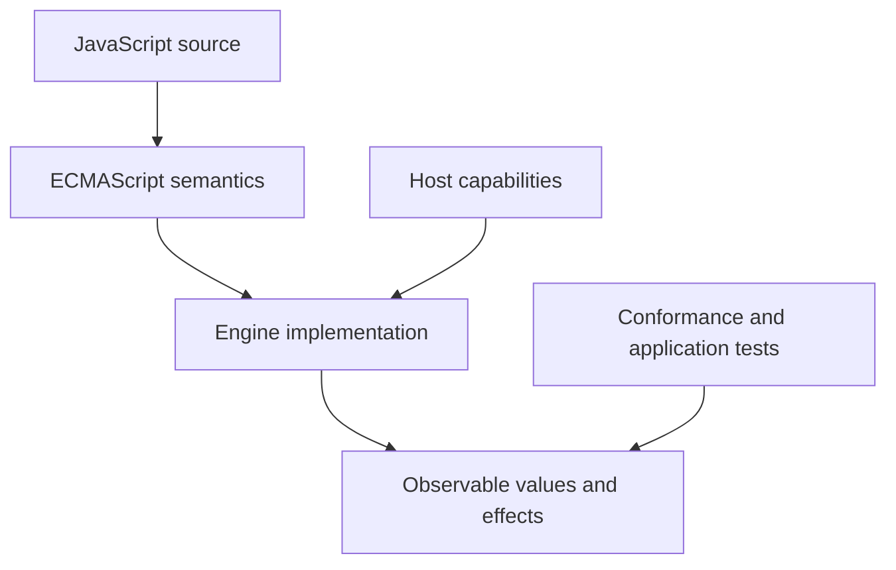
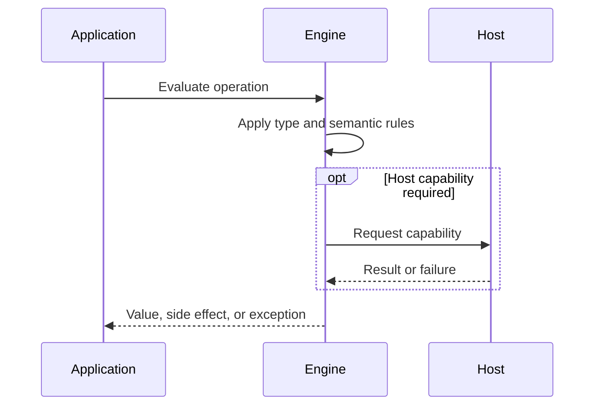

# Strict Mode

## Overview

Strict mode selects a deliberately less permissive set of ECMAScript semantics. It converts silent legacy behavior into errors, removes ambiguous bindings, and gives engines and developers stronger local invariants. ES modules and class bodies are strict automatically.

The first-principles question is: **what invariant must a runtime preserve, and what observable behavior follows from that invariant?** This note answers that question before introducing convenience rules.

## Learning Objectives

- Explain the concept without relying on framework terminology.
- Predict edge cases from ECMAScript semantics.
- Separate language rules from engine representation and host policy.
- Select production practices based on explicit trade-offs.
- Verify claims with executable JavaScript in [[02-JavaScript/code/README|JavaScript code labs]].

## Prerequisites

- [[02-JavaScript/00-Orientation/JavaScript Program Lifecycle|JavaScript Program Lifecycle]]

## Difficulty

`beginner`

## Estimated Time

2 hours reading, 90 minutes exercises, and 3–6 hours for the mini project.

## History

ECMAScript 5 introduced strict mode without breaking existing scripts. The opt-in directive preserved web compatibility while enabling cleaner semantics. Later syntax such as modules and classes adopted strict behavior by construction.

History matters because compatibility constraints explain behavior that would otherwise look arbitrary. A production engineer must know which behavior is guaranteed by ECMAScript and which behavior is only a current implementation strategy.

## Problem It Solves

Legacy script semantics silently create globals, coerce some invalid writes into no-ops, and bind this to the global object in plain calls. Those behaviors hide defects and constrain optimization. Strict mode turns many of them into deterministic failures.

### First-Principles Questions

1. What information exists before the operation starts?
2. Which distinctions must remain observable afterward?
3. Which conversions or side effects are permitted?
4. Where can the operation fail, and is that failure synchronous?
5. Which layer—specification, engine, or host—owns the guarantee?

## Internal Implementation

- A Directive Prologue string literal exactly equal to use strict marks a script or function body.
- Strictness is determined during parsing and changes the semantics of the contained code.
- Assignment to an unresolvable reference throws instead of creating a global property.
- Plain function calls receive undefined as this rather than substituting globalThis.
- Writes to non-writable properties and deletion of non-configurable properties throw.
- Direct eval in strict code does not leak var declarations into the surrounding scope.

Engines may optimize representation aggressively, but optimization must preserve specified observable behavior. Internal tags, pointers, NaN-boxing, bytecode, and inline caches are implementation techniques, not portable API contracts.


## Mermaid Diagrams

### Responsibility Boundary



### Evaluation Sequence



## Examples

### Minimal Example

```javascript
const sample = { value: 1 };
const alias = sample;
console.log(alias === sample);
console.log(typeof sample);
```

The example isolates identity and runtime classification. It should be run before adding framework state, network I/O, or transpilation.

### Production-Shaped Example

```javascript
"use strict";

function updateReadonly(record) {
  // Object.freeze is shallow, but strict mode makes this invalid write visible.
  record.id = "changed";
}

const record = Object.freeze({ id: "original" });
try {
  updateReadonly(record);
} catch (error) {
  console.error("invariant violation", {
    name: error.name,
    message: error.message,
  });
}
```

Production-shaped code validates assumptions, makes failure visible, and avoids depending on unspecified engine details. Copy this example into [[02-JavaScript/code/README|JavaScript code labs]] and add tests for boundary values.

## Trade-offs

| Dimension | Upside | Downside | When it matters |
| --- | --- | --- | --- |
| Semantics | Earlier failure improves diagnosability | Requires a precise mental model | API design |
| Compatibility | Legacy code may depend on sloppy behavior | Legacy behavior remains observable | Multi-runtime software |
| Operations | Strict mode is semantic hardening, not complete security or immutability | Additional validation and tests | Production boundaries |

### When to Use

- Use the language feature when its semantics match the domain invariant.
- Use explicit conversion or validation at untrusted and serialized boundaries.
- Prefer the simplest representation that preserves every required distinction.

### When Not to Use

- Do not use implicit behavior merely to save a line of code.
- Do not expose engine-specific representations as application contracts.
- Do not infer security, ownership, or validation guarantees from convenient syntax.

## Exercises

1. Compare accidental assignment in sloppy and strict classic scripts.
2. Call the same plain function under both modes and inspect this.
3. Attempt writes to frozen and non-writable properties.
4. Explain why strict mode could not simply replace sloppy mode globally.
5. Add table-driven tests for empty, nullish, extreme, and wrong-type inputs.
6. Explain one result by naming the relevant abstract operation rather than saying “JavaScript is weird.”

## Mini Project

**Prompt:** Build a strict-mode migration harness that runs legacy functions in isolated fixtures and reports changed errors, this bindings, and accidental globals.

Deliver a README, automated tests, input contracts, error examples, and a short performance or compatibility note. Link the implementation from [[02-JavaScript/code/README|JavaScript code labs]].

## Portfolio Project

**Prompt:** Modernize a small classic-script application into ES modules, documenting each behavior change and adding regression tests.

Treat this as a production artifact: define scope and non-goals, include architecture and sequence Mermaid diagrams, automate tests, record trade-offs, and provide operational diagnostics.

## Interview Questions

1. What does strict mode change?
2. How is strict mode enabled?
3. Are modules strict automatically?
4. Why does strict mode exist instead of changing all scripts?
5. Does strict mode make JavaScript secure?

### Stretch / Staff-Level

1. Which parts of this behavior are normative, and which are engine freedom?
2. How would you migrate a large codebase that relied on the most dangerous edge case?
3. Design observability that detects failures without logging secrets or high-cardinality raw values.

## Common Mistakes

- Adding use strict inside an ES module as if it changes behavior.
- Assuming strict mode deep-freezes values.
- Using a misspelled directive or placing it after a statement.
- Treating strict mode as a sandbox for untrusted code.

The common pattern is accidental loss of information: collapsing distinct states, assuming structural equality, or allowing an implicit conversion to choose policy. Make that policy explicit.

## Best Practices

- Prefer ES modules, which are strict by default.
- Keep strict directives at the start of classic scripts that need them.
- Run tests that exercise invalid writes and accidental globals.
- Use explicit receivers instead of relying on global this.
- Combine strict mode with linting, validation, and object integrity controls.

### Production Checklist

- Validate values when they enter the process, worker, request, or module boundary.
- Pin supported runtime versions and test against the compatibility matrix.
- Prefer deterministic errors over silent fallback.
- Add regression tests for every edge case described in this note.
- Measure before applying engine-specific performance advice.
- Keep sensitive decisions on trusted infrastructure.
- Document serialization, equality, mutation, and absence semantics in public APIs.

## Summary

Strict mode selects a deliberately less permissive set of ECMAScript semantics. It converts silent legacy behavior into errors, removes ambiguous bindings, and gives engines and developers stronger local invariants. ES modules and class bodies are strict automatically. The practical skill is not memorizing isolated outputs; it is deriving behavior from value categories, abstract operations, identity, and host boundaries. Production code then narrows permissive language behavior into explicit domain contracts.

## Further Reading

- [https://tc39.es/ecma262/#sec-strict-mode-code](https://tc39.es/ecma262/#sec-strict-mode-code)
- [https://developer.mozilla.org/en-US/docs/Web/JavaScript/Reference/Strict_mode](https://developer.mozilla.org/en-US/docs/Web/JavaScript/Reference/Strict_mode)
- [https://tc39.es/ecma262/#sec-directive-prologues-and-the-use-strict-directive](https://tc39.es/ecma262/#sec-directive-prologues-and-the-use-strict-directive)
- [ECMAScript Language Specification](https://tc39.es/ecma262/)
- [MDN JavaScript Guide](https://developer.mozilla.org/en-US/docs/Web/JavaScript/Guide)

## Related Notes

- [[02-JavaScript/01-Values-and-Types/JavaScript Type System|JavaScript Type System]]
- [[01-Computer-Science/08-Languages-and-Computation/Compilers Interpreters and Virtual Machines|Compilers, Interpreters, and Virtual Machines]]
- [[02-JavaScript/00-Orientation/JavaScript Program Lifecycle|JavaScript Program Lifecycle]]
- [[02-JavaScript/code/README|JavaScript code labs]]
- [[02-JavaScript/README|JavaScript]]

## Progress Checklist

- [ ] Explained the concept from first principles
- [ ] Recreated both Mermaid diagrams from memory
- [ ] Ran and modified the JavaScript examples
- [ ] Documented trade-offs and non-goals
- [ ] Completed all exercises
- [ ] Built the mini project with tests
- [ ] Practiced interview questions aloud
- [ ] Followed prerequisite and dependent wiki links
