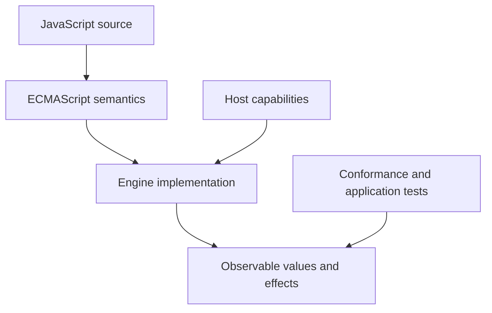
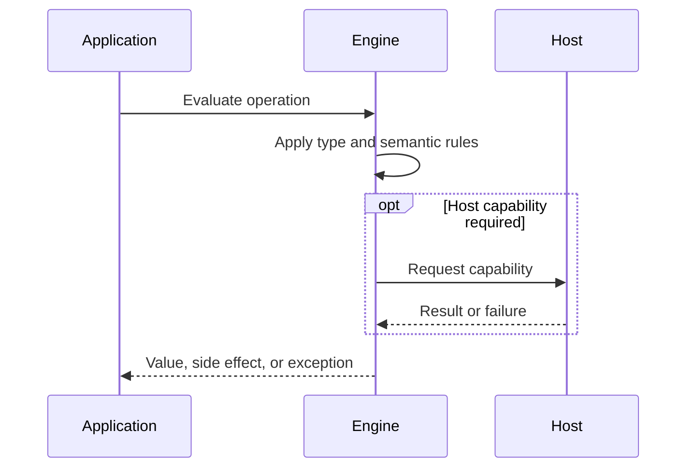

# Why JavaScript Exists

## Overview

JavaScript exists because the early web needed small programs to react immediately inside downloaded documents. Its defining constraints were not elegance in isolation but safe-enough distribution, instant startup, approachable syntax, and integration with browser objects.

The first-principles question is: **what invariant must a runtime preserve, and what observable behavior follows from that invariant?** This note answers that question before introducing convenience rules.

## Learning Objectives

- Explain the concept without relying on framework terminology.
- Predict edge cases from ECMAScript semantics.
- Separate language rules from engine representation and host policy.
- Select production practices based on explicit trade-offs.
- Verify claims with executable JavaScript in [[02-JavaScript/code/README|JavaScript code labs]].

## Prerequisites

- [[01-Computer-Science/00-Orientation/How Computers Run Programs|How Computers Run Programs]]

## Difficulty

`beginner`

## Estimated Time

2 hours reading, 90 minutes exercises, and 3–6 hours for the mini project.

## History

In 1995 Netscape asked Brendan Eich to create a scripting language for Navigator under severe schedule pressure. Mocha became LiveScript and then JavaScript; standardization through ECMA produced ECMAScript. Competition, backward compatibility, AJAX, V8, Node.js, and annual editions turned a browser glue language into a general-purpose platform.

History matters because compatibility constraints explain behavior that would otherwise look arbitrary. A production engineer must know which behavior is guaranteed by ECMAScript and which behavior is only a current implementation strategy.

## Problem It Solves

Static HTML could describe a document but could not validate a form, respond to a click, or update a page without a server round trip. Shipping native binaries from every site would have been unsafe and non-portable. A sandboxed source language gave each page behavior while the browser retained control of privileged capabilities.

### First-Principles Questions

1. What information exists before the operation starts?
2. Which distinctions must remain observable afterward?
3. Which conversions or side effects are permitted?
4. Where can the operation fail, and is that failure synchronous?
5. Which layer—specification, engine, or host—owns the guarantee?

## Internal Implementation

- ECMAScript defines language semantics; it does not define the DOM, files, sockets, or timers.
- A host creates a realm, global object, and host-defined APIs, then asks an engine to parse and execute source.
- Dynamic values reduce ceremony at boundaries but move many checks to runtime.
- Prototype delegation and first-class functions made small event handlers compact and composable.
- Backward compatibility is a platform invariant: breaking old pages fragments the web.

Engines may optimize representation aggressively, but optimization must preserve specified observable behavior. Internal tags, pointers, NaN-boxing, bytecode, and inline caches are implementation techniques, not portable API contracts.


## Mermaid Diagrams

### Responsibility Boundary



### Evaluation Sequence



## Examples

### Minimal Example

```javascript
const sample = { value: 1 };
const alias = sample;
console.log(alias === sample);
console.log(typeof sample);
```

The example isolates identity and runtime classification. It should be run before adding framework state, network I/O, or transpilation.

### Production-Shaped Example

```javascript
const button = document.querySelector("#save");
button.addEventListener("click", async () => {
  button.disabled = true;
  try {
    const response = await fetch("/api/draft", {
      method: "POST",
      headers: { "content-type": "application/json" },
      body: JSON.stringify({ text: document.querySelector("textarea").value }),
    });
    if (!response.ok) throw new Error(`save failed: ${response.status}`);
  } finally {
    button.disabled = false;
  }
});
```

Production-shaped code validates assumptions, makes failure visible, and avoids depending on unspecified engine details. Copy this example into [[02-JavaScript/code/README|JavaScript code labs]] and add tests for boundary values.

## Trade-offs

| Dimension | Upside | Downside | When it matters |
| --- | --- | --- | --- |
| Semantics | Instant distribution and no install | Requires a precise mental model | API design |
| Compatibility | Legacy semantics cannot be freely removed | Legacy behavior remains observable | Multi-runtime software |
| Operations | Code shipped to untrusted clients must be treated as observable and modifiable | Additional validation and tests | Production boundaries |

### When to Use

- Use the language feature when its semantics match the domain invariant.
- Use explicit conversion or validation at untrusted and serialized boundaries.
- Prefer the simplest representation that preserves every required distinction.

### When Not to Use

- Do not use implicit behavior merely to save a line of code.
- Do not expose engine-specific representations as application contracts.
- Do not infer security, ownership, or validation guarantees from convenient syntax.

## Exercises

1. Explain why a browser scripting language was preferable to downloadable native executables.
2. Run one expression in a browser and Node.js; list which globals differ.
3. Disable JavaScript on a simple page and identify what still works.
4. Map a click handler into language, engine, and host responsibilities.
5. Add table-driven tests for empty, nullish, extreme, and wrong-type inputs.
6. Explain one result by naming the relevant abstract operation rather than saying “JavaScript is weird.”

## Mini Project

**Prompt:** Build a progressively enhanced form that works with navigation alone, then adds client validation and asynchronous submission without weakening server validation.

Deliver a README, automated tests, input contracts, error examples, and a short performance or compatibility note. Link the implementation from [[02-JavaScript/code/README|JavaScript code labs]].

## Portfolio Project

**Prompt:** Create an interactive timeline of JavaScript platform evolution that runs capability probes and distinguishes ECMAScript features from browser APIs.

Treat this as a production artifact: define scope and non-goals, include architecture and sequence Mermaid diagrams, automate tests, record trade-offs, and provide operational diagnostics.

## Interview Questions

1. Why was JavaScript created?
2. What is the difference between JavaScript and ECMAScript?
3. Why is backward compatibility unusually strong on the web?
4. Why can client-side validation never enforce authorization?
5. How did V8 and Node.js change JavaScript's deployment model?

### Stretch / Staff-Level

1. Which parts of this behavior are normative, and which are engine freedom?
2. How would you migrate a large codebase that relied on the most dangerous edge case?
3. Design observability that detects failures without logging secrets or high-cardinality raw values.

## Common Mistakes

- Calling JavaScript a subset of Java; the languages have different object and type models.
- Treating browser APIs as part of ECMAScript.
- Assuming its early design constraints imply modern engines are simplistic.
- Trusting client-side validation as an authorization boundary.

The common pattern is accidental loss of information: collapsing distinct states, assuming structural equality, or allowing an implicit conversion to choose policy. Make that policy explicit.

## Best Practices

- Target documented runtime baselines and test them in CI.
- Keep security decisions on trusted servers.
- Use progressive enhancement for critical user journeys.
- Measure download, parse, compile, and execution costs separately.
- Prefer standards over engine-specific behavior.

### Production Checklist

- Validate values when they enter the process, worker, request, or module boundary.
- Pin supported runtime versions and test against the compatibility matrix.
- Prefer deterministic errors over silent fallback.
- Add regression tests for every edge case described in this note.
- Measure before applying engine-specific performance advice.
- Keep sensitive decisions on trusted infrastructure.
- Document serialization, equality, mutation, and absence semantics in public APIs.

## Summary

JavaScript exists because the early web needed small programs to react immediately inside downloaded documents. Its defining constraints were not elegance in isolation but safe-enough distribution, instant startup, approachable syntax, and integration with browser objects. The practical skill is not memorizing isolated outputs; it is deriving behavior from value categories, abstract operations, identity, and host boundaries. Production code then narrows permissive language behavior into explicit domain contracts.

## Further Reading

- [https://www.ecma-international.org/publications-and-standards/standards/ecma-262/](https://www.ecma-international.org/publications-and-standards/standards/ecma-262/)
- [https://developer.mozilla.org/en-US/docs/Web/JavaScript/Guide/Introduction](https://developer.mozilla.org/en-US/docs/Web/JavaScript/Guide/Introduction)
- [https://www.w3.org/History/19921103-hypertext/hypertext/WWW/MarkUp/Tags.html](https://www.w3.org/History/19921103-hypertext/hypertext/WWW/MarkUp/Tags.html)
- [ECMAScript Language Specification](https://tc39.es/ecma262/)
- [MDN JavaScript Guide](https://developer.mozilla.org/en-US/docs/Web/JavaScript/Guide)

## Related Notes

- [[01-Computer-Science/08-Languages-and-Computation/Compilers Interpreters and Virtual Machines|Compilers, Interpreters, and Virtual Machines]]
- [[02-JavaScript/00-Orientation/ECMAScript Engines and Host Runtimes|ECMAScript Engines and Host Runtimes]]
- [[01-Computer-Science/00-Orientation/How Computers Run Programs|How Computers Run Programs]]
- [[02-JavaScript/code/README|JavaScript code labs]]
- [[02-JavaScript/README|JavaScript]]

## Progress Checklist

- [ ] Explained the concept from first principles
- [ ] Recreated both Mermaid diagrams from memory
- [ ] Ran and modified the JavaScript examples
- [ ] Documented trade-offs and non-goals
- [ ] Completed all exercises
- [ ] Built the mini project with tests
- [ ] Practiced interview questions aloud
- [ ] Followed prerequisite and dependent wiki links
