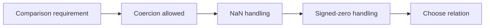
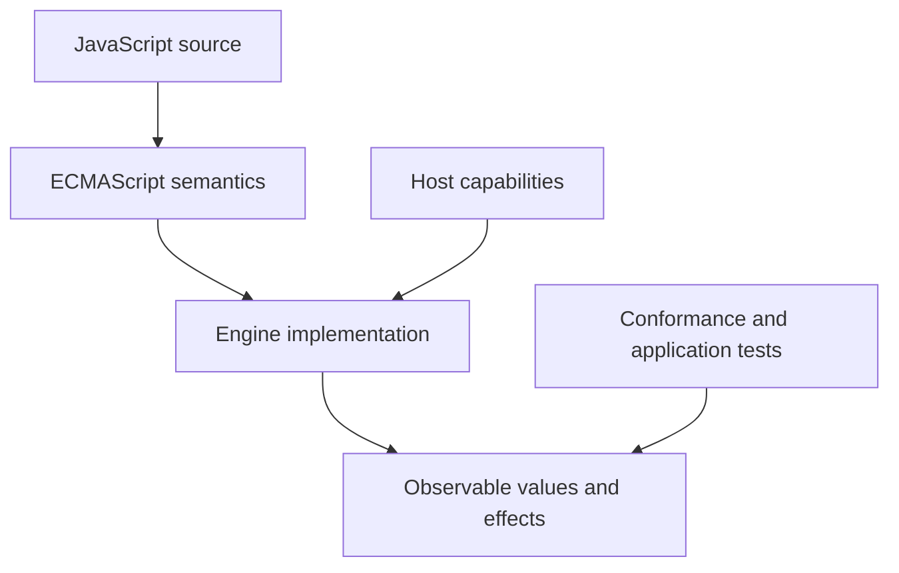
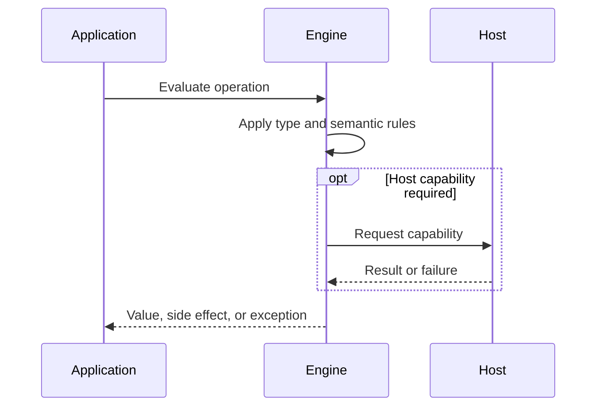

# Equality and Sameness

## Overview

JavaScript has several sameness relations because no single relation fits coercive convenience, numeric edge cases, collection keys, and change detection. The main relations are abstract equality, strict equality, SameValue, and SameValueZero.

The first-principles question is: **what invariant must a runtime preserve, and what observable behavior follows from that invariant?** This note answers that question before introducing convenience rules.

## Learning Objectives

- Explain the concept without relying on framework terminology.
- Predict edge cases from ECMAScript semantics.
- Separate language rules from engine representation and host policy.
- Select production practices based on explicit trade-offs.
- Verify claims with executable JavaScript in [[02-JavaScript/code/README|JavaScript code labs]].

## Prerequisites

- [[02-JavaScript/01-Values-and-Types/Type Coercion|Type Coercion]]
- [[02-JavaScript/01-Values-and-Types/Numbers BigInt and Numeric Precision|Numbers, BigInt, and Numeric Precision]]

## Difficulty

`advanced`

## Estimated Time

2 hours reading, 90 minutes exercises, and 3–6 hours for the mini project.

## History

Loose equality supported permissive early scripts. Strict equality arrived as the predictable default. Object.is exposed SameValue, while Map, Set, and includes adopted SameValueZero to make NaN findable without distinguishing signed zeros.

History matters because compatibility constraints explain behavior that would otherwise look arbitrary. A production engineer must know which behavior is guaranteed by ECMAScript and which behavior is only a current implementation strategy.

## Problem It Solves

Programs must decide whether two values should count as equivalent for a specific purpose. Identity, numeric sameness, coercive comparison, and domain equality are different questions and should not be collapsed.

### First-Principles Questions

1. What information exists before the operation starts?
2. Which distinctions must remain observable afterward?
3. Which conversions or side effects are permitted?
4. Where can the operation fail, and is that failure synchronous?
5. Which layer—specification, engine, or host—owns the guarantee?

## Internal Implementation

- Strict equality rejects differing types, treats NaN as unequal to itself, and treats +0 and -0 as equal.
- Abstract equality follows a type-pair decision algorithm and may coerce; it is not simply strict equality after converting both sides to numbers.
- SameValue, exposed by Object.is, makes NaN equal to itself and distinguishes signed zeros.
- SameValueZero makes NaN equal to itself and treats signed zeros as equal; Map, Set, and Array.prototype.includes use it.
- Objects compare by identity under built-in equality operators; structural or domain equality must be implemented explicitly.
- Relational comparisons are not equality tests and can involve different conversion behavior.

Engines may optimize representation aggressively, but optimization must preserve specified observable behavior. Internal tags, pointers, NaN-boxing, bytecode, and inline caches are implementation techniques, not portable API contracts.



## Mermaid Diagrams

### Responsibility Boundary



### Evaluation Sequence



## Examples

### Minimal Example

```javascript
const sample = { value: 1 };
const alias = sample;
console.log(alias === sample);
console.log(typeof sample);
```

The example isolates identity and runtime classification. It should be run before adding framework state, network I/O, or transpilation.

### Production-Shaped Example

```javascript
function sameCoordinates(a, b) {
  return Number.isFinite(a.x) &&
    Number.isFinite(a.y) &&
    Number.isFinite(b.x) &&
    Number.isFinite(b.y) &&
    Object.is(a.x, b.x) &&
    Object.is(a.y, b.y);
}

console.log(NaN === NaN);             // false
console.log(Object.is(NaN, NaN));     // true
console.log(Object.is(-0, 0));        // false
console.log([NaN].includes(NaN));     // true
console.log(new Set([-0, 0]).size);   // 1
```

Production-shaped code validates assumptions, makes failure visible, and avoids depending on unspecified engine details. Copy this example into [[02-JavaScript/code/README|JavaScript code labs]] and add tests for boundary values.

## Trade-offs

| Dimension | Upside | Downside | When it matters |
| --- | --- | --- | --- |
| Semantics | === avoids implicit cross-type conversion | Requires a precise mental model | API design |
| Compatibility | Object.is handles NaN change detection but distinguishes signed zero | Legacy behavior remains observable | Multi-runtime software |
| Operations | Domain equality is meaningful but costs design and traversal time | Additional validation and tests | Production boundaries |

### When to Use

- Use the language feature when its semantics match the domain invariant.
- Use explicit conversion or validation at untrusted and serialized boundaries.
- Prefer the simplest representation that preserves every required distinction.

### When Not to Use

- Do not use implicit behavior merely to save a line of code.
- Do not expose engine-specific representations as application contracts.
- Do not infer security, ownership, or validation guarantees from convenient syntax.

## Exercises

1. Create a matrix comparing ==, ===, Object.is, includes, and Set.
2. Explain the intentional null == undefined idiom and its limits.
3. Implement equality for normalized money values.
4. Demonstrate why JSON text order breaks stringify-based equality.
5. Add table-driven tests for empty, nullish, extreme, and wrong-type inputs.
6. Explain one result by naming the relevant abstract operation rather than saying “JavaScript is weird.”

## Mini Project

**Prompt:** Build a comparison laboratory that names the algorithm used by operators and collection APIs and visualizes edge cases.

Deliver a README, automated tests, input contracts, error examples, and a short performance or compatibility note. Link the implementation from [[02-JavaScript/code/README|JavaScript code labs]].

## Portfolio Project

**Prompt:** Create a configurable deep-equality package supporting cycles, custom comparators, symbol keys, typed arrays, and benchmarked limits.

Treat this as a production artifact: define scope and non-goals, include architecture and sequence Mermaid diagrams, automate tests, record trade-offs, and provide operational diagnostics.

## Interview Questions

1. How do == and === differ?
2. What does Object.is change?
3. What is SameValueZero?
4. How do objects compare?
5. Why does includes find NaN while indexOf does not?

### Stretch / Staff-Level

1. Which parts of this behavior are normative, and which are engine freedom?
2. How would you migrate a large codebase that relied on the most dangerous edge case?
3. Design observability that detects failures without logging secrets or high-cardinality raw values.

## Common Mistakes

- Using == without documenting an intentional coercive case.
- Expecting object literals with equal fields to compare equal.
- Using indexOf to find NaN.
- Applying JSON.stringify as a general deep-equality algorithm.

The common pattern is accidental loss of information: collapsing distinct states, assuming structural equality, or allowing an implicit conversion to choose policy. Make that policy explicit.

## Best Practices

- Default to === and !==.
- Use Object.is when SameValue semantics are specifically required.
- Define domain equality around normalized invariants, not incidental representation.
- Use Map and Set with awareness that object keys use identity.
- Test NaN, signed zero, nullish values, and cross-type inputs.

### Production Checklist

- Validate values when they enter the process, worker, request, or module boundary.
- Pin supported runtime versions and test against the compatibility matrix.
- Prefer deterministic errors over silent fallback.
- Add regression tests for every edge case described in this note.
- Measure before applying engine-specific performance advice.
- Keep sensitive decisions on trusted infrastructure.
- Document serialization, equality, mutation, and absence semantics in public APIs.

## Summary

JavaScript has several sameness relations because no single relation fits coercive convenience, numeric edge cases, collection keys, and change detection. The main relations are abstract equality, strict equality, SameValue, and SameValueZero. The practical skill is not memorizing isolated outputs; it is deriving behavior from value categories, abstract operations, identity, and host boundaries. Production code then narrows permissive language behavior into explicit domain contracts.

## Further Reading

- [https://tc39.es/ecma262/#sec-abstract-equality-comparison](https://tc39.es/ecma262/#sec-abstract-equality-comparison)
- [https://tc39.es/ecma262/#sec-strict-equality-comparison](https://tc39.es/ecma262/#sec-strict-equality-comparison)
- [https://tc39.es/ecma262/#sec-samevaluezero](https://tc39.es/ecma262/#sec-samevaluezero)
- [ECMAScript Language Specification](https://tc39.es/ecma262/)
- [MDN JavaScript Guide](https://developer.mozilla.org/en-US/docs/Web/JavaScript/Guide)

## Related Notes

- [[02-JavaScript/01-Values-and-Types/Value Copying Sharing and Mutation|Value Copying, Sharing, and Mutation]]
- [[01-Computer-Science/01-Information-and-Representation/Floating Point|Floating Point]]
- [[02-JavaScript/01-Values-and-Types/Type Coercion|Type Coercion]]
- [[02-JavaScript/01-Values-and-Types/Numbers BigInt and Numeric Precision|Numbers, BigInt, and Numeric Precision]]
- [[02-JavaScript/code/README|JavaScript code labs]]
- [[02-JavaScript/README|JavaScript]]

## Progress Checklist

- [ ] Explained the concept from first principles
- [ ] Recreated both Mermaid diagrams from memory
- [ ] Ran and modified the JavaScript examples
- [ ] Documented trade-offs and non-goals
- [ ] Completed all exercises
- [ ] Built the mini project with tests
- [ ] Practiced interview questions aloud
- [ ] Followed prerequisite and dependent wiki links
