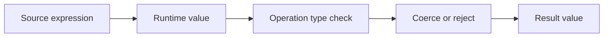
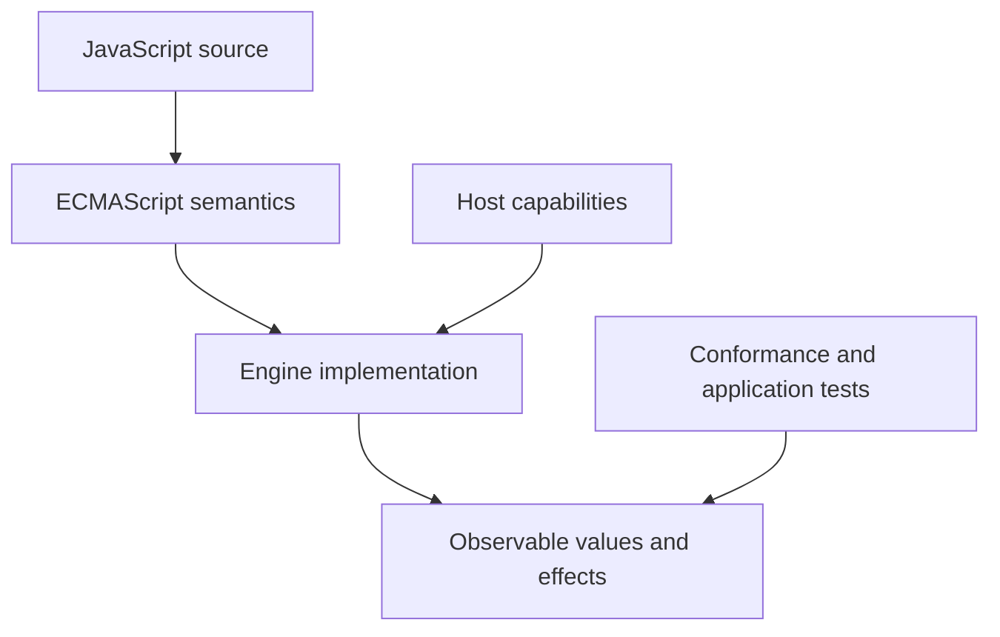
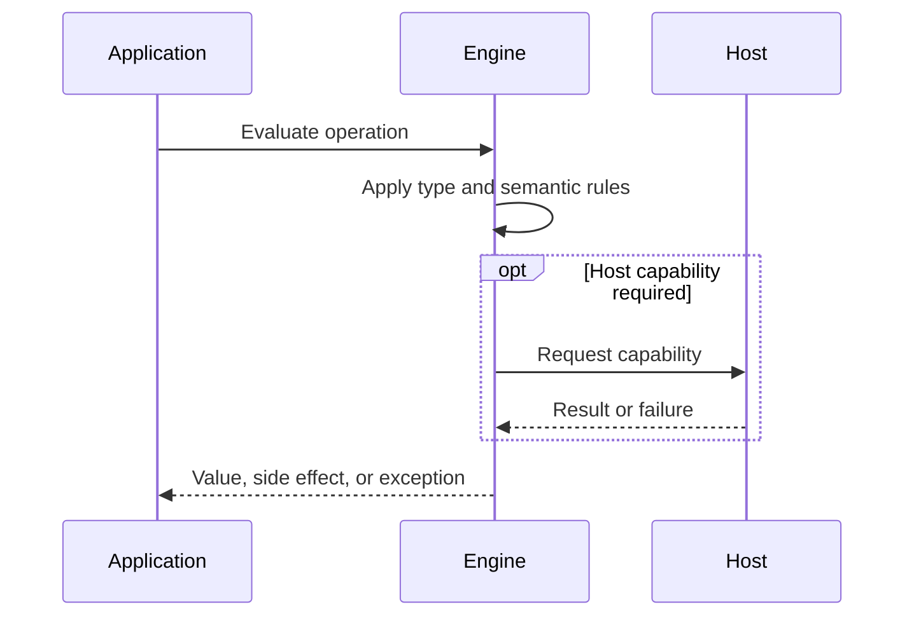

# JavaScript Type System

## Overview

JavaScript is dynamically typed: values have specification types, while variables are bindings that can refer to different kinds of values over time. Operations inspect value types at runtime and either proceed, coerce, or throw.

The first-principles question is: **what invariant must a runtime preserve, and what observable behavior follows from that invariant?** This note answers that question before introducing convenience rules.

## Learning Objectives

- Explain the concept without relying on framework terminology.
- Predict edge cases from ECMAScript semantics.
- Separate language rules from engine representation and host policy.
- Select production practices based on explicit trade-offs.
- Verify claims with executable JavaScript in [[02-JavaScript/code/README|JavaScript code labs]].

## Prerequisites

- [[01-Computer-Science/08-Languages-and-Computation/Type Systems Fundamentals|Type Systems Fundamentals]]
- [[02-JavaScript/00-Orientation/Strict Mode|Strict Mode]]

## Difficulty

`intermediate`

## Estimated Time

2 hours reading, 90 minutes exercises, and 3–6 hours for the mini project.

## History

JavaScript chose dynamic typing for short interactive scripts and rapid iteration. ECMAScript later formalized language and specification types. Gradual tools such as TypeScript add static analysis but emit JavaScript whose runtime type rules remain unchanged.

History matters because compatibility constraints explain behavior that would otherwise look arbitrary. A production engineer must know which behavior is guaranteed by ECMAScript and which behavior is only a current implementation strategy.

## Problem It Solves

Programs need rules for deciding which operations values support. JavaScript makes those decisions at runtime, enabling flexible composition and low ceremony but requiring explicit validation at untrusted boundaries.

### First-Principles Questions

1. What information exists before the operation starts?
2. Which distinctions must remain observable afterward?
3. Which conversions or side effects are permitted?
4. Where can the operation fail, and is that failure synchronous?
5. Which layer—specification, engine, or host—owns the guarantee?

## Internal Implementation

- ECMAScript language types include Undefined, Null, Boolean, String, Symbol, Number, BigInt, and Object.
- Specification types such as Reference Record are modeling devices and cannot be directly observed as values.
- typeof is a limited operator with historical cases: null reports object and functions report function.
- Objects carry internal slots and methods; ordinary property access follows object semantics and prototype delegation.
- Dynamic typing does not mean no typing: invalid operations can throw and implicit conversion follows precise algorithms.

Engines may optimize representation aggressively, but optimization must preserve specified observable behavior. Internal tags, pointers, NaN-boxing, bytecode, and inline caches are implementation techniques, not portable API contracts.



## Mermaid Diagrams

### Responsibility Boundary



### Evaluation Sequence



## Examples

### Minimal Example

```javascript
const sample = { value: 1 };
const alias = sample;
console.log(alias === sample);
console.log(typeof sample);
```

The example isolates identity and runtime classification. It should be run before adding framework state, network I/O, or transpilation.

### Production-Shaped Example

```javascript
function parsePort(input) {
  if (typeof input !== "string" && typeof input !== "number") {
    throw new TypeError("port must be a string or number");
  }
  const port = Number(input);
  if (!Number.isInteger(port) || port < 1 || port > 65_535) {
    throw new RangeError("port must be an integer from 1 to 65535");
  }
  return port;
}

console.log(parsePort("8080"));
console.log(typeof null); // "object": historical, not a useful null test
```

Production-shaped code validates assumptions, makes failure visible, and avoids depending on unspecified engine details. Copy this example into [[02-JavaScript/code/README|JavaScript code labs]] and add tests for boundary values.

## Trade-offs

| Dimension | Upside | Downside | When it matters |
| --- | --- | --- | --- |
| Semantics | Dynamic values support concise polymorphic code | Requires a precise mental model | API design |
| Compatibility | Runtime failures occur later than sound static rejection | Legacy behavior remains observable | Multi-runtime software |
| Operations | Static tooling helps maintainers but cannot validate external data after type erasure | Additional validation and tests | Production boundaries |

### When to Use

- Use the language feature when its semantics match the domain invariant.
- Use explicit conversion or validation at untrusted and serialized boundaries.
- Prefer the simplest representation that preserves every required distinction.

### When Not to Use

- Do not use implicit behavior merely to save a line of code.
- Do not expose engine-specific representations as application contracts.
- Do not infer security, ownership, or validation guarantees from convenient syntax.

## Exercises

1. Classify values produced by literals into ECMAScript language types.
2. Build a safer diagnostic typeOf function and document its limits.
3. Demonstrate that reassigning a binding does not change a value's type.
4. Validate a JSON payload before passing it into domain logic.
5. Add table-driven tests for empty, nullish, extreme, and wrong-type inputs.
6. Explain one result by naming the relevant abstract operation rather than saying “JavaScript is weird.”

## Mini Project

**Prompt:** Implement a runtime schema validator for a small tagged-union configuration format with path-aware errors.

Deliver a README, automated tests, input contracts, error examples, and a short performance or compatibility note. Link the implementation from [[02-JavaScript/code/README|JavaScript code labs]].

## Portfolio Project

**Prompt:** Create a value-inspection workbench that compares typeof, constructors, prototypes, cross-realm behavior, and serialization.

Treat this as a production artifact: define scope and non-goals, include architecture and sequence Mermaid diagrams, automate tests, record trade-offs, and provide operational diagnostics.

## Interview Questions

1. Is JavaScript strongly typed?
2. Do variables or values have types?
3. Why does typeof null return object?
4. What is the difference between a language type and a specification type?
5. What guarantees remain after TypeScript compilation?

### Stretch / Staff-Level

1. Which parts of this behavior are normative, and which are engine freedom?
2. How would you migrate a large codebase that relied on the most dangerous edge case?
3. Design observability that detects failures without logging secrets or high-cardinality raw values.

## Common Mistakes

- Saying variables have fixed runtime types.
- Using typeof null === object as an object guard.
- Assuming TypeScript changes ECMAScript runtime semantics.
- Calling JavaScript untyped rather than dynamically typed.

The common pattern is accidental loss of information: collapsing distinct states, assuming structural equality, or allowing an implicit conversion to choose policy. Make that policy explicit.

## Best Practices

- Validate external input at runtime.
- Use typeof, Array.isArray, and explicit null checks for their narrow purposes.
- Keep domain APIs precise even when the language permits broad inputs.
- Use TypeScript or JSDoc for large-codebase feedback, not as a security boundary.
- Test every supported runtime variant of polymorphic functions.

### Production Checklist

- Validate values when they enter the process, worker, request, or module boundary.
- Pin supported runtime versions and test against the compatibility matrix.
- Prefer deterministic errors over silent fallback.
- Add regression tests for every edge case described in this note.
- Measure before applying engine-specific performance advice.
- Keep sensitive decisions on trusted infrastructure.
- Document serialization, equality, mutation, and absence semantics in public APIs.

## Summary

JavaScript is dynamically typed: values have specification types, while variables are bindings that can refer to different kinds of values over time. Operations inspect value types at runtime and either proceed, coerce, or throw. The practical skill is not memorizing isolated outputs; it is deriving behavior from value categories, abstract operations, identity, and host boundaries. Production code then narrows permissive language behavior into explicit domain contracts.

## Further Reading

- [https://tc39.es/ecma262/#sec-ecmascript-data-types-and-values](https://tc39.es/ecma262/#sec-ecmascript-data-types-and-values)
- [https://tc39.es/ecma262/#sec-typeof-operator](https://tc39.es/ecma262/#sec-typeof-operator)
- [https://developer.mozilla.org/en-US/docs/Web/JavaScript/Data_structures](https://developer.mozilla.org/en-US/docs/Web/JavaScript/Data_structures)
- [ECMAScript Language Specification](https://tc39.es/ecma262/)
- [MDN JavaScript Guide](https://developer.mozilla.org/en-US/docs/Web/JavaScript/Guide)

## Related Notes

- [[02-JavaScript/01-Values-and-Types/Primitive Values and Objects|Primitive Values and Objects]]
- [[01-Computer-Science/08-Languages-and-Computation/Type Systems Fundamentals|Type Systems Fundamentals]]
- [[02-JavaScript/00-Orientation/Strict Mode|Strict Mode]]
- [[02-JavaScript/code/README|JavaScript code labs]]
- [[02-JavaScript/README|JavaScript]]

## Progress Checklist

- [ ] Explained the concept from first principles
- [ ] Recreated both Mermaid diagrams from memory
- [ ] Ran and modified the JavaScript examples
- [ ] Documented trade-offs and non-goals
- [ ] Completed all exercises
- [ ] Built the mini project with tests
- [ ] Practiced interview questions aloud
- [ ] Followed prerequisite and dependent wiki links
