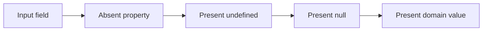
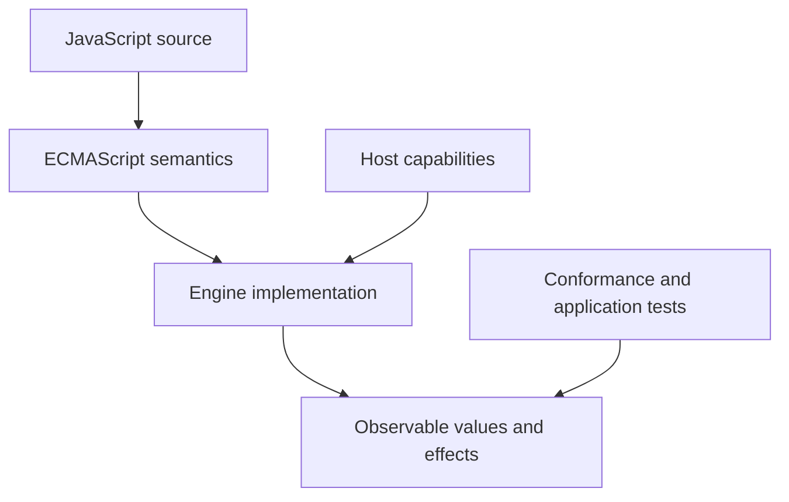
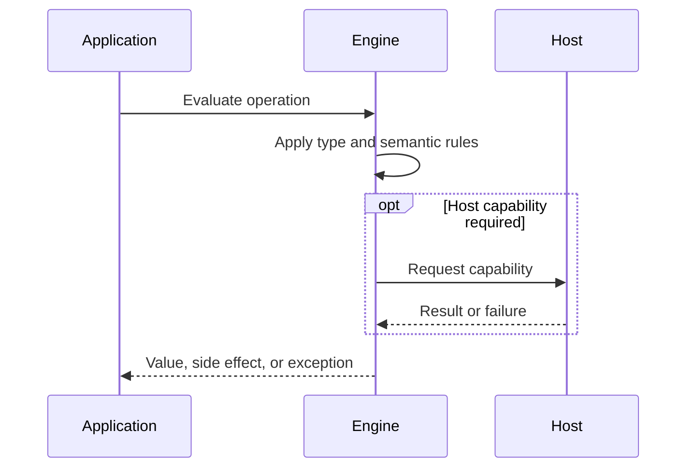

# Null Undefined and Missing Values

## Overview

undefined and null are distinct primitive values, while missing is a state that depends on an operation: an absent property, omitted argument, array hole, or absent map entry. APIs become reliable only when they define which states are meaningful.

The first-principles question is: **what invariant must a runtime preserve, and what observable behavior follows from that invariant?** This note answers that question before introducing convenience rules.

## Learning Objectives

- Explain the concept without relying on framework terminology.
- Predict edge cases from ECMAScript semantics.
- Separate language rules from engine representation and host policy.
- Select production practices based on explicit trade-offs.
- Verify claims with executable JavaScript in [[02-JavaScript/code/README|JavaScript code labs]].

## Prerequisites

- [[02-JavaScript/01-Values-and-Types/JavaScript Type System|JavaScript Type System]]

## Difficulty

`intermediate`

## Estimated Time

2 hours reading, 90 minutes exercises, and 3–6 hours for the mini project.

## History

undefined emerged as the default absence result; null was an explicit null-object marker influenced by Java-like syntax. Legacy behavior such as typeof null and sparse arrays remains for compatibility. Modern syntax added optional chaining and nullish coalescing.

History matters because compatibility constraints explain behavior that would otherwise look arbitrary. A production engineer must know which behavior is guaranteed by ECMAScript and which behavior is only a current implementation strategy.

## Problem It Solves

Real systems must distinguish not supplied, explicitly empty, unknown, deleted, and defaulted. Collapsing every state into falsiness loses valid values such as zero, false, and the empty string.

### First-Principles Questions

1. What information exists before the operation starts?
2. Which distinctions must remain observable afterward?
3. Which conversions or side effects are permitted?
4. Where can the operation fail, and is that failure synchronous?
5. Which layer—specification, engine, or host—owns the guarantee?

## Internal Implementation

- Uninitialized var bindings and omitted returns produce undefined; lexical bindings before initialization throw rather than yielding undefined.
- Property access returns undefined both for an absent property and for a present property whose value is undefined.
- The in operator and Object.hasOwn distinguish presence from value.
- Array holes are absent indexed properties and behave differently from explicit undefined in some iteration methods.
- Default parameters apply to undefined, including omission, but not to null.
- JSON omits undefined object properties, converts undefined array elements to null, and preserves explicit null.

Engines may optimize representation aggressively, but optimization must preserve specified observable behavior. Internal tags, pointers, NaN-boxing, bytecode, and inline caches are implementation techniques, not portable API contracts.



## Mermaid Diagrams

### Responsibility Boundary



### Evaluation Sequence



## Examples

### Minimal Example

```javascript
const sample = { value: 1 };
const alias = sample;
console.log(alias === sample);
console.log(typeof sample);
```

The example isolates identity and runtime classification. It should be run before adding framework state, network I/O, or transpilation.

### Production-Shaped Example

```javascript
function readTimeout(options) {
  if (!Object.hasOwn(options, "timeoutMs")) return 5_000;
  if (options.timeoutMs === null) return Infinity;
  if (!Number.isFinite(options.timeoutMs) || options.timeoutMs < 0) {
    throw new TypeError("timeoutMs must be non-negative, null, or absent");
  }
  return options.timeoutMs;
}

console.log(readTimeout({}));                 // default
console.log(readTimeout({ timeoutMs: null })); // disabled
console.log(readTimeout({ timeoutMs: 0 }));    // immediate
```

Production-shaped code validates assumptions, makes failure visible, and avoids depending on unspecified engine details. Copy this example into [[02-JavaScript/code/README|JavaScript code labs]] and add tests for boundary values.

## Trade-offs

| Dimension | Upside | Downside | When it matters |
| --- | --- | --- | --- |
| Semantics | Multiple absence states can express intent | Requires a precise mental model | API design |
| Compatibility | Extra states increase API and serialization complexity | Legacy behavior remains observable | Multi-runtime software |
| Operations | Nullish operators preserve falsy domain values but can hide absence if overused | Additional validation and tests | Production boundaries |

### When to Use

- Use the language feature when its semantics match the domain invariant.
- Use explicit conversion or validation at untrusted and serialized boundaries.
- Prefer the simplest representation that preserves every required distinction.

### When Not to Use

- Do not use implicit behavior merely to save a line of code.
- Do not expose engine-specific representations as application contracts.
- Do not infer security, ownership, or validation guarantees from convenient syntax.

## Exercises

1. Compare an array hole with an explicit undefined element.
2. Observe JSON serialization of undefined in objects and arrays.
3. Design a PATCH field with absent, null, and value states.
4. Refactor a falsy default bug to preserve zero.
5. Add table-driven tests for empty, nullish, extreme, and wrong-type inputs.
6. Explain one result by naming the relevant abstract operation rather than saying “JavaScript is weird.”

## Mini Project

**Prompt:** Build a request-normalization library that models absent, clear, and update operations and emits precise validation errors.

Deliver a README, automated tests, input contracts, error examples, and a short performance or compatibility note. Link the implementation from [[02-JavaScript/code/README|JavaScript code labs]].

## Portfolio Project

**Prompt:** Create a JSON Merge Patch service with schema-aware null semantics, audit logs, property tests, and compatibility documentation.

Treat this as a production artifact: define scope and non-goals, include architecture and sequence Mermaid diagrams, automate tests, record trade-offs, and provide operational diagnostics.

## Interview Questions

1. How do null and undefined differ?
2. How can you test property presence?
3. What is an array hole?
4. When do default parameters apply?
5. Why is ?? different from ||?

### Stretch / Staff-Level

1. Which parts of this behavior are normative, and which are engine freedom?
2. How would you migrate a large codebase that relied on the most dangerous edge case?
3. Design observability that detects failures without logging secrets or high-cardinality raw values.

## Common Mistakes

- Using value || default when zero or empty string is valid.
- Assuming obj.x === undefined proves x is absent.
- Creating sparse arrays accidentally.
- Ignoring JSON's transformation of undefined.

The common pattern is accidental loss of information: collapsing distinct states, assuming structural equality, or allowing an implicit conversion to choose policy. Make that policy explicit.

## Best Practices

- Write an absence-state contract for public APIs.
- Use Object.hasOwn when property presence matters.
- Use ?? for nullish defaults and || only for intentional falsiness.
- Avoid sparse arrays in application data.
- Normalize wire formats at system boundaries.

### Production Checklist

- Validate values when they enter the process, worker, request, or module boundary.
- Pin supported runtime versions and test against the compatibility matrix.
- Prefer deterministic errors over silent fallback.
- Add regression tests for every edge case described in this note.
- Measure before applying engine-specific performance advice.
- Keep sensitive decisions on trusted infrastructure.
- Document serialization, equality, mutation, and absence semantics in public APIs.

## Summary

undefined and null are distinct primitive values, while missing is a state that depends on an operation: an absent property, omitted argument, array hole, or absent map entry. APIs become reliable only when they define which states are meaningful. The practical skill is not memorizing isolated outputs; it is deriving behavior from value categories, abstract operations, identity, and host boundaries. Production code then narrows permissive language behavior into explicit domain contracts.

## Further Reading

- [https://tc39.es/ecma262/#sec-undefined-value](https://tc39.es/ecma262/#sec-undefined-value)
- [https://tc39.es/ecma262/#sec-null-value](https://tc39.es/ecma262/#sec-null-value)
- [https://developer.mozilla.org/en-US/docs/Web/JavaScript/Reference/Operators/Nullish_coalescing](https://developer.mozilla.org/en-US/docs/Web/JavaScript/Reference/Operators/Nullish_coalescing)
- [ECMAScript Language Specification](https://tc39.es/ecma262/)
- [MDN JavaScript Guide](https://developer.mozilla.org/en-US/docs/Web/JavaScript/Guide)

## Related Notes

- [[02-JavaScript/01-Values-and-Types/Equality and Sameness|Equality and Sameness]]
- [[02-JavaScript/01-Values-and-Types/Type Coercion|Type Coercion]]
- [[02-JavaScript/01-Values-and-Types/JavaScript Type System|JavaScript Type System]]
- [[02-JavaScript/code/README|JavaScript code labs]]
- [[02-JavaScript/README|JavaScript]]

## Progress Checklist

- [ ] Explained the concept from first principles
- [ ] Recreated both Mermaid diagrams from memory
- [ ] Ran and modified the JavaScript examples
- [ ] Documented trade-offs and non-goals
- [ ] Completed all exercises
- [ ] Built the mini project with tests
- [ ] Practiced interview questions aloud
- [ ] Followed prerequisite and dependent wiki links
