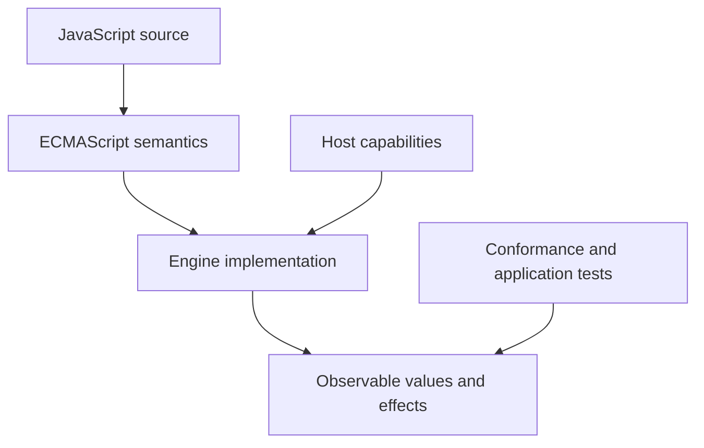
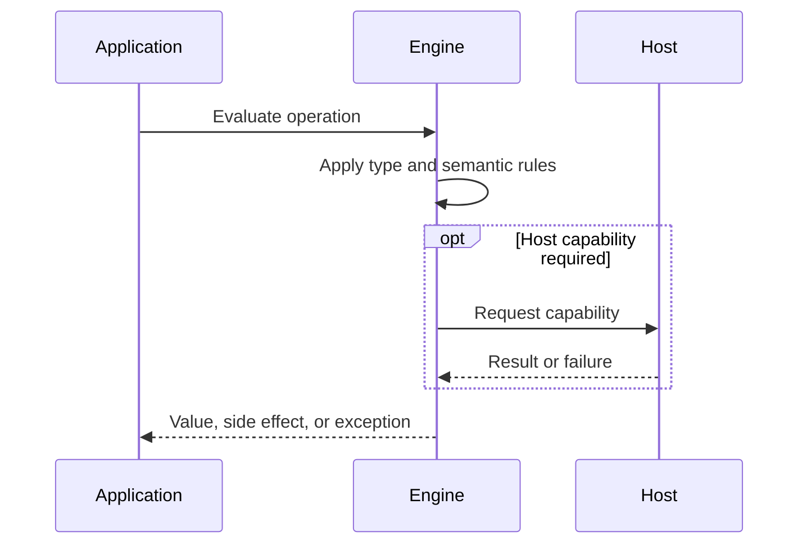

# Numbers BigInt and Numeric Precision

## Overview

JavaScript Number uses IEEE 754 binary64 for integers and fractions, including NaN, infinities, and signed zero. BigInt represents arbitrary-precision integers. Choosing between them is a domain decision about range, fractions, interoperability, and cost.

The first-principles question is: **what invariant must a runtime preserve, and what observable behavior follows from that invariant?** This note answers that question before introducing convenience rules.

## Learning Objectives

- Explain the concept without relying on framework terminology.
- Predict edge cases from ECMAScript semantics.
- Separate language rules from engine representation and host policy.
- Select production practices based on explicit trade-offs.
- Verify claims with executable JavaScript in [[02-JavaScript/code/README|JavaScript code labs]].

## Prerequisites

- [[01-Computer-Science/01-Information-and-Representation/Floating Point|Floating Point]]
- [[01-Computer-Science/01-Information-and-Representation/Integer Representation|Integer Representation]]
- [[02-JavaScript/01-Values-and-Types/Primitive Values and Objects|Primitive Values and Objects]]

## Difficulty

`intermediate`

## Estimated Time

2 hours reading, 90 minutes exercises, and 3–6 hours for the mini project.

## History

One numeric type simplified early scripting. Web applications later needed exact identifiers, counters, and cryptographic-sized integers, leading to BigInt in ECMAScript 2020 while preserving Number behavior.

History matters because compatibility constraints explain behavior that would otherwise look arbitrary. A production engineer must know which behavior is guaranteed by ECMAScript and which behavior is only a current implementation strategy.

## Problem It Solves

Finite hardware cannot represent every real number. Binary64 offers wide range and fast hardware operations but cannot exactly encode many decimals or every large integer. BigInt provides exact integers but no fractional values and limited interchange.

### First-Principles Questions

1. What information exists before the operation starts?
2. Which distinctions must remain observable afterward?
3. Which conversions or side effects are permitted?
4. Where can the operation fail, and is that failure synchronous?
5. Which layer—specification, engine, or host—owns the guarantee?

## Internal Implementation

- Binary64 stores a sign, an 11-bit exponent, and a 52-bit fraction with an implicit leading bit for normal values.
- Integers are exact only through Number.MAX_SAFE_INTEGER; beyond it adjacent mathematical integers may collapse.
- NaN is not equal to itself, while Number.isNaN avoids coercive global isNaN behavior.
- BigInt arithmetic stays in the BigInt domain; mixing Number and BigInt arithmetic throws.
- JSON.stringify rejects BigInt unless an explicit serialization policy transforms it.
- Negative zero can be distinguished with Object.is and can matter in reciprocal and directional calculations.

Engines may optimize representation aggressively, but optimization must preserve specified observable behavior. Internal tags, pointers, NaN-boxing, bytecode, and inline caches are implementation techniques, not portable API contracts.


## Mermaid Diagrams

### Responsibility Boundary



### Evaluation Sequence



## Examples

### Minimal Example

```javascript
const sample = { value: 1 };
const alias = sample;
console.log(alias === sample);
console.log(typeof sample);
```

The example isolates identity and runtime classification. It should be run before adding framework state, network I/O, or transpilation.

### Production-Shaped Example

```javascript
function addMoneyInCents(a, b) {
  if (!Number.isSafeInteger(a) || !Number.isSafeInteger(b)) {
    throw new RangeError("amounts must be safe integer cents");
  }
  const total = a + b;
  if (!Number.isSafeInteger(total)) throw new RangeError("total overflow");
  return total;
}

console.log(0.1 + 0.2); // 0.30000000000000004
console.log(addMoneyInCents(10, 20)); // 30
console.log(9_007_199_254_740_993n + 1n);
console.log(Object.is(-0, 0)); // false
```

Production-shaped code validates assumptions, makes failure visible, and avoids depending on unspecified engine details. Copy this example into [[02-JavaScript/code/README|JavaScript code labs]] and add tests for boundary values.

## Trade-offs

| Dimension | Upside | Downside | When it matters |
| --- | --- | --- | --- |
| Semantics | Number is hardware-friendly and interoperable | Requires a precise mental model | API design |
| Compatibility | BigInt preserves arbitrary integer precision but costs more and cannot mix implicitly | Legacy behavior remains observable | Multi-runtime software |
| Operations | Integer minor units simplify money but still require currency and overflow policy | Additional validation and tests | Production boundaries |

### When to Use

- Use the language feature when its semantics match the domain invariant.
- Use explicit conversion or validation at untrusted and serialized boundaries.
- Prefer the simplest representation that preserves every required distinction.

### When Not to Use

- Do not use implicit behavior merely to save a line of code.
- Do not expose engine-specific representations as application contracts.
- Do not infer security, ownership, or validation guarantees from convenient syntax.

## Exercises

1. Show the first integer for which Number loses adjacency.
2. Implement nearlyEqual with absolute and relative tolerances.
3. Design a JSON encoding for BigInt identifiers.
4. Compare integer cents with binary floating-point dollars.
5. Add table-driven tests for empty, nullish, extreme, and wrong-type inputs.
6. Explain one result by naming the relevant abstract operation rather than saying “JavaScript is weird.”

## Mini Project

**Prompt:** Build a numeric audit CLI that reads JSON-like input, detects unsafe integers and non-finite values, and recommends schema encodings.

Deliver a README, automated tests, input contracts, error examples, and a short performance or compatibility note. Link the implementation from [[02-JavaScript/code/README|JavaScript code labs]].

## Portfolio Project

**Prompt:** Create a currency calculation package with rounding modes, overflow checks, property tests, serialization contracts, and benchmarks.

Treat this as a production artifact: define scope and non-goals, include architecture and sequence Mermaid diagrams, automate tests, record trade-offs, and provide operational diagnostics.

## Interview Questions

1. Why is 0.1 + 0.2 not exactly 0.3?
2. What is a safe integer?
3. When should BigInt be used?
4. Why can BigInt not be JSON-stringified directly?
5. What is negative zero?

### Stretch / Staff-Level

1. Which parts of this behavior are normative, and which are engine freedom?
2. How would you migrate a large codebase that relied on the most dangerous edge case?
3. Design observability that detects failures without logging secrets or high-cardinality raw values.

## Common Mistakes

- Comparing decimal results with exact equality.
- Using large Number values for database identifiers.
- Mixing BigInt and Number arithmetic.
- Assuming toFixed repairs earlier precision loss.

The common pattern is accidental loss of information: collapsing distinct states, assuming structural equality, or allowing an implicit conversion to choose policy. Make that policy explicit.

## Best Practices

- Use Number.isFinite and Number.isSafeInteger at boundaries.
- Represent money as validated minor units or a decimal library.
- Serialize large integers as strings under an explicit schema.
- Use tolerances derived from domain scale, not a universal epsilon.
- Benchmark BigInt only under realistic operand sizes.

### Production Checklist

- Validate values when they enter the process, worker, request, or module boundary.
- Pin supported runtime versions and test against the compatibility matrix.
- Prefer deterministic errors over silent fallback.
- Add regression tests for every edge case described in this note.
- Measure before applying engine-specific performance advice.
- Keep sensitive decisions on trusted infrastructure.
- Document serialization, equality, mutation, and absence semantics in public APIs.

## Summary

JavaScript Number uses IEEE 754 binary64 for integers and fractions, including NaN, infinities, and signed zero. BigInt represents arbitrary-precision integers. Choosing between them is a domain decision about range, fractions, interoperability, and cost. The practical skill is not memorizing isolated outputs; it is deriving behavior from value categories, abstract operations, identity, and host boundaries. Production code then narrows permissive language behavior into explicit domain contracts.

## Further Reading

- [https://tc39.es/ecma262/#sec-ecmascript-language-types-number-type](https://tc39.es/ecma262/#sec-ecmascript-language-types-number-type)
- [https://tc39.es/ecma262/#sec-bigint-objects](https://tc39.es/ecma262/#sec-bigint-objects)
- [https://standards.ieee.org/ieee/754/6210/](https://standards.ieee.org/ieee/754/6210/)
- [ECMAScript Language Specification](https://tc39.es/ecma262/)
- [MDN JavaScript Guide](https://developer.mozilla.org/en-US/docs/Web/JavaScript/Guide)

## Related Notes

- [[01-Computer-Science/01-Information-and-Representation/Bits Bytes and Information|Bits, Bytes, and Information]]
- [[02-JavaScript/01-Values-and-Types/Equality and Sameness|Equality and Sameness]]
- [[01-Computer-Science/01-Information-and-Representation/Floating Point|Floating Point]]
- [[01-Computer-Science/01-Information-and-Representation/Integer Representation|Integer Representation]]
- [[02-JavaScript/01-Values-and-Types/Primitive Values and Objects|Primitive Values and Objects]]
- [[02-JavaScript/code/README|JavaScript code labs]]
- [[02-JavaScript/README|JavaScript]]

## Progress Checklist

- [ ] Explained the concept from first principles
- [ ] Recreated both Mermaid diagrams from memory
- [ ] Ran and modified the JavaScript examples
- [ ] Documented trade-offs and non-goals
- [ ] Completed all exercises
- [ ] Built the mini project with tests
- [ ] Practiced interview questions aloud
- [ ] Followed prerequisite and dependent wiki links
