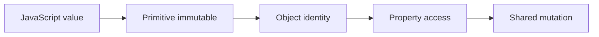
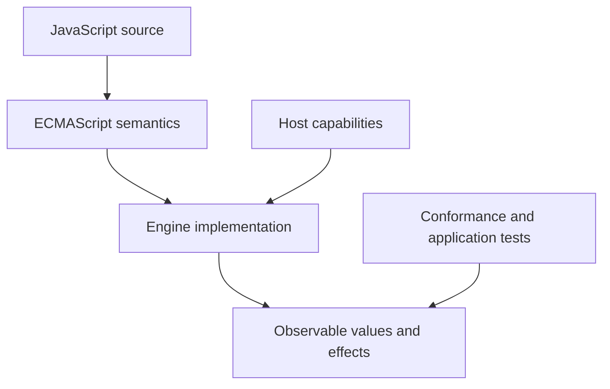
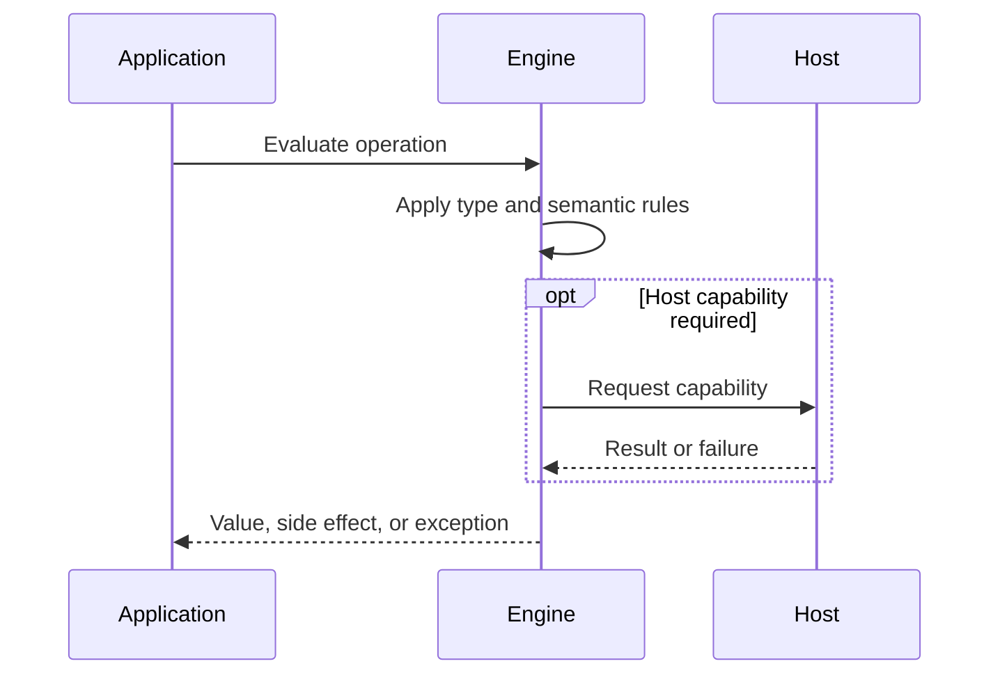

# Primitive Values and Objects

## Overview

JavaScript divides language values into primitives and objects. Primitives are immutable atomic values; objects are mutable identity-bearing collections with internal slots. Apparent method calls on primitives work through property-access semantics, not because primitives become permanently boxed objects.

The first-principles question is: **what invariant must a runtime preserve, and what observable behavior follows from that invariant?** This note answers that question before introducing convenience rules.

## Learning Objectives

- Explain the concept without relying on framework terminology.
- Predict edge cases from ECMAScript semantics.
- Separate language rules from engine representation and host policy.
- Select production practices based on explicit trade-offs.
- Verify claims with executable JavaScript in [[02-JavaScript/code/README|JavaScript code labs]].

## Prerequisites

- [[02-JavaScript/01-Values-and-Types/JavaScript Type System|JavaScript Type System]]
- [[01-Computer-Science/03-Memory-and-Addressing/Pointers References and Aliasing|Pointers, References, and Aliasing]]

## Difficulty

`intermediate`

## Estimated Time

2 hours reading, 90 minutes exercises, and 3–6 hours for the mini project.

## History

The language borrowed convenient primitive/object distinctions from earlier languages while making strings and numbers feel object-like. Wrapper constructors preserved an object model but also created lasting truthiness and equality hazards.

History matters because compatibility constraints explain behavior that would otherwise look arbitrary. A production engineer must know which behavior is guaranteed by ECMAScript and which behavior is only a current implementation strategy.

## Problem It Solves

Programs need cheap scalar values and extensible structured values. The split provides value-like numbers and strings while objects support identity, mutation, methods, and shared graphs.

### First-Principles Questions

1. What information exists before the operation starts?
2. Which distinctions must remain observable afterward?
3. Which conversions or side effects are permitted?
4. Where can the operation fail, and is that failure synchronous?
5. Which layer—specification, engine, or host—owns the guarantee?

## Internal Implementation

- Primitive categories are undefined, null, boolean, number, bigint, string, and symbol.
- An object has identity: two separately allocated objects are unequal even with equal properties.
- Primitive property access conceptually uses wrapper behavior; the temporary access does not mutate the primitive.
- Object wrappers created with new Boolean, new Number, or new String are real truthy objects.
- Variables hold values; copying an object value copies a reference-like identity handle, not a recursive object graph.

Engines may optimize representation aggressively, but optimization must preserve specified observable behavior. Internal tags, pointers, NaN-boxing, bytecode, and inline caches are implementation techniques, not portable API contracts.



## Mermaid Diagrams

### Responsibility Boundary



### Evaluation Sequence



## Examples

### Minimal Example

```javascript
const sample = { value: 1 };
const alias = sample;
console.log(alias === sample);
console.log(typeof sample);
```

The example isolates identity and runtime classification. It should be run before adding framework state, network I/O, or transpilation.

### Production-Shaped Example

```javascript
const label = "release";
console.log(label.toUpperCase()); // primitive property access

const a = { retries: 2 };
const b = a;
b.retries += 1;
console.log(a.retries); // 3: both bindings share one object

const dangerous = new Boolean(false);
if (dangerous) console.log("wrapper objects are truthy");

const safeConfig = Object.freeze({ retries: 3 });
```

Production-shaped code validates assumptions, makes failure visible, and avoids depending on unspecified engine details. Copy this example into [[02-JavaScript/code/README|JavaScript code labs]] and add tests for boundary values.

## Trade-offs

| Dimension | Upside | Downside | When it matters |
| --- | --- | --- | --- |
| Semantics | Primitives are simple immutable values | Requires a precise mental model | API design |
| Compatibility | Objects model rich evolving state but introduce aliasing | Legacy behavior remains observable | Multi-runtime software |
| Operations | Wrapper convenience makes APIs ergonomic while obscuring temporary boxing | Additional validation and tests | Production boundaries |

### When to Use

- Use the language feature when its semantics match the domain invariant.
- Use explicit conversion or validation at untrusted and serialized boundaries.
- Prefer the simplest representation that preserves every required distinction.

### When Not to Use

- Do not use implicit behavior merely to save a line of code.
- Do not expose engine-specific representations as application contracts.
- Do not infer security, ownership, or validation guarantees from convenient syntax.

## Exercises

1. Compare Boolean(false) with new Boolean(false).
2. Attempt to attach a property to a string primitive.
3. Trace aliases through assignment and function calls.
4. Implement a shallow immutable update without mutating the original.
5. Add table-driven tests for empty, nullish, extreme, and wrong-type inputs.
6. Explain one result by naming the relevant abstract operation rather than saying “JavaScript is weird.”

## Mini Project

**Prompt:** Build an object-graph visualizer that labels identities, aliases, primitives, and mutations across a scripted sequence.

Deliver a README, automated tests, input contracts, error examples, and a short performance or compatibility note. Link the implementation from [[02-JavaScript/code/README|JavaScript code labs]].

## Portfolio Project

**Prompt:** Create an immutable configuration library with structural sharing, deep-freeze development checks, benchmarks, and clear ownership contracts.

Treat this as a production artifact: define scope and non-goals, include architecture and sequence Mermaid diagrams, automate tests, record trade-offs, and provide operational diagnostics.

## Interview Questions

1. What distinguishes primitives from objects?
2. How can a primitive have methods?
3. Why are two object literals not equal?
4. Is JavaScript pass-by-reference?
5. What is dangerous about wrapper constructors?

### Stretch / Staff-Level

1. Which parts of this behavior are normative, and which are engine freedom?
2. How would you migrate a large codebase that relied on the most dangerous edge case?
3. Design observability that detects failures without logging secrets or high-cardinality raw values.

## Common Mistakes

- Using new Boolean(false) and expecting a falsy value.
- Claiming objects are passed by reference; arguments are values, including object references.
- Expecting primitive property assignment to persist.
- Assuming Object.freeze recursively freezes nested objects.

The common pattern is accidental loss of information: collapsing distinct states, assuming structural equality, or allowing an implicit conversion to choose policy. Make that policy explicit.

## Best Practices

- Use primitive literals, not wrapper constructors.
- Make mutation and ownership explicit at API boundaries.
- Freeze or clone only with a documented depth policy.
- Use value objects or normalized records for comparison-heavy domains.
- Inspect aliases before changing shared state.

### Production Checklist

- Validate values when they enter the process, worker, request, or module boundary.
- Pin supported runtime versions and test against the compatibility matrix.
- Prefer deterministic errors over silent fallback.
- Add regression tests for every edge case described in this note.
- Measure before applying engine-specific performance advice.
- Keep sensitive decisions on trusted infrastructure.
- Document serialization, equality, mutation, and absence semantics in public APIs.

## Summary

JavaScript divides language values into primitives and objects. Primitives are immutable atomic values; objects are mutable identity-bearing collections with internal slots. Apparent method calls on primitives work through property-access semantics, not because primitives become permanently boxed objects. The practical skill is not memorizing isolated outputs; it is deriving behavior from value categories, abstract operations, identity, and host boundaries. Production code then narrows permissive language behavior into explicit domain contracts.

## Further Reading

- [https://tc39.es/ecma262/#sec-ecmascript-data-types-and-values](https://tc39.es/ecma262/#sec-ecmascript-data-types-and-values)
- [https://tc39.es/ecma262/#sec-toobject](https://tc39.es/ecma262/#sec-toobject)
- [https://developer.mozilla.org/en-US/docs/Glossary/Primitive](https://developer.mozilla.org/en-US/docs/Glossary/Primitive)
- [ECMAScript Language Specification](https://tc39.es/ecma262/)
- [MDN JavaScript Guide](https://developer.mozilla.org/en-US/docs/Web/JavaScript/Guide)

## Related Notes

- [[02-JavaScript/01-Values-and-Types/Value Copying Sharing and Mutation|Value Copying, Sharing, and Mutation]]
- [[01-Computer-Science/03-Memory-and-Addressing/Garbage Collection Models|Garbage Collection Models]]
- [[02-JavaScript/01-Values-and-Types/JavaScript Type System|JavaScript Type System]]
- [[01-Computer-Science/03-Memory-and-Addressing/Pointers References and Aliasing|Pointers, References, and Aliasing]]
- [[02-JavaScript/code/README|JavaScript code labs]]
- [[02-JavaScript/README|JavaScript]]

## Progress Checklist

- [ ] Explained the concept from first principles
- [ ] Recreated both Mermaid diagrams from memory
- [ ] Ran and modified the JavaScript examples
- [ ] Documented trade-offs and non-goals
- [ ] Completed all exercises
- [ ] Built the mini project with tests
- [ ] Practiced interview questions aloud
- [ ] Followed prerequisite and dependent wiki links
