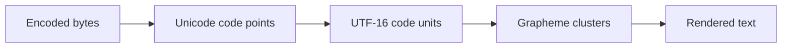
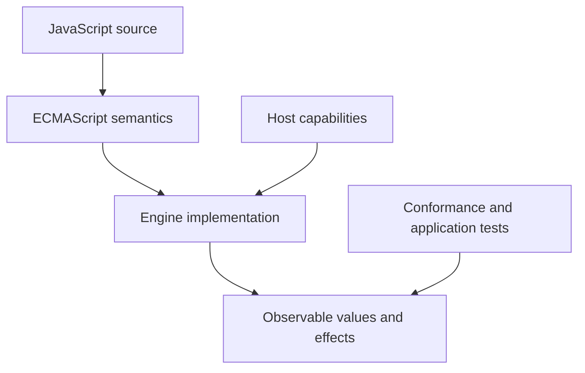
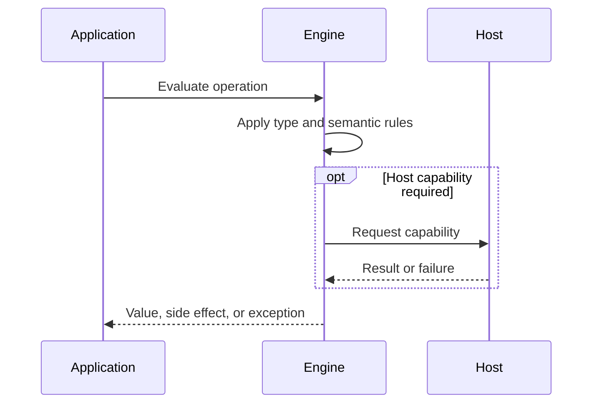

# Strings Unicode and Template Literals

## Overview

A JavaScript string is an immutable sequence of UTF-16 code units, not a guaranteed sequence of Unicode code points or user-perceived characters. Template literals add multiline syntax, interpolation, and tagged processing but do not automatically escape output.

The first-principles question is: **what invariant must a runtime preserve, and what observable behavior follows from that invariant?** This note answers that question before introducing convenience rules.

## Learning Objectives

- Explain the concept without relying on framework terminology.
- Predict edge cases from ECMAScript semantics.
- Separate language rules from engine representation and host policy.
- Select production practices based on explicit trade-offs.
- Verify claims with executable JavaScript in [[02-JavaScript/code/README|JavaScript code labs]].

## Prerequisites

- [[01-Computer-Science/01-Information-and-Representation/Character Encoding|Character Encoding]]
- [[02-JavaScript/01-Values-and-Types/Primitive Values and Objects|Primitive Values and Objects]]

## Difficulty

`intermediate`

## Estimated Time

2 hours reading, 90 minutes exercises, and 3–6 hours for the mini project.

## History

JavaScript adopted 16-bit strings when Unicode was expected to fit in that width. Unicode later expanded beyond the Basic Multilingual Plane, so surrogate pairs and code-point-aware APIs had to coexist with legacy code-unit indexing.

History matters because compatibility constraints explain behavior that would otherwise look arbitrary. A production engineer must know which behavior is guaranteed by ECMAScript and which behavior is only a current implementation strategy.

## Problem It Solves

Software must carry text across languages and systems. UTF-16 provides stable legacy indexing, but correctness requires distinguishing bytes, code units, code points, and grapheme clusters. Interpolation improves composition while making context-sensitive escaping essential.

### First-Principles Questions

1. What information exists before the operation starts?
2. Which distinctions must remain observable afterward?
3. Which conversions or side effects are permitted?
4. Where can the operation fail, and is that failure synchronous?
5. Which layer—specification, engine, or host—owns the guarantee?

## Internal Implementation

- length counts UTF-16 code units; many non-BMP symbols count as two.
- for...of iterates code points using the string iterator, unlike numeric indexing.
- Combining marks and emoji sequences can contain multiple code points per grapheme cluster.
- Normalization can make canonically equivalent text share a chosen representation.
- Tagged templates receive frozen arrays of cooked and raw segments and can implement safe domain-specific construction.
- Interpolation calls string conversion; it does not know whether the target context is HTML, SQL, a URL, or a shell.

Engines may optimize representation aggressively, but optimization must preserve specified observable behavior. Internal tags, pointers, NaN-boxing, bytecode, and inline caches are implementation techniques, not portable API contracts.



## Mermaid Diagrams

### Responsibility Boundary



### Evaluation Sequence



## Examples

### Minimal Example

```javascript
const sample = { value: 1 };
const alias = sample;
console.log(alias === sample);
console.log(typeof sample);
```

The example isolates identity and runtime classification. It should be run before adding framework state, network I/O, or transpilation.

### Production-Shaped Example

```javascript
const text = "A💡e\u0301";
console.log(text.length);          // UTF-16 code units
console.log([...text].length);     // code points

const segmenter = new Intl.Segmenter("en", { granularity: "grapheme" });
console.log([...segmenter.segment(text)].map(({ segment }) => segment));

function logTemplate(parts, ...values) {
  return parts.reduce((out, part, i) =>
    out + part + (i < values.length ? JSON.stringify(values[i]) : ""), "");
}
console.log(logTemplate`user=${"Ada"} count=${3}`);
```

Production-shaped code validates assumptions, makes failure visible, and avoids depending on unspecified engine details. Copy this example into [[02-JavaScript/code/README|JavaScript code labs]] and add tests for boundary values.

## Trade-offs

| Dimension | Upside | Downside | When it matters |
| --- | --- | --- | --- |
| Semantics | UTF-16 preserves web compatibility | Requires a precise mental model | API design |
| Compatibility | Code-unit indexing is fast but not user-character aware | Legacy behavior remains observable | Multi-runtime software |
| Operations | Tagged templates can centralize escaping but only for a clearly defined output context | Additional validation and tests | Production boundaries |

### When to Use

- Use the language feature when its semantics match the domain invariant.
- Use explicit conversion or validation at untrusted and serialized boundaries.
- Prefer the simplest representation that preserves every required distinction.

### When Not to Use

- Do not use implicit behavior merely to save a line of code.
- Do not expose engine-specific representations as application contracts.
- Do not infer security, ownership, or validation guarantees from convenient syntax.

## Exercises

1. Compare length, spread length, and grapheme count for several emoji.
2. Write a code-point-safe truncator, then explain why it is not grapheme-safe.
3. Compare NFC and NFD forms of accented text.
4. Implement a tagged template for structured logging, not HTML concatenation.
5. Add table-driven tests for empty, nullish, extreme, and wrong-type inputs.
6. Explain one result by naming the relevant abstract operation rather than saying “JavaScript is weird.”

## Mini Project

**Prompt:** Build a Unicode inspector showing code units, code points, grapheme clusters, normalization forms, and UTF-8 byte length.

Deliver a README, automated tests, input contracts, error examples, and a short performance or compatibility note. Link the implementation from [[02-JavaScript/code/README|JavaScript code labs]].

## Portfolio Project

**Prompt:** Create an internationalized text-processing toolkit with segmentation, truncation, normalization policy, fuzz tests, and accessibility notes.

Treat this as a production artifact: define scope and non-goals, include architecture and sequence Mermaid diagrams, automate tests, record trade-offs, and provide operational diagnostics.

## Interview Questions

1. What does JavaScript string length count?
2. What is a surrogate pair?
3. How do code points differ from grapheme clusters?
4. What does a tagged template receive?
5. Do template literals prevent injection?

### Stretch / Staff-Level

1. Which parts of this behavior are normative, and which are engine freedom?
2. How would you migrate a large codebase that relied on the most dangerous edge case?
3. Design observability that detects failures without logging secrets or high-cardinality raw values.

## Common Mistakes

- Treating length as visible character count.
- Slicing through a surrogate pair.
- Comparing user text without a normalization policy.
- Assuming template interpolation prevents injection.

The common pattern is accidental loss of information: collapsing distinct states, assuming structural equality, or allowing an implicit conversion to choose policy. Make that policy explicit.

## Best Practices

- Define normalization and locale policy at boundaries.
- Use Intl.Segmenter for user-perceived segmentation when supported.
- Use context-specific escaping or parameterization.
- Encode and decode explicitly at byte boundaries.
- Test emoji, combining marks, bidirectional text, and empty strings.

### Production Checklist

- Validate values when they enter the process, worker, request, or module boundary.
- Pin supported runtime versions and test against the compatibility matrix.
- Prefer deterministic errors over silent fallback.
- Add regression tests for every edge case described in this note.
- Measure before applying engine-specific performance advice.
- Keep sensitive decisions on trusted infrastructure.
- Document serialization, equality, mutation, and absence semantics in public APIs.

## Summary

A JavaScript string is an immutable sequence of UTF-16 code units, not a guaranteed sequence of Unicode code points or user-perceived characters. Template literals add multiline syntax, interpolation, and tagged processing but do not automatically escape output. The practical skill is not memorizing isolated outputs; it is deriving behavior from value categories, abstract operations, identity, and host boundaries. Production code then narrows permissive language behavior into explicit domain contracts.

## Further Reading

- [https://tc39.es/ecma262/#sec-ecmascript-language-types-string-type](https://tc39.es/ecma262/#sec-ecmascript-language-types-string-type)
- [https://unicode.org/standard/standard.html](https://unicode.org/standard/standard.html)
- [https://developer.mozilla.org/en-US/docs/Web/JavaScript/Reference/Template_literals](https://developer.mozilla.org/en-US/docs/Web/JavaScript/Reference/Template_literals)
- [ECMAScript Language Specification](https://tc39.es/ecma262/)
- [MDN JavaScript Guide](https://developer.mozilla.org/en-US/docs/Web/JavaScript/Guide)

## Related Notes

- [[01-Computer-Science/01-Information-and-Representation/Character Encoding|Character Encoding]]
- [[02-JavaScript/01-Values-and-Types/Type Coercion|Type Coercion]]
- [[02-JavaScript/01-Values-and-Types/Primitive Values and Objects|Primitive Values and Objects]]
- [[02-JavaScript/code/README|JavaScript code labs]]
- [[02-JavaScript/README|JavaScript]]

## Progress Checklist

- [ ] Explained the concept from first principles
- [ ] Recreated both Mermaid diagrams from memory
- [ ] Ran and modified the JavaScript examples
- [ ] Documented trade-offs and non-goals
- [ ] Completed all exercises
- [ ] Built the mini project with tests
- [ ] Practiced interview questions aloud
- [ ] Followed prerequisite and dependent wiki links
