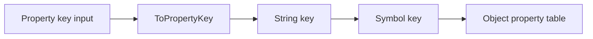
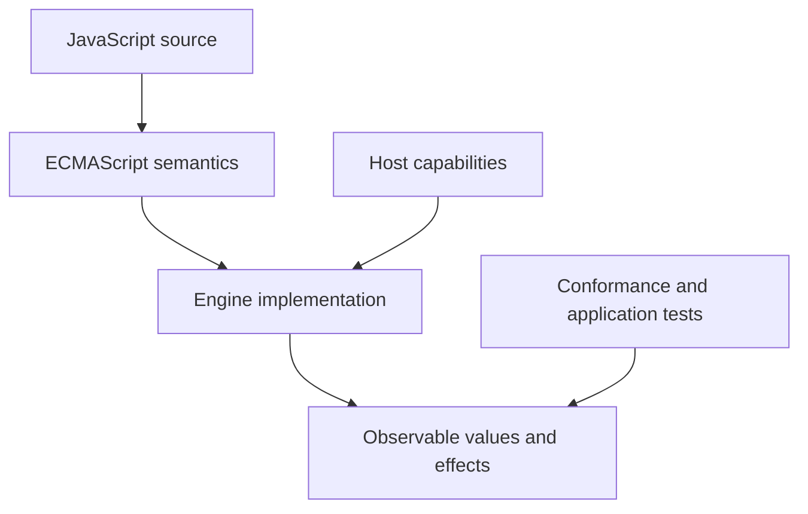
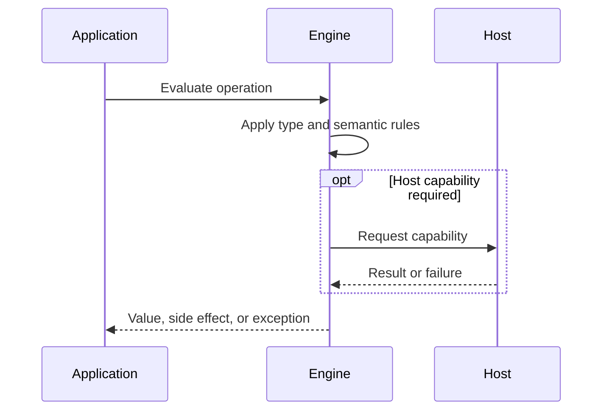

# Symbols and Unique Property Keys

## Overview

A Symbol is an immutable primitive whose identity is unique unless obtained from a shared registry. Symbols are one of the two object property-key domains, alongside strings, and support collision-resistant metadata and protocol hooks.

The first-principles question is: **what invariant must a runtime preserve, and what observable behavior follows from that invariant?** This note answers that question before introducing convenience rules.

## Learning Objectives

- Explain the concept without relying on framework terminology.
- Predict edge cases from ECMAScript semantics.
- Separate language rules from engine representation and host policy.
- Select production practices based on explicit trade-offs.
- Verify claims with executable JavaScript in [[02-JavaScript/code/README|JavaScript code labs]].

## Prerequisites

- [[02-JavaScript/01-Values-and-Types/Primitive Values and Objects|Primitive Values and Objects]]

## Difficulty

`intermediate`

## Estimated Time

2 hours reading, 90 minutes exercises, and 3–6 hours for the mini project.

## History

ES2015 introduced Symbol to let libraries attach metadata without ordinary string-name collisions and to expose language protocols through well-known symbols such as Symbol.iterator. Private fields later addressed true encapsulation separately.

History matters because compatibility constraints explain behavior that would otherwise look arbitrary. A production engineer must know which behavior is guaranteed by ECMAScript and which behavior is only a current implementation strategy.

## Problem It Solves

Independent components often extend the same object. String keys can collide with user data or future standards. Unique keys create separate identity-based namespaces, though they do not make properties secret.

### First-Principles Questions

1. What information exists before the operation starts?
2. Which distinctions must remain observable afterward?
3. Which conversions or side effects are permitted?
4. Where can the operation fail, and is that failure synchronous?
5. Which layer—specification, engine, or host—owns the guarantee?

## Internal Implementation

- Symbol(description) creates a fresh identity every call; the description is diagnostic only.
- Symbol.for(key) retrieves or creates a symbol in the agent-wide global symbol registry.
- ToPropertyKey preserves symbols but converts other key candidates to strings.
- Well-known symbols customize protocols including iteration, coercion, matching, and species.
- Object.keys and JSON ignore symbol-keyed properties; Reflect.ownKeys includes strings and symbols.
- Symbol properties remain discoverable and accessible through reflection, so they are not privacy controls.

Engines may optimize representation aggressively, but optimization must preserve specified observable behavior. Internal tags, pointers, NaN-boxing, bytecode, and inline caches are implementation techniques, not portable API contracts.



## Mermaid Diagrams

### Responsibility Boundary



### Evaluation Sequence



## Examples

### Minimal Example

```javascript
const sample = { value: 1 };
const alias = sample;
console.log(alias === sample);
console.log(typeof sample);
```

The example isolates identity and runtime classification. It should be run before adding framework state, network I/O, or transpilation.

### Production-Shaped Example

```javascript
const traceId = Symbol("traceId");

export function attachTrace(record, id) {
  Object.defineProperty(record, traceId, {
    value: id,
    enumerable: false,
    writable: false,
  });
  return record;
}

const event = attachTrace({ type: "saved" }, "tr-42");
console.log(JSON.stringify(event));       // {"type":"saved"}
console.log(event[traceId]);              // tr-42
console.log(Reflect.ownKeys(event));      // includes traceId
```

Production-shaped code validates assumptions, makes failure visible, and avoids depending on unspecified engine details. Copy this example into [[02-JavaScript/code/README|JavaScript code labs]] and add tests for boundary values.

## Trade-offs

| Dimension | Upside | Downside | When it matters |
| --- | --- | --- | --- |
| Semantics | Unique identity avoids accidental key collisions | Requires a precise mental model | API design |
| Compatibility | Symbol data is omitted by common enumeration and serialization | Legacy behavior remains observable | Multi-runtime software |
| Operations | Registry symbols enable coordination but create global naming and lifetime concerns | Additional validation and tests | Production boundaries |

### When to Use

- Use the language feature when its semantics match the domain invariant.
- Use explicit conversion or validation at untrusted and serialized boundaries.
- Prefer the simplest representation that preserves every required distinction.

### When Not to Use

- Do not use implicit behavior merely to save a line of code.
- Do not expose engine-specific representations as application contracts.
- Do not infer security, ownership, or validation guarantees from convenient syntax.

## Exercises

1. Compare two symbols with the same description.
2. Inspect local and registry symbols with keyFor.
3. Add Symbol.iterator to a small collection.
4. Compare Object.keys, Object.getOwnPropertySymbols, and Reflect.ownKeys.
5. Add table-driven tests for empty, nullish, extreme, and wrong-type inputs.
6. Explain one result by naming the relevant abstract operation rather than saying “JavaScript is weird.”

## Mini Project

**Prompt:** Build a plugin metadata system using symbols, with collision tests and explicit export/import behavior.

Deliver a README, automated tests, input contracts, error examples, and a short performance or compatibility note. Link the implementation from [[02-JavaScript/code/README|JavaScript code labs]].

## Portfolio Project

**Prompt:** Create a protocol-oriented collection library implementing iteration, conversion, inspection, and metadata hooks with conformance tests.

Treat this as a production artifact: define scope and non-goals, include architecture and sequence Mermaid diagrams, automate tests, record trade-offs, and provide operational diagnostics.

## Interview Questions

1. Why were symbols added?
2. How do Symbol and Symbol.for differ?
3. Are symbol properties private?
4. What are well-known symbols?
5. Which reflection API returns every own key?

### Stretch / Staff-Level

1. Which parts of this behavior are normative, and which are engine freedom?
2. How would you migrate a large codebase that relied on the most dangerous edge case?
3. Design observability that detects failures without logging secrets or high-cardinality raw values.

## Common Mistakes

- Treating the description as identity.
- Calling Symbol with new.
- Assuming symbol keys are private or secure.
- Forgetting symbol metadata during clones or serialization.

The common pattern is accidental loss of information: collapsing distinct states, assuming structural equality, or allowing an implicit conversion to choose policy. Make that policy explicit.

## Best Practices

- Use local symbols for implementation metadata.
- Use Symbol.for only when cross-component coordination is intentional.
- Use well-known symbols only according to their protocol contracts.
- Choose Reflect.ownKeys when complete reflection is required.
- Document serialization behavior for symbol-keyed state.

### Production Checklist

- Validate values when they enter the process, worker, request, or module boundary.
- Pin supported runtime versions and test against the compatibility matrix.
- Prefer deterministic errors over silent fallback.
- Add regression tests for every edge case described in this note.
- Measure before applying engine-specific performance advice.
- Keep sensitive decisions on trusted infrastructure.
- Document serialization, equality, mutation, and absence semantics in public APIs.

## Summary

A Symbol is an immutable primitive whose identity is unique unless obtained from a shared registry. Symbols are one of the two object property-key domains, alongside strings, and support collision-resistant metadata and protocol hooks. The practical skill is not memorizing isolated outputs; it is deriving behavior from value categories, abstract operations, identity, and host boundaries. Production code then narrows permissive language behavior into explicit domain contracts.

## Further Reading

- [https://tc39.es/ecma262/#sec-ecmascript-language-types-symbol-type](https://tc39.es/ecma262/#sec-ecmascript-language-types-symbol-type)
- [https://tc39.es/ecma262/#sec-well-known-symbols](https://tc39.es/ecma262/#sec-well-known-symbols)
- [https://developer.mozilla.org/en-US/docs/Web/JavaScript/Reference/Global_Objects/Symbol](https://developer.mozilla.org/en-US/docs/Web/JavaScript/Reference/Global_Objects/Symbol)
- [ECMAScript Language Specification](https://tc39.es/ecma262/)
- [MDN JavaScript Guide](https://developer.mozilla.org/en-US/docs/Web/JavaScript/Guide)

## Related Notes

- [[02-JavaScript/03-Objects-and-Metaprogramming/Objects and Property Keys|Objects and Property Keys]]
- [[02-JavaScript/01-Values-and-Types/Type Coercion|Type Coercion]]
- [[02-JavaScript/01-Values-and-Types/Primitive Values and Objects|Primitive Values and Objects]]
- [[02-JavaScript/code/README|JavaScript code labs]]
- [[02-JavaScript/README|JavaScript]]

## Progress Checklist

- [ ] Explained the concept from first principles
- [ ] Recreated both Mermaid diagrams from memory
- [ ] Ran and modified the JavaScript examples
- [ ] Documented trade-offs and non-goals
- [ ] Completed all exercises
- [ ] Built the mini project with tests
- [ ] Practiced interview questions aloud
- [ ] Followed prerequisite and dependent wiki links
