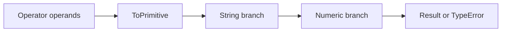
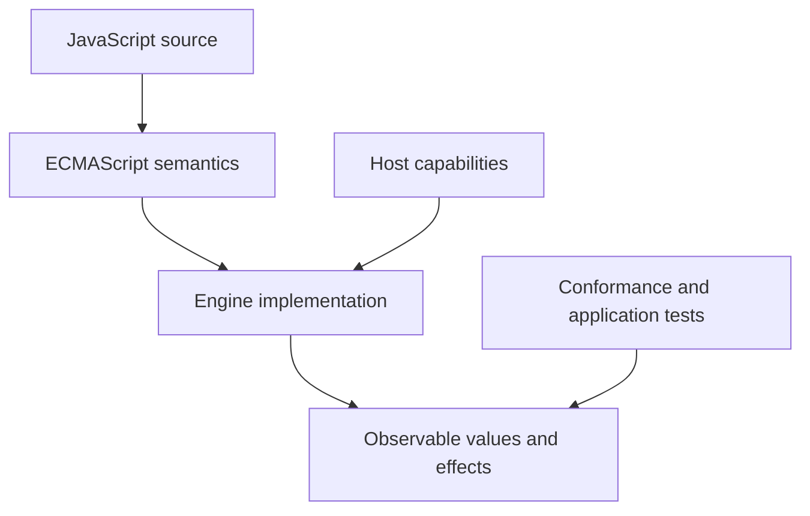
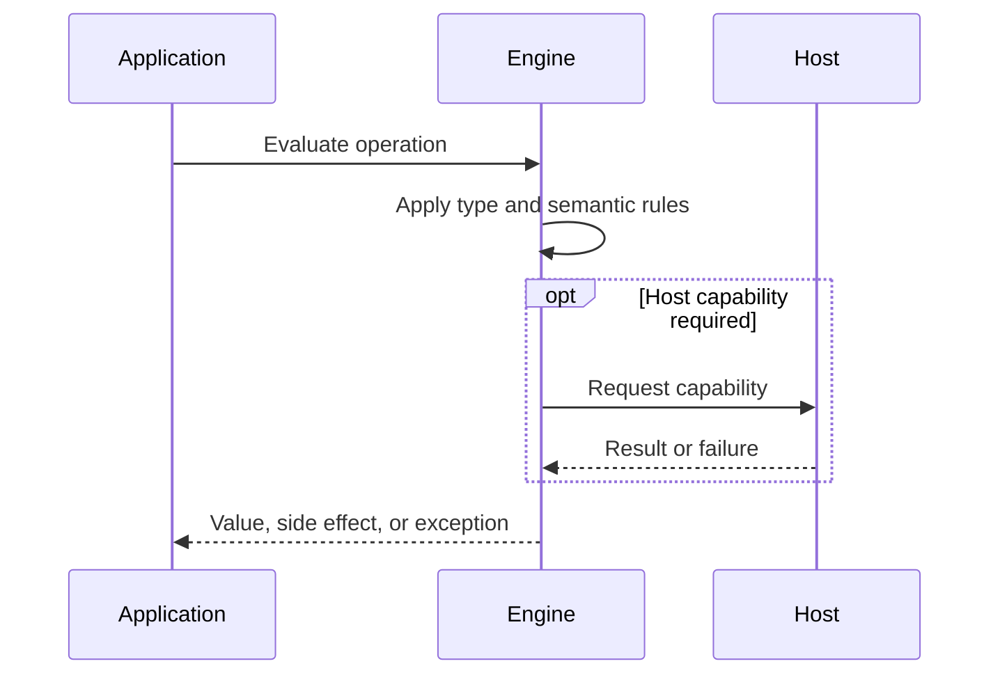

# Type Coercion

## Overview

Type coercion is the specification-directed conversion of a value when an operation requires another type. It is deterministic, context-dependent, and composed from abstract operations such as ToPrimitive, ToNumber, ToString, and ToBoolean.

The first-principles question is: **what invariant must a runtime preserve, and what observable behavior follows from that invariant?** This note answers that question before introducing convenience rules.

## Learning Objectives

- Explain the concept without relying on framework terminology.
- Predict edge cases from ECMAScript semantics.
- Separate language rules from engine representation and host policy.
- Select production practices based on explicit trade-offs.
- Verify claims with executable JavaScript in [[02-JavaScript/code/README|JavaScript code labs]].

## Prerequisites

- [[02-JavaScript/01-Values-and-Types/JavaScript Type System|JavaScript Type System]]
- [[02-JavaScript/01-Values-and-Types/Symbols and Unique Property Keys|Symbols and Unique Property Keys]]

## Difficulty

`advanced`

## Estimated Time

2 hours reading, 90 minutes exercises, and 3–6 hours for the mini project.

## History

Implicit conversion made early scripts concise and web forms convenient, but legacy choices became compatibility constraints. ES2015 added Symbol.toPrimitive so objects can explicitly participate in conversion while BigInt introduced new mixed-domain restrictions.

History matters because compatibility constraints explain behavior that would otherwise look arbitrary. A production engineer must know which behavior is guaranteed by ECMAScript and which behavior is only a current implementation strategy.

## Problem It Solves

Operators and APIs receive heterogeneous values. They need a rule for accepting, converting, or rejecting those values. Coercion supplies composable defaults, but implicit context can obscure intent at trust boundaries.

### First-Principles Questions

1. What information exists before the operation starts?
2. Which distinctions must remain observable afterward?
3. Which conversions or side effects are permitted?
4. Where can the operation fail, and is that failure synchronous?
5. Which layer—specification, engine, or host—owns the guarantee?

## Internal Implementation

- ToBoolean maps a small fixed set to false: false, +0, -0, 0n, NaN, empty string, null, and undefined; all objects are truthy.
- ToPrimitive asks Symbol.toPrimitive first, then follows ordinary conversion with a string or number hint.
- The + operator performs primitive conversion, then concatenates if either primitive is a string; otherwise it performs numeric addition.
- Relational comparison uses primitive and numeric conversion with ordering-specific details.
- BigInt conversion and arithmetic intentionally reject many implicit Number mixtures to avoid silent precision loss.
- Explicit Number, String, and Boolean calls still invoke the same underlying abstract operations.

Engines may optimize representation aggressively, but optimization must preserve specified observable behavior. Internal tags, pointers, NaN-boxing, bytecode, and inline caches are implementation techniques, not portable API contracts.



## Mermaid Diagrams

### Responsibility Boundary



### Evaluation Sequence



## Examples

### Minimal Example

```javascript
const sample = { value: 1 };
const alias = sample;
console.log(alias === sample);
console.log(typeof sample);
```

The example isolates identity and runtime classification. It should be run before adding framework state, network I/O, or transpilation.

### Production-Shaped Example

```javascript
const duration = {
  milliseconds: 1500,
  [Symbol.toPrimitive](hint) {
    if (hint === "string") return `${this.milliseconds}ms`;
    return this.milliseconds;
  },
};

console.log(Number(duration)); // 1500
console.log(String(duration)); // "1500ms"
console.log(duration + 500);   // 2000

function requireBoolean(value) {
  if (typeof value !== "boolean") throw new TypeError("boolean required");
  return value;
}
```

Production-shaped code validates assumptions, makes failure visible, and avoids depending on unspecified engine details. Copy this example into [[02-JavaScript/code/README|JavaScript code labs]] and add tests for boundary values.

## Trade-offs

| Dimension | Upside | Downside | When it matters |
| --- | --- | --- | --- |
| Semantics | Implicit conversion enables compact generic syntax | Requires a precise mental model | API design |
| Compatibility | Hidden conversion paths make reviews and debugging harder | Legacy behavior remains observable | Multi-runtime software |
| Operations | Explicit conversion communicates boundary intent but can still accept surprising inputs | Additional validation and tests | Production boundaries |

### When to Use

- Use the language feature when its semantics match the domain invariant.
- Use explicit conversion or validation at untrusted and serialized boundaries.
- Prefer the simplest representation that preserves every required distinction.

### When Not to Use

- Do not use implicit behavior merely to save a line of code.
- Do not expose engine-specific representations as application contracts.
- Do not infer security, ownership, or validation guarantees from convenient syntax.

## Exercises

1. Predict and then run a coercion matrix for +, -, Boolean, and String.
2. Implement an object with Symbol.toPrimitive and log each hint.
3. Explain why [] == false without calling it random.
4. Harden a configuration parser against string booleans.
5. Add table-driven tests for empty, nullish, extreme, and wrong-type inputs.
6. Explain one result by naming the relevant abstract operation rather than saying “JavaScript is weird.”

## Mini Project

**Prompt:** Build an interactive coercion explorer that logs each abstract-operation stage for a curated value matrix.

Deliver a README, automated tests, input contracts, error examples, and a short performance or compatibility note. Link the implementation from [[02-JavaScript/code/README|JavaScript code labs]].

## Portfolio Project

**Prompt:** Implement a small ECMAScript coercion model with differential tests against a real engine and documented unsupported cases.

Treat this as a production artifact: define scope and non-goals, include architecture and sequence Mermaid diagrams, automate tests, record trade-offs, and provide operational diagnostics.

## Interview Questions

1. What is ToPrimitive?
2. Why does + behave differently from -?
3. Which values are falsy?
4. How does Symbol.toPrimitive work?
5. Why are Number and BigInt not freely mixed?

### Stretch / Staff-Level

1. Which parts of this behavior are normative, and which are engine freedom?
2. How would you migrate a large codebase that relied on the most dangerous edge case?
3. Design observability that detects failures without logging secrets or high-cardinality raw values.

## Common Mistakes

- Believing [] or {} is falsy.
- Using unary plus on BigInt.
- Forgetting that + can concatenate after primitive conversion.
- Assuming Boolean('false') is false.

The common pattern is accidental loss of information: collapsing distinct states, assuming structural equality, or allowing an implicit conversion to choose policy. Make that policy explicit.

## Best Practices

- Convert and validate once at external boundaries.
- Avoid clever coercion in domain logic.
- Use Number.parseInt with an explicit radix for integer text.
- Reserve custom Symbol.toPrimitive for value-like domain objects.
- Write truth tables for APIs that intentionally accept multiple input types.

### Production Checklist

- Validate values when they enter the process, worker, request, or module boundary.
- Pin supported runtime versions and test against the compatibility matrix.
- Prefer deterministic errors over silent fallback.
- Add regression tests for every edge case described in this note.
- Measure before applying engine-specific performance advice.
- Keep sensitive decisions on trusted infrastructure.
- Document serialization, equality, mutation, and absence semantics in public APIs.

## Summary

Type coercion is the specification-directed conversion of a value when an operation requires another type. It is deterministic, context-dependent, and composed from abstract operations such as ToPrimitive, ToNumber, ToString, and ToBoolean. The practical skill is not memorizing isolated outputs; it is deriving behavior from value categories, abstract operations, identity, and host boundaries. Production code then narrows permissive language behavior into explicit domain contracts.

## Further Reading

- [https://tc39.es/ecma262/#sec-type-conversion](https://tc39.es/ecma262/#sec-type-conversion)
- [https://tc39.es/ecma262/#sec-toprimitive](https://tc39.es/ecma262/#sec-toprimitive)
- [https://developer.mozilla.org/en-US/docs/Glossary/Type_coercion](https://developer.mozilla.org/en-US/docs/Glossary/Type_coercion)
- [ECMAScript Language Specification](https://tc39.es/ecma262/)
- [MDN JavaScript Guide](https://developer.mozilla.org/en-US/docs/Web/JavaScript/Guide)

## Related Notes

- [[02-JavaScript/01-Values-and-Types/Equality and Sameness|Equality and Sameness]]
- [[02-JavaScript/01-Values-and-Types/Strings Unicode and Template Literals|Strings, Unicode, and Template Literals]]
- [[02-JavaScript/01-Values-and-Types/JavaScript Type System|JavaScript Type System]]
- [[02-JavaScript/01-Values-and-Types/Symbols and Unique Property Keys|Symbols and Unique Property Keys]]
- [[02-JavaScript/code/README|JavaScript code labs]]
- [[02-JavaScript/README|JavaScript]]

## Progress Checklist

- [ ] Explained the concept from first principles
- [ ] Recreated both Mermaid diagrams from memory
- [ ] Ran and modified the JavaScript examples
- [ ] Documented trade-offs and non-goals
- [ ] Completed all exercises
- [ ] Built the mini project with tests
- [ ] Practiced interview questions aloud
- [ ] Followed prerequisite and dependent wiki links
