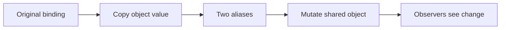
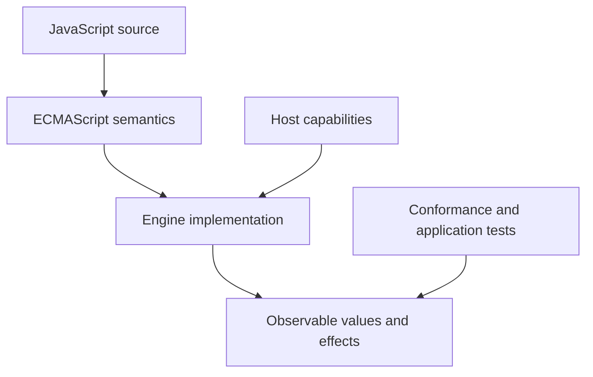
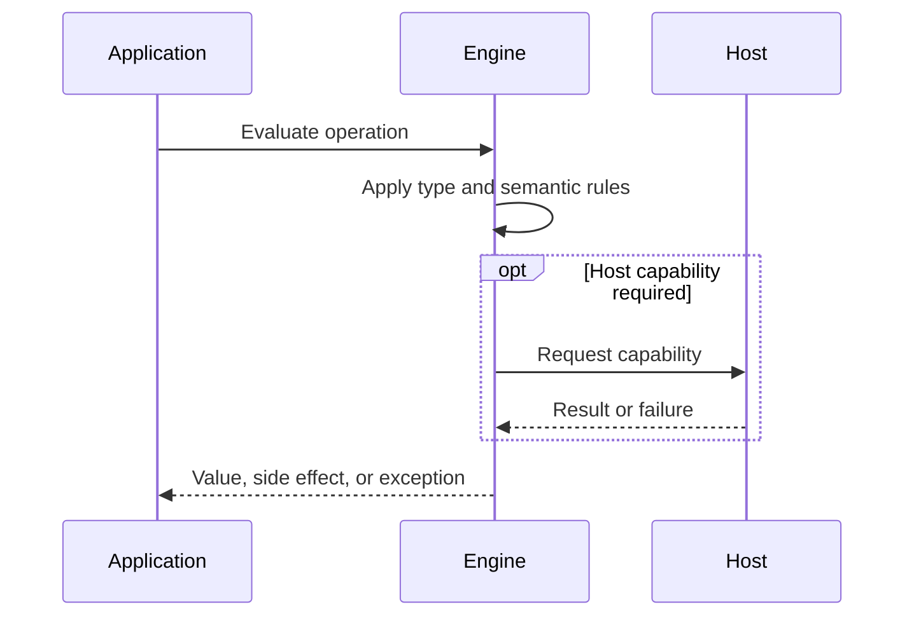

# Value Copying Sharing and Mutation

## Overview

Assignment, argument passing, and return copy JavaScript values. For primitives the copied value is self-contained; for objects the copied value identifies the same object, so multiple bindings can observe mutation. This is call-by-sharing, not pass-by-reference to the caller's variable.

The first-principles question is: **what invariant must a runtime preserve, and what observable behavior follows from that invariant?** This note answers that question before introducing convenience rules.

## Learning Objectives

- Explain the concept without relying on framework terminology.
- Predict edge cases from ECMAScript semantics.
- Separate language rules from engine representation and host policy.
- Select production practices based on explicit trade-offs.
- Verify claims with executable JavaScript in [[02-JavaScript/code/README|JavaScript code labs]].

## Prerequisites

- [[02-JavaScript/01-Values-and-Types/Primitive Values and Objects|Primitive Values and Objects]]
- [[01-Computer-Science/03-Memory-and-Addressing/Pointers References and Aliasing|Pointers, References, and Aliasing]]
- [[01-Computer-Science/03-Memory-and-Addressing/Garbage Collection Models|Garbage Collection Models]]

## Difficulty

`intermediate`

## Estimated Time

2 hours reading, 90 minutes exercises, and 3–6 hours for the mini project.

## History

JavaScript inherited garbage-collected object identity and reference-like sharing from dynamic languages. Spread syntax and structuredClone later made common copy operations convenient, but neither erased the need for explicit ownership and depth semantics.

History matters because compatibility constraints explain behavior that would otherwise look arbitrary. A production engineer must know which behavior is guaranteed by ECMAScript and which behavior is only a current implementation strategy.

## Problem It Solves

Structured state is expensive to duplicate continuously, so programs share objects. Sharing is efficient and expressive but creates non-local effects, races across asynchronous workflows, and change-detection problems unless ownership is controlled.

### First-Principles Questions

1. What information exists before the operation starts?
2. Which distinctions must remain observable afterward?
3. Which conversions or side effects are permitted?
4. Where can the operation fail, and is that failure synchronous?
5. Which layer—specification, engine, or host—owns the guarantee?

## Internal Implementation

- A parameter binding receives a copy of the argument value; reassigning it cannot rebind the caller's variable.
- Mutating an object through the copied identity is visible through every alias to that object.
- Object and array spread copy enumerable own properties one level deep; nested objects remain shared.
- structuredClone recursively clones supported graph types, preserves cycles, and can transfer certain buffers, but rejects functions and some host objects.
- Object.freeze prevents own property changes only at one level unless recursively applied.
- Garbage collection retains an object while any reachable path keeps it alive, including closures, listeners, and caches.

Engines may optimize representation aggressively, but optimization must preserve specified observable behavior. Internal tags, pointers, NaN-boxing, bytecode, and inline caches are implementation techniques, not portable API contracts.



## Mermaid Diagrams

### Responsibility Boundary



### Evaluation Sequence



## Examples

### Minimal Example

```javascript
const sample = { value: 1 };
const alias = sample;
console.log(alias === sample);
console.log(typeof sample);
```

The example isolates identity and runtime classification. It should be run before adding framework state, network I/O, or transpilation.

### Production-Shaped Example

```javascript
function withRetry(config, retries) {
  return {
    ...config,
    policy: {
      ...config.policy,
      retries,
    },
  };
}

const original = Object.freeze({
  endpoint: "/jobs",
  policy: Object.freeze({ retries: 2, timeoutMs: 1000 }),
});
const updated = withRetry(original, 4);
console.log(original.policy.retries); // 2
console.log(updated.policy.retries);  // 4

const isolated = structuredClone(updated);
```

Production-shaped code validates assumptions, makes failure visible, and avoids depending on unspecified engine details. Copy this example into [[02-JavaScript/code/README|JavaScript code labs]] and add tests for boundary values.

## Trade-offs

| Dimension | Upside | Downside | When it matters |
| --- | --- | --- | --- |
| Semantics | Sharing avoids copies and supports coordinated state | Requires a precise mental model | API design |
| Compatibility | Aliasing makes local reasoning and concurrency harder | Legacy behavior remains observable | Multi-runtime software |
| Operations | Immutable updates improve predictability but allocate and can copy paths | Additional validation and tests | Production boundaries |

### When to Use

- Use the language feature when its semantics match the domain invariant.
- Use explicit conversion or validation at untrusted and serialized boundaries.
- Prefer the simplest representation that preserves every required distinction.

### When Not to Use

- Do not use implicit behavior merely to save a line of code.
- Do not expose engine-specific representations as application contracts.
- Do not infer security, ownership, or validation guarantees from convenient syntax.

## Exercises

1. Show that parameter reassignment differs from object mutation.
2. Trace aliases through a nested shallow copy.
3. Compare spread, structuredClone, and JSON cloning on special values.
4. Implement a cycle-safe deepFreeze for supported ordinary objects.
5. Add table-driven tests for empty, nullish, extreme, and wrong-type inputs.
6. Explain one result by naming the relevant abstract operation rather than saying “JavaScript is weird.”

## Mini Project

**Prompt:** Build an alias-and-mutation tracer using proxies that records reads, writes, and object identities during test scenarios.

Deliver a README, automated tests, input contracts, error examples, and a short performance or compatibility note. Link the implementation from [[02-JavaScript/code/README|JavaScript code labs]].

## Portfolio Project

**Prompt:** Create a versioned state store with structural sharing, selectors, transactions, undo/redo, leak tests, and performance measurements.

Treat this as a production artifact: define scope and non-goals, include architecture and sequence Mermaid diagrams, automate tests, record trade-offs, and provide operational diagnostics.

## Interview Questions

1. Is JavaScript pass-by-reference?
2. What does object spread copy?
3. How does structuredClone differ from JSON cloning?
4. What does Object.freeze guarantee?
5. How can sharing cause memory leaks?

### Stretch / Staff-Level

1. Which parts of this behavior are normative, and which are engine freedom?
2. How would you migrate a large codebase that relied on the most dangerous edge case?
3. Design observability that detects failures without logging secrets or high-cardinality raw values.

## Common Mistakes

- Saying objects are passed by reference.
- Assuming spread performs a deep clone.
- Mutating input parameters or cached objects unexpectedly.
- Using JSON serialization as a universal clone.

The common pattern is accidental loss of information: collapsing distinct states, assuming structural equality, or allowing an implicit conversion to choose policy. Make that policy explicit.

## Best Practices

- Document whether functions borrow, consume, mutate, or copy inputs.
- Keep mutable state behind narrow interfaces.
- Use immutable updates where identity drives change detection.
- Choose clone depth from domain ownership, not convenience.
- Remove listeners and bound cache growth to avoid retention.

### Production Checklist

- Validate values when they enter the process, worker, request, or module boundary.
- Pin supported runtime versions and test against the compatibility matrix.
- Prefer deterministic errors over silent fallback.
- Add regression tests for every edge case described in this note.
- Measure before applying engine-specific performance advice.
- Keep sensitive decisions on trusted infrastructure.
- Document serialization, equality, mutation, and absence semantics in public APIs.

## Summary

Assignment, argument passing, and return copy JavaScript values. For primitives the copied value is self-contained; for objects the copied value identifies the same object, so multiple bindings can observe mutation. This is call-by-sharing, not pass-by-reference to the caller's variable. The practical skill is not memorizing isolated outputs; it is deriving behavior from value categories, abstract operations, identity, and host boundaries. Production code then narrows permissive language behavior into explicit domain contracts.

## Further Reading

- [https://tc39.es/ecma262/#sec-assignment-operators](https://tc39.es/ecma262/#sec-assignment-operators)
- [https://developer.mozilla.org/en-US/docs/Web/API/Window/structuredClone](https://developer.mozilla.org/en-US/docs/Web/API/Window/structuredClone)
- [https://developer.mozilla.org/en-US/docs/Web/JavaScript/Reference/Global_Objects/Object/freeze](https://developer.mozilla.org/en-US/docs/Web/JavaScript/Reference/Global_Objects/Object/freeze)
- [ECMAScript Language Specification](https://tc39.es/ecma262/)
- [MDN JavaScript Guide](https://developer.mozilla.org/en-US/docs/Web/JavaScript/Guide)

## Related Notes

- [[01-Computer-Science/03-Memory-and-Addressing/Pointers References and Aliasing|Pointers, References, and Aliasing]]
- [[01-Computer-Science/03-Memory-and-Addressing/Garbage Collection Models|Garbage Collection Models]]
- [[02-JavaScript/code/README|JavaScript code labs]]
- [[02-JavaScript/01-Values-and-Types/Primitive Values and Objects|Primitive Values and Objects]]
- [[02-JavaScript/README|JavaScript]]

## Progress Checklist

- [ ] Explained the concept from first principles
- [ ] Recreated both Mermaid diagrams from memory
- [ ] Ran and modified the JavaScript examples
- [ ] Documented trade-offs and non-goals
- [ ] Completed all exercises
- [ ] Built the mini project with tests
- [ ] Practiced interview questions aloud
- [ ] Followed prerequisite and dependent wiki links
