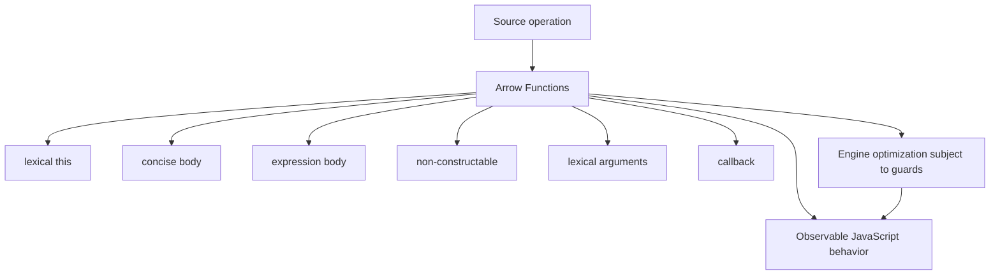
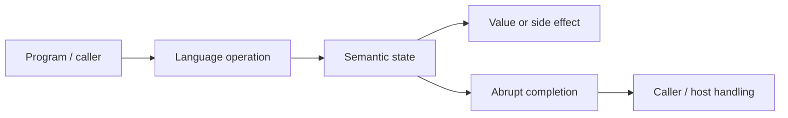
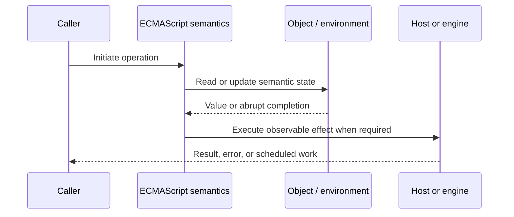
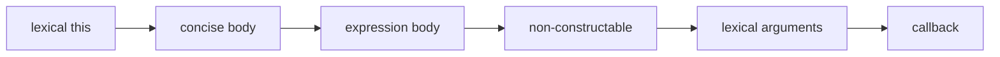

# Arrow Functions

## Overview

Arrow functions are concise callable objects with lexical `this`, `arguments`, `super`, and `new.target`. They are intentionally non-constructable and are not a drop-in shorter spelling for every ordinary function.

This note separates the ECMAScript language model from engine implementation choices and host behavior. That distinction matters: specification algorithms define correctness, while engines remain free to optimize as long as observable behavior is preserved.

## Learning Objectives

- Define lexical this and distinguish it from concise body
- Trace expression body through the relevant ECMAScript operations
- Predict edge cases without relying on engine folklore
- Evaluate memory, performance, security, and API-design trade-offs
- Apply the mechanism safely in production JavaScript

## Prerequisites

- [[01-Computer-Science/00-Orientation/How Computers Run Programs|How Computers Run Programs]]
- [[01-Computer-Science/03-Memory-and-Addressing/Stack and Heap|Stack and Heap]]
- [[01-Computer-Science/03-Memory-and-Addressing/Garbage Collection Models|Garbage Collection Models]]
- [[02-JavaScript/README|JavaScript]]

## Difficulty

`intermediate`

## Estimated Time

90–120 minutes for reading and examples; 2–4 hours for exercises and the mini project.

## History

ES2015 introduced arrows to make functional callbacks concise and eliminate the pervasive `const self = this` or `.bind(this)` pattern in nested callbacks.

## Problem It Solves

Choosing arrows by syntax preference alone can remove needed receiver semantics, allocate per-instance fields, or accidentally return object literals incorrectly.

## First-Principles Model

1. An arrow reads `this` from the nearest enclosing non-arrow function or module/global lexical context.
2. Calling an arrow with `call`, `apply`, or `bind` cannot replace its lexical `this`.
3. Arrows have no `[[Construct]]`; invoking one with `new` throws `TypeError`.
4. Arrows have no own `prototype` property for constructed instances.
5. A concise body implicitly returns its expression; a block body needs explicit `return`.
6. An object literal expression must be parenthesized: `() => ({ ok: true })`.
7. Arrows have no own `arguments`; use rest parameters for explicit variadic input.
8. Arrow class fields create one function per instance and capture that instance.

The useful debugging question is not “what does JavaScript usually do?” but “which abstract operation runs, what state does it read, and what observable result follows?” This framing survives minification, transpilation, optimization, and framework changes.

## Internal Implementation

- Arrow creation records lexical-this mode in its function environment semantics.
- Because no own receiver is initialized, `this` resolution continues through outer environments.
- Lexical `super` and `new.target` similarly resolve through the enclosing function context.
- Per-instance arrow fields can increase allocations compared with one prototype method.
- Stable arrow closures can simplify callback identity if created once, but inline arrows cannot later be removed by identity.

These are semantic obligations rather than a mandate for a specific physical representation. Connect them to [[01-Computer-Science/08-Languages-and-Computation/Compilers Interpreters and Virtual Machines|Compilers Interpreters and Virtual Machines]], [[01-Computer-Science/03-Memory-and-Addressing/Stack and Heap|Stack and Heap]], and [[01-Computer-Science/03-Memory-and-Addressing/Garbage Collection Models|Garbage Collection Models]]: optimized code may use registers, native frames, compact tables, or heap contexts while preserving the same language-level result.



## Mermaid Diagrams

### Structure



### Sequence / Lifecycle



### Mechanism Detail



## Examples

### Minimal Example

```js
const values = [1, 2, 3];
const doubled = values.map((value) => value * 2);
const status = () => ({ ok: true });

console.log(doubled, status());
```

Trace this example before running it. Record binding/receiver/property state at each line, then compare the trace with the actual output.

### Production-Shaped Example

```js
export class Poller {
  #timer;
  constructor(client, intervalMs) {
    this.client = client;
    this.intervalMs = intervalMs;
  }

  tick = async () => {
    await this.client.refresh();
  };

  start() { this.#timer = setInterval(this.tick, this.intervalMs); }
  stop() { clearInterval(this.#timer); }
}
```

The production-shaped version validates assumptions, gives failures domain context, and makes lifecycle behavior visible. It still needs tests for malformed input and whichever host runtime deploys it.

## Trade-offs

| Approach | Upside | Downside | When it matters |
| --- | --- | --- | --- |
| Arrow callback | Lexical receiver and concise syntax | Cannot accept dynamic receiver | Nested callbacks |
| Prototype method | One function shared by instances | Must preserve receiver at boundaries | Object behavior |
| Arrow field | Stable instance receiver | Per-instance allocation | UI/event callback instances |

No choice is universally best. Prefer the simplest mechanism that preserves the required semantics, then measure memory and latency under representative workload rather than microbenchmarks alone.

### When to Use

- Use the mechanism when its semantics directly express a stable domain or lifecycle requirement.
- Use it when tests can cover both normal and abrupt completion paths.
- Use it when maintainers can observe and debug the resulting state transitions.

### When Not to Use

- Do not use a clever language feature merely to reduce line count.
- Avoid it when an explicit data structure or named function communicates ownership better.
- Do not depend on undocumented engine optimization behavior for correctness.

## Performance, Memory, and Security

- **Allocation:** Determine whether the pattern creates per-call objects, closures, wrappers, or collections.
- **Reachability:** Long-lived listeners, caches, registries, and suspended computations can retain an entire object graph.
- **Optimization:** Stable shapes and call sites help engines, but optimization tiers and heuristics are not API contracts.
- **Input limits:** Bound depth, size, key count, and work when values cross a trust boundary.
- **Side effects:** Getters, proxies, iterators, coercion hooks, and callbacks can run user code inside apparently simple syntax.
- **Observability:** Emit domain events and timings; never parse engine-specific stack text as a primary protocol.

## Production Practices

- Use arrows for lexical callbacks and transformations.
- Use method syntax for dynamic receivers and prototype sharing.
- Prefer rest parameters over inherited `arguments`.
- Parenthesize returned object literals.
- Create long-lived callbacks once.
- Measure per-instance arrow cost for high-cardinality objects.

At public boundaries, validate first, normalize once, and construct trusted domain values only after validation. Keep errors actionable without logging secrets or entire retained object graphs.

## Exercises

1. Predict the observable result of five edge cases involving **lexical this**, then verify them in two engines.
2. Instrument a small example to expose **concise body** and explain every transition from specification operations.
3. Write table-driven tests for the listed common mistakes, including strict-mode and module execution.
4. Compare the first trade-off alternatives with a benchmark and a maintainability review; do not optimize from timing alone.
5. Extend the relevant exercise in [[02-JavaScript/code/README|JavaScript code labs]] with malformed, adversarial, and high-volume inputs.

For every exercise, include tests for success, malformed input, abrupt completion, and cleanup. Explain observed results from first principles rather than merely recording them.

## Mini Project

Create a behavior matrix comparing ordinary functions, methods, arrows, bound functions, and class fields under six call forms.

Required deliverables: implementation, automated tests, a Mermaid lifecycle diagram, benchmark methodology, and a short failure-mode analysis.

## Portfolio Project

Build an event-driven component both with prototype methods and arrow fields; benchmark allocation and verify teardown correctness.

Package it with a stable API, examples, generated documentation, CI checks, changelog discipline, and a production-readiness section covering limits and observability.

## Interview Questions

1. Which bindings are lexical in an arrow?
2. Why can an arrow not be a constructor?
3. What does `() => ({})` fix?
4. When is a class arrow field justified?
5. Why does `call` not rebind an arrow?
6. How does arrow choice affect listener cleanup?

### Stretch / Staff-Level

1. Design a migration from a codebase that misuses lexical this; include compatibility, telemetry, staged rollout, and rollback.
2. Explain which guarantees belong to ECMAScript, which are engine heuristics, and which belong to the browser or Node.js host.
3. Describe a production incident involving this mechanism and the evidence you would collect before proposing a fix.

Strong answers name the controlling abstract operations, distinguish identity from equality or ownership, discuss abrupt completion, and state operational limits.

## Common Mistakes

- **Using an arrow where an API intentionally supplies `this`.** Reproduce this case in a focused test before relying on intuition.
- **Expecting `bind` to change an arrow receiver.** Reproduce this case in a focused test before relying on intuition.
- **Writing `() => { value: 1 }` and expecting an object.** Reproduce this case in a focused test before relying on intuition.
- **Using implicit return for side-effect-heavy logic.** Reproduce this case in a focused test before relying on intuition.
- **Creating inline arrows that cannot be unsubscribed.** Reproduce this case in a focused test before relying on intuition.

## Best Practices

- Use arrows for lexical callbacks and transformations.
- Use method syntax for dynamic receivers and prototype sharing.
- Prefer rest parameters over inherited `arguments`.
- Parenthesize returned object literals.
- Create long-lived callbacks once.
- Measure per-instance arrow cost for high-cardinality objects.

## Summary

Arrow functions are concise callable objects with lexical `this`, `arguments`, `super`, and `new.target`. They are intentionally non-constructable and are not a drop-in shorter spelling for every ordinary function. The production rule is to model the semantics precisely, constrain untrusted work, make ownership and cleanup explicit, and treat engine optimization as measured implementation behavior rather than a language guarantee.

## Further Reading

- [ECMAScript Language Specification](https://tc39.es/ecma262/)
- [MDN JavaScript Guide](https://developer.mozilla.org/docs/Web/JavaScript/Guide)
- [[00-References/JavaScript/README|JavaScript References]]
- [[02-JavaScript/code/README|JavaScript code labs]]

## Related Notes

- [[02-JavaScript/02-Execution-and-Functions/This Binding|This Binding]]
- [[02-JavaScript/02-Execution-and-Functions/Functions as Values|Functions as Values]]
- [[02-JavaScript/code/README|JavaScript code labs]]
- [[01-Computer-Science/00-Orientation/How Computers Run Programs|How Computers Run Programs]]

## Progress Checklist

- [ ] Explained the mechanism from first principles
- [ ] Drew and narrated every Mermaid diagram
- [ ] Predicted the minimal example before executing it
- [ ] Implemented malformed and adversarial tests
- [ ] Documented performance, memory, security, and non-goals
- [ ] Completed the mini project
- [ ] Practiced interview questions aloud
- [ ] Linked prerequisites and dependent topics
