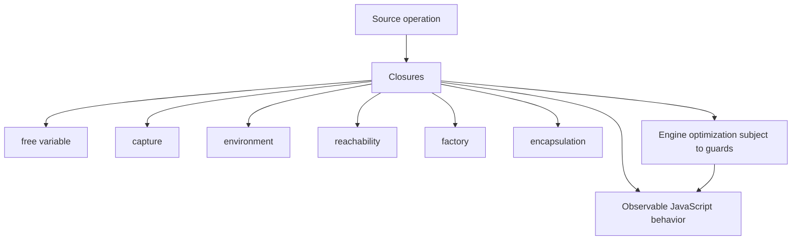
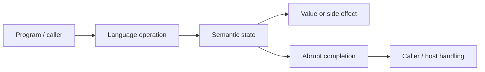
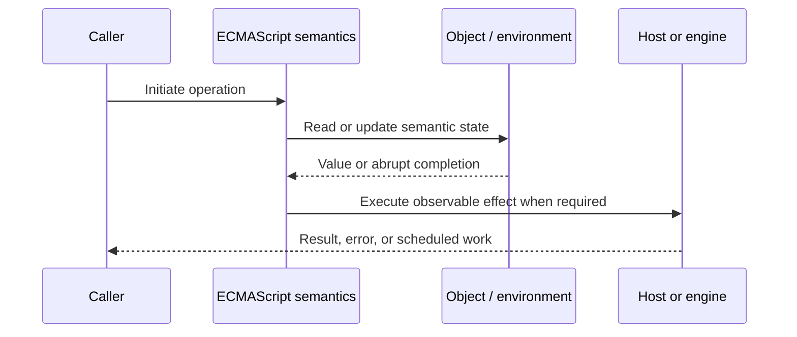
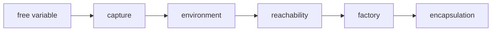

# Closures

## Overview

A closure is a function paired with the lexical environment in which it was created. It resolves free variables against that environment later, even after the creating call has returned.

This note separates the ECMAScript language model from engine implementation choices and host behavior. That distinction matters: specification algorithms define correctness, while engines remain free to optimize as long as observable behavior is preserved.

## Learning Objectives

- Define free variable and distinguish it from capture
- Trace environment through the relevant ECMAScript operations
- Predict edge cases without relying on engine folklore
- Evaluate memory, performance, security, and API-design trade-offs
- Apply the mechanism safely in production JavaScript

## Prerequisites

- [[01-Computer-Science/00-Orientation/How Computers Run Programs|How Computers Run Programs]]
- [[01-Computer-Science/03-Memory-and-Addressing/Stack and Heap|Stack and Heap]]
- [[01-Computer-Science/03-Memory-and-Addressing/Garbage Collection Models|Garbage Collection Models]]
- [[02-JavaScript/README|JavaScript]]

## Difficulty

`advanced`

## Estimated Time

90–120 minutes for reading and examples; 2–4 hours for exercises and the mini project.

## History

Lexical closures unify callbacks, factories, module privacy, and functional composition. They replaced the need for callers to manually thread every contextual value through delayed computations.

## Problem It Solves

Closures provide encapsulation and lifecycle-local state, but captures can keep large object graphs reachable and mutable shared captures can create subtle temporal coupling.

## First-Principles Model

1. A function closes over bindings, not frozen snapshots of their current values.
2. Multiple closures created in one invocation may share the same captured binding.
3. Each factory invocation creates a distinct environment and therefore independent state.
4. `let` in a `for` loop creates a fresh per-iteration binding; `var` shares one function binding.
5. A closure may outlive its creator because reachable function objects keep necessary environments reachable.
6. Engines capture only semantically required bindings and may optimize their representation.
7. Private state through closure is inaccessible except through capabilities the factory returns.
8. Closures do not inherently make concurrent async operations race-free; shared mutable state still requires protocol design.

The useful debugging question is not “what does JavaScript usually do?” but “which abstract operation runs, what state does it read, and what observable result follows?” This framing survives minification, transpilation, optimization, and framework changes.

## Internal Implementation

- Function creation records the current lexical environment in internal `[[Environment]]`.
- A captured binding may move from an ordinary stack/register representation into a heap-managed context.
- Garbage collection reclaims a closure cycle when no root can reach it; cycles alone do not imply leaks.
- Listener registries, timers, and caches commonly act as roots that retain closure environments.
- Heap snapshots reveal retaining paths from roots through function contexts to captured values.

These are semantic obligations rather than a mandate for a specific physical representation. Connect them to [[01-Computer-Science/08-Languages-and-Computation/Compilers Interpreters and Virtual Machines|Compilers Interpreters and Virtual Machines]], [[01-Computer-Science/03-Memory-and-Addressing/Stack and Heap|Stack and Heap]], and [[01-Computer-Science/03-Memory-and-Addressing/Garbage Collection Models|Garbage Collection Models]]: optimized code may use registers, native frames, compact tables, or heap contexts while preserving the same language-level result.



## Mermaid Diagrams

### Structure



### Sequence / Lifecycle



### Mechanism Detail



## Examples

### Minimal Example

```js
function createCounter() {
  let count = 0;
  return () => ++count;
}

const next = createCounter();
console.log(next()); // 1
console.log(next()); // 2
```

Trace this example before running it. Record binding/receiver/property state at each line, then compare the trace with the actual output.

### Production-Shaped Example

```js
export function createSessionStore({ clock, ttlMs }) {
  const sessions = new Map();

  function set(id, value) {
    sessions.set(id, { value, expiresAt: clock.now() + ttlMs });
  }
  function get(id) {
    const entry = sessions.get(id);
    if (!entry || entry.expiresAt <= clock.now()) {
      sessions.delete(id);
      return undefined;
    }
    return entry.value;
  }
  return Object.freeze({ set, get, dispose: () => sessions.clear() });
}
```

The production-shaped version validates assumptions, gives failures domain context, and makes lifecycle behavior visible. It still needs tests for malformed input and whichever host runtime deploys it.

## Trade-offs

| Approach | Upside | Downside | When it matters |
| --- | --- | --- | --- |
| Closure privacy | Minimal capability surface | Harder state inspection | Small stateful factories |
| Class fields | Explicit instance shape | Broader receiver surface | Many related methods/instances |
| Capture by binding | State updates remain visible | Temporal coupling | Coordinated callbacks |

No choice is universally best. Prefer the simplest mechanism that preserves the required semantics, then measure memory and latency under representative workload rather than microbenchmarks alone.

### When to Use

- Use the mechanism when its semantics directly express a stable domain or lifecycle requirement.
- Use it when tests can cover both normal and abrupt completion paths.
- Use it when maintainers can observe and debug the resulting state transitions.

### When Not to Use

- Do not use a clever language feature merely to reduce line count.
- Avoid it when an explicit data structure or named function communicates ownership better.
- Do not depend on undocumented engine optimization behavior for correctness.

## Performance, Memory, and Security

- **Allocation:** Determine whether the pattern creates per-call objects, closures, wrappers, or collections.
- **Reachability:** Long-lived listeners, caches, registries, and suspended computations can retain an entire object graph.
- **Optimization:** Stable shapes and call sites help engines, but optimization tiers and heuristics are not API contracts.
- **Input limits:** Bound depth, size, key count, and work when values cross a trust boundary.
- **Side effects:** Getters, proxies, iterators, coercion hooks, and callbacks can run user code inside apparently simple syntax.
- **Observability:** Emit domain events and timings; never parse engine-specific stack text as a primary protocol.

## Production Practices

- Capture the smallest stable values.
- Expose explicit `dispose` or unsubscribe operations.
- Use heap snapshots to prove retention.
- Prefer per-request factories over process-global mutable closures.
- Document reentrancy and concurrency assumptions.
- Use `WeakMap` when lifetime should follow object keys.

At public boundaries, validate first, normalize once, and construct trusted domain values only after validation. Keep errors actionable without logging secrets or entire retained object graphs.

## Exercises

1. Predict the observable result of five edge cases involving **free variable**, then verify them in two engines.
2. Instrument a small example to expose **capture** and explain every transition from specification operations.
3. Write table-driven tests for the listed common mistakes, including strict-mode and module execution.
4. Compare the first trade-off alternatives with a benchmark and a maintainability review; do not optimize from timing alone.
5. Extend the relevant exercise in [[02-JavaScript/code/README|JavaScript code labs]] with malformed, adversarial, and high-volume inputs.

For every exercise, include tests for success, malformed input, abrupt completion, and cleanup. Explain observed results from first principles rather than merely recording them.

## Mini Project

Build a leak laboratory with timers and listeners, then use heap snapshots to identify and remove retaining paths.

Required deliverables: implementation, automated tests, a Mermaid lifecycle diagram, benchmark methodology, and a short failure-mode analysis.

## Portfolio Project

Create a capability-based service container whose factories expose narrow closures, disposal, test clocks, and memory diagnostics.

Package it with a stable API, examples, generated documentation, CI checks, changelog discipline, and a production-readiness section covering limits and observability.

## Interview Questions

1. Does a closure capture values or bindings?
2. Why does `let` fix loop callback capture?
3. When does a captured environment become collectible?
4. How can a closure emulate private state?
5. What retaining paths commonly cause closure leaks?
6. How would you make shared closure state reentrant?

### Stretch / Staff-Level

1. Design a migration from a codebase that misuses free variable; include compatibility, telemetry, staged rollout, and rollback.
2. Explain which guarantees belong to ECMAScript, which are engine heuristics, and which belong to the browser or Node.js host.
3. Describe a production incident involving this mechanism and the evidence you would collect before proposing a fix.

Strong answers name the controlling abstract operations, distinguish identity from equality or ownership, discuss abrupt completion, and state operational limits.

## Common Mistakes

- **Assuming captures copy values.** Reproduce this case in a focused test before relying on intuition.
- **Capturing a request or DOM tree in a long-lived listener.** Reproduce this case in a focused test before relying on intuition.
- **Using `var` in delayed loop callbacks.** Reproduce this case in a focused test before relying on intuition.
- **Calling every retained closure a memory leak.** Reproduce this case in a focused test before relying on intuition.
- **Sharing mutable closure state across overlapping async calls without invariants.** Reproduce this case in a focused test before relying on intuition.

## Best Practices

- Capture the smallest stable values.
- Expose explicit `dispose` or unsubscribe operations.
- Use heap snapshots to prove retention.
- Prefer per-request factories over process-global mutable closures.
- Document reentrancy and concurrency assumptions.
- Use `WeakMap` when lifetime should follow object keys.

## Summary

A closure is a function paired with the lexical environment in which it was created. It resolves free variables against that environment later, even after the creating call has returned. The production rule is to model the semantics precisely, constrain untrusted work, make ownership and cleanup explicit, and treat engine optimization as measured implementation behavior rather than a language guarantee.

## Further Reading

- [ECMAScript Language Specification](https://tc39.es/ecma262/)
- [MDN JavaScript Guide](https://developer.mozilla.org/docs/Web/JavaScript/Guide)
- [[00-References/JavaScript/README|JavaScript References]]
- [[02-JavaScript/code/README|JavaScript code labs]]

## Related Notes

- [[02-JavaScript/02-Execution-and-Functions/Lexical Scope and Environment Records|Lexical Scope and Environment Records]]
- [[01-Computer-Science/03-Memory-and-Addressing/Garbage Collection Models|Garbage Collection Models]]
- [[01-Computer-Science/03-Memory-and-Addressing/Stack and Heap|Stack and Heap]]
- [[02-JavaScript/code/README|JavaScript code labs]]
- [[01-Computer-Science/00-Orientation/How Computers Run Programs|How Computers Run Programs]]

## Progress Checklist

- [ ] Explained the mechanism from first principles
- [ ] Drew and narrated every Mermaid diagram
- [ ] Predicted the minimal example before executing it
- [ ] Implemented malformed and adversarial tests
- [ ] Documented performance, memory, security, and non-goals
- [ ] Completed the mini project
- [ ] Practiced interview questions aloud
- [ ] Linked prerequisites and dependent topics
