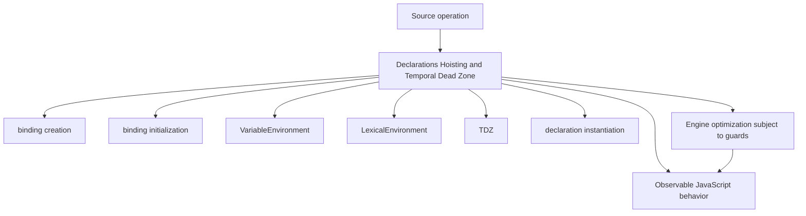
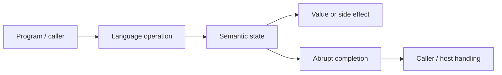
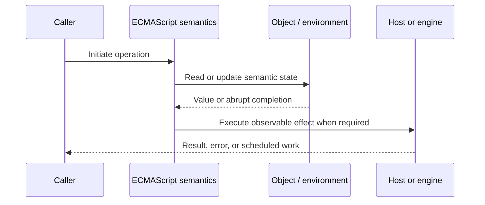
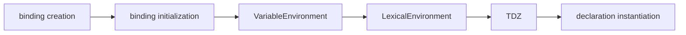

# Declarations Hoisting and Temporal Dead Zone

## Overview

Before execution, ECMAScript instantiates declarations into environment records. “Hoisting” is informal shorthand for those creation and initialization rules; the temporal dead zone (TDZ) is the period in which a lexical binding exists but remains uninitialized.

This note separates the ECMAScript language model from engine implementation choices and host behavior. That distinction matters: specification algorithms define correctness, while engines remain free to optimize as long as observable behavior is preserved.

## Learning Objectives

- Define binding creation and distinguish it from binding initialization
- Trace VariableEnvironment through the relevant ECMAScript operations
- Predict edge cases without relying on engine folklore
- Evaluate memory, performance, security, and API-design trade-offs
- Apply the mechanism safely in production JavaScript

## Prerequisites

- [[01-Computer-Science/00-Orientation/How Computers Run Programs|How Computers Run Programs]]
- [[01-Computer-Science/03-Memory-and-Addressing/Stack and Heap|Stack and Heap]]
- [[01-Computer-Science/03-Memory-and-Addressing/Garbage Collection Models|Garbage Collection Models]]
- [[02-JavaScript/README|JavaScript]]

## Difficulty

`intermediate`

## Estimated Time

90–120 minutes for reading and examples; 2–4 hours for exercises and the mini project.

## History

Early JavaScript had function-scoped `var` and function declarations. ES2015 introduced block-scoped `let`, `const`, and `class`, deliberately making premature access fail instead of silently producing `undefined`.

## Problem It Solves

Without a declaration-instantiation model, refactoring declaration order can cause hidden `undefined`, accidental globals, redeclaration errors, or runtime `ReferenceError` failures.

## First-Principles Model

1. `var` bindings are created in a variable environment and initialized to `undefined` before body execution.
2. Lexical bindings are created during instantiation but initialized only when evaluation reaches their declaration.
3. Reading or writing an uninitialized lexical binding throws `ReferenceError`.
4. Function declarations are generally initialized with function objects before statements run.
5. `const` requires an initializer and prevents rebinding, not mutation of the referenced object.
6. A `class` declaration is lexical and remains in the TDZ until its evaluation completes.
7. `typeof undeclaredName` is safe, but `typeof lexicalName` inside that binding's TDZ throws.
8. A lexical declaration cannot redeclare a same-scope lexical, function, or conflicting `var` declaration.

The useful debugging question is not “what does JavaScript usually do?” but “which abstract operation runs, what state does it read, and what observable result follows?” This framing survives minification, transpilation, optimization, and framework changes.

## Internal Implementation

- Global declaration instantiation distinguishes object-backed `var` bindings from declarative lexical bindings.
- Function declaration instantiation creates parameter bindings, `arguments`, function declarations, and local declarations in specified order.
- Modules use module environment records and have live bindings; cyclic imports can expose uninitialized bindings.
- The TDZ is temporal in execution order, not necessarily textual: a closure may access a later binding after initialization.
- Engines often represent uninitialized bindings with an internal sentinel distinct from JavaScript `undefined`.

These are semantic obligations rather than a mandate for a specific physical representation. Connect them to [[01-Computer-Science/08-Languages-and-Computation/Compilers Interpreters and Virtual Machines|Compilers Interpreters and Virtual Machines]], [[01-Computer-Science/03-Memory-and-Addressing/Stack and Heap|Stack and Heap]], and [[01-Computer-Science/03-Memory-and-Addressing/Garbage Collection Models|Garbage Collection Models]]: optimized code may use registers, native frames, compact tables, or heap contexts while preserving the same language-level result.



## Mermaid Diagrams

### Structure



### Sequence / Lifecycle



### Mechanism Detail



## Examples

### Minimal Example

```js
console.log(version); // undefined
var version = 1;

try {
  console.log(token);
} catch (error) {
  console.log(error.name); // ReferenceError
}
const token = "ready";
```

Trace this example before running it. Record binding/receiver/property state at each line, then compare the trace with the actual output.

### Production-Shaped Example

```js
export function createRegistry(config) {
  if (!config) throw new TypeError("config is required");

  const entries = new Map();
  function register(name, handler) {
    if (entries.has(name)) throw new Error(`duplicate handler: ${name}`);
    entries.set(name, handler);
  }

  return Object.freeze({ register, entries: () => new Map(entries) });
}
```

The production-shaped version validates assumptions, gives failures domain context, and makes lifecycle behavior visible. It still needs tests for malformed input and whichever host runtime deploys it.

## Trade-offs

| Approach | Upside | Downside | When it matters |
| --- | --- | --- | --- |
| `var` | Permits legacy function-scoped patterns | Silent `undefined` and loop capture hazards | Maintaining legacy code |
| `let` | Rebinding with block scope | Larger state surface than `const` | True state transitions |
| `const` | Signals stable binding | Does not make values immutable | Default declaration choice |

No choice is universally best. Prefer the simplest mechanism that preserves the required semantics, then measure memory and latency under representative workload rather than microbenchmarks alone.

### When to Use

- Use the mechanism when its semantics directly express a stable domain or lifecycle requirement.
- Use it when tests can cover both normal and abrupt completion paths.
- Use it when maintainers can observe and debug the resulting state transitions.

### When Not to Use

- Do not use a clever language feature merely to reduce line count.
- Avoid it when an explicit data structure or named function communicates ownership better.
- Do not depend on undocumented engine optimization behavior for correctness.

## Performance, Memory, and Security

- **Allocation:** Determine whether the pattern creates per-call objects, closures, wrappers, or collections.
- **Reachability:** Long-lived listeners, caches, registries, and suspended computations can retain an entire object graph.
- **Optimization:** Stable shapes and call sites help engines, but optimization tiers and heuristics are not API contracts.
- **Input limits:** Bound depth, size, key count, and work when values cross a trust boundary.
- **Side effects:** Getters, proxies, iterators, coercion hooks, and callbacks can run user code inside apparently simple syntax.
- **Observability:** Emit domain events and timings; never parse engine-specific stack text as a primary protocol.

## Production Practices

- Default to `const`, use `let` only for deliberate rebinding.
- Declare bindings close to first use.
- Keep module initialization free of cyclic side effects.
- Reject accidental globals with modules or strict mode.
- Use lint rules against `var` and use-before-define.
- Document intentional function-declaration ordering.

At public boundaries, validate first, normalize once, and construct trusted domain values only after validation. Keep errors actionable without logging secrets or entire retained object graphs.

## Exercises

1. Predict the observable result of five edge cases involving **binding creation**, then verify them in two engines.
2. Instrument a small example to expose **binding initialization** and explain every transition from specification operations.
3. Write table-driven tests for the listed common mistakes, including strict-mode and module execution.
4. Compare the first trade-off alternatives with a benchmark and a maintainability review; do not optimize from timing alone.
5. Extend the relevant exercise in [[02-JavaScript/code/README|JavaScript code labs]] with malformed, adversarial, and high-volume inputs.

For every exercise, include tests for success, malformed input, abrupt completion, and cleanup. Explain observed results from first principles rather than merely recording them.

## Mini Project

Implement a tiny environment-record simulator with create, initialize, get, and set operations plus an uninitialized sentinel.

Required deliverables: implementation, automated tests, a Mermaid lifecycle diagram, benchmark methodology, and a short failure-mode analysis.

## Portfolio Project

Build a module-cycle visualizer that executes fixtures and reports which imported live binding was read before initialization.

Package it with a stable API, examples, generated documentation, CI checks, changelog discipline, and a production-readiness section covering limits and observability.

## Interview Questions

1. What phases create and initialize each declaration kind?
2. Why is TDZ preferable to returning `undefined`?
3. Does `const` provide object immutability?
4. Why can a closure refer to a declaration written later?
5. How do global `var` and global `let` differ?
6. How can an ES module cycle produce a TDZ failure?

### Stretch / Staff-Level

1. Design a migration from a codebase that misuses binding creation; include compatibility, telemetry, staged rollout, and rollback.
2. Explain which guarantees belong to ECMAScript, which are engine heuristics, and which belong to the browser or Node.js host.
3. Describe a production incident involving this mechanism and the evidence you would collect before proposing a fix.

Strong answers name the controlling abstract operations, distinguish identity from equality or ownership, discuss abrupt completion, and state operational limits.

## Common Mistakes

- **Describing hoisting as source code physically moving.** Reproduce this case in a focused test before relying on intuition.
- **Using `var` to avoid a TDZ error.** Reproduce this case in a focused test before relying on intuition.
- **Expecting `const` to freeze an object.** Reproduce this case in a focused test before relying on intuition.
- **Using `typeof` as a universal TDZ-safe probe.** Reproduce this case in a focused test before relying on intuition.
- **Creating cyclic modules that read imports during initialization.** Reproduce this case in a focused test before relying on intuition.

## Best Practices

- Default to `const`, use `let` only for deliberate rebinding.
- Declare bindings close to first use.
- Keep module initialization free of cyclic side effects.
- Reject accidental globals with modules or strict mode.
- Use lint rules against `var` and use-before-define.
- Document intentional function-declaration ordering.

## Summary

Before execution, ECMAScript instantiates declarations into environment records. “Hoisting” is informal shorthand for those creation and initialization rules; the temporal dead zone (TDZ) is the period in which a lexical binding exists but remains uninitialized. The production rule is to model the semantics precisely, constrain untrusted work, make ownership and cleanup explicit, and treat engine optimization as measured implementation behavior rather than a language guarantee.

## Further Reading

- [ECMAScript Language Specification](https://tc39.es/ecma262/)
- [MDN JavaScript Guide](https://developer.mozilla.org/docs/Web/JavaScript/Guide)
- [[00-References/JavaScript/README|JavaScript References]]
- [[02-JavaScript/code/README|JavaScript code labs]]

## Related Notes

- [[02-JavaScript/02-Execution-and-Functions/Lexical Scope and Environment Records|Lexical Scope and Environment Records]]
- [[01-Computer-Science/00-Orientation/How Computers Run Programs|How Computers Run Programs]]
- [[02-JavaScript/code/README|JavaScript code labs]]

## Progress Checklist

- [ ] Explained the mechanism from first principles
- [ ] Drew and narrated every Mermaid diagram
- [ ] Predicted the minimal example before executing it
- [ ] Implemented malformed and adversarial tests
- [ ] Documented performance, memory, security, and non-goals
- [ ] Completed the mini project
- [ ] Practiced interview questions aloud
- [ ] Linked prerequisites and dependent topics
