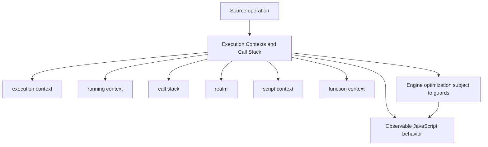
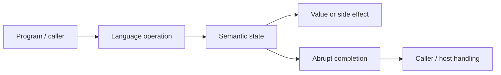
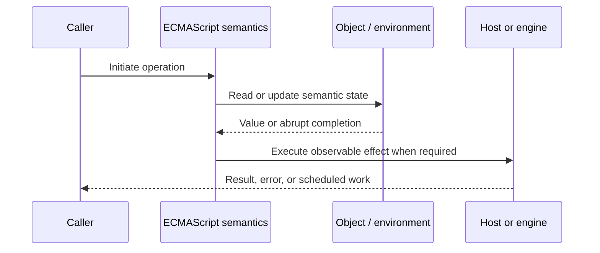
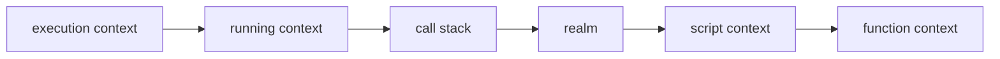

# Execution Contexts and Call Stack

## Overview

An execution context is the specification state needed to evaluate JavaScript code. The running context sits atop a last-in-first-out stack; calls suspend their caller, push a callee context, and later pop it on return or abrupt completion.

This note separates the ECMAScript language model from engine implementation choices and host behavior. That distinction matters: specification algorithms define correctness, while engines remain free to optimize as long as observable behavior is preserved.

## Learning Objectives

- Define execution context and distinguish it from running context
- Trace call stack through the relevant ECMAScript operations
- Predict edge cases without relying on engine folklore
- Evaluate memory, performance, security, and API-design trade-offs
- Apply the mechanism safely in production JavaScript

## Prerequisites

- [[01-Computer-Science/00-Orientation/How Computers Run Programs|How Computers Run Programs]]
- [[01-Computer-Science/03-Memory-and-Addressing/Stack and Heap|Stack and Heap]]
- [[01-Computer-Science/03-Memory-and-Addressing/Garbage Collection Models|Garbage Collection Models]]
- [[02-JavaScript/README|JavaScript]]

## Difficulty

`advanced`

## Estimated Time

90–120 minutes for reading and examples; 2–4 hours for exercises and the mini project.

## History

Stack-based calls map structured function invocation onto machine execution and debuggable stack traces. ECMAScript abstracts away native stack layout so engines can interpret, optimize, inline, and deoptimize while preserving observable semantics.

## Problem It Solves

The model explains recursion limits, stack traces, reentrancy, `this`, lexical resolution, synchronous exception propagation, and why asynchronous callbacks do not retain the original active call stack.

## First-Principles Model

1. A context includes a code evaluation state, Function or Script/Module association, Realm, and lexical/variable environments.
2. Only the top context is running; lower contexts are suspended, not concurrently executing.
3. A normal function call creates and pushes a function execution context.
4. Returning or throwing removes the callee context and resumes propagation in the caller.
5. An execution-context stack is a specification device; an engine may inline calls or use optimized frames.
6. Stack traces are host diagnostics and are not fully standardized by ECMAScript.
7. Promise reactions run in later jobs with fresh stacks even when causally linked to an earlier call.
8. Generators suspend their evaluation state and later resume it without remaining on the active call stack.

The useful debugging question is not “what does JavaScript usually do?” but “which abstract operation runs, what state does it read, and what observable result follows?” This framing survives minification, transpilation, optimization, and framework changes.

## Internal Implementation

- FunctionDeclarationInstantiation prepares parameter, arguments, lexical, and variable bindings before body evaluation.
- The callee's Realm influences intrinsic objects used by that function.
- Native-to-JavaScript and JavaScript-to-native calls add host/engine frames around language frames.
- JIT inlining collapses apparent calls; deoptimization reconstructs interpreter-visible frame state at safepoints.
- Maximum stack depth is implementation-dependent because frame sizes and available native stack differ.

These are semantic obligations rather than a mandate for a specific physical representation. Connect them to [[01-Computer-Science/08-Languages-and-Computation/Compilers Interpreters and Virtual Machines|Compilers Interpreters and Virtual Machines]], [[01-Computer-Science/03-Memory-and-Addressing/Stack and Heap|Stack and Heap]], and [[01-Computer-Science/03-Memory-and-Addressing/Garbage Collection Models|Garbage Collection Models]]: optimized code may use registers, native frames, compact tables, or heap contexts while preserving the same language-level result.



## Mermaid Diagrams

### Structure



### Sequence / Lifecycle



### Mechanism Detail



## Examples

### Minimal Example

```js
function third() {
  throw new Error("boom");
}
function second() {
  third();
}
function first() {
  second();
}
first();
```

Trace this example before running it. Record binding/receiver/property state at each line, then compare the trace with the actual output.

### Production-Shaped Example

```js
export function withOperationContext(logger, operationName, operation) {
  return function instrumented(...args) {
    const startedAt = performance.now();
    try {
      return operation.apply(this, args);
    } catch (error) {
      logger.error({ error, operationName }, "operation.failed");
      throw error;
    } finally {
      logger.info({ operationName, durationMs: performance.now() - startedAt });
    }
  };
}
```

The production-shaped version validates assumptions, gives failures domain context, and makes lifecycle behavior visible. It still needs tests for malformed input and whichever host runtime deploys it.

## Trade-offs

| Approach | Upside | Downside | When it matters |
| --- | --- | --- | --- |
| Deep synchronous calls | Natural expression of nested work | Stack overflow risk | Bounded depth only |
| Iterative state machine | Constant stack usage | More explicit bookkeeping | Untrusted or large input |
| Async boundary | Releases active stack | Changes ordering and error paths | I/O and cooperative scheduling |

No choice is universally best. Prefer the simplest mechanism that preserves the required semantics, then measure memory and latency under representative workload rather than microbenchmarks alone.

### When to Use

- Use the mechanism when its semantics directly express a stable domain or lifecycle requirement.
- Use it when tests can cover both normal and abrupt completion paths.
- Use it when maintainers can observe and debug the resulting state transitions.

### When Not to Use

- Do not use a clever language feature merely to reduce line count.
- Avoid it when an explicit data structure or named function communicates ownership better.
- Do not depend on undocumented engine optimization behavior for correctness.

## Performance, Memory, and Security

- **Allocation:** Determine whether the pattern creates per-call objects, closures, wrappers, or collections.
- **Reachability:** Long-lived listeners, caches, registries, and suspended computations can retain an entire object graph.
- **Optimization:** Stable shapes and call sites help engines, but optimization tiers and heuristics are not API contracts.
- **Input limits:** Bound depth, size, key count, and work when values cross a trust boundary.
- **Side effects:** Getters, proxies, iterators, coercion hooks, and callbacks can run user code inside apparently simple syntax.
- **Observability:** Emit domain events and timings; never parse engine-specific stack text as a primary protocol.

## Production Practices

- Bound recursion or rewrite it iteratively.
- Preserve error causes across abstraction boundaries.
- Use source maps in deployed builds.
- Capture operation metadata rather than parsing stack strings.
- Avoid blocking synchronous frames in request paths.
- Profile before reasoning from apparent source calls.

At public boundaries, validate first, normalize once, and construct trusted domain values only after validation. Keep errors actionable without logging secrets or entire retained object graphs.

## Exercises

1. Predict the observable result of five edge cases involving **execution context**, then verify them in two engines.
2. Instrument a small example to expose **running context** and explain every transition from specification operations.
3. Write table-driven tests for the listed common mistakes, including strict-mode and module execution.
4. Compare the first trade-off alternatives with a benchmark and a maintainability review; do not optimize from timing alone.
5. Extend the relevant exercise in [[02-JavaScript/code/README|JavaScript code labs]] with malformed, adversarial, and high-volume inputs.

For every exercise, include tests for success, malformed input, abrupt completion, and cleanup. Explain observed results from first principles rather than merely recording them.

## Mini Project

Build a call-stack tracer that wraps functions, records push/pop/throw events, and renders normal and exceptional control flow.

Required deliverables: implementation, automated tests, a Mermaid lifecycle diagram, benchmark methodology, and a short failure-mode analysis.

## Portfolio Project

Create a safe expression evaluator using an explicit frame stack, depth budgets, structured errors, and telemetry.

Package it with a stable API, examples, generated documentation, CI checks, changelog discipline, and a production-readiness section covering limits and observability.

## Interview Questions

1. What state belongs to an execution context?
2. Why is a context stack not identical to a native stack?
3. How does exception propagation change the stack?
4. Why does an `await` split stack history?
5. What does deoptimization reconstruct?
6. How would you process an unbounded tree safely?

### Stretch / Staff-Level

1. Design a migration from a codebase that misuses execution context; include compatibility, telemetry, staged rollout, and rollback.
2. Explain which guarantees belong to ECMAScript, which are engine heuristics, and which belong to the browser or Node.js host.
3. Describe a production incident involving this mechanism and the evidence you would collect before proposing a fix.

Strong answers name the controlling abstract operations, distinguish identity from equality or ownership, discuss abrupt completion, and state operational limits.

## Common Mistakes

- **Equating execution contexts with operating-system threads.** Reproduce this case in a focused test before relying on intuition.
- **Expecting async callbacks to preserve the physical caller stack.** Reproduce this case in a focused test before relying on intuition.
- **Using recursion on attacker-controlled depth.** Reproduce this case in a focused test before relying on intuition.
- **Swallowing errors to make stack traces shorter.** Reproduce this case in a focused test before relying on intuition.
- **Depending on engine-specific stack-string formatting.** Reproduce this case in a focused test before relying on intuition.

## Best Practices

- Bound recursion or rewrite it iteratively.
- Preserve error causes across abstraction boundaries.
- Use source maps in deployed builds.
- Capture operation metadata rather than parsing stack strings.
- Avoid blocking synchronous frames in request paths.
- Profile before reasoning from apparent source calls.

## Summary

An execution context is the specification state needed to evaluate JavaScript code. The running context sits atop a last-in-first-out stack; calls suspend their caller, push a callee context, and later pop it on return or abrupt completion. The production rule is to model the semantics precisely, constrain untrusted work, make ownership and cleanup explicit, and treat engine optimization as measured implementation behavior rather than a language guarantee.

## Further Reading

- [ECMAScript Language Specification](https://tc39.es/ecma262/)
- [MDN JavaScript Guide](https://developer.mozilla.org/docs/Web/JavaScript/Guide)
- [[00-References/JavaScript/README|JavaScript References]]
- [[02-JavaScript/code/README|JavaScript code labs]]

## Related Notes

- [[02-JavaScript/02-Execution-and-Functions/Recursion Tail Calls and Stack Limits|Recursion Tail Calls and Stack Limits]]
- [[01-Computer-Science/03-Memory-and-Addressing/Stack and Heap|Stack and Heap]]
- [[01-Computer-Science/00-Orientation/How Computers Run Programs|How Computers Run Programs]]
- [[02-JavaScript/code/README|JavaScript code labs]]

## Progress Checklist

- [ ] Explained the mechanism from first principles
- [ ] Drew and narrated every Mermaid diagram
- [ ] Predicted the minimal example before executing it
- [ ] Implemented malformed and adversarial tests
- [ ] Documented performance, memory, security, and non-goals
- [ ] Completed the mini project
- [ ] Practiced interview questions aloud
- [ ] Linked prerequisites and dependent topics
