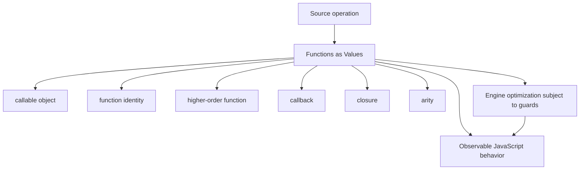
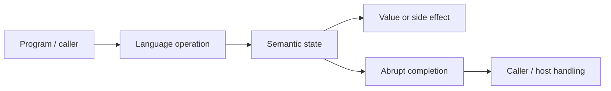
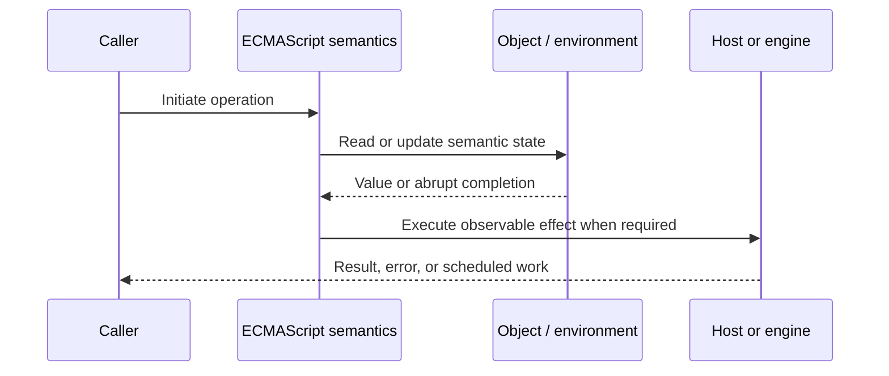
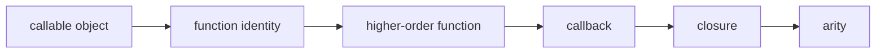

# Functions as Values

## Overview

JavaScript function objects are callable values: code can bind, pass, return, store, decorate, and compare them by identity. Higher-order functions turn behavior into data while closures attach lexical state.

This note separates the ECMAScript language model from engine implementation choices and host behavior. That distinction matters: specification algorithms define correctness, while engines remain free to optimize as long as observable behavior is preserved.

## Learning Objectives

- Define callable object and distinguish it from function identity
- Trace higher-order function through the relevant ECMAScript operations
- Predict edge cases without relying on engine folklore
- Evaluate memory, performance, security, and API-design trade-offs
- Apply the mechanism safely in production JavaScript

## Prerequisites

- [[01-Computer-Science/00-Orientation/How Computers Run Programs|How Computers Run Programs]]
- [[01-Computer-Science/03-Memory-and-Addressing/Stack and Heap|Stack and Heap]]
- [[01-Computer-Science/03-Memory-and-Addressing/Garbage Collection Models|Garbage Collection Models]]
- [[02-JavaScript/README|JavaScript]]

## Difficulty

`intermediate`

## Estimated Time

90–120 minutes for reading and examples; 2–4 hours for exercises and the mini project.

## History

First-class functions came from functional-language influence and enabled browser callbacks, event handlers, and reusable collection operations without a separate interface or delegate type.

## Problem It Solves

Treating behavior as a value enables composition and dependency injection, but unmanaged callback identity, hidden capture, and excessive abstraction can damage lifecycle control and observability.

## First-Principles Model

1. Every ordinary function is an object with identity and internal `[[Call]]` behavior.
2. Constructable functions also have `[[Construct]]`; arrows and many methods are callable but not constructable.
3. Passing a function copies a reference to the function object, not its body.
4. A returned function can retain its defining lexical environment.
5. Methods are functions obtained through property access; method syntax does not permanently bind a receiver.
6. `name` and `length` are metadata with limited reflective value and can be changed by wrappers or transforms.
7. `call`, `apply`, and `bind` control invocation mechanics but differ in timing and allocation.
8. Function equality is identity equality; two equivalent arrow expressions still produce distinct objects.

The useful debugging question is not “what does JavaScript usually do?” but “which abstract operation runs, what state does it read, and what observable result follows?” This framing survives minification, transpilation, optimization, and framework changes.

## Internal Implementation

- A function object stores code, a Realm, and an internal environment reference.
- Bound functions store target, bound `this`, and bound arguments in internal slots.
- Closures permit partial application without requiring a bound-function exotic object.
- Engines specialize stable call sites; megamorphic callback targets may reduce optimization opportunities.
- Event systems retain callback references, so listener lifecycle directly participates in memory reachability.

These are semantic obligations rather than a mandate for a specific physical representation. Connect them to [[01-Computer-Science/08-Languages-and-Computation/Compilers Interpreters and Virtual Machines|Compilers Interpreters and Virtual Machines]], [[01-Computer-Science/03-Memory-and-Addressing/Stack and Heap|Stack and Heap]], and [[01-Computer-Science/03-Memory-and-Addressing/Garbage Collection Models|Garbage Collection Models]]: optimized code may use registers, native frames, compact tables, or heap contexts while preserving the same language-level result.



## Mermaid Diagrams

### Structure



### Sequence / Lifecycle



### Mechanism Detail



## Examples

### Minimal Example

```js
const twice = (fn) => (value) => fn(fn(value));
const increment = (value) => value + 1;

console.log(twice(increment)(3)); // 5
console.log(increment === ((value) => value + 1)); // false
```

Trace this example before running it. Record binding/receiver/property state at each line, then compare the trace with the actual output.

### Production-Shaped Example

```js
export function withRetry(operation, { attempts, shouldRetry, onAttempt }) {
  return async function retried(...args) {
    let lastError;
    for (let attempt = 1; attempt <= attempts; attempt += 1) {
      try {
        onAttempt?.({ attempt });
        return await operation.apply(this, args);
      } catch (error) {
        lastError = error;
        if (!shouldRetry(error) || attempt === attempts) throw error;
      }
    }
    throw lastError;
  };
}
```

The production-shaped version validates assumptions, gives failures domain context, and makes lifecycle behavior visible. It still needs tests for malformed input and whichever host runtime deploys it.

## Trade-offs

| Approach | Upside | Downside | When it matters |
| --- | --- | --- | --- |
| Callbacks | Small flexible contracts | Inversion of control | One-shot operations |
| Decorators | Cross-cutting behavior is composable | Wrapper stacks obscure traces | Logging, retries, authorization |
| Stable function identity | Efficient memoization/listener removal | Requires lifecycle design | Long-lived components |

No choice is universally best. Prefer the simplest mechanism that preserves the required semantics, then measure memory and latency under representative workload rather than microbenchmarks alone.

### When to Use

- Use the mechanism when its semantics directly express a stable domain or lifecycle requirement.
- Use it when tests can cover both normal and abrupt completion paths.
- Use it when maintainers can observe and debug the resulting state transitions.

### When Not to Use

- Do not use a clever language feature merely to reduce line count.
- Avoid it when an explicit data structure or named function communicates ownership better.
- Do not depend on undocumented engine optimization behavior for correctness.

## Performance, Memory, and Security

- **Allocation:** Determine whether the pattern creates per-call objects, closures, wrappers, or collections.
- **Reachability:** Long-lived listeners, caches, registries, and suspended computations can retain an entire object graph.
- **Optimization:** Stable shapes and call sites help engines, but optimization tiers and heuristics are not API contracts.
- **Input limits:** Bound depth, size, key count, and work when values cross a trust boundary.
- **Side effects:** Getters, proxies, iterators, coercion hooks, and callbacks can run user code inside apparently simple syntax.
- **Observability:** Emit domain events and timings; never parse engine-specific stack text as a primary protocol.

## Production Practices

- Document callback timing, cardinality, and error behavior.
- Keep references needed for unsubscription.
- Preserve receiver semantics deliberately.
- Name important wrappers for useful traces.
- Avoid retrying non-idempotent operations blindly.
- Measure abstraction overhead only in proven hot paths.

At public boundaries, validate first, normalize once, and construct trusted domain values only after validation. Keep errors actionable without logging secrets or entire retained object graphs.

## Exercises

1. Predict the observable result of five edge cases involving **callable object**, then verify them in two engines.
2. Instrument a small example to expose **function identity** and explain every transition from specification operations.
3. Write table-driven tests for the listed common mistakes, including strict-mode and module execution.
4. Compare the first trade-off alternatives with a benchmark and a maintainability review; do not optimize from timing alone.
5. Extend the relevant exercise in [[02-JavaScript/code/README|JavaScript code labs]] with malformed, adversarial, and high-volume inputs.

For every exercise, include tests for success, malformed input, abrupt completion, and cleanup. Explain observed results from first principles rather than merely recording them.

## Mini Project

Implement `once`, `memoize`, `compose`, `partial`, and `withRetry`, including tests for receiver, identity, errors, and async results.

Required deliverables: implementation, automated tests, a Mermaid lifecycle diagram, benchmark methodology, and a short failure-mode analysis.

## Portfolio Project

Build a middleware pipeline with typed contracts, cancellation, timing, structured logs, and deterministic lifecycle cleanup.

Package it with a stable API, examples, generated documentation, CI checks, changelog discipline, and a production-readiness section covering limits and observability.

## Interview Questions

1. What makes a JavaScript function first-class?
2. Are all callable values constructable?
3. Why does listener removal depend on identity?
4. How does `bind` differ from closure-based partial application?
5. What contract dimensions should a callback API document?
6. How can higher-order functions harm observability?

### Stretch / Staff-Level

1. Design a migration from a codebase that misuses callable object; include compatibility, telemetry, staged rollout, and rollback.
2. Explain which guarantees belong to ECMAScript, which are engine heuristics, and which belong to the browser or Node.js host.
3. Describe a production incident involving this mechanism and the evidence you would collect before proposing a fix.

Strong answers name the controlling abstract operations, distinguish identity from equality or ownership, discuss abrupt completion, and state operational limits.

## Common Mistakes

- **Creating a fresh callback when removing a listener.** Reproduce this case in a focused test before relying on intuition.
- **Calling a callback twice when the contract is one-shot.** Reproduce this case in a focused test before relying on intuition.
- **Losing `this` while passing a method.** Reproduce this case in a focused test before relying on intuition.
- **Hiding I/O inside a seemingly pure higher-order utility.** Reproduce this case in a focused test before relying on intuition.
- **Decorating errors without preserving `cause`.** Reproduce this case in a focused test before relying on intuition.

## Best Practices

- Document callback timing, cardinality, and error behavior.
- Keep references needed for unsubscription.
- Preserve receiver semantics deliberately.
- Name important wrappers for useful traces.
- Avoid retrying non-idempotent operations blindly.
- Measure abstraction overhead only in proven hot paths.

## Summary

JavaScript function objects are callable values: code can bind, pass, return, store, decorate, and compare them by identity. Higher-order functions turn behavior into data while closures attach lexical state. The production rule is to model the semantics precisely, constrain untrusted work, make ownership and cleanup explicit, and treat engine optimization as measured implementation behavior rather than a language guarantee.

## Further Reading

- [ECMAScript Language Specification](https://tc39.es/ecma262/)
- [MDN JavaScript Guide](https://developer.mozilla.org/docs/Web/JavaScript/Guide)
- [[00-References/JavaScript/README|JavaScript References]]
- [[02-JavaScript/code/README|JavaScript code labs]]

## Related Notes

- [[02-JavaScript/02-Execution-and-Functions/Closures|Closures]]
- [[02-JavaScript/code/README|JavaScript code labs]]
- [[01-Computer-Science/00-Orientation/How Computers Run Programs|How Computers Run Programs]]

## Progress Checklist

- [ ] Explained the mechanism from first principles
- [ ] Drew and narrated every Mermaid diagram
- [ ] Predicted the minimal example before executing it
- [ ] Implemented malformed and adversarial tests
- [ ] Documented performance, memory, security, and non-goals
- [ ] Completed the mini project
- [ ] Practiced interview questions aloud
- [ ] Linked prerequisites and dependent topics
