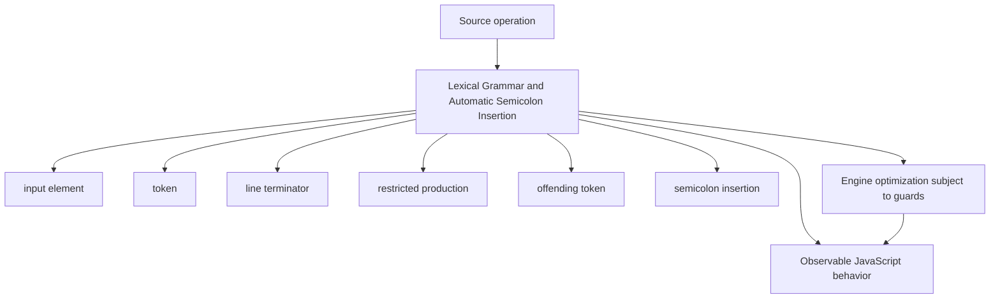
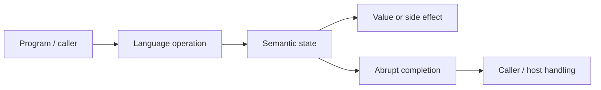
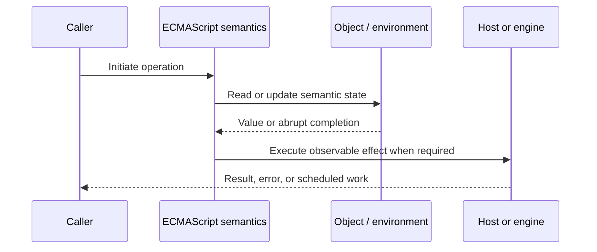
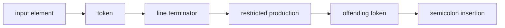

# Lexical Grammar and Automatic Semicolon Insertion

## Overview

ECMAScript first converts source text into tokens, then parses those tokens according to syntactic grammar. Automatic Semicolon Insertion (ASI) is a small, deterministic error-recovery rule in that grammar—not a general license to omit punctuation.

This note separates the ECMAScript language model from engine implementation choices and host behavior. That distinction matters: specification algorithms define correctness, while engines remain free to optimize as long as observable behavior is preserved.

## Learning Objectives

- Define input element and distinguish it from token
- Trace line terminator through the relevant ECMAScript operations
- Predict edge cases without relying on engine folklore
- Evaluate memory, performance, security, and API-design trade-offs
- Apply the mechanism safely in production JavaScript

## Prerequisites

- [[01-Computer-Science/00-Orientation/How Computers Run Programs|How Computers Run Programs]]
- [[01-Computer-Science/03-Memory-and-Addressing/Stack and Heap|Stack and Heap]]
- [[01-Computer-Science/03-Memory-and-Addressing/Garbage Collection Models|Garbage Collection Models]]
- [[02-JavaScript/README|JavaScript]]

## Difficulty

`intermediate`

## Estimated Time

90–120 minutes for reading and examples; 2–4 hours for exercises and the mini project.

## History

JavaScript inherited C-like statement syntax while targeting short scripts embedded in HTML. Optional semicolons reduced typing, but line terminators had to remain observable so the parser could repair only narrowly defined statement boundaries.

## Problem It Solves

Code review and minification become unsafe when engineers reason from visual lines rather than tokenization, restricted productions, and the exact points at which the grammar permits insertion.

## First-Principles Model

1. Whitespace usually separates tokens, but a line terminator is semantically significant in restricted productions.
2. Comments behave like whitespace; a multi-line comment containing a newline also contributes a line terminator.
3. A semicolon may be inserted before an offending token when a line terminator separates it from the previous token.
4. A semicolon may be inserted at the closing brace of a statement list or at end of input.
5. ASI never inserts a semicolon if doing so would create an empty statement forbidden by the grammar.
6. The restricted productions include postfix `++`/`--`, `return`, `throw`, `break`, `continue`, `yield`, and `async` arrow/function forms.
7. A line beginning with `(`, `[`, `` ` ``, `/`, `+`, or `-` may continue the previous expression.
8. A `return` followed by a newline returns `undefined`; the following expression becomes unreachable or a separate statement.

The useful debugging question is not “what does JavaScript usually do?” but “which abstract operation runs, what state does it read, and what observable result follows?” This framing survives minification, transpilation, optimization, and framework changes.

## Internal Implementation

- The scanner applies longest-match rules, so `>=` is one punctuator rather than `>` and `=`.
- Lexical goal symbols disambiguate a regular-expression literal from division using parser context.
- The parser consumes line-terminator metadata even though most whitespace tokens are discarded.
- ASI is attempted only after ordinary parsing encounters a token that the current production cannot accept.
- Formatters print defensive semicolons because concatenation and transformed code can create new token adjacency.

These are semantic obligations rather than a mandate for a specific physical representation. Connect them to [[01-Computer-Science/08-Languages-and-Computation/Compilers Interpreters and Virtual Machines|Compilers Interpreters and Virtual Machines]], [[01-Computer-Science/03-Memory-and-Addressing/Stack and Heap|Stack and Heap]], and [[01-Computer-Science/03-Memory-and-Addressing/Garbage Collection Models|Garbage Collection Models]]: optimized code may use registers, native frames, compact tables, or heap contexts while preserving the same language-level result.



## Mermaid Diagrams

### Structure



### Sequence / Lifecycle



### Mechanism Detail



## Examples

### Minimal Example

```js
function label(user) {
  return
  {
    name: user.name
  };
}

console.log(label({ name: "Ada" })); // undefined
```

Trace this example before running it. Record binding/receiver/property state at each line, then compare the trace with the actual output.

### Production-Shaped Example

```js
export function installHandlers(buttons, onSelect) {
  for (const button of buttons) {
    button.addEventListener("click", () => onSelect(button.dataset.id));
  }
}

// The leading semicolon protects this IIFE if files are concatenated.
;(function reportLoaded() {
  globalThis.telemetry?.emit("handlers.loaded", { count: buttons.length });
})();
```

The production-shaped version validates assumptions, gives failures domain context, and makes lifecycle behavior visible. It still needs tests for malformed input and whichever host runtime deploys it.

## Trade-offs

| Approach | Upside | Downside | When it matters |
| --- | --- | --- | --- |
| Omitted semicolons | Less visual punctuation | Boundary hazards during concatenation | Only with enforced formatter/linter rules |
| Explicit semicolons | Stable statement intent | Minor syntax noise | Libraries and mixed toolchains |
| Parser-aware tooling | Catches restricted productions | Adds build dependency | Every production repository |

No choice is universally best. Prefer the simplest mechanism that preserves the required semantics, then measure memory and latency under representative workload rather than microbenchmarks alone.

### When to Use

- Use the mechanism when its semantics directly express a stable domain or lifecycle requirement.
- Use it when tests can cover both normal and abrupt completion paths.
- Use it when maintainers can observe and debug the resulting state transitions.

### When Not to Use

- Do not use a clever language feature merely to reduce line count.
- Avoid it when an explicit data structure or named function communicates ownership better.
- Do not depend on undocumented engine optimization behavior for correctness.

## Performance, Memory, and Security

- **Allocation:** Determine whether the pattern creates per-call objects, closures, wrappers, or collections.
- **Reachability:** Long-lived listeners, caches, registries, and suspended computations can retain an entire object graph.
- **Optimization:** Stable shapes and call sites help engines, but optimization tiers and heuristics are not API contracts.
- **Input limits:** Bound depth, size, key count, and work when values cross a trust boundary.
- **Side effects:** Getters, proxies, iterators, coercion hooks, and callbacks can run user code inside apparently simple syntax.
- **Observability:** Emit domain events and timings; never parse engine-specific stack text as a primary protocol.

## Production Practices

- Adopt one formatter and enforce it in CI.
- Enable `no-unexpected-multiline` and `no-unreachable`.
- Keep `throw` and its expression on one line.
- Prefix hazard-leading statements when publishing semicolonless code.
- Test distributed artifacts, not only unbundled source.
- Treat parse errors as build failures.

At public boundaries, validate first, normalize once, and construct trusted domain values only after validation. Keep errors actionable without logging secrets or entire retained object graphs.

## Exercises

1. Predict the observable result of five edge cases involving **input element**, then verify them in two engines.
2. Instrument a small example to expose **token** and explain every transition from specification operations.
3. Write table-driven tests for the listed common mistakes, including strict-mode and module execution.
4. Compare the first trade-off alternatives with a benchmark and a maintainability review; do not optimize from timing alone.
5. Extend the relevant exercise in [[02-JavaScript/code/README|JavaScript code labs]] with malformed, adversarial, and high-volume inputs.

For every exercise, include tests for success, malformed input, abrupt completion, and cleanup. Explain observed results from first principles rather than merely recording them.

## Mini Project

Build a tokenizer-driven ASI hazard reporter that identifies restricted productions and dangerous line-leading tokens.

Required deliverables: implementation, automated tests, a Mermaid lifecycle diagram, benchmark methodology, and a short failure-mode analysis.

## Portfolio Project

Create a source concatenation laboratory that runs fixture pairs through a parser, formatter, minifier, and runtime, then documents semantic changes.

Package it with a stable API, examples, generated documentation, CI checks, changelog discipline, and a production-readiness section covering limits and observability.

## Interview Questions

1. At exactly which three kinds of locations can ASI insert a semicolon?
2. Why does `return\n{}` return `undefined`?
3. How can `/` represent either division or a regular-expression literal?
4. Which tokens commonly continue a previous expression?
5. Why can concatenating two valid files produce invalid behavior?
6. How would you enforce a semicolonless style safely?

### Stretch / Staff-Level

1. Design a migration from a codebase that misuses input element; include compatibility, telemetry, staged rollout, and rollback.
2. Explain which guarantees belong to ECMAScript, which are engine heuristics, and which belong to the browser or Node.js host.
3. Describe a production incident involving this mechanism and the evidence you would collect before proposing a fix.

Strong answers name the controlling abstract operations, distinguish identity from equality or ownership, discuss abrupt completion, and state operational limits.

## Common Mistakes

- **Assuming every newline terminates a statement.** Reproduce this case in a focused test before relying on intuition.
- **Putting an expression on the line after `return` or `throw`.** Reproduce this case in a focused test before relying on intuition.
- **Starting an IIFE with `(` after an unterminated expression.** Reproduce this case in a focused test before relying on intuition.
- **Treating regex-versus-division as a whitespace decision.** Reproduce this case in a focused test before relying on intuition.
- **Believing a minifier can always infer author intent.** Reproduce this case in a focused test before relying on intuition.

## Best Practices

- Adopt one formatter and enforce it in CI.
- Enable `no-unexpected-multiline` and `no-unreachable`.
- Keep `throw` and its expression on one line.
- Prefix hazard-leading statements when publishing semicolonless code.
- Test distributed artifacts, not only unbundled source.
- Treat parse errors as build failures.

## Summary

ECMAScript first converts source text into tokens, then parses those tokens according to syntactic grammar. Automatic Semicolon Insertion (ASI) is a small, deterministic error-recovery rule in that grammar—not a general license to omit punctuation. The production rule is to model the semantics precisely, constrain untrusted work, make ownership and cleanup explicit, and treat engine optimization as measured implementation behavior rather than a language guarantee.

## Further Reading

- [ECMAScript Language Specification](https://tc39.es/ecma262/)
- [MDN JavaScript Guide](https://developer.mozilla.org/docs/Web/JavaScript/Guide)
- [[00-References/JavaScript/README|JavaScript References]]
- [[02-JavaScript/code/README|JavaScript code labs]]

## Related Notes

- [[02-JavaScript/04-Engines-and-Memory/Parsing AST and Bytecode|Parsing AST and Bytecode]]
- [[01-Computer-Science/08-Languages-and-Computation/Compilers Interpreters and Virtual Machines|Compilers Interpreters and Virtual Machines]]
- [[02-JavaScript/code/README|JavaScript code labs]]
- [[01-Computer-Science/00-Orientation/How Computers Run Programs|How Computers Run Programs]]

## Progress Checklist

- [ ] Explained the mechanism from first principles
- [ ] Drew and narrated every Mermaid diagram
- [ ] Predicted the minimal example before executing it
- [ ] Implemented malformed and adversarial tests
- [ ] Documented performance, memory, security, and non-goals
- [ ] Completed the mini project
- [ ] Practiced interview questions aloud
- [ ] Linked prerequisites and dependent topics
