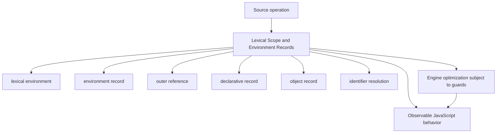
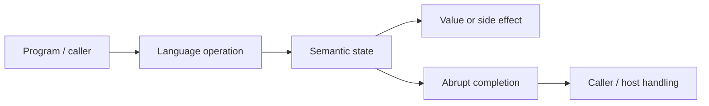
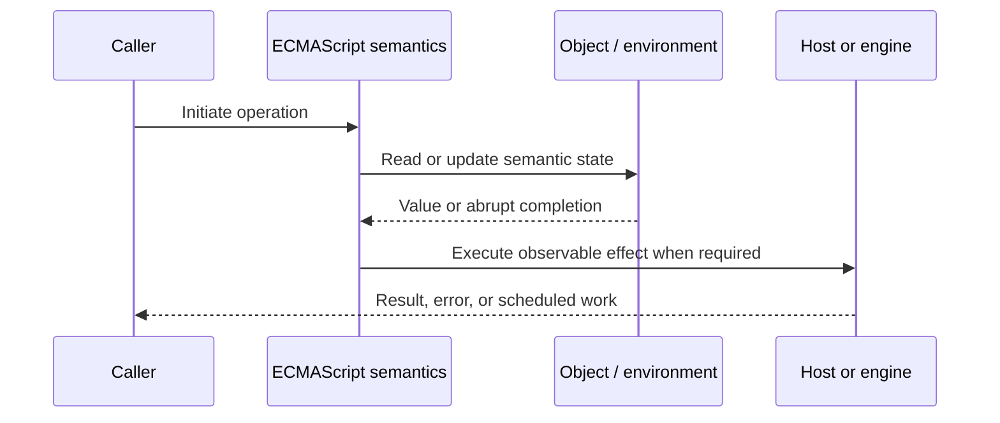
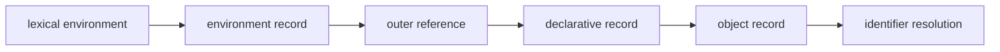

# Lexical Scope and Environment Records

## Overview

Lexical scope means identifier resolution is determined by source nesting. ECMAScript specifies this with linked lexical environments whose environment records hold bindings and whose outer references form a scope chain.

This note separates the ECMAScript language model from engine implementation choices and host behavior. That distinction matters: specification algorithms define correctness, while engines remain free to optimize as long as observable behavior is preserved.

## Learning Objectives

- Define lexical environment and distinguish it from environment record
- Trace outer reference through the relevant ECMAScript operations
- Predict edge cases without relying on engine folklore
- Evaluate memory, performance, security, and API-design trade-offs
- Apply the mechanism safely in production JavaScript

## Prerequisites

- [[01-Computer-Science/00-Orientation/How Computers Run Programs|How Computers Run Programs]]
- [[01-Computer-Science/03-Memory-and-Addressing/Stack and Heap|Stack and Heap]]
- [[01-Computer-Science/03-Memory-and-Addressing/Garbage Collection Models|Garbage Collection Models]]
- [[02-JavaScript/README|JavaScript]]

## Difficulty

`advanced`

## Estimated Time

90–120 minutes for reading and examples; 2–4 hours for exercises and the mini project.

## History

Lexical scoping made local reasoning and compilation practical compared with dynamic scoping, while environment-record abstractions let one specification cover blocks, functions, modules, objects, and host-defined globals.

## Problem It Solves

A precise model explains shadowing, closure capture, modules, `with`, direct `eval`, and why source location—not caller identity—decides which binding an identifier denotes.

## First-Principles Model

1. Every lexical environment pairs an environment record with an outer-environment reference.
2. Declarative records store named bindings without exposing them as ordinary object properties.
3. Object environment records resolve bindings through an ordinary object and are used in parts of global semantics.
4. Function environment records additionally track `this`, `super`, and `new.target` where applicable.
5. Module environment records expose immutable import bindings that remain live views of exporter bindings.
6. Identifier resolution walks outward until a record reports that it has the binding.
7. Shadowing stops outward lookup; it does not mutate the hidden outer binding.
8. A block creates an environment only when its declarations require one; this is semantic, not necessarily a heap allocation.

The useful debugging question is not “what does JavaScript usually do?” but “which abstract operation runs, what state does it read, and what observable result follows?” This framing survives minification, transpilation, optimization, and framework changes.

## Internal Implementation

- `ResolveBinding` starts from the running execution context's lexical environment.
- `GetIdentifierReference` recursively checks `HasBinding` and returns a Reference Record.
- Reading the Reference invokes the chosen record's `GetBindingValue` operation.
- Direct `eval` can introduce or inspect bindings depending on strictness, forcing engines to preserve dynamic lookup behavior.
- Optimizing engines may use stack slots or registers when escape analysis proves an environment need not survive.

These are semantic obligations rather than a mandate for a specific physical representation. Connect them to [[01-Computer-Science/08-Languages-and-Computation/Compilers Interpreters and Virtual Machines|Compilers Interpreters and Virtual Machines]], [[01-Computer-Science/03-Memory-and-Addressing/Stack and Heap|Stack and Heap]], and [[01-Computer-Science/03-Memory-and-Addressing/Garbage Collection Models|Garbage Collection Models]]: optimized code may use registers, native frames, compact tables, or heap contexts while preserving the same language-level result.



## Mermaid Diagrams

### Structure



### Sequence / Lifecycle



### Mechanism Detail



## Examples

### Minimal Example

```js
const region = "global";

function makeReporter() {
  const region = "function";
  return () => region;
}

console.log(makeReporter()()); // "function"
```

Trace this example before running it. Record binding/receiver/property state at each line, then compare the trace with the actual output.

### Production-Shaped Example

```js
export function createRequestScope(baseLogger, requestId) {
  const logger = baseLogger.child({ requestId });
  const startedAt = performance.now();

  return async function run(operation) {
    try {
      return await operation({ logger, requestId });
    } finally {
      logger.info({ durationMs: performance.now() - startedAt }, "request.done");
    }
  };
}
```

The production-shaped version validates assumptions, gives failures domain context, and makes lifecycle behavior visible. It still needs tests for malformed input and whichever host runtime deploys it.

## Trade-offs

| Approach | Upside | Downside | When it matters |
| --- | --- | --- | --- |
| Lexical scope | Predictable local resolution | Closures can retain state | Nearly all application code |
| Dynamic features | Powerful runtime adaptation | Disable important optimizations | `eval`/`with` should be avoided |
| Nested scopes | Limit authority and names | Deep shadowing harms readability | Small cohesive blocks |

No choice is universally best. Prefer the simplest mechanism that preserves the required semantics, then measure memory and latency under representative workload rather than microbenchmarks alone.

### When to Use

- Use the mechanism when its semantics directly express a stable domain or lifecycle requirement.
- Use it when tests can cover both normal and abrupt completion paths.
- Use it when maintainers can observe and debug the resulting state transitions.

### When Not to Use

- Do not use a clever language feature merely to reduce line count.
- Avoid it when an explicit data structure or named function communicates ownership better.
- Do not depend on undocumented engine optimization behavior for correctness.

## Performance, Memory, and Security

- **Allocation:** Determine whether the pattern creates per-call objects, closures, wrappers, or collections.
- **Reachability:** Long-lived listeners, caches, registries, and suspended computations can retain an entire object graph.
- **Optimization:** Stable shapes and call sites help engines, but optimization tiers and heuristics are not API contracts.
- **Input limits:** Bound depth, size, key count, and work when values cross a trust boundary.
- **Side effects:** Getters, proxies, iterators, coercion hooks, and callbacks can run user code inside apparently simple syntax.
- **Observability:** Emit domain events and timings; never parse engine-specific stack text as a primary protocol.

## Production Practices

- Keep scope narrow and names intention-revealing.
- Use modules as explicit dependency boundaries.
- Avoid `with` and direct `eval`.
- Inspect retained closures when diagnosing leaks.
- Prefer explicit parameters over ambient mutable bindings.
- Use linting to flag confusing shadowing.

At public boundaries, validate first, normalize once, and construct trusted domain values only after validation. Keep errors actionable without logging secrets or entire retained object graphs.

## Exercises

1. Predict the observable result of five edge cases involving **lexical environment**, then verify them in two engines.
2. Instrument a small example to expose **environment record** and explain every transition from specification operations.
3. Write table-driven tests for the listed common mistakes, including strict-mode and module execution.
4. Compare the first trade-off alternatives with a benchmark and a maintainability review; do not optimize from timing alone.
5. Extend the relevant exercise in [[02-JavaScript/code/README|JavaScript code labs]] with malformed, adversarial, and high-volume inputs.

For every exercise, include tests for success, malformed input, abrupt completion, and cleanup. Explain observed results from first principles rather than merely recording them.

## Mini Project

Write a scope-chain interpreter for blocks, functions, shadowing, and assignment, then compare its traces with JavaScript.

Required deliverables: implementation, automated tests, a Mermaid lifecycle diagram, benchmark methodology, and a short failure-mode analysis.

## Portfolio Project

Create a lexical-scope explorer that parses sample code and renders bindings, outer links, captures, and shadowed names.

Package it with a stable API, examples, generated documentation, CI checks, changelog discipline, and a production-readiness section covering limits and observability.

## Interview Questions

1. How does identifier resolution differ from prototype lookup?
2. What data does a lexical environment contain?
3. Which environment records exist and why?
4. Why can engines avoid allocating many scope objects?
5. What makes an imported binding live?
6. How does direct `eval` constrain optimization?

### Stretch / Staff-Level

1. Design a migration from a codebase that misuses lexical environment; include compatibility, telemetry, staged rollout, and rollback.
2. Explain which guarantees belong to ECMAScript, which are engine heuristics, and which belong to the browser or Node.js host.
3. Describe a production incident involving this mechanism and the evidence you would collect before proposing a fix.

Strong answers name the controlling abstract operations, distinguish identity from equality or ownership, discuss abrupt completion, and state operational limits.

## Common Mistakes

- **Confusing lexical scope with object property lookup.** Reproduce this case in a focused test before relying on intuition.
- **Assuming caller locals are visible to a called function.** Reproduce this case in a focused test before relying on intuition.
- **Overusing the same identifier in deeply nested scopes.** Reproduce this case in a focused test before relying on intuition.
- **Treating every lexical environment as a concrete heap object.** Reproduce this case in a focused test before relying on intuition.
- **Using direct `eval` in production code.** Reproduce this case in a focused test before relying on intuition.

## Best Practices

- Keep scope narrow and names intention-revealing.
- Use modules as explicit dependency boundaries.
- Avoid `with` and direct `eval`.
- Inspect retained closures when diagnosing leaks.
- Prefer explicit parameters over ambient mutable bindings.
- Use linting to flag confusing shadowing.

## Summary

Lexical scope means identifier resolution is determined by source nesting. ECMAScript specifies this with linked lexical environments whose environment records hold bindings and whose outer references form a scope chain. The production rule is to model the semantics precisely, constrain untrusted work, make ownership and cleanup explicit, and treat engine optimization as measured implementation behavior rather than a language guarantee.

## Further Reading

- [ECMAScript Language Specification](https://tc39.es/ecma262/)
- [MDN JavaScript Guide](https://developer.mozilla.org/docs/Web/JavaScript/Guide)
- [[00-References/JavaScript/README|JavaScript References]]
- [[02-JavaScript/code/README|JavaScript code labs]]

## Related Notes

- [[02-JavaScript/02-Execution-and-Functions/Closures|Closures]]
- [[01-Computer-Science/03-Memory-and-Addressing/Stack and Heap|Stack and Heap]]
- [[01-Computer-Science/03-Memory-and-Addressing/Garbage Collection Models|Garbage Collection Models]]
- [[02-JavaScript/code/README|JavaScript code labs]]
- [[01-Computer-Science/00-Orientation/How Computers Run Programs|How Computers Run Programs]]

## Progress Checklist

- [ ] Explained the mechanism from first principles
- [ ] Drew and narrated every Mermaid diagram
- [ ] Predicted the minimal example before executing it
- [ ] Implemented malformed and adversarial tests
- [ ] Documented performance, memory, security, and non-goals
- [ ] Completed the mini project
- [ ] Practiced interview questions aloud
- [ ] Linked prerequisites and dependent topics
