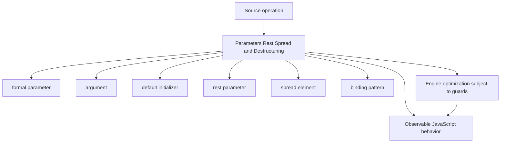
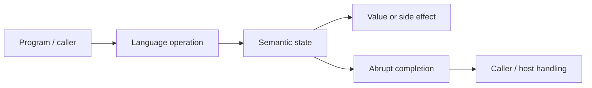
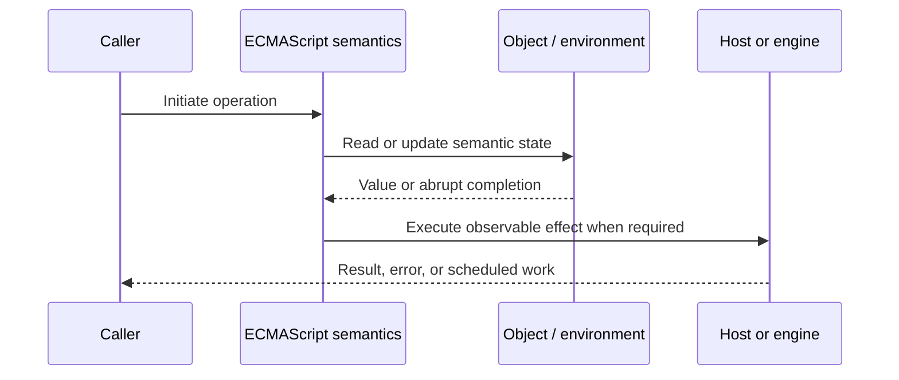
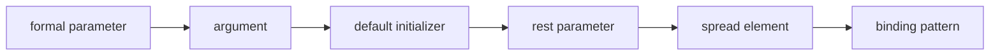

# Parameters Rest Spread and Destructuring

## Overview

Parameter syntax maps supplied arguments into local bindings. Defaults, rest, spread, and destructuring make that mapping expressive, but each has precise evaluation order, iteration, allocation, and failure behavior.

This note separates the ECMAScript language model from engine implementation choices and host behavior. That distinction matters: specification algorithms define correctness, while engines remain free to optimize as long as observable behavior is preserved.

## Learning Objectives

- Define formal parameter and distinguish it from argument
- Trace default initializer through the relevant ECMAScript operations
- Predict edge cases without relying on engine folklore
- Evaluate memory, performance, security, and API-design trade-offs
- Apply the mechanism safely in production JavaScript

## Prerequisites

- [[01-Computer-Science/00-Orientation/How Computers Run Programs|How Computers Run Programs]]
- [[01-Computer-Science/03-Memory-and-Addressing/Stack and Heap|Stack and Heap]]
- [[01-Computer-Science/03-Memory-and-Addressing/Garbage Collection Models|Garbage Collection Models]]
- [[02-JavaScript/README|JavaScript]]

## Difficulty

`intermediate`

## Estimated Time

90–120 minutes for reading and examples; 2–4 hours for exercises and the mini project.

## History

ES2015 replaced common `arguments` slicing and manual property extraction with declarative syntax that works naturally with iterables and structured option objects.

## Problem It Solves

These features improve API clarity while creating risks from eager getters, shallow copies, iterable expansion limits, ambiguous defaults, and destructuring errors at trust boundaries.

## First-Principles Model

1. Missing arguments and explicit `undefined` trigger a default initializer; `null` does not.
2. Default initializers run left-to-right and may reference earlier parameters but not later uninitialized ones.
3. A rest parameter collects remaining arguments into a real Array.
4. Spread in a call consumes an iterable; object spread enumerates own enumerable properties instead.
5. Array destructuring consumes an iterator and may invoke `return()` when destructuring stops early.
6. Object destructuring performs property access, so getters and proxies can execute code.
7. Rest and spread are shallow: nested object references remain shared.
8. Non-simple parameter lists change `arguments` aliasing rules and establish a separate parameter environment.

The useful debugging question is not “what does JavaScript usually do?” but “which abstract operation runs, what state does it read, and what observable result follows?” This framing survives minification, transpilation, optimization, and framework changes.

## Internal Implementation

- Iterator spread repeatedly calls `next()` and closes the iterator on abrupt completion where required.
- Object spread uses `CopyDataProperties`, ignores `null`/`undefined`, and creates data properties rather than preserving descriptors.
- Computed binding keys are evaluated in source order and may have side effects.
- A function's `length` stops counting at the first default, rest, or later parameter.
- Very large call spreads can exceed engine argument-count or stack limits; iteration avoids that boundary.

These are semantic obligations rather than a mandate for a specific physical representation. Connect them to [[01-Computer-Science/08-Languages-and-Computation/Compilers Interpreters and Virtual Machines|Compilers Interpreters and Virtual Machines]], [[01-Computer-Science/03-Memory-and-Addressing/Stack and Heap|Stack and Heap]], and [[01-Computer-Science/03-Memory-and-Addressing/Garbage Collection Models|Garbage Collection Models]]: optimized code may use registers, native frames, compact tables, or heap contexts while preserving the same language-level result.



## Mermaid Diagrams

### Structure



### Sequence / Lifecycle



### Mechanism Detail



## Examples

### Minimal Example

```js
function connect(host, { port = 443, secure = true } = {}) {
  return `${secure ? "https" : "http"}://${host}:${port}`;
}

const numbers = [2, 3];
console.log(Math.max(1, ...numbers, 4));
```

Trace this example before running it. Record binding/receiver/property state at each line, then compare the trace with the actual output.

### Production-Shaped Example

```js
export function parseJob(input) {
  if (input === null || typeof input !== "object") {
    throw new TypeError("job must be an object");
  }
  const {
    id,
    queue = "default",
    metadata: { traceId } = {},
    ...extra
  } = input;
  if (typeof id !== "string") throw new TypeError("job.id must be a string");
  return { id, queue, traceId, extra };
}
```

The production-shaped version validates assumptions, gives failures domain context, and makes lifecycle behavior visible. It still needs tests for malformed input and whichever host runtime deploys it.

## Trade-offs

| Approach | Upside | Downside | When it matters |
| --- | --- | --- | --- |
| Options object | Named extensible inputs | Runtime validation still required | Three or more optional inputs |
| Positional parameters | Compact and direct | Order-sensitive evolution | Few required inputs |
| Spread copy | Readable shallow clone | Getters run and descriptors disappear | Plain data records |

No choice is universally best. Prefer the simplest mechanism that preserves the required semantics, then measure memory and latency under representative workload rather than microbenchmarks alone.

### When to Use

- Use the mechanism when its semantics directly express a stable domain or lifecycle requirement.
- Use it when tests can cover both normal and abrupt completion paths.
- Use it when maintainers can observe and debug the resulting state transitions.

### When Not to Use

- Do not use a clever language feature merely to reduce line count.
- Avoid it when an explicit data structure or named function communicates ownership better.
- Do not depend on undocumented engine optimization behavior for correctness.

## Performance, Memory, and Security

- **Allocation:** Determine whether the pattern creates per-call objects, closures, wrappers, or collections.
- **Reachability:** Long-lived listeners, caches, registries, and suspended computations can retain an entire object graph.
- **Optimization:** Stable shapes and call sites help engines, but optimization tiers and heuristics are not API contracts.
- **Input limits:** Bound depth, size, key count, and work when values cross a trust boundary.
- **Side effects:** Getters, proxies, iterators, coercion hooks, and callbacks can run user code inside apparently simple syntax.
- **Observability:** Emit domain events and timings; never parse engine-specific stack text as a primary protocol.

## Production Practices

- Default the whole options object to `{}` when omission is valid.
- Validate external input before deep destructuring.
- Use iteration/reduction for unbounded collections.
- Document shallow-copy semantics.
- Keep parameter initializers side-effect free.
- Prefer explicit schemas at network and storage boundaries.

At public boundaries, validate first, normalize once, and construct trusted domain values only after validation. Keep errors actionable without logging secrets or entire retained object graphs.

## Exercises

1. Predict the observable result of five edge cases involving **formal parameter**, then verify them in two engines.
2. Instrument a small example to expose **argument** and explain every transition from specification operations.
3. Write table-driven tests for the listed common mistakes, including strict-mode and module execution.
4. Compare the first trade-off alternatives with a benchmark and a maintainability review; do not optimize from timing alone.
5. Extend the relevant exercise in [[02-JavaScript/code/README|JavaScript code labs]] with malformed, adversarial, and high-volume inputs.

For every exercise, include tests for success, malformed input, abrupt completion, and cleanup. Explain observed results from first principles rather than merely recording them.

## Mini Project

Implement safe `pick`, `omit`, `merge`, and iterable batching utilities; test symbols, getters, holes, and abrupt iteration.

Required deliverables: implementation, automated tests, a Mermaid lifecycle diagram, benchmark methodology, and a short failure-mode analysis.

## Portfolio Project

Build a schema-backed command dispatcher that uses options objects, validates before destructuring, and redacts unknown fields in logs.

Package it with a stable API, examples, generated documentation, CI checks, changelog discipline, and a production-readiness section covering limits and observability.

## Interview Questions

1. When do default parameters execute?
2. How do array and object spread differ?
3. Does object spread preserve property descriptors?
4. Why can destructuring close an iterator?
5. How does a non-simple parameter list affect `arguments`?
6. Why is spreading unbounded arrays into calls unsafe?

### Stretch / Staff-Level

1. Design a migration from a codebase that misuses formal parameter; include compatibility, telemetry, staged rollout, and rollback.
2. Explain which guarantees belong to ECMAScript, which are engine heuristics, and which belong to the browser or Node.js host.
3. Describe a production incident involving this mechanism and the evidence you would collect before proposing a fix.

Strong answers name the controlling abstract operations, distinguish identity from equality or ownership, discuss abrupt completion, and state operational limits.

## Common Mistakes

- **Expecting defaults to handle `null`.** Reproduce this case in a focused test before relying on intuition.
- **Calling with `...hugeArray`.** Reproduce this case in a focused test before relying on intuition.
- **Assuming spread deep-clones data.** Reproduce this case in a focused test before relying on intuition.
- **Destructuring unvalidated `null` input.** Reproduce this case in a focused test before relying on intuition.
- **Forgetting that getters/proxies run during object spread.** Reproduce this case in a focused test before relying on intuition.

## Best Practices

- Default the whole options object to `{}` when omission is valid.
- Validate external input before deep destructuring.
- Use iteration/reduction for unbounded collections.
- Document shallow-copy semantics.
- Keep parameter initializers side-effect free.
- Prefer explicit schemas at network and storage boundaries.

## Summary

Parameter syntax maps supplied arguments into local bindings. Defaults, rest, spread, and destructuring make that mapping expressive, but each has precise evaluation order, iteration, allocation, and failure behavior. The production rule is to model the semantics precisely, constrain untrusted work, make ownership and cleanup explicit, and treat engine optimization as measured implementation behavior rather than a language guarantee.

## Further Reading

- [ECMAScript Language Specification](https://tc39.es/ecma262/)
- [MDN JavaScript Guide](https://developer.mozilla.org/docs/Web/JavaScript/Guide)
- [[00-References/JavaScript/README|JavaScript References]]
- [[02-JavaScript/code/README|JavaScript code labs]]

## Related Notes

- [[02-JavaScript/03-Objects-and-Metaprogramming/Property Descriptors and Object Integrity|Property Descriptors and Object Integrity]]
- [[02-JavaScript/code/README|JavaScript code labs]]
- [[01-Computer-Science/00-Orientation/How Computers Run Programs|How Computers Run Programs]]

## Progress Checklist

- [ ] Explained the mechanism from first principles
- [ ] Drew and narrated every Mermaid diagram
- [ ] Predicted the minimal example before executing it
- [ ] Implemented malformed and adversarial tests
- [ ] Documented performance, memory, security, and non-goals
- [ ] Completed the mini project
- [ ] Practiced interview questions aloud
- [ ] Linked prerequisites and dependent topics
