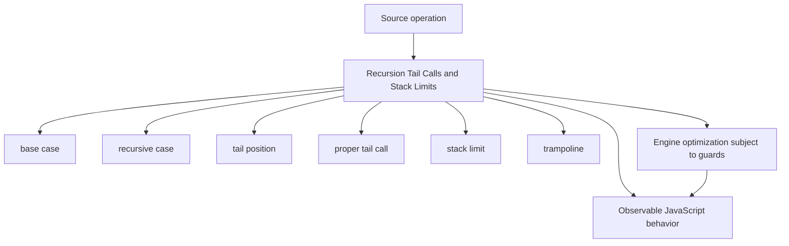
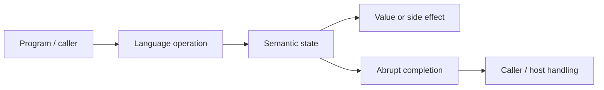
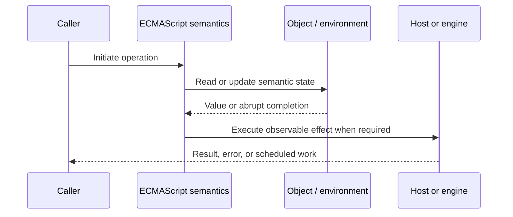
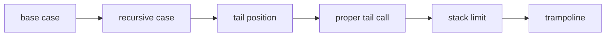

# Recursion Tail Calls and Stack Limits

## Overview

Recursion solves a problem by calling the same computation on smaller input. Each ordinary recursive call consumes execution-frame resources; ECMAScript specifies proper tail calls in strict tail position, but production code cannot rely on broad engine support.

This note separates the ECMAScript language model from engine implementation choices and host behavior. That distinction matters: specification algorithms define correctness, while engines remain free to optimize as long as observable behavior is preserved.

## Learning Objectives

- Define base case and distinguish it from recursive case
- Trace tail position through the relevant ECMAScript operations
- Predict edge cases without relying on engine folklore
- Evaluate memory, performance, security, and API-design trade-offs
- Apply the mechanism safely in production JavaScript

## Prerequisites

- [[01-Computer-Science/00-Orientation/How Computers Run Programs|How Computers Run Programs]]
- [[01-Computer-Science/03-Memory-and-Addressing/Stack and Heap|Stack and Heap]]
- [[01-Computer-Science/03-Memory-and-Addressing/Garbage Collection Models|Garbage Collection Models]]
- [[02-JavaScript/README|JavaScript]]

## Difficulty

`advanced`

## Estimated Time

90–120 minutes for reading and examples; 2–4 hours for exercises and the mini project.

## History

Recursive definitions mirror trees, grammars, and divide-and-conquer algorithms. Proper tail calls were standardized to permit constant-space recursion, yet debugging and implementation trade-offs limited adoption across engines.

## Problem It Solves

Untrusted nesting can turn elegant recursion into `RangeError`, denial of service, or process failure, so robust software budgets depth or uses explicit work stacks.

## First-Principles Model

1. A terminating recursion needs progress toward a reachable base case.
2. Non-tail recursion must preserve pending work in each caller frame.
3. A call is in tail position only when its result is directly returned under specification rules.
4. Tail-recursive source does not guarantee constant space on common V8-based runtimes.
5. Maximum call-stack depth is implementation- and frame-size-dependent.
6. Mutual recursion can overflow even when each function appears small.
7. An explicit array stack moves control state to heap-managed memory and permits depth limits.
8. A trampoline repeatedly invokes returned thunks, trading allocations and complexity for bounded native stack.

The useful debugging question is not “what does JavaScript usually do?” but “which abstract operation runs, what state does it read, and what observable result follows?” This framing survives minification, transpilation, optimization, and framework changes.

## Internal Implementation

- Each active frame needs return state, locals, arguments, and engine bookkeeping.
- Optimized and interpreted frames differ in size, so a numeric safe depth is not portable.
- Proper tail-call semantics replace the current frame rather than pushing a new one.
- JIT inlining may remove some frames but cannot be treated as a correctness guarantee.
- Iterative graph traversal also needs visited-set semantics to avoid cycles, not merely stack management.

These are semantic obligations rather than a mandate for a specific physical representation. Connect them to [[01-Computer-Science/08-Languages-and-Computation/Compilers Interpreters and Virtual Machines|Compilers Interpreters and Virtual Machines]], [[01-Computer-Science/03-Memory-and-Addressing/Stack and Heap|Stack and Heap]], and [[01-Computer-Science/03-Memory-and-Addressing/Garbage Collection Models|Garbage Collection Models]]: optimized code may use registers, native frames, compact tables, or heap contexts while preserving the same language-level result.



## Mermaid Diagrams

### Structure



### Sequence / Lifecycle



### Mechanism Detail



## Examples

### Minimal Example

```js
function factorial(n) {
  if (!Number.isInteger(n) || n < 0) throw new RangeError("n");
  if (n <= 1) return 1;
  return n * factorial(n - 1);
}

console.log(factorial(5)); // 120
```

Trace this example before running it. Record binding/receiver/property state at each line, then compare the trace with the actual output.

### Production-Shaped Example

```js
export function walkJson(root, { maxDepth = 1000 } = {}) {
  const work = [{ value: root, depth: 0 }];
  let nodes = 0;

  while (work.length) {
    const { value, depth } = work.pop();
    if (depth > maxDepth) throw new RangeError("maximum nesting exceeded");
    nodes += 1;
    if (value && typeof value === "object") {
      for (const child of Object.values(value)) {
        work.push({ value: child, depth: depth + 1 });
      }
    }
  }
  return nodes;
}
```

The production-shaped version validates assumptions, gives failures domain context, and makes lifecycle behavior visible. It still needs tests for malformed input and whichever host runtime deploys it.

## Trade-offs

| Approach | Upside | Downside | When it matters |
| --- | --- | --- | --- |
| Direct recursion | Matches inductive problem structure | Consumes call stack | Small trusted depth |
| Explicit stack | Portable depth control | More bookkeeping | Untrusted trees/graphs |
| Trampoline | Keeps recursive decomposition | Thunk allocation and unusual APIs | Controlled functional systems |

No choice is universally best. Prefer the simplest mechanism that preserves the required semantics, then measure memory and latency under representative workload rather than microbenchmarks alone.

### When to Use

- Use the mechanism when its semantics directly express a stable domain or lifecycle requirement.
- Use it when tests can cover both normal and abrupt completion paths.
- Use it when maintainers can observe and debug the resulting state transitions.

### When Not to Use

- Do not use a clever language feature merely to reduce line count.
- Avoid it when an explicit data structure or named function communicates ownership better.
- Do not depend on undocumented engine optimization behavior for correctness.

## Performance, Memory, and Security

- **Allocation:** Determine whether the pattern creates per-call objects, closures, wrappers, or collections.
- **Reachability:** Long-lived listeners, caches, registries, and suspended computations can retain an entire object graph.
- **Optimization:** Stable shapes and call sites help engines, but optimization tiers and heuristics are not API contracts.
- **Input limits:** Bound depth, size, key count, and work when values cross a trust boundary.
- **Side effects:** Getters, proxies, iterators, coercion hooks, and callbacks can run user code inside apparently simple syntax.
- **Observability:** Emit domain events and timings; never parse engine-specific stack text as a primary protocol.

## Production Practices

- Set explicit depth and node budgets.
- Prefer iterative traversal at trust boundaries.
- Test pathological skewed inputs.
- Separate cycle detection from depth protection.
- Do not benchmark with optimization assumptions as correctness requirements.
- Report budget violations with structured context.

At public boundaries, validate first, normalize once, and construct trusted domain values only after validation. Keep errors actionable without logging secrets or entire retained object graphs.

## Exercises

1. Predict the observable result of five edge cases involving **base case**, then verify them in two engines.
2. Instrument a small example to expose **recursive case** and explain every transition from specification operations.
3. Write table-driven tests for the listed common mistakes, including strict-mode and module execution.
4. Compare the first trade-off alternatives with a benchmark and a maintainability review; do not optimize from timing alone.
5. Extend the relevant exercise in [[02-JavaScript/code/README|JavaScript code labs]] with malformed, adversarial, and high-volume inputs.

For every exercise, include tests for success, malformed input, abrupt completion, and cleanup. Explain observed results from first principles rather than merely recording them.

## Mini Project

Implement DFS recursively, iteratively, and with a trampoline; test deep, wide, cyclic, and malformed structures.

Required deliverables: implementation, automated tests, a Mermaid lifecycle diagram, benchmark methodology, and a short failure-mode analysis.

## Portfolio Project

Build a resource-budgeted AST walker with cancellation, cycle detection, metrics, visitor hooks, and deterministic error reporting.

Package it with a stable API, examples, generated documentation, CI checks, changelog discipline, and a production-readiness section covering limits and observability.

## Interview Questions

1. What qualifies as tail position?
2. Why is tail recursion not portable constant-space JavaScript?
3. What determines a runtime's stack limit?
4. How does a trampoline work?
5. When is an explicit work stack superior?
6. How would you defend a recursive parser against denial of service?

### Stretch / Staff-Level

1. Design a migration from a codebase that misuses base case; include compatibility, telemetry, staged rollout, and rollback.
2. Explain which guarantees belong to ECMAScript, which are engine heuristics, and which belong to the browser or Node.js host.
3. Describe a production incident involving this mechanism and the evidence you would collect before proposing a fix.

Strong answers name the controlling abstract operations, distinguish identity from equality or ownership, discuss abrupt completion, and state operational limits.

## Common Mistakes

- **Assuming strict mode guarantees optimized tail calls.** Reproduce this case in a focused test before relying on intuition.
- **Omitting a base case or progress argument.** Reproduce this case in a focused test before relying on intuition.
- **Using recursion for attacker-controlled JSON depth.** Reproduce this case in a focused test before relying on intuition.
- **Traversing cyclic graphs without a visited set.** Reproduce this case in a focused test before relying on intuition.
- **Catching stack overflow as normal flow.** Reproduce this case in a focused test before relying on intuition.

## Best Practices

- Set explicit depth and node budgets.
- Prefer iterative traversal at trust boundaries.
- Test pathological skewed inputs.
- Separate cycle detection from depth protection.
- Do not benchmark with optimization assumptions as correctness requirements.
- Report budget violations with structured context.

## Summary

Recursion solves a problem by calling the same computation on smaller input. Each ordinary recursive call consumes execution-frame resources; ECMAScript specifies proper tail calls in strict tail position, but production code cannot rely on broad engine support. The production rule is to model the semantics precisely, constrain untrusted work, make ownership and cleanup explicit, and treat engine optimization as measured implementation behavior rather than a language guarantee.

## Further Reading

- [ECMAScript Language Specification](https://tc39.es/ecma262/)
- [MDN JavaScript Guide](https://developer.mozilla.org/docs/Web/JavaScript/Guide)
- [[00-References/JavaScript/README|JavaScript References]]
- [[02-JavaScript/code/README|JavaScript code labs]]

## Related Notes

- [[02-JavaScript/02-Execution-and-Functions/Execution Contexts and Call Stack|Execution Contexts and Call Stack]]
- [[01-Computer-Science/03-Memory-and-Addressing/Stack and Heap|Stack and Heap]]
- [[02-JavaScript/code/README|JavaScript code labs]]
- [[01-Computer-Science/00-Orientation/How Computers Run Programs|How Computers Run Programs]]

## Progress Checklist

- [ ] Explained the mechanism from first principles
- [ ] Drew and narrated every Mermaid diagram
- [ ] Predicted the minimal example before executing it
- [ ] Implemented malformed and adversarial tests
- [ ] Documented performance, memory, security, and non-goals
- [ ] Completed the mini project
- [ ] Practiced interview questions aloud
- [ ] Linked prerequisites and dependent topics
