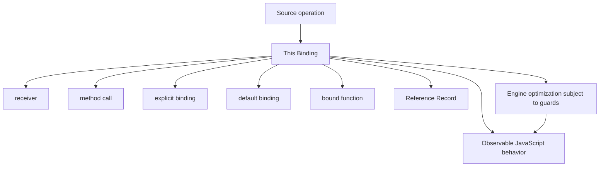
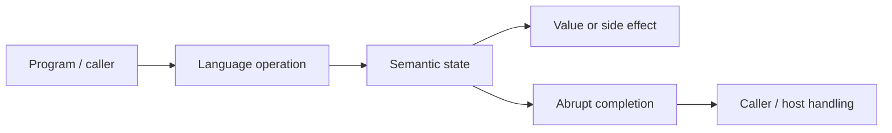
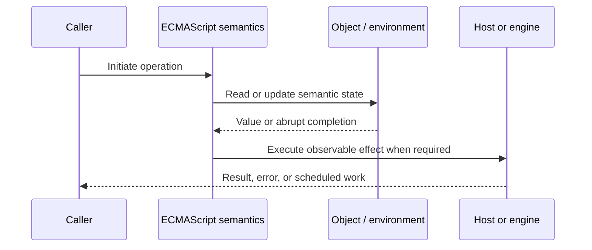
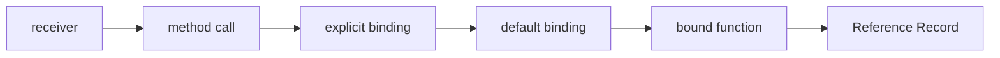

# This Binding

## Overview

For ordinary functions, `this` is an invocation-time receiver selected by the call form. It is not lexical scope and is not permanently owned by the object where a function happens to be stored.

This note separates the ECMAScript language model from engine implementation choices and host behavior. That distinction matters: specification algorithms define correctness, while engines remain free to optimize as long as observable behavior is preserved.

## Learning Objectives

- Define receiver and distinguish it from method call
- Trace explicit binding through the relevant ECMAScript operations
- Predict edge cases without relying on engine folklore
- Evaluate memory, performance, security, and API-design trade-offs
- Apply the mechanism safely in production JavaScript

## Prerequisites

- [[01-Computer-Science/00-Orientation/How Computers Run Programs|How Computers Run Programs]]
- [[01-Computer-Science/03-Memory-and-Addressing/Stack and Heap|Stack and Heap]]
- [[01-Computer-Science/03-Memory-and-Addressing/Garbage Collection Models|Garbage Collection Models]]
- [[02-JavaScript/README|JavaScript]]

## Difficulty

`advanced`

## Estimated Time

90–120 minutes for reading and examples; 2–4 hours for exercises and the mini project.

## History

JavaScript adopted receiver-based method calls from object-oriented languages while retaining freely movable functions. The resulting dynamic binding supports delegation but requires exact reasoning about Reference Records and call sites.

## Problem It Solves

Misbound receivers cause production failures when methods cross callback, timer, event, RPC, or decorator boundaries; strict mode makes these failures more visible by preserving `undefined`.

## First-Principles Model

1. `obj.method()` supplies `obj` as the receiver because property access produces a reference with a base value.
2. Extracting `const fn = obj.method; fn()` loses that base and uses default binding.
3. Strict ordinary calls receive `undefined`; sloppy calls substitute the global object and box primitives.
4. `call` and `apply` invoke immediately with an explicit receiver.
5. `bind` creates a new function that remembers a receiver and optional leading arguments.
6. Constructor invocation with `new` supplies the newly created object and ignores a bound `this` value.
7. Arrow functions do not define their own `this`; they read it from an enclosing lexical context.
8. `super` uses a method's `[[HomeObject]]`, not the dynamic value of `this`, to start method lookup.

The useful debugging question is not “what does JavaScript usually do?” but “which abstract operation runs, what state does it read, and what observable result follows?” This framing survives minification, transpilation, optimization, and framework changes.

## Internal Implementation

- Evaluation of a property call preserves a Reference Record until `EvaluateCall` derives `thisValue`.
- Function environment records track whether `this` is lexical, initialized, or derived-constructor-uninitialized.
- Derived constructors cannot access `this` before `super()` initializes it.
- Bound function exotic objects store `[[BoundTargetFunction]]`, `[[BoundThis]]`, and `[[BoundArguments]]`.
- Host callbacks may define receiver conventions; browser listeners commonly set `this` to `currentTarget` for ordinary functions.

These are semantic obligations rather than a mandate for a specific physical representation. Connect them to [[01-Computer-Science/08-Languages-and-Computation/Compilers Interpreters and Virtual Machines|Compilers Interpreters and Virtual Machines]], [[01-Computer-Science/03-Memory-and-Addressing/Stack and Heap|Stack and Heap]], and [[01-Computer-Science/03-Memory-and-Addressing/Garbage Collection Models|Garbage Collection Models]]: optimized code may use registers, native frames, compact tables, or heap contexts while preserving the same language-level result.



## Mermaid Diagrams

### Structure



### Sequence / Lifecycle



### Mechanism Detail



## Examples

### Minimal Example

```js
const account = {
  balance: 10,
  read() { return this.balance; }
};

console.log(account.read()); // 10
const read = account.read;
console.log(read()); // undefined in modules/strict mode
```

Trace this example before running it. Record binding/receiver/property state at each line, then compare the trace with the actual output.

### Production-Shaped Example

```js
export function createHandler(service, logger) {
  return {
    async handle(request) {
      try {
        return await service.execute(request);
      } catch (error) {
        logger.error({ error, requestId: request.id }, "request.failed");
        throw error;
      }
    }
  };
}

const handler = createHandler(service, logger);
router.post("/jobs", handler.handle.bind(handler));
```

The production-shaped version validates assumptions, gives failures domain context, and makes lifecycle behavior visible. It still needs tests for malformed input and whichever host runtime deploys it.

## Trade-offs

| Approach | Upside | Downside | When it matters |
| --- | --- | --- | --- |
| Dynamic receiver | One method serves many objects | Call-site fragility | Prototype delegation |
| Bound method | Stable callback receiver | Allocates identity-changing wrapper | Boundary adapters |
| Closure/arrow | Lexical dependencies are explicit | Cannot be rebound | Callback-oriented APIs |

No choice is universally best. Prefer the simplest mechanism that preserves the required semantics, then measure memory and latency under representative workload rather than microbenchmarks alone.

### When to Use

- Use the mechanism when its semantics directly express a stable domain or lifecycle requirement.
- Use it when tests can cover both normal and abrupt completion paths.
- Use it when maintainers can observe and debug the resulting state transitions.

### When Not to Use

- Do not use a clever language feature merely to reduce line count.
- Avoid it when an explicit data structure or named function communicates ownership better.
- Do not depend on undocumented engine optimization behavior for correctness.

## Performance, Memory, and Security

- **Allocation:** Determine whether the pattern creates per-call objects, closures, wrappers, or collections.
- **Reachability:** Long-lived listeners, caches, registries, and suspended computations can retain an entire object graph.
- **Optimization:** Stable shapes and call sites help engines, but optimization tiers and heuristics are not API contracts.
- **Input limits:** Bound depth, size, key count, and work when values cross a trust boundary.
- **Side effects:** Getters, proxies, iterators, coercion hooks, and callbacks can run user code inside apparently simple syntax.
- **Observability:** Emit domain events and timings; never parse engine-specific stack text as a primary protocol.

## Production Practices

- Choose receiver-based or closure-based APIs deliberately.
- Bind once and retain the bound identity.
- Use strict mode or modules.
- Avoid ambient global receiver behavior.
- Test methods when detached from their object.
- Prefer explicit dependencies in service code.

At public boundaries, validate first, normalize once, and construct trusted domain values only after validation. Keep errors actionable without logging secrets or entire retained object graphs.

## Exercises

1. Predict the observable result of five edge cases involving **receiver**, then verify them in two engines.
2. Instrument a small example to expose **method call** and explain every transition from specification operations.
3. Write table-driven tests for the listed common mistakes, including strict-mode and module execution.
4. Compare the first trade-off alternatives with a benchmark and a maintainability review; do not optimize from timing alone.
5. Extend the relevant exercise in [[02-JavaScript/code/README|JavaScript code labs]] with malformed, adversarial, and high-volume inputs.

For every exercise, include tests for success, malformed input, abrupt completion, and cleanup. Explain observed results from first principles rather than merely recording them.

## Mini Project

Implement a `myBind` approximation covering partial arguments, method calls, constructor calls, and returned-object constructors.

Required deliverables: implementation, automated tests, a Mermaid lifecycle diagram, benchmark methodology, and a short failure-mode analysis.

## Portfolio Project

Build a callback adapter library that preserves identity, receiver, cancellation, error causes, and listener teardown across host APIs.

Package it with a stable API, examples, generated documentation, CI checks, changelog discipline, and a production-readiness section covering limits and observability.

## Interview Questions

1. How is `this` chosen for `obj.m()`?
2. What changes when `m` is extracted?
3. How do `call`, `apply`, and `bind` differ?
4. What happens to bound `this` under `new`?
5. Why is `super` not merely `Object.getPrototypeOf(this)`?
6. How do browser event receiver conventions affect cleanup?

### Stretch / Staff-Level

1. Design a migration from a codebase that misuses receiver; include compatibility, telemetry, staged rollout, and rollback.
2. Explain which guarantees belong to ECMAScript, which are engine heuristics, and which belong to the browser or Node.js host.
3. Describe a production incident involving this mechanism and the evidence you would collect before proposing a fix.

Strong answers name the controlling abstract operations, distinguish identity from equality or ownership, discuss abrupt completion, and state operational limits.

## Common Mistakes

- **Saying `this` refers to the function's owner.** Reproduce this case in a focused test before relying on intuition.
- **Passing an unbound method as a callback.** Reproduce this case in a focused test before relying on intuition.
- **Using arrows as prototype methods that need dynamic receivers.** Reproduce this case in a focused test before relying on intuition.
- **Removing a listener with a newly bound function.** Reproduce this case in a focused test before relying on intuition.
- **Accessing `this` before `super()` in a derived constructor.** Reproduce this case in a focused test before relying on intuition.

## Best Practices

- Choose receiver-based or closure-based APIs deliberately.
- Bind once and retain the bound identity.
- Use strict mode or modules.
- Avoid ambient global receiver behavior.
- Test methods when detached from their object.
- Prefer explicit dependencies in service code.

## Summary

For ordinary functions, `this` is an invocation-time receiver selected by the call form. It is not lexical scope and is not permanently owned by the object where a function happens to be stored. The production rule is to model the semantics precisely, constrain untrusted work, make ownership and cleanup explicit, and treat engine optimization as measured implementation behavior rather than a language guarantee.

## Further Reading

- [ECMAScript Language Specification](https://tc39.es/ecma262/)
- [MDN JavaScript Guide](https://developer.mozilla.org/docs/Web/JavaScript/Guide)
- [[00-References/JavaScript/README|JavaScript References]]
- [[02-JavaScript/code/README|JavaScript code labs]]

## Related Notes

- [[02-JavaScript/02-Execution-and-Functions/Arrow Functions|Arrow Functions]]
- [[02-JavaScript/03-Objects-and-Metaprogramming/Prototype Chain and Delegation|Prototype Chain and Delegation]]
- [[02-JavaScript/code/README|JavaScript code labs]]
- [[01-Computer-Science/00-Orientation/How Computers Run Programs|How Computers Run Programs]]

## Progress Checklist

- [ ] Explained the mechanism from first principles
- [ ] Drew and narrated every Mermaid diagram
- [ ] Predicted the minimal example before executing it
- [ ] Implemented malformed and adversarial tests
- [ ] Documented performance, memory, security, and non-goals
- [ ] Completed the mini project
- [ ] Practiced interview questions aloud
- [ ] Linked prerequisites and dependent topics
