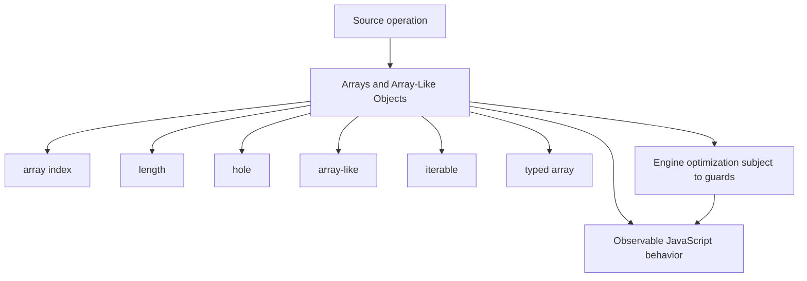
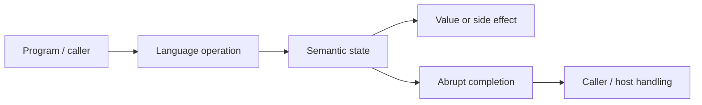
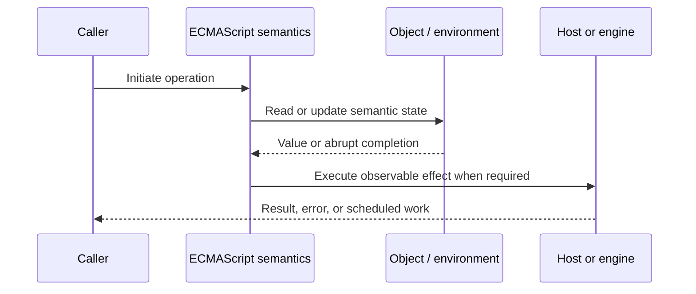
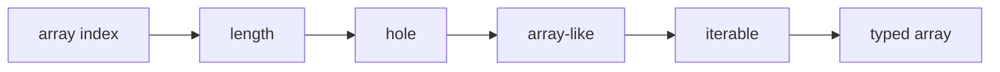

# Arrays and Array-Like Objects

## Overview

Arrays are exotic objects whose indexed properties interact with a special `length` property. Array-like objects merely expose indexed keys and length; iterables instead expose a protocol for producing values.

This note separates the ECMAScript language model from engine implementation choices and host behavior. That distinction matters: specification algorithms define correctness, while engines remain free to optimize as long as observable behavior is preserved.

## Learning Objectives

- Define array index and distinguish it from length
- Trace hole through the relevant ECMAScript operations
- Predict edge cases without relying on engine folklore
- Evaluate memory, performance, security, and API-design trade-offs
- Apply the mechanism safely in production JavaScript

## Prerequisites

- [[01-Computer-Science/00-Orientation/How Computers Run Programs|How Computers Run Programs]]
- [[01-Computer-Science/03-Memory-and-Addressing/Stack and Heap|Stack and Heap]]
- [[01-Computer-Science/03-Memory-and-Addressing/Garbage Collection Models|Garbage Collection Models]]
- [[02-JavaScript/README|JavaScript]]

## Difficulty

`advanced`

## Estimated Time

90–120 minutes for reading and examples; 2–4 hours for exercises and the mini project.

## History

JavaScript arrays combined object flexibility with list ergonomics. Typed arrays and iterable protocols later separated dense binary storage and traversal from the ordinary Array object model.

## Problem It Solves

Production code must account for holes, mutation during iteration, species behavior, argument limits, and the difference between generic array methods and iterable conversion.

## First-Principles Model

1. An array index is a canonical string key in the range `0` through `2^32 - 2`.
2. Setting an index at or beyond current length increases `length`.
3. Reducing `length` deletes indexed properties at or above the new value and can fail on non-configurable elements.
4. A hole is an absent property, not a property whose value is `undefined`.
5. Many callbacks such as `map` skip holes, while iteration and spread produce `undefined` for them.
6. `Array.from` accepts iterables or array-like values and creates a dense result.
7. Many `Array.prototype` methods are generic and can operate on array-like receivers.
8. Typed arrays are fixed-length views over binary buffers with different indexed-property semantics.

The useful debugging question is not “what does JavaScript usually do?” but “which abstract operation runs, what state does it read, and what observable result follows?” This framing survives minification, transpilation, optimization, and framework changes.

## Internal Implementation

- Array `[[DefineOwnProperty]]` implements length coupling and deletion rules.
- Engines often use packed versus holey element representations and specialize element kinds.
- Sparse or mixed-type arrays may transition to slower representations, but correctness must not depend on engine heuristics.
- Array methods snapshot or re-read length according to each algorithm; mutation can affect later visits.
- `Array.isArray` performs an internal brand test and works across realms unlike `instanceof Array`.

These are semantic obligations rather than a mandate for a specific physical representation. Connect them to [[01-Computer-Science/08-Languages-and-Computation/Compilers Interpreters and Virtual Machines|Compilers Interpreters and Virtual Machines]], [[01-Computer-Science/03-Memory-and-Addressing/Stack and Heap|Stack and Heap]], and [[01-Computer-Science/03-Memory-and-Addressing/Garbage Collection Models|Garbage Collection Models]]: optimized code may use registers, native frames, compact tables, or heap contexts while preserving the same language-level result.



## Mermaid Diagrams

### Structure



### Sequence / Lifecycle



### Mechanism Detail



## Examples

### Minimal Example

```js
const sparse = [1, , 3];
console.log(1 in sparse); // false
console.log(sparse.map(String)); // ["1", empty, "3"]
console.log([...sparse]); // [1, undefined, 3]
```

Trace this example before running it. Record binding/receiver/property state at each line, then compare the trace with the actual output.

### Production-Shaped Example

```js
export function chunk(iterable, size) {
  if (!Number.isInteger(size) || size <= 0) throw new RangeError("size");
  const chunks = [];
  let current = [];
  for (const value of iterable) {
    current.push(value);
    if (current.length === size) {
      chunks.push(current);
      current = [];
    }
  }
  if (current.length) chunks.push(current);
  return chunks;
}
```

The production-shaped version validates assumptions, gives failures domain context, and makes lifecycle behavior visible. It still needs tests for malformed input and whichever host runtime deploys it.

## Trade-offs

| Approach | Upside | Downside | When it matters |
| --- | --- | --- | --- |
| Array | Rich APIs and dynamic length | Holes/mutation semantics | In-memory ordered values |
| Typed array | Compact binary numeric storage | Fixed element type and length | Buffers, media, protocols |
| Iterable | Can be lazy and unbounded | No random access guarantee | Pipelines and streams |

No choice is universally best. Prefer the simplest mechanism that preserves the required semantics, then measure memory and latency under representative workload rather than microbenchmarks alone.

### When to Use

- Use the mechanism when its semantics directly express a stable domain or lifecycle requirement.
- Use it when tests can cover both normal and abrupt completion paths.
- Use it when maintainers can observe and debug the resulting state transitions.

### When Not to Use

- Do not use a clever language feature merely to reduce line count.
- Avoid it when an explicit data structure or named function communicates ownership better.
- Do not depend on undocumented engine optimization behavior for correctness.

## Performance, Memory, and Security

- **Allocation:** Determine whether the pattern creates per-call objects, closures, wrappers, or collections.
- **Reachability:** Long-lived listeners, caches, registries, and suspended computations can retain an entire object graph.
- **Optimization:** Stable shapes and call sites help engines, but optimization tiers and heuristics are not API contracts.
- **Input limits:** Bound depth, size, key count, and work when values cross a trust boundary.
- **Side effects:** Getters, proxies, iterators, coercion hooks, and callbacks can run user code inside apparently simple syntax.
- **Observability:** Emit domain events and timings; never parse engine-specific stack text as a primary protocol.

## Production Practices

- Use `splice` for removal that should shift elements.
- Prefer dense arrays in normal application data.
- Use `Array.isArray` for validation.
- Iterate unbounded sources instead of materializing.
- Copy before mutation when callers may share the array.
- Use typed arrays for binary representation, not ordinary records.

At public boundaries, validate first, normalize once, and construct trusted domain values only after validation. Keep errors actionable without logging secrets or entire retained object graphs.

## Exercises

1. Predict the observable result of five edge cases involving **array index**, then verify them in two engines.
2. Instrument a small example to expose **length** and explain every transition from specification operations.
3. Write table-driven tests for the listed common mistakes, including strict-mode and module execution.
4. Compare the first trade-off alternatives with a benchmark and a maintainability review; do not optimize from timing alone.
5. Extend the relevant exercise in [[02-JavaScript/code/README|JavaScript code labs]] with malformed, adversarial, and high-volume inputs.

For every exercise, include tests for success, malformed input, abrupt completion, and cleanup. Explain observed results from first principles rather than merely recording them.

## Mini Project

Create a matrix runner comparing holes across `map`, `forEach`, `for...of`, spread, JSON, and `Object.keys`.

Required deliverables: implementation, automated tests, a Mermaid lifecycle diagram, benchmark methodology, and a short failure-mode analysis.

## Portfolio Project

Build a bounded batch-processing library accepting iterables, preserving order, reporting backpressure, and avoiding giant materializations.

Package it with a stable API, examples, generated documentation, CI checks, changelog discipline, and a production-readiness section covering limits and observability.

## Interview Questions

1. How does `length` constrain indexed properties?
2. What observable differences distinguish holes?
3. How do array-like and iterable values differ?
4. Why is `Array.isArray` cross-realm safe?
5. What happens when length shrinks past non-configurable elements?
6. When should a typed array be preferred?

### Stretch / Staff-Level

1. Design a migration from a codebase that misuses array index; include compatibility, telemetry, staged rollout, and rollback.
2. Explain which guarantees belong to ECMAScript, which are engine heuristics, and which belong to the browser or Node.js host.
3. Describe a production incident involving this mechanism and the evidence you would collect before proposing a fix.

Strong answers name the controlling abstract operations, distinguish identity from equality or ownership, discuss abrupt completion, and state operational limits.

## Common Mistakes

- **Using `delete arr[i]` when compaction is intended.** Reproduce this case in a focused test before relying on intuition.
- **Equating holes with `undefined`.** Reproduce this case in a focused test before relying on intuition.
- **Using `instanceof Array` across realms.** Reproduce this case in a focused test before relying on intuition.
- **Spreading huge arrays into calls.** Reproduce this case in a focused test before relying on intuition.
- **Mutating an array during callback iteration without specified intent.** Reproduce this case in a focused test before relying on intuition.

## Best Practices

- Use `splice` for removal that should shift elements.
- Prefer dense arrays in normal application data.
- Use `Array.isArray` for validation.
- Iterate unbounded sources instead of materializing.
- Copy before mutation when callers may share the array.
- Use typed arrays for binary representation, not ordinary records.

## Summary

Arrays are exotic objects whose indexed properties interact with a special `length` property. Array-like objects merely expose indexed keys and length; iterables instead expose a protocol for producing values. The production rule is to model the semantics precisely, constrain untrusted work, make ownership and cleanup explicit, and treat engine optimization as measured implementation behavior rather than a language guarantee.

## Further Reading

- [ECMAScript Language Specification](https://tc39.es/ecma262/)
- [MDN JavaScript Guide](https://developer.mozilla.org/docs/Web/JavaScript/Guide)
- [[00-References/JavaScript/README|JavaScript References]]
- [[02-JavaScript/code/README|JavaScript code labs]]

## Related Notes

- [[02-JavaScript/03-Objects-and-Metaprogramming/Iterators and Generators|Iterators and Generators]]
- [[01-Computer-Science/03-Memory-and-Addressing/Stack and Heap|Stack and Heap]]
- [[02-JavaScript/code/README|JavaScript code labs]]
- [[01-Computer-Science/00-Orientation/How Computers Run Programs|How Computers Run Programs]]

## Progress Checklist

- [ ] Explained the mechanism from first principles
- [ ] Drew and narrated every Mermaid diagram
- [ ] Predicted the minimal example before executing it
- [ ] Implemented malformed and adversarial tests
- [ ] Documented performance, memory, security, and non-goals
- [ ] Completed the mini project
- [ ] Practiced interview questions aloud
- [ ] Linked prerequisites and dependent topics
