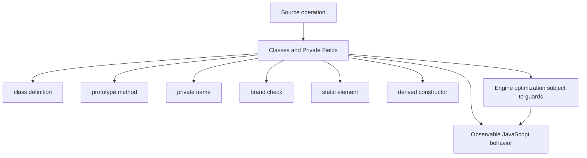
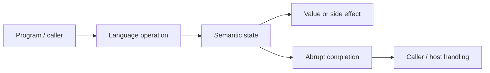
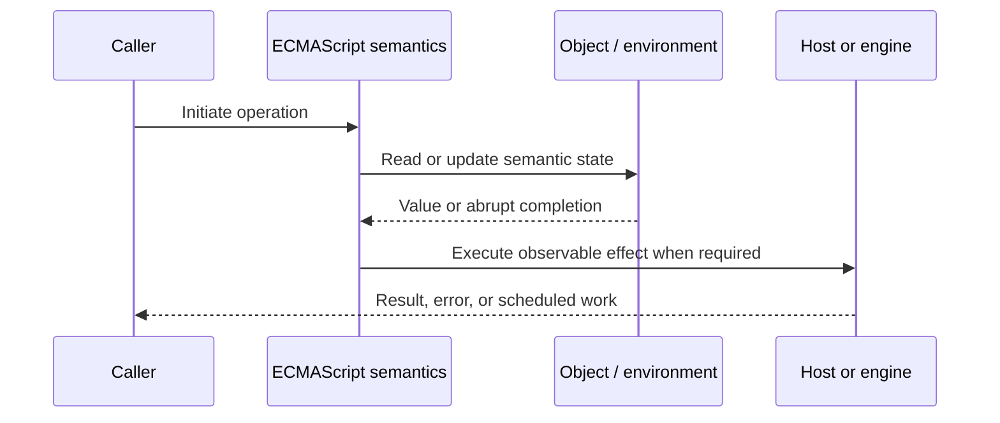
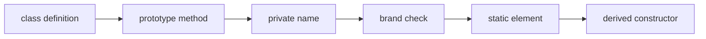

# Classes and Private Fields

## Overview

JavaScript classes are specialized syntax and semantics over constructors and prototype delegation. Private fields use lexically scoped private names and branded internal slots; they are not ordinary properties.

This note separates the ECMAScript language model from engine implementation choices and host behavior. That distinction matters: specification algorithms define correctness, while engines remain free to optimize as long as observable behavior is preserved.

## Learning Objectives

- Define class definition and distinguish it from prototype method
- Trace private name through the relevant ECMAScript operations
- Predict edge cases without relying on engine folklore
- Evaluate memory, performance, security, and API-design trade-offs
- Apply the mechanism safely in production JavaScript

## Prerequisites

- [[01-Computer-Science/00-Orientation/How Computers Run Programs|How Computers Run Programs]]
- [[01-Computer-Science/03-Memory-and-Addressing/Stack and Heap|Stack and Heap]]
- [[01-Computer-Science/03-Memory-and-Addressing/Garbage Collection Models|Garbage Collection Models]]
- [[02-JavaScript/README|JavaScript]]

## Difficulty

`advanced`

## Estimated Time

90–120 minutes for reading and examples; 2–4 hours for exercises and the mini project.

## History

ES2015 classes offered strict, non-callable-without-new declarations and clearer inheritance. Private fields later supplied enforceable encapsulation that naming conventions and Symbols could not provide.

## Problem It Solves

Classes organize stable instance behavior, but deep inheritance, receiver loss, private-brand failures, and per-instance field allocations can complicate production systems.

## First-Principles Model

1. Class bodies always run in strict mode and class declarations have TDZ behavior.
2. Prototype methods are non-enumerable and shared across instances.
3. Public field initializers define own properties on each instance.
4. Private fields are identified by lexical private names and cannot be accessed with bracket notation.
5. Accessing a private field on an unbranded receiver throws `TypeError`.
6. Derived constructors must call `super()` before accessing `this` or returning normally.
7. Static fields belong to the constructor; static private fields use the declaring class's brand.
8. Subclassing extends prototype and constructor chains but does not make parent private names directly accessible.

The useful debugging question is not “what does JavaScript usually do?” but “which abstract operation runs, what state does it read, and what observable result follows?” This framing survives minification, transpilation, optimization, and framework changes.

## Internal Implementation

- Class evaluation creates a constructor function and associated prototype object.
- Private elements are installed into an object's internal private-element collection during initialization.
- A proxy wrapping an instance is not automatically branded for the target's private fields.
- Method `[[HomeObject]]` enables `super` lookup even when a method is moved.
- Field initialization order matters: base fields before base body completion; derived fields after `super()` returns.

These are semantic obligations rather than a mandate for a specific physical representation. Connect them to [[01-Computer-Science/08-Languages-and-Computation/Compilers Interpreters and Virtual Machines|Compilers Interpreters and Virtual Machines]], [[01-Computer-Science/03-Memory-and-Addressing/Stack and Heap|Stack and Heap]], and [[01-Computer-Science/03-Memory-and-Addressing/Garbage Collection Models|Garbage Collection Models]]: optimized code may use registers, native frames, compact tables, or heap contexts while preserving the same language-level result.



## Mermaid Diagrams

### Structure



### Sequence / Lifecycle



### Mechanism Detail



## Examples

### Minimal Example

```js
class Counter {
  #value = 0;

  increment() {
    this.#value += 1;
    return this.#value;
  }
}

console.log(new Counter().increment()); // 1
```

Trace this example before running it. Record binding/receiver/property state at each line, then compare the trace with the actual output.

### Production-Shaped Example

```js
export class ConnectionPool {
  #available = [];
  #closed = false;

  acquire() {
    if (this.#closed) throw new Error("pool is closed");
    const connection = this.#available.pop();
    if (!connection) throw new Error("pool exhausted");
    return connection;
  }

  release(connection) {
    if (this.#closed) return connection.close();
    this.#available.push(connection);
  }

  close() { this.#closed = true; }
}
```

The production-shaped version validates assumptions, gives failures domain context, and makes lifecycle behavior visible. It still needs tests for malformed input and whichever host runtime deploys it.

## Trade-offs

| Approach | Upside | Downside | When it matters |
| --- | --- | --- | --- |
| Private fields | Language-enforced encapsulation | Proxy/mocking friction | Critical invariants |
| Closure privacy | Narrow capabilities without receiver brands | Methods often duplicated per factory | Factory APIs |
| Inheritance | Shares a coherent protocol | Tight coupling and fragile base classes | True substitutable hierarchies |

No choice is universally best. Prefer the simplest mechanism that preserves the required semantics, then measure memory and latency under representative workload rather than microbenchmarks alone.

### When to Use

- Use the mechanism when its semantics directly express a stable domain or lifecycle requirement.
- Use it when tests can cover both normal and abrupt completion paths.
- Use it when maintainers can observe and debug the resulting state transitions.

### When Not to Use

- Do not use a clever language feature merely to reduce line count.
- Avoid it when an explicit data structure or named function communicates ownership better.
- Do not depend on undocumented engine optimization behavior for correctness.

## Performance, Memory, and Security

- **Allocation:** Determine whether the pattern creates per-call objects, closures, wrappers, or collections.
- **Reachability:** Long-lived listeners, caches, registries, and suspended computations can retain an entire object graph.
- **Optimization:** Stable shapes and call sites help engines, but optimization tiers and heuristics are not API contracts.
- **Input limits:** Bound depth, size, key count, and work when values cross a trust boundary.
- **Side effects:** Getters, proxies, iterators, coercion hooks, and callbacks can run user code inside apparently simple syntax.
- **Observability:** Emit domain events and timings; never parse engine-specific stack text as a primary protocol.

## Production Practices

- Keep inheritance shallow.
- Use private fields for invariants, not every implementation detail.
- Bind or adapt methods at callback boundaries.
- Prefer composition for independent capabilities.
- Define cleanup protocols explicitly.
- Test subclass substitutability rather than only happy paths.

At public boundaries, validate first, normalize once, and construct trusted domain values only after validation. Keep errors actionable without logging secrets or entire retained object graphs.

## Exercises

1. Predict the observable result of five edge cases involving **class definition**, then verify them in two engines.
2. Instrument a small example to expose **prototype method** and explain every transition from specification operations.
3. Write table-driven tests for the listed common mistakes, including strict-mode and module execution.
4. Compare the first trade-off alternatives with a benchmark and a maintainability review; do not optimize from timing alone.
5. Extend the relevant exercise in [[02-JavaScript/code/README|JavaScript code labs]] with malformed, adversarial, and high-volume inputs.

For every exercise, include tests for success, malformed input, abrupt completion, and cleanup. Explain observed results from first principles rather than merely recording them.

## Mini Project

Implement equivalent counter APIs with public fields, Symbols, WeakMap, closure state, and private fields; compare reflection and ergonomics.

Required deliverables: implementation, automated tests, a Mermaid lifecycle diagram, benchmark methodology, and a short failure-mode analysis.

## Portfolio Project

Build a resource pool with private invariants, async acquisition, cancellation, leak detection, metrics, and deterministic shutdown.

Package it with a stable API, examples, generated documentation, CI checks, changelog discipline, and a production-readiness section covering limits and observability.

## Interview Questions

1. How are classes more than syntax sugar?
2. How do private brands work?
3. Why can a proxy fail private-field access?
4. When are instance fields initialized?
5. How does `super` find a parent method?
6. When should closure privacy beat private fields?

### Stretch / Staff-Level

1. Design a migration from a codebase that misuses class definition; include compatibility, telemetry, staged rollout, and rollback.
2. Explain which guarantees belong to ECMAScript, which are engine heuristics, and which belong to the browser or Node.js host.
3. Describe a production incident involving this mechanism and the evidence you would collect before proposing a fix.

Strong answers name the controlling abstract operations, distinguish identity from equality or ownership, discuss abrupt completion, and state operational limits.

## Common Mistakes

- **Calling an extracted method that accesses private state.** Reproduce this case in a focused test before relying on intuition.
- **Expecting `proxy.#field` to forward.** Reproduce this case in a focused test before relying on intuition.
- **Using inheritance only for code reuse.** Reproduce this case in a focused test before relying on intuition.
- **Returning before `super()` in a derived constructor.** Reproduce this case in a focused test before relying on intuition.
- **Assuming `#private` data is cryptographic secrecy.** Reproduce this case in a focused test before relying on intuition.

## Best Practices

- Keep inheritance shallow.
- Use private fields for invariants, not every implementation detail.
- Bind or adapt methods at callback boundaries.
- Prefer composition for independent capabilities.
- Define cleanup protocols explicitly.
- Test subclass substitutability rather than only happy paths.

## Summary

JavaScript classes are specialized syntax and semantics over constructors and prototype delegation. Private fields use lexically scoped private names and branded internal slots; they are not ordinary properties. The production rule is to model the semantics precisely, constrain untrusted work, make ownership and cleanup explicit, and treat engine optimization as measured implementation behavior rather than a language guarantee.

## Further Reading

- [ECMAScript Language Specification](https://tc39.es/ecma262/)
- [MDN JavaScript Guide](https://developer.mozilla.org/docs/Web/JavaScript/Guide)
- [[00-References/JavaScript/README|JavaScript References]]
- [[02-JavaScript/code/README|JavaScript code labs]]

## Related Notes

- [[02-JavaScript/03-Objects-and-Metaprogramming/Prototype Chain and Delegation|Prototype Chain and Delegation]]
- [[01-Computer-Science/03-Memory-and-Addressing/Garbage Collection Models|Garbage Collection Models]]
- [[02-JavaScript/code/README|JavaScript code labs]]
- [[01-Computer-Science/00-Orientation/How Computers Run Programs|How Computers Run Programs]]

## Progress Checklist

- [ ] Explained the mechanism from first principles
- [ ] Drew and narrated every Mermaid diagram
- [ ] Predicted the minimal example before executing it
- [ ] Implemented malformed and adversarial tests
- [ ] Documented performance, memory, security, and non-goals
- [ ] Completed the mini project
- [ ] Practiced interview questions aloud
- [ ] Linked prerequisites and dependent topics
