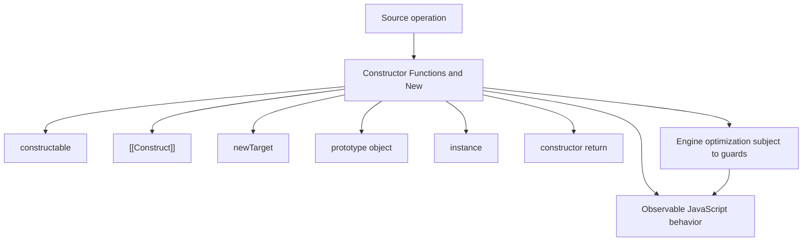
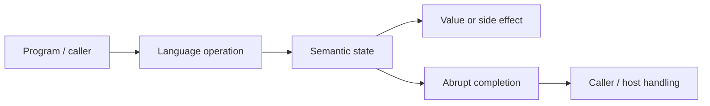
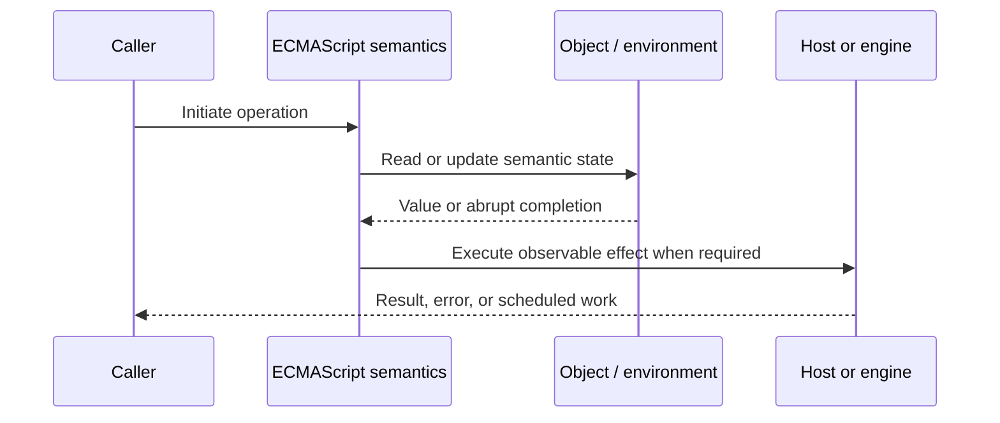
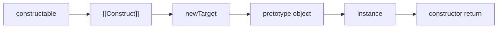

# Constructor Functions and New

## Overview

A constructable function has internal `[[Construct]]` behavior. `new F(args)` creates a candidate object, links it to `F.prototype`, invokes `F` with that object as `this`, and returns either the constructor's explicit object result or the candidate.

This note separates the ECMAScript language model from engine implementation choices and host behavior. That distinction matters: specification algorithms define correctness, while engines remain free to optimize as long as observable behavior is preserved.

## Learning Objectives

- Define constructable and distinguish it from [[Construct]]
- Trace newTarget through the relevant ECMAScript operations
- Predict edge cases without relying on engine folklore
- Evaluate memory, performance, security, and API-design trade-offs
- Apply the mechanism safely in production JavaScript

## Prerequisites

- [[01-Computer-Science/00-Orientation/How Computers Run Programs|How Computers Run Programs]]
- [[01-Computer-Science/03-Memory-and-Addressing/Stack and Heap|Stack and Heap]]
- [[01-Computer-Science/03-Memory-and-Addressing/Garbage Collection Models|Garbage Collection Models]]
- [[02-JavaScript/README|JavaScript]]

## Difficulty

`advanced`

## Estimated Time

90–120 minutes for reading and examples; 2–4 hours for exercises and the mini project.

## History

Constructor functions gave JavaScript a conventional instance factory while preserving prototype delegation. ES2015 classes standardized and restricted the pattern rather than replacing its mechanics.

## Problem It Solves

Understanding `new` prevents incorrect factories, missing-new bugs, prototype replacement surprises, and faulty attempts to reproduce construction or subclassing.

## First-Principles Model

1. Not every callable is constructable: arrows and concise methods lack `[[Construct]]`.
2. The instance prototype comes from `GetPrototypeFromConstructor(newTarget, ...)`.
3. A base constructor's explicit object return replaces the candidate; a primitive return is ignored.
4. Calling a legacy constructor without `new` performs an ordinary call and can misbind `this`.
5. Functions expose a `.prototype` object by convention for future instances; existing instances keep their current link.
6. Replacing `F.prototype` affects only subsequently created instances.
7. `new.target` identifies the constructor through which construction began.
8. `Reflect.construct(Target, args, NewTarget)` exposes construction with a separate prototype source.

The useful debugging question is not “what does JavaScript usually do?” but “which abstract operation runs, what state does it read, and what observable result follows?” This framing survives minification, transpilation, optimization, and framework changes.

## Internal Implementation

- `[[Construct]]` creates an ordinary object before invoking a base constructor.
- Derived class constructors defer object creation to `super()` and cannot use `this` first.
- Constructor property lookup itself can invoke proxy traps or getters.
- Built-in subclassing may allocate specialized internal-slot-bearing objects that `Object.create` cannot emulate.
- JITs optimize stable constructor/prototype pairs and predictable instance property initialization order.

These are semantic obligations rather than a mandate for a specific physical representation. Connect them to [[01-Computer-Science/08-Languages-and-Computation/Compilers Interpreters and Virtual Machines|Compilers Interpreters and Virtual Machines]], [[01-Computer-Science/03-Memory-and-Addressing/Stack and Heap|Stack and Heap]], and [[01-Computer-Science/03-Memory-and-Addressing/Garbage Collection Models|Garbage Collection Models]]: optimized code may use registers, native frames, compact tables, or heap contexts while preserving the same language-level result.



## Mermaid Diagrams

### Structure



### Sequence / Lifecycle



### Mechanism Detail



## Examples

### Minimal Example

```js
function User(name) {
  this.name = name;
}
User.prototype.greet = function greet() {
  return `Hello, ${this.name}`;
};

const user = new User("Ada");
console.log(user.greet());
```

Trace this example before running it. Record binding/receiver/property state at each line, then compare the trace with the actual output.

### Production-Shaped Example

```js
export function Job(id, payload) {
  if (!new.target) return new Job(id, payload);
  if (typeof id !== "string") throw new TypeError("id must be a string");
  this.id = id;
  this.payload = payload;
  this.createdAt = Date.now();
}

Object.defineProperty(Job.prototype, "toJSON", {
  value() { return { id: this.id, payload: this.payload }; },
  enumerable: false
});
```

The production-shaped version validates assumptions, gives failures domain context, and makes lifecycle behavior visible. It still needs tests for malformed input and whichever host runtime deploys it.

## Trade-offs

| Approach | Upside | Downside | When it matters |
| --- | --- | --- | --- |
| Constructor function | Compatible with old runtimes/patterns | Can be called incorrectly | Legacy public APIs |
| Class | Enforces construction and clearer inheritance | Still has receiver/prototype complexity | New instance-oriented APIs |
| Factory | Controls returned shape and privacy | `instanceof` is less central | Composition-focused design |

No choice is universally best. Prefer the simplest mechanism that preserves the required semantics, then measure memory and latency under representative workload rather than microbenchmarks alone.

### When to Use

- Use the mechanism when its semantics directly express a stable domain or lifecycle requirement.
- Use it when tests can cover both normal and abrupt completion paths.
- Use it when maintainers can observe and debug the resulting state transitions.

### When Not to Use

- Do not use a clever language feature merely to reduce line count.
- Avoid it when an explicit data structure or named function communicates ownership better.
- Do not depend on undocumented engine optimization behavior for correctness.

## Performance, Memory, and Security

- **Allocation:** Determine whether the pattern creates per-call objects, closures, wrappers, or collections.
- **Reachability:** Long-lived listeners, caches, registries, and suspended computations can retain an entire object graph.
- **Optimization:** Stable shapes and call sites help engines, but optimization tiers and heuristics are not API contracts.
- **Input limits:** Bound depth, size, key count, and work when values cross a trust boundary.
- **Side effects:** Getters, proxies, iterators, coercion hooks, and callbacks can run user code inside apparently simple syntax.
- **Observability:** Emit domain events and timings; never parse engine-specific stack text as a primary protocol.

## Production Practices

- Prefer classes or factories for new APIs.
- Validate inputs before partially initializing an instance.
- Initialize fields in consistent order.
- Use `Reflect.construct` for metaprogramming.
- Avoid cross-realm `instanceof` as a validation boundary.
- Document whether callers must use `new`.

At public boundaries, validate first, normalize once, and construct trusted domain values only after validation. Keep errors actionable without logging secrets or entire retained object graphs.

## Exercises

1. Predict the observable result of five edge cases involving **constructable**, then verify them in two engines.
2. Instrument a small example to expose **[[Construct]]** and explain every transition from specification operations.
3. Write table-driven tests for the listed common mistakes, including strict-mode and module execution.
4. Compare the first trade-off alternatives with a benchmark and a maintainability review; do not optimize from timing alone.
5. Extend the relevant exercise in [[02-JavaScript/code/README|JavaScript code labs]] with malformed, adversarial, and high-volume inputs.

For every exercise, include tests for success, malformed input, abrupt completion, and cleanup. Explain observed results from first principles rather than merely recording them.

## Mini Project

Implement a `construct` helper with `Reflect.construct`, then test return overrides, bound constructors, proxies, and custom new targets.

Required deliverables: implementation, automated tests, a Mermaid lifecycle diagram, benchmark methodology, and a short failure-mode analysis.

## Portfolio Project

Build a factory/class/constructor interoperability lab with cross-realm tests, serialization, validation, and benchmarks.

Package it with a stable API, examples, generated documentation, CI checks, changelog discipline, and a production-readiness section covering limits and observability.

## Interview Questions

1. What steps does `new` perform?
2. What happens when a constructor returns an object?
3. How does `new.target` differ from the function name?
4. Why is an arrow non-constructable?
5. What does replacing `.prototype` change?
6. When is `Reflect.construct` necessary?

### Stretch / Staff-Level

1. Design a migration from a codebase that misuses constructable; include compatibility, telemetry, staged rollout, and rollback.
2. Explain which guarantees belong to ECMAScript, which are engine heuristics, and which belong to the browser or Node.js host.
3. Describe a production incident involving this mechanism and the evidence you would collect before proposing a fix.

Strong answers name the controlling abstract operations, distinguish identity from equality or ownership, discuss abrupt completion, and state operational limits.

## Common Mistakes

- **Writing `Object.create(F.prototype); F.apply(...)` as a complete `new` polyfill.** Reproduce this case in a focused test before relying on intuition.
- **Forgetting explicit object return semantics.** Reproduce this case in a focused test before relying on intuition.
- **Replacing `.prototype` and expecting old instances to change.** Reproduce this case in a focused test before relying on intuition.
- **Using arrows as constructors.** Reproduce this case in a focused test before relying on intuition.
- **Depending on `constructor` property as secure type proof.** Reproduce this case in a focused test before relying on intuition.

## Best Practices

- Prefer classes or factories for new APIs.
- Validate inputs before partially initializing an instance.
- Initialize fields in consistent order.
- Use `Reflect.construct` for metaprogramming.
- Avoid cross-realm `instanceof` as a validation boundary.
- Document whether callers must use `new`.

## Summary

A constructable function has internal `[[Construct]]` behavior. `new F(args)` creates a candidate object, links it to `F.prototype`, invokes `F` with that object as `this`, and returns either the constructor's explicit object result or the candidate. The production rule is to model the semantics precisely, constrain untrusted work, make ownership and cleanup explicit, and treat engine optimization as measured implementation behavior rather than a language guarantee.

## Further Reading

- [ECMAScript Language Specification](https://tc39.es/ecma262/)
- [MDN JavaScript Guide](https://developer.mozilla.org/docs/Web/JavaScript/Guide)
- [[00-References/JavaScript/README|JavaScript References]]
- [[02-JavaScript/code/README|JavaScript code labs]]

## Related Notes

- [[02-JavaScript/03-Objects-and-Metaprogramming/Classes and Private Fields|Classes and Private Fields]]
- [[02-JavaScript/03-Objects-and-Metaprogramming/Prototype Chain and Delegation|Prototype Chain and Delegation]]
- [[02-JavaScript/code/README|JavaScript code labs]]
- [[01-Computer-Science/00-Orientation/How Computers Run Programs|How Computers Run Programs]]

## Progress Checklist

- [ ] Explained the mechanism from first principles
- [ ] Drew and narrated every Mermaid diagram
- [ ] Predicted the minimal example before executing it
- [ ] Implemented malformed and adversarial tests
- [ ] Documented performance, memory, security, and non-goals
- [ ] Completed the mini project
- [ ] Practiced interview questions aloud
- [ ] Linked prerequisites and dependent topics
