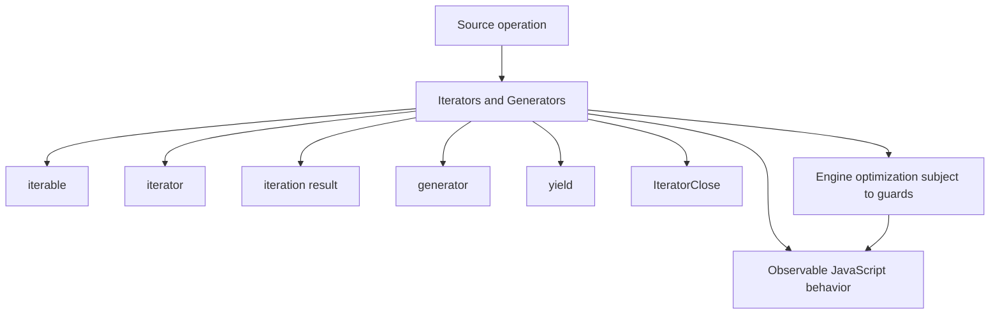
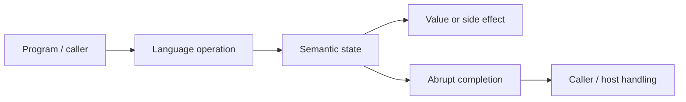
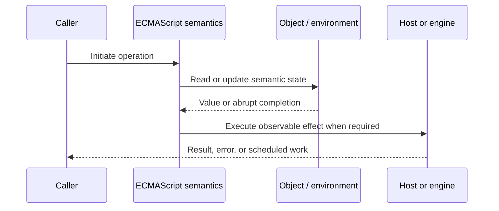
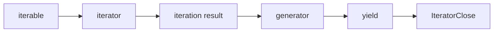

# Iterators and Generators

## Overview

An iterable supplies an iterator through `Symbol.iterator`; an iterator's `next()` returns `{ value, done }`. Generators are suspendable functions that implement both sides of this protocol with resumable execution state.

This note separates the ECMAScript language model from engine implementation choices and host behavior. That distinction matters: specification algorithms define correctness, while engines remain free to optimize as long as observable behavior is preserved.

## Learning Objectives

- Define iterable and distinguish it from iterator
- Trace iteration result through the relevant ECMAScript operations
- Predict edge cases without relying on engine folklore
- Evaluate memory, performance, security, and API-design trade-offs
- Apply the mechanism safely in production JavaScript

## Prerequisites

- [[01-Computer-Science/00-Orientation/How Computers Run Programs|How Computers Run Programs]]
- [[01-Computer-Science/03-Memory-and-Addressing/Stack and Heap|Stack and Heap]]
- [[01-Computer-Science/03-Memory-and-Addressing/Garbage Collection Models|Garbage Collection Models]]
- [[02-JavaScript/README|JavaScript]]

## Difficulty

`advanced`

## Estimated Time

90–120 minutes for reading and examples; 2–4 hours for exercises and the mini project.

## History

ES2015 standardized traversal independently of collection shape, enabling `for...of`, spread, destructuring, and lazy pipelines. Generators made complex stateful iterators expressible as linear code.

## Problem It Solves

Iteration supports laziness and bounded memory, but production implementations must close resources, propagate errors, avoid accidental infinite materialization, and define single-use behavior.

## First-Principles Model

1. An iterable may create a fresh iterator or return itself for single-use iteration.
2. `next(input)` resumes a generator; the first supplied input is ignored because no `yield` is suspended yet.
3. `return(value)` requests completion and runs pending `finally` blocks.
4. `throw(error)` injects an abrupt completion at the suspended `yield` point.
5. `yield*` delegates values and completion methods to another iterator.
6. `for...of` invokes iterator closing on abrupt loop exit such as `break` or `throw`.
7. Spread eagerly consumes an iterable and can hang or exhaust memory on infinite sources.
8. Generator objects retain suspended execution state and captured references until completed or unreachable.

The useful debugging question is not “what does JavaScript usually do?” but “which abstract operation runs, what state does it read, and what observable result follows?” This framing survives minification, transpilation, optimization, and framework changes.

## Internal Implementation

- A generator call creates a generator object without immediately evaluating its body.
- Resumption switches internal state among suspended-start, suspended-yield, executing, and completed.
- Re-entering an already executing generator throws because generator execution is not concurrent.
- Iterator consumers call `GetIterator`, then repeatedly call `IteratorStepValue`-like operations.
- IteratorClose preserves resource cleanup while carefully prioritizing abrupt completions.

These are semantic obligations rather than a mandate for a specific physical representation. Connect them to [[01-Computer-Science/08-Languages-and-Computation/Compilers Interpreters and Virtual Machines|Compilers Interpreters and Virtual Machines]], [[01-Computer-Science/03-Memory-and-Addressing/Stack and Heap|Stack and Heap]], and [[01-Computer-Science/03-Memory-and-Addressing/Garbage Collection Models|Garbage Collection Models]]: optimized code may use registers, native frames, compact tables, or heap contexts while preserving the same language-level result.



## Mermaid Diagrams

### Structure



### Sequence / Lifecycle



### Mechanism Detail



## Examples

### Minimal Example

```js
function* range(start, end) {
  for (let value = start; value < end; value += 1) {
    yield value;
  }
}

for (const value of range(2, 5)) {
  console.log(value);
}
```

Trace this example before running it. Record binding/receiver/property state at each line, then compare the trace with the actual output.

### Production-Shaped Example

```js
export function* readBatches(cursor, batchSize) {
  try {
    while (true) {
      const batch = cursor.read(batchSize);
      if (batch.length === 0) return;
      yield Object.freeze([...batch]);
    }
  } finally {
    cursor.close();
  }
}

for (const batch of readBatches(cursor, 100)) {
  if (shouldStop(batch)) break; // closes cursor through return()
  processBatch(batch);
}
```

The production-shaped version validates assumptions, gives failures domain context, and makes lifecycle behavior visible. It still needs tests for malformed input and whichever host runtime deploys it.

## Trade-offs

| Approach | Upside | Downside | When it matters |
| --- | --- | --- | --- |
| Lazy iterator | Bounded memory and composability | Single-pass lifecycle complexity | Large sequences |
| Materialized array | Random access and repeatability | Memory proportional to input | Small bounded data |
| Generator | Linear state-machine source | Suspended retention and debugging cost | Complex traversal |

No choice is universally best. Prefer the simplest mechanism that preserves the required semantics, then measure memory and latency under representative workload rather than microbenchmarks alone.

### When to Use

- Use the mechanism when its semantics directly express a stable domain or lifecycle requirement.
- Use it when tests can cover both normal and abrupt completion paths.
- Use it when maintainers can observe and debug the resulting state transitions.

### When Not to Use

- Do not use a clever language feature merely to reduce line count.
- Avoid it when an explicit data structure or named function communicates ownership better.
- Do not depend on undocumented engine optimization behavior for correctness.

## Performance, Memory, and Security

- **Allocation:** Determine whether the pattern creates per-call objects, closures, wrappers, or collections.
- **Reachability:** Long-lived listeners, caches, registries, and suspended computations can retain an entire object graph.
- **Optimization:** Stable shapes and call sites help engines, but optimization tiers and heuristics are not API contracts.
- **Input limits:** Bound depth, size, key count, and work when values cross a trust boundary.
- **Side effects:** Getters, proxies, iterators, coercion hooks, and callbacks can run user code inside apparently simple syntax.
- **Observability:** Emit domain events and timings; never parse engine-specific stack text as a primary protocol.

## Production Practices

- Document finite versus infinite and reusable versus single-use.
- Implement cleanup with `return` and `finally`.
- Apply item and time budgets to external iterables.
- Avoid side effects in `next` beyond the protocol contract.
- Prefer lazy pipelines for large inputs.
- Test early break, thrown consumer errors, and manual return.

At public boundaries, validate first, normalize once, and construct trusted domain values only after validation. Keep errors actionable without logging secrets or entire retained object graphs.

## Exercises

1. Predict the observable result of five edge cases involving **iterable**, then verify them in two engines.
2. Instrument a small example to expose **iterator** and explain every transition from specification operations.
3. Write table-driven tests for the listed common mistakes, including strict-mode and module execution.
4. Compare the first trade-off alternatives with a benchmark and a maintainability review; do not optimize from timing alone.
5. Extend the relevant exercise in [[02-JavaScript/code/README|JavaScript code labs]] with malformed, adversarial, and high-volume inputs.

For every exercise, include tests for success, malformed input, abrupt completion, and cleanup. Explain observed results from first principles rather than merely recording them.

## Mini Project

Implement range, map, filter, take, zip, and flatMap as lazy iterables with closing and infinite-source tests.

Required deliverables: implementation, automated tests, a Mermaid lifecycle diagram, benchmark methodology, and a short failure-mode analysis.

## Portfolio Project

Build a resource-safe query cursor pipeline with batching, cancellation, tracing, backpressure notes, and deterministic cleanup.

Package it with a stable API, examples, generated documentation, CI checks, changelog discipline, and a production-readiness section covering limits and observability.

## Interview Questions

1. What separates iterable from iterator?
2. When does IteratorClose run?
3. How do `next`, `return`, and `throw` affect generators?
4. What does `yield*` delegate?
5. Why can spread be dangerous?
6. How would you design a resource-safe iterator?

### Stretch / Staff-Level

1. Design a migration from a codebase that misuses iterable; include compatibility, telemetry, staged rollout, and rollback.
2. Explain which guarantees belong to ECMAScript, which are engine heuristics, and which belong to the browser or Node.js host.
3. Describe a production incident involving this mechanism and the evidence you would collect before proposing a fix.

Strong answers name the controlling abstract operations, distinguish identity from equality or ownership, discuss abrupt completion, and state operational limits.

## Common Mistakes

- **Returning an iterator that lacks `[Symbol.iterator]()` when self-iteration is expected.** Reproduce this case in a focused test before relying on intuition.
- **Spreading an infinite sequence.** Reproduce this case in a focused test before relying on intuition.
- **Omitting `return()` cleanup for resource-backed iterators.** Reproduce this case in a focused test before relying on intuition.
- **Reusing an exhausted single-use iterator.** Reproduce this case in a focused test before relying on intuition.
- **Holding suspended generators that capture large resources.** Reproduce this case in a focused test before relying on intuition.

## Best Practices

- Document finite versus infinite and reusable versus single-use.
- Implement cleanup with `return` and `finally`.
- Apply item and time budgets to external iterables.
- Avoid side effects in `next` beyond the protocol contract.
- Prefer lazy pipelines for large inputs.
- Test early break, thrown consumer errors, and manual return.

## Summary

An iterable supplies an iterator through `Symbol.iterator`; an iterator's `next()` returns `{ value, done }`. Generators are suspendable functions that implement both sides of this protocol with resumable execution state. The production rule is to model the semantics precisely, constrain untrusted work, make ownership and cleanup explicit, and treat engine optimization as measured implementation behavior rather than a language guarantee.

## Further Reading

- [ECMAScript Language Specification](https://tc39.es/ecma262/)
- [MDN JavaScript Guide](https://developer.mozilla.org/docs/Web/JavaScript/Guide)
- [[00-References/JavaScript/README|JavaScript References]]
- [[02-JavaScript/code/README|JavaScript code labs]]

## Related Notes

- [[02-JavaScript/03-Objects-and-Metaprogramming/Arrays and Array-Like Objects|Arrays and Array-Like Objects]]
- [[02-JavaScript/code/README|JavaScript code labs]]
- [[01-Computer-Science/00-Orientation/How Computers Run Programs|How Computers Run Programs]]

## Progress Checklist

- [ ] Explained the mechanism from first principles
- [ ] Drew and narrated every Mermaid diagram
- [ ] Predicted the minimal example before executing it
- [ ] Implemented malformed and adversarial tests
- [ ] Documented performance, memory, security, and non-goals
- [ ] Completed the mini project
- [ ] Practiced interview questions aloud
- [ ] Linked prerequisites and dependent topics
