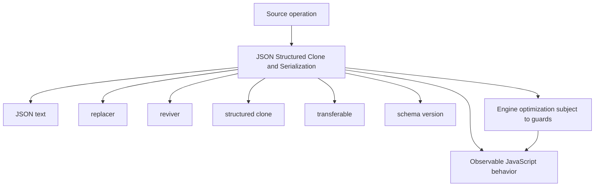
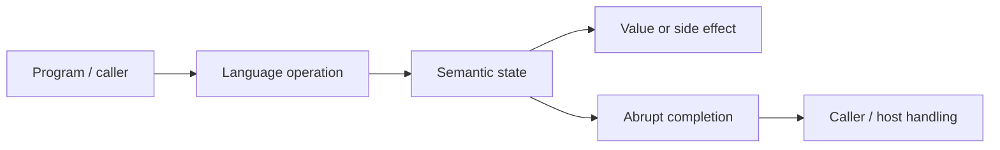
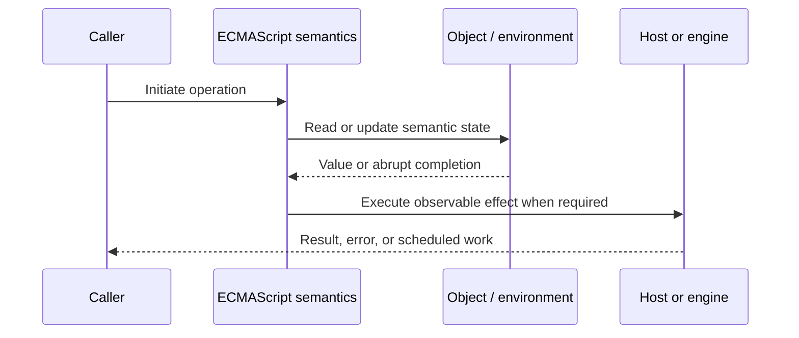
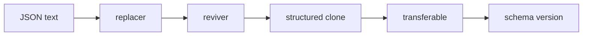

# JSON Structured Clone and Serialization

## Overview

Serialization converts an in-memory graph into a transport or storage representation. JSON is a text data-interchange format with a narrow type model; structured clone is a host algorithm that copies richer graphs and preserves cycles for supported types.

This note separates the ECMAScript language model from engine implementation choices and host behavior. That distinction matters: specification algorithms define correctness, while engines remain free to optimize as long as observable behavior is preserved.

## Learning Objectives

- Define JSON text and distinguish it from replacer
- Trace reviver through the relevant ECMAScript operations
- Predict edge cases without relying on engine folklore
- Evaluate memory, performance, security, and API-design trade-offs
- Apply the mechanism safely in production JavaScript

## Prerequisites

- [[01-Computer-Science/00-Orientation/How Computers Run Programs|How Computers Run Programs]]
- [[01-Computer-Science/03-Memory-and-Addressing/Stack and Heap|Stack and Heap]]
- [[01-Computer-Science/03-Memory-and-Addressing/Garbage Collection Models|Garbage Collection Models]]
- [[02-JavaScript/README|JavaScript]]

## Difficulty

`advanced`

## Estimated Time

90–120 minutes for reading and examples; 2–4 hours for exercises and the mini project.

## History

JSON grew from JavaScript literal syntax into a language-independent wire format. Structured clone originated in browsers to transfer data between realms and workers without sharing mutable object identity.

## Problem It Solves

Serialization boundaries are security and compatibility boundaries: unsupported values, precision loss, cycles, accessors, prototypes, versioning, and resource limits must be handled deliberately.

## First-Principles Model

1. JSON represents objects, arrays, strings, finite numbers, booleans, and null.
2. `JSON.stringify` omits object properties whose values are `undefined`, functions, or Symbols; array positions become `null`.
3. BigInt serialization throws unless application code defines an explicit representation.
4. `NaN` and infinities serialize as `null`, and number precision is already limited before encoding.
5. Object cycles cause `JSON.stringify` to throw unless a custom graph encoding is used.
6. `toJSON` and replacer functions can execute application code during serialization.
7. Structured clone preserves cycles and supports types such as Map, Set, Date, typed arrays, and ArrayBuffer.
8. Structured clone does not preserve custom prototypes, property descriptors, functions, or private state as general behavior.

The useful debugging question is not “what does JavaScript usually do?” but “which abstract operation runs, what state does it read, and what observable result follows?” This framing survives minification, transpilation, optimization, and framework changes.

## Internal Implementation

- Stringification enumerates own enumerable string properties in property order and reads their values.
- Parsing constructs data first, then applies a reviver bottom-up; returning `undefined` deletes a property.
- Structured clone tracks already-seen references to preserve graph aliasing and cycles.
- Transfer moves ownership of transferable backing resources and detaches the source buffer.
- Both algorithms can consume significant CPU/memory; hosts and applications need payload and depth limits.

These are semantic obligations rather than a mandate for a specific physical representation. Connect them to [[01-Computer-Science/08-Languages-and-Computation/Compilers Interpreters and Virtual Machines|Compilers Interpreters and Virtual Machines]], [[01-Computer-Science/03-Memory-and-Addressing/Stack and Heap|Stack and Heap]], and [[01-Computer-Science/03-Memory-and-Addressing/Garbage Collection Models|Garbage Collection Models]]: optimized code may use registers, native frames, compact tables, or heap contexts while preserving the same language-level result.



## Mermaid Diagrams

### Structure



### Sequence / Lifecycle



### Mechanism Detail



## Examples

### Minimal Example

```js
const payload = {
  createdAt: new Date("2026-07-21T00:00:00Z"),
  missing: undefined,
  invalid: NaN
};

const text = JSON.stringify(payload);
console.log(text); // date string; missing omitted; invalid null
```

Trace this example before running it. Record binding/receiver/property state at each line, then compare the trace with the actual output.

### Production-Shaped Example

```js
export function encodeEvent(event) {
  const envelope = {
    schemaVersion: 2,
    id: String(event.id),
    occurredAt: event.occurredAt.toISOString(),
    amountMinor: event.amountMinor.toString()
  };
  const text = JSON.stringify(envelope);
  if (new TextEncoder().encode(text).byteLength > 64_000) {
    throw new RangeError("event exceeds 64 KB");
  }
  return text;
}

export function decodeEvent(text) {
  const value = JSON.parse(text);
  if (value?.schemaVersion !== 2) throw new Error("unsupported schema");
  return { ...value, occurredAt: new Date(value.occurredAt), amountMinor: BigInt(value.amountMinor) };
}
```

The production-shaped version validates assumptions, gives failures domain context, and makes lifecycle behavior visible. It still needs tests for malformed input and whichever host runtime deploys it.

## Trade-offs

| Approach | Upside | Downside | When it matters |
| --- | --- | --- | --- |
| JSON | Portable human-readable wire format | Narrow types and no references | APIs/configuration |
| Structured clone | Rich graphs, cycles, transfer | Host boundary and behavior loss | Workers/local copying |
| Custom codec | Exact schema and evolution | Maintenance and security burden | Long-lived domain protocols |

No choice is universally best. Prefer the simplest mechanism that preserves the required semantics, then measure memory and latency under representative workload rather than microbenchmarks alone.

### When to Use

- Use the mechanism when its semantics directly express a stable domain or lifecycle requirement.
- Use it when tests can cover both normal and abrupt completion paths.
- Use it when maintainers can observe and debug the resulting state transitions.

### When Not to Use

- Do not use a clever language feature merely to reduce line count.
- Avoid it when an explicit data structure or named function communicates ownership better.
- Do not depend on undocumented engine optimization behavior for correctness.

## Performance, Memory, and Security

- **Allocation:** Determine whether the pattern creates per-call objects, closures, wrappers, or collections.
- **Reachability:** Long-lived listeners, caches, registries, and suspended computations can retain an entire object graph.
- **Optimization:** Stable shapes and call sites help engines, but optimization tiers and heuristics are not API contracts.
- **Input limits:** Bound depth, size, key count, and work when values cross a trust boundary.
- **Side effects:** Getters, proxies, iterators, coercion hooks, and callbacks can run user code inside apparently simple syntax.
- **Observability:** Emit domain events and timings; never parse engine-specific stack text as a primary protocol.

## Production Practices

- Version every durable/wire schema.
- Validate after parsing and before domain construction.
- Apply byte, depth, and collection-size limits.
- Encode BigInt, Date, Map, and errors explicitly.
- Redact secrets before serialization.
- Use transfer only when source detachment is acceptable.

At public boundaries, validate first, normalize once, and construct trusted domain values only after validation. Keep errors actionable without logging secrets or entire retained object graphs.

## Exercises

1. Predict the observable result of five edge cases involving **JSON text**, then verify them in two engines.
2. Instrument a small example to expose **replacer** and explain every transition from specification operations.
3. Write table-driven tests for the listed common mistakes, including strict-mode and module execution.
4. Compare the first trade-off alternatives with a benchmark and a maintainability review; do not optimize from timing alone.
5. Extend the relevant exercise in [[02-JavaScript/code/README|JavaScript code labs]] with malformed, adversarial, and high-volume inputs.

For every exercise, include tests for success, malformed input, abrupt completion, and cleanup. Explain observed results from first principles rather than merely recording them.

## Mini Project

Create a JSON edge-case suite and a tagged codec for BigInt, Date, Map, Set, Error, cycles, and version rejection.

Required deliverables: implementation, automated tests, a Mermaid lifecycle diagram, benchmark methodology, and a short failure-mode analysis.

## Portfolio Project

Build a versioned event codec with schema validation, migrations, payload budgets, redaction, fuzz tests, and compatibility fixtures.

Package it with a stable API, examples, generated documentation, CI checks, changelog discipline, and a production-readiness section covering limits and observability.

## Interview Questions

1. Which values does JSON omit or convert?
2. How does structured clone preserve cycles?
3. What does transfer do to an ArrayBuffer?
4. Why is JSON round-trip not a faithful clone?
5. When and in what order does a reviver run?
6. How should schemas evolve safely?

### Stretch / Staff-Level

1. Design a migration from a codebase that misuses JSON text; include compatibility, telemetry, staged rollout, and rollback.
2. Explain which guarantees belong to ECMAScript, which are engine heuristics, and which belong to the browser or Node.js host.
3. Describe a production incident involving this mechanism and the evidence you would collect before proposing a fix.

Strong answers name the controlling abstract operations, distinguish identity from equality or ownership, discuss abrupt completion, and state operational limits.

## Common Mistakes

- **Using JSON round-trip as a general deep clone.** Reproduce this case in a focused test before relying on intuition.
- **Trusting a reviver to validate hostile input.** Reproduce this case in a focused test before relying on intuition.
- **Losing BigInt or numeric precision.** Reproduce this case in a focused test before relying on intuition.
- **Assuming parsed data has trusted prototypes/types.** Reproduce this case in a focused test before relying on intuition.
- **Serializing secrets into logs or caches.** Reproduce this case in a focused test before relying on intuition.

## Best Practices

- Version every durable/wire schema.
- Validate after parsing and before domain construction.
- Apply byte, depth, and collection-size limits.
- Encode BigInt, Date, Map, and errors explicitly.
- Redact secrets before serialization.
- Use transfer only when source detachment is acceptable.

## Summary

Serialization converts an in-memory graph into a transport or storage representation. JSON is a text data-interchange format with a narrow type model; structured clone is a host algorithm that copies richer graphs and preserves cycles for supported types. The production rule is to model the semantics precisely, constrain untrusted work, make ownership and cleanup explicit, and treat engine optimization as measured implementation behavior rather than a language guarantee.

## Further Reading

- [ECMAScript Language Specification](https://tc39.es/ecma262/)
- [MDN JavaScript Guide](https://developer.mozilla.org/docs/Web/JavaScript/Guide)
- [[00-References/JavaScript/README|JavaScript References]]
- [[02-JavaScript/code/README|JavaScript code labs]]

## Related Notes

- [[02-JavaScript/01-Values-and-Types/Numbers BigInt and Numeric Precision|Numbers BigInt and Numeric Precision]]
- [[01-Computer-Science/03-Memory-and-Addressing/Garbage Collection Models|Garbage Collection Models]]
- [[02-JavaScript/code/README|JavaScript code labs]]
- [[01-Computer-Science/00-Orientation/How Computers Run Programs|How Computers Run Programs]]

## Progress Checklist

- [ ] Explained the mechanism from first principles
- [ ] Drew and narrated every Mermaid diagram
- [ ] Predicted the minimal example before executing it
- [ ] Implemented malformed and adversarial tests
- [ ] Documented performance, memory, security, and non-goals
- [ ] Completed the mini project
- [ ] Practiced interview questions aloud
- [ ] Linked prerequisites and dependent topics
