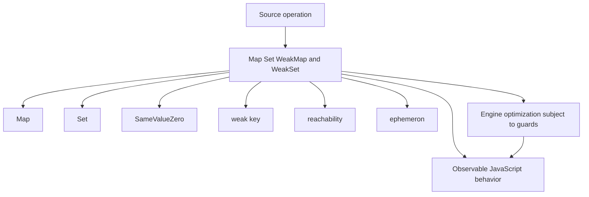
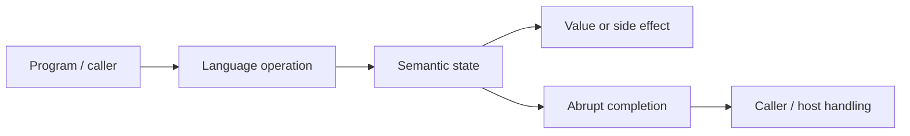
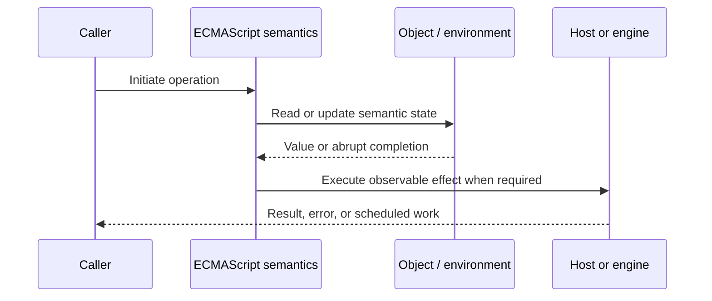
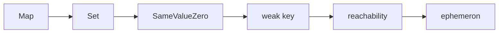

# Map Set WeakMap and WeakSet

## Overview

Map and Set are insertion-ordered keyed collections using SameValueZero equality. WeakMap and WeakSet hold weakly referenced object/symbol keys, allowing metadata to disappear when keys are otherwise unreachable.

This note separates the ECMAScript language model from engine implementation choices and host behavior. That distinction matters: specification algorithms define correctness, while engines remain free to optimize as long as observable behavior is preserved.

## Learning Objectives

- Define Map and distinguish it from Set
- Trace SameValueZero through the relevant ECMAScript operations
- Predict edge cases without relying on engine folklore
- Evaluate memory, performance, security, and API-design trade-offs
- Apply the mechanism safely in production JavaScript

## Prerequisites

- [[01-Computer-Science/00-Orientation/How Computers Run Programs|How Computers Run Programs]]
- [[01-Computer-Science/03-Memory-and-Addressing/Stack and Heap|Stack and Heap]]
- [[01-Computer-Science/03-Memory-and-Addressing/Garbage Collection Models|Garbage Collection Models]]
- [[02-JavaScript/README|JavaScript]]

## Difficulty

`advanced`

## Estimated Time

90–120 minutes for reading and examples; 2–4 hours for exercises and the mini project.

## History

ES2015 added collections because plain objects were poor arbitrary-key dictionaries and could not express lifetime-coupled metadata without leaks.

## Problem It Solves

Correct collection choice affects key identity, serialization, iteration, cache eviction, memory retention, and whether cleanup can be observed deterministically.

## First-Principles Model

1. Map keys may be any value and preserve object identity without string coercion.
2. Set stores unique values under SameValueZero, where `NaN` equals itself and `+0` equals `-0`.
3. Map and Set iteration follows insertion order.
4. WeakMap keys must be objects or non-registered Symbols; WeakSet has corresponding key restrictions.
5. Weak collections are intentionally non-enumerable because garbage-collection timing is nondeterministic.
6. A WeakMap does not keep a key alive solely because the map refers to it.
7. WeakMap values can reference their keys; ephemeron tracing still allows collection when no external key path exists.
8. Weak collections do not replace bounded caches because live keys can still grow without limit.

The useful debugging question is not “what does JavaScript usually do?” but “which abstract operation runs, what state does it read, and what observable result follows?” This framing survives minification, transpilation, optimization, and framework changes.

## Internal Implementation

- Map implementations generally use hash-table-like indexing plus order-tracking structures, though layout is engine-specific. See [[04-Data-Structures/04-Hash-Tables-and-Sets/Separate Chaining|Separate Chaining]], [[04-Data-Structures/04-Hash-Tables-and-Sets/Sets Multisets and Map vs Set|Sets Multisets and Map vs Set]], and [[04-Data-Structures/14-Production-Selection/Standard-Library Mapping for TypeScript and Python|Standard-Library Mapping for TypeScript and Python]].
- WeakMap entries are processed with ephemeron semantics during garbage collection.
- `size`, iteration, and key listing are omitted from weak collections to avoid exposing liveness.
- Deleting and reinserting a Map key moves it to the end of insertion order.
- Object identity keys remain realm/object-instance specific and need explicit stable IDs for persistence.

These are semantic obligations rather than a mandate for a specific physical representation. Connect them to [[01-Computer-Science/08-Languages-and-Computation/Compilers Interpreters and Virtual Machines|Compilers Interpreters and Virtual Machines]], [[01-Computer-Science/03-Memory-and-Addressing/Stack and Heap|Stack and Heap]], and [[01-Computer-Science/03-Memory-and-Addressing/Garbage Collection Models|Garbage Collection Models]]: optimized code may use registers, native frames, compact tables, or heap contexts while preserving the same language-level result.



## Mermaid Diagrams

### Structure



### Sequence / Lifecycle



### Mechanism Detail



## Examples

### Minimal Example

```js
const visits = new Map();
const user = { id: 1 };
visits.set(user, 1);

const unique = new Set([NaN, NaN, 0, -0]);
console.log(visits.get(user)); // 1
console.log(unique.size); // 2
```

Trace this example before running it. Record binding/receiver/property state at each line, then compare the trace with the actual output.

### Production-Shaped Example

```js
const metadata = new WeakMap();

export function instrument(target, logger) {
  if (metadata.has(target)) return target;
  const state = { calls: 0 };
  metadata.set(target, state);

  return new Proxy(target, {
    apply(fn, thisArg, args) {
      state.calls += 1;
      logger.debug({ calls: state.calls }, "target.called");
      return Reflect.apply(fn, thisArg, args);
    }
  });
}
```

The production-shaped version validates assumptions, gives failures domain context, and makes lifecycle behavior visible. It still needs tests for malformed input and whichever host runtime deploys it.

## Trade-offs

| Approach | Upside | Downside | When it matters |
| --- | --- | --- | --- |
| Map | Arbitrary keys and deterministic iteration | Needs explicit serialization | Dynamic dictionaries |
| Object | Natural record/JSON shape | String/Symbol keys and prototype concerns | Known schemas |
| WeakMap | Lifetime follows key reachability | Not iterable or observable | Private metadata/memoization |

No choice is universally best. Prefer the simplest mechanism that preserves the required semantics, then measure memory and latency under representative workload rather than microbenchmarks alone.

### When to Use

- Use the mechanism when its semantics directly express a stable domain or lifecycle requirement.
- Use it when tests can cover both normal and abrupt completion paths.
- Use it when maintainers can observe and debug the resulting state transitions.

### When Not to Use

- Do not use a clever language feature merely to reduce line count.
- Avoid it when an explicit data structure or named function communicates ownership better.
- Do not depend on undocumented engine optimization behavior for correctness.

## Performance, Memory, and Security

- **Allocation:** Determine whether the pattern creates per-call objects, closures, wrappers, or collections.
- **Reachability:** Long-lived listeners, caches, registries, and suspended computations can retain an entire object graph.
- **Optimization:** Stable shapes and call sites help engines, but optimization tiers and heuristics are not API contracts.
- **Input limits:** Bound depth, size, key count, and work when values cross a trust boundary.
- **Side effects:** Getters, proxies, iterators, coercion hooks, and callbacks can run user code inside apparently simple syntax.
- **Observability:** Emit domain events and timings; never parse engine-specific stack text as a primary protocol.

## Production Practices

- Choose records for schemas and Map for dynamic key identity.
- Add explicit LRU/TTL policy to caches.
- Use WeakMap for auxiliary object metadata.
- Convert collections explicitly at serialization boundaries.
- Do not base correctness on garbage-collection timing.
- Expose metrics that do not require weak-key enumeration.

At public boundaries, validate first, normalize once, and construct trusted domain values only after validation. Keep errors actionable without logging secrets or entire retained object graphs.

## Exercises

1. Predict the observable result of five edge cases involving **Map**, then verify them in two engines.
2. Instrument a small example to expose **Set** and explain every transition from specification operations.
3. Write table-driven tests for the listed common mistakes, including strict-mode and module execution.
4. Compare the first trade-off alternatives with a benchmark and a maintainability review; do not optimize from timing alone.
5. Extend the relevant exercise in [[02-JavaScript/code/README|JavaScript code labs]] with malformed, adversarial, and high-volume inputs.

For every exercise, include tests for success, malformed input, abrupt completion, and cleanup. Explain observed results from first principles rather than merely recording them.

## Mini Project

Implement an LRU Map cache and a WeakMap memoizer; test identity, `NaN`, eviction, and observable lifecycle differences.

Required deliverables: implementation, automated tests, a Mermaid lifecycle diagram, benchmark methodology, and a short failure-mode analysis.

## Portfolio Project

Build a cache toolkit offering LRU, TTL, weak metadata, hit-rate metrics, cancellation, and explicit serialization policies.

Package it with a stable API, examples, generated documentation, CI checks, changelog discipline, and a production-readiness section covering limits and observability.

## Interview Questions

1. What equality does Map use?
2. Why are weak collections non-enumerable?
3. How does ephemeron tracing handle value-to-key references?
4. When should Map replace Object?
5. Why is WeakMap not an LRU cache?
6. How would you serialize a Map with non-string keys?

### Stretch / Staff-Level

1. Design a migration from a codebase that misuses Map; include compatibility, telemetry, staged rollout, and rollback.
2. Explain which guarantees belong to ECMAScript, which are engine heuristics, and which belong to the browser or Node.js host.
3. Describe a production incident involving this mechanism and the evidence you would collect before proposing a fix.

Strong answers name the controlling abstract operations, distinguish identity from equality or ownership, discuss abrupt completion, and state operational limits.

## Common Mistakes

- **Using object keys in plain objects and getting `[object Object]` collisions.** Reproduce this case in a focused test before relying on intuition.
- **Expecting WeakMap entries to expire on a schedule.** Reproduce this case in a focused test before relying on intuition.
- **Trying to inspect weak collection size.** Reproduce this case in a focused test before relying on intuition.
- **Using WeakMap when persistence or enumeration is required.** Reproduce this case in a focused test before relying on intuition.
- **Treating Map as automatically bounded.** Reproduce this case in a focused test before relying on intuition.

## Best Practices

- Choose records for schemas and Map for dynamic key identity.
- Add explicit LRU/TTL policy to caches.
- Use WeakMap for auxiliary object metadata.
- Convert collections explicitly at serialization boundaries.
- Do not base correctness on garbage-collection timing.
- Expose metrics that do not require weak-key enumeration.

## Summary

Map and Set are insertion-ordered keyed collections using SameValueZero equality. WeakMap and WeakSet hold weakly referenced object/symbol keys, allowing metadata to disappear when keys are otherwise unreachable. The production rule is to model the semantics precisely, constrain untrusted work, make ownership and cleanup explicit, and treat engine optimization as measured implementation behavior rather than a language guarantee.

## Further Reading

- [ECMAScript Language Specification](https://tc39.es/ecma262/)
- [MDN JavaScript Guide](https://developer.mozilla.org/docs/Web/JavaScript/Guide)
- [[00-References/JavaScript/README|JavaScript References]]
- [[02-JavaScript/code/README|JavaScript code labs]]

## Related Notes

- [[02-JavaScript/03-Objects-and-Metaprogramming/Objects and Property Keys|Objects and Property Keys]]
- [[04-Data-Structures/04-Hash-Tables-and-Sets/Hash Functions Avalanche and Equality Contracts|Hash Functions Avalanche and Equality Contracts]]
- [[04-Data-Structures/04-Hash-Tables-and-Sets/Sets Multisets and Map vs Set|Sets Multisets and Map vs Set]]
- [[04-Data-Structures/04-Hash-Tables-and-Sets/Hash-Flooding DoS and Randomized Hashing|Hash-Flooding DoS and Randomized Hashing]]
- [[04-Data-Structures/14-Production-Selection/Standard-Library Mapping for TypeScript and Python|Standard-Library Mapping for TypeScript and Python]]
- [[01-Computer-Science/03-Memory-and-Addressing/Garbage Collection Models|Garbage Collection Models]]
- [[02-JavaScript/code/README|JavaScript code labs]]
- [[01-Computer-Science/00-Orientation/How Computers Run Programs|How Computers Run Programs]]

## Progress Checklist

- [ ] Explained the mechanism from first principles
- [ ] Drew and narrated every Mermaid diagram
- [ ] Predicted the minimal example before executing it
- [ ] Implemented malformed and adversarial tests
- [ ] Documented performance, memory, security, and non-goals
- [ ] Completed the mini project
- [ ] Practiced interview questions aloud
- [ ] Linked prerequisites and dependent topics
