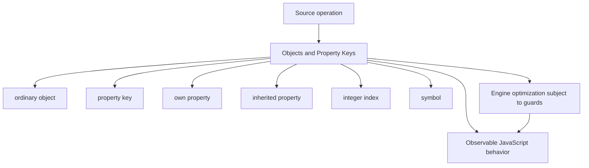
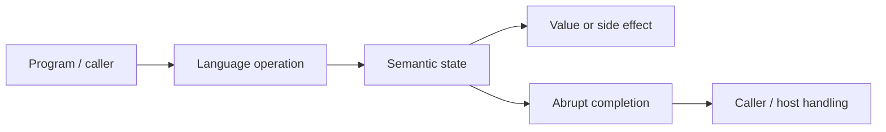
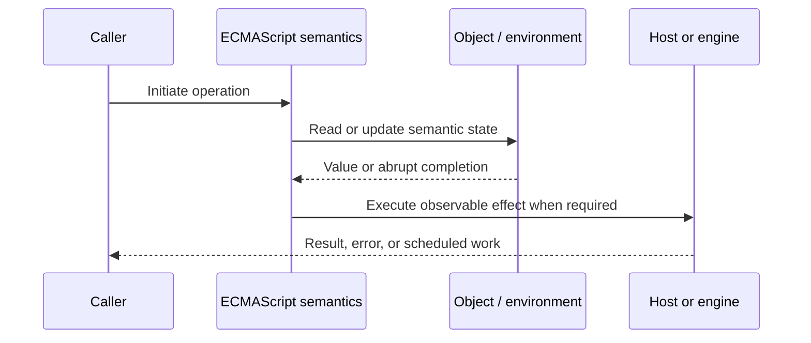
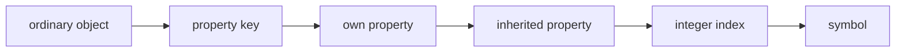

# Objects and Property Keys

## Overview

A JavaScript object is a mutable collection of properties plus an internal prototype and extensibility state. Every ordinary property key is either a String or Symbol; numeric-looking keys are converted to strings.

This note separates the ECMAScript language model from engine implementation choices and host behavior. That distinction matters: specification algorithms define correctness, while engines remain free to optimize as long as observable behavior is preserved.

## Learning Objectives

- Define ordinary object and distinguish it from property key
- Trace own property through the relevant ECMAScript operations
- Predict edge cases without relying on engine folklore
- Evaluate memory, performance, security, and API-design trade-offs
- Apply the mechanism safely in production JavaScript

## Prerequisites

- [[01-Computer-Science/00-Orientation/How Computers Run Programs|How Computers Run Programs]]
- [[01-Computer-Science/03-Memory-and-Addressing/Stack and Heap|Stack and Heap]]
- [[01-Computer-Science/03-Memory-and-Addressing/Garbage Collection Models|Garbage Collection Models]]
- [[02-JavaScript/README|JavaScript]]

## Difficulty

`intermediate`

## Estimated Time

90–120 minutes for reading and examples; 2–4 hours for exercises and the mini project.

## History

JavaScript unified record-like storage and prototype-based behavior in one object model. Symbols later added collision-resistant keys for protocols and metadata.

## Problem It Solves

Production correctness depends on distinguishing own from inherited properties, key coercion, enumeration order, prototype pollution, and data records from dictionaries.

## First-Principles Model

1. `ToPropertyKey` converts keys to String unless they are already Symbols.
2. `obj[1]` and `obj['1']` address the same property.
3. Own keys are ordered: integer-index strings ascending, other strings by creation order, then Symbols by creation order.
4. `Object.keys` returns own enumerable string keys, while `Reflect.ownKeys` also includes non-enumerable strings and Symbols.
5. The `in` operator traverses the prototype chain; `Object.hasOwn` does not.
6. Object literals normally inherit from `Object.prototype`; `Object.create(null)` creates a null-prototype dictionary.
7. Property access can execute accessors or proxy traps and therefore is not always passive.
8. Symbols provide unique identity, but global-registry symbols created by `Symbol.for` can be shared by key.

The useful debugging question is not “what does JavaScript usually do?” but “which abstract operation runs, what state does it read, and what observable result follows?” This framing survives minification, transpilation, optimization, and framework changes.

## Internal Implementation

- Ordinary `[[Get]]` first queries an own property descriptor, then recursively delegates to the prototype.
- Engines commonly represent stable property layouts with shapes/hidden classes and separate value storage.
- Adding properties in consistent order can preserve shape sharing; deleting/churning keys may force dictionary-like storage.
- Integer-index ordering supports array-like behavior even on ordinary objects.
- Untrusted keys such as `__proto__` require defensive handling because assignment mechanisms differ in prototype effects.

These are semantic obligations rather than a mandate for a specific physical representation. Connect them to [[01-Computer-Science/08-Languages-and-Computation/Compilers Interpreters and Virtual Machines|Compilers Interpreters and Virtual Machines]], [[01-Computer-Science/03-Memory-and-Addressing/Stack and Heap|Stack and Heap]], and [[01-Computer-Science/03-Memory-and-Addressing/Garbage Collection Models|Garbage Collection Models]]: optimized code may use registers, native frames, compact tables, or heap contexts while preserving the same language-level result.



## Mermaid Diagrams

### Structure



### Sequence / Lifecycle



### Mechanism Detail



## Examples

### Minimal Example

```js
const token = Symbol("token");
const record = { 2: "two", 1: "one", name: "Ada", [token]: 42 };

console.log(record[1] === record["1"]); // true
console.log(Reflect.ownKeys(record)); // ["1", "2", "name", token]
```

Trace this example before running it. Record binding/receiver/property state at each line, then compare the trace with the actual output.

### Production-Shaped Example

```js
export function groupHeaders(entries) {
  const headers = Object.create(null);
  for (const [rawName, rawValue] of entries) {
    const name = String(rawName).toLowerCase();
    if (!/^[a-z0-9-]+$/.test(name)) throw new TypeError("invalid header name");
    const values = headers[name] ?? (headers[name] = []);
    values.push(String(rawValue));
  }
  return Object.freeze(headers);
}
```

The production-shaped version validates assumptions, gives failures domain context, and makes lifecycle behavior visible. It still needs tests for malformed input and whichever host runtime deploys it.

## Trade-offs

| Approach | Upside | Downside | When it matters |
| --- | --- | --- | --- |
| Plain object record | Literal syntax and serialization | Prototype/key hazards | Known schema fields |
| Null-prototype dictionary | No inherited names | Missing object conveniences | String-key dictionaries |
| Map | Arbitrary key identity and clear API | Not direct JSON data | Dynamic key-value collections |

No choice is universally best. Prefer the simplest mechanism that preserves the required semantics, then measure memory and latency under representative workload rather than microbenchmarks alone.

### When to Use

- Use the mechanism when its semantics directly express a stable domain or lifecycle requirement.
- Use it when tests can cover both normal and abrupt completion paths.
- Use it when maintainers can observe and debug the resulting state transitions.

### When Not to Use

- Do not use a clever language feature merely to reduce line count.
- Avoid it when an explicit data structure or named function communicates ownership better.
- Do not depend on undocumented engine optimization behavior for correctness.

## Performance, Memory, and Security

- **Allocation:** Determine whether the pattern creates per-call objects, closures, wrappers, or collections.
- **Reachability:** Long-lived listeners, caches, registries, and suspended computations can retain an entire object graph.
- **Optimization:** Stable shapes and call sites help engines, but optimization tiers and heuristics are not API contracts.
- **Input limits:** Bound depth, size, key count, and work when values cross a trust boundary.
- **Side effects:** Getters, proxies, iterators, coercion hooks, and callbacks can run user code inside apparently simple syntax.
- **Observability:** Emit domain events and timings; never parse engine-specific stack text as a primary protocol.

## Production Practices

- Use `Object.hasOwn` for record validation.
- Choose Map for dynamic dictionaries.
- Reject or safely copy untrusted keys.
- Keep stable object shapes in measured hot paths.
- Use Symbols for protocols, not secret storage.
- Define record schemas at boundaries.

At public boundaries, validate first, normalize once, and construct trusted domain values only after validation. Keep errors actionable without logging secrets or entire retained object graphs.

## Exercises

1. Predict the observable result of five edge cases involving **ordinary object**, then verify them in two engines.
2. Instrument a small example to expose **property key** and explain every transition from specification operations.
3. Write table-driven tests for the listed common mistakes, including strict-mode and module execution.
4. Compare the first trade-off alternatives with a benchmark and a maintainability review; do not optimize from timing alone.
5. Extend the relevant exercise in [[02-JavaScript/code/README|JavaScript code labs]] with malformed, adversarial, and high-volume inputs.

For every exercise, include tests for success, malformed input, abrupt completion, and cleanup. Explain observed results from first principles rather than merely recording them.

## Mini Project

Build a property inspector showing own keys, descriptors, inheritance source, enumeration visibility, and coerced input keys.

Required deliverables: implementation, automated tests, a Mermaid lifecycle diagram, benchmark methodology, and a short failure-mode analysis.

## Portfolio Project

Create a hardened configuration registry supporting schemas, symbol metadata, pollution-safe merges, and deterministic serialization.

Package it with a stable API, examples, generated documentation, CI checks, changelog discipline, and a production-readiness section covering limits and observability.

## Interview Questions

1. What are the only two property-key types?
2. How are own keys ordered?
3. How do `in` and `Object.hasOwn` differ?
4. Why use a null-prototype object?
5. How does ordinary `[[Get]]` delegate?
6. How can untrusted keys alter prototypes?

### Stretch / Staff-Level

1. Design a migration from a codebase that misuses ordinary object; include compatibility, telemetry, staged rollout, and rollback.
2. Explain which guarantees belong to ECMAScript, which are engine heuristics, and which belong to the browser or Node.js host.
3. Describe a production incident involving this mechanism and the evidence you would collect before proposing a fix.

Strong answers name the controlling abstract operations, distinguish identity from equality or ownership, discuss abrupt completion, and state operational limits.

## Common Mistakes

- **Using `in` when only own fields are valid.** Reproduce this case in a focused test before relying on intuition.
- **Assuming number keys remain numbers.** Reproduce this case in a focused test before relying on intuition.
- **Treating enumeration order as arbitrary or alphabetical.** Reproduce this case in a focused test before relying on intuition.
- **Merging untrusted keys without prototype-pollution defenses.** Reproduce this case in a focused test before relying on intuition.
- **Expecting Symbols in `Object.keys` or JSON.** Reproduce this case in a focused test before relying on intuition.

## Best Practices

- Use `Object.hasOwn` for record validation.
- Choose Map for dynamic dictionaries.
- Reject or safely copy untrusted keys.
- Keep stable object shapes in measured hot paths.
- Use Symbols for protocols, not secret storage.
- Define record schemas at boundaries.

## Summary

A JavaScript object is a mutable collection of properties plus an internal prototype and extensibility state. Every ordinary property key is either a String or Symbol; numeric-looking keys are converted to strings. The production rule is to model the semantics precisely, constrain untrusted work, make ownership and cleanup explicit, and treat engine optimization as measured implementation behavior rather than a language guarantee.

## Further Reading

- [ECMAScript Language Specification](https://tc39.es/ecma262/)
- [MDN JavaScript Guide](https://developer.mozilla.org/docs/Web/JavaScript/Guide)
- [[00-References/JavaScript/README|JavaScript References]]
- [[02-JavaScript/code/README|JavaScript code labs]]

## Related Notes

- [[02-JavaScript/01-Values-and-Types/Symbols and Unique Property Keys|Symbols and Unique Property Keys]]
- [[02-JavaScript/03-Objects-and-Metaprogramming/Map Set WeakMap and WeakSet|Map Set WeakMap and WeakSet]]
- [[02-JavaScript/code/README|JavaScript code labs]]
- [[01-Computer-Science/00-Orientation/How Computers Run Programs|How Computers Run Programs]]

## Progress Checklist

- [ ] Explained the mechanism from first principles
- [ ] Drew and narrated every Mermaid diagram
- [ ] Predicted the minimal example before executing it
- [ ] Implemented malformed and adversarial tests
- [ ] Documented performance, memory, security, and non-goals
- [ ] Completed the mini project
- [ ] Practiced interview questions aloud
- [ ] Linked prerequisites and dependent topics
