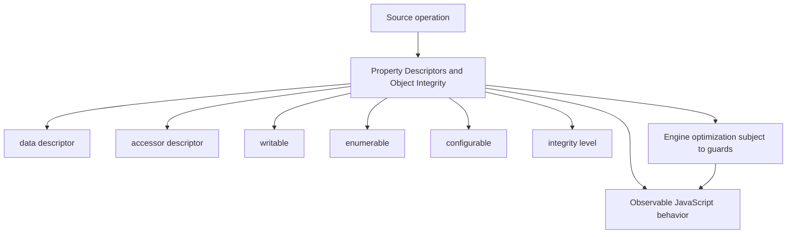
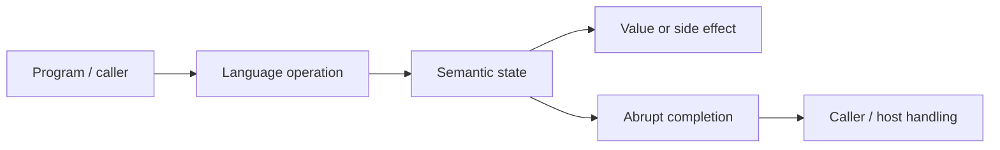
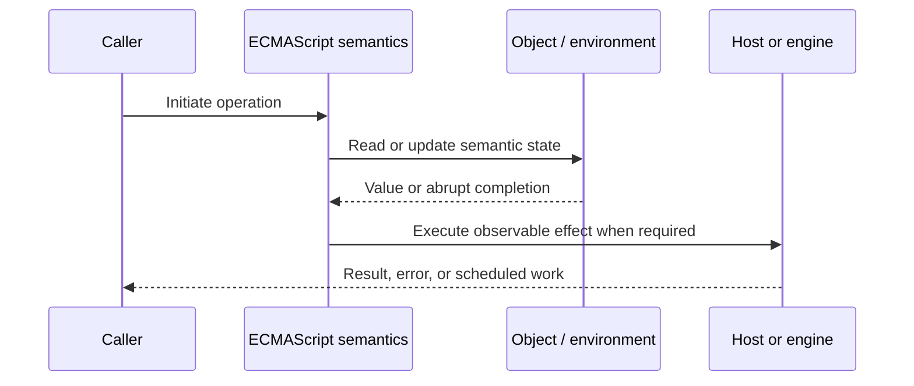
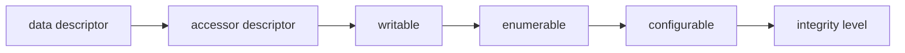

# Property Descriptors and Object Integrity

## Overview

A property descriptor defines a property's value/getter/setter and its writable, enumerable, and configurable attributes. Object integrity operations constrain adding, deleting, or rewriting own properties, but they are shallow.

This note separates the ECMAScript language model from engine implementation choices and host behavior. That distinction matters: specification algorithms define correctness, while engines remain free to optimize as long as observable behavior is preserved.

## Learning Objectives

- Define data descriptor and distinguish it from accessor descriptor
- Trace writable through the relevant ECMAScript operations
- Predict edge cases without relying on engine folklore
- Evaluate memory, performance, security, and API-design trade-offs
- Apply the mechanism safely in production JavaScript

## Prerequisites

- [[01-Computer-Science/00-Orientation/How Computers Run Programs|How Computers Run Programs]]
- [[01-Computer-Science/03-Memory-and-Addressing/Stack and Heap|Stack and Heap]]
- [[01-Computer-Science/03-Memory-and-Addressing/Garbage Collection Models|Garbage Collection Models]]
- [[02-JavaScript/README|JavaScript]]

## Difficulty

`advanced`

## Estimated Time

90–120 minutes for reading and examples; 2–4 hours for exercises and the mini project.

## History

Descriptor attributes made JavaScript's object model capable of library-quality invariants and host-like APIs. ES5 standardized reflective access and integrity controls.

## Problem It Solves

Assignment syntax hides important constraints; precise descriptor knowledge prevents silent writes, accidental API exposure, broken copying, and false claims of deep immutability.

## First-Principles Model

1. A descriptor is either data or accessor; it cannot contain both `value` and `get`/`set` fields.
2. Absent descriptor fields default to `false` or `undefined` in `Object.defineProperty`.
3. Non-configurable properties generally cannot be deleted or structurally redefined.
4. A non-configurable writable data property may transition from writable to non-writable, not back.
5. `preventExtensions` rejects new own properties but leaves existing descriptors unchanged.
6. `seal` prevents extensions and makes all own properties non-configurable.
7. `freeze` seals and also makes own data properties non-writable.
8. Freezing is shallow: referenced objects, private fields, and external resources may still change.

The useful debugging question is not “what does JavaScript usually do?” but “which abstract operation runs, what state does it read, and what observable result follows?” This framing survives minification, transpilation, optimization, and framework changes.

## Internal Implementation

- `ValidateAndApplyPropertyDescriptor` checks whether a requested transition is legal.
- Ordinary assignment invokes internal `[[Set]]`, which respects inherited setters and writable attributes.
- Strict-mode failed assignment throws; sloppy assignment may fail silently.
- Spread and `Object.assign` copy values, not original descriptor attributes.
- Proxies must report descriptor and extensibility results consistent with target invariants.

These are semantic obligations rather than a mandate for a specific physical representation. Connect them to [[01-Computer-Science/08-Languages-and-Computation/Compilers Interpreters and Virtual Machines|Compilers Interpreters and Virtual Machines]], [[01-Computer-Science/03-Memory-and-Addressing/Stack and Heap|Stack and Heap]], and [[01-Computer-Science/03-Memory-and-Addressing/Garbage Collection Models|Garbage Collection Models]]: optimized code may use registers, native frames, compact tables, or heap contexts while preserving the same language-level result.



## Mermaid Diagrams

### Structure



### Sequence / Lifecycle



### Mechanism Detail



## Examples

### Minimal Example

```js
const settings = {};
Object.defineProperty(settings, "version", {
  value: 1,
  enumerable: true,
  writable: false,
  configurable: false
});

console.log(Object.getOwnPropertyDescriptor(settings, "version"));
```

Trace this example before running it. Record binding/receiver/property state at each line, then compare the trace with the actual output.

### Production-Shaped Example

```js
export function defineConfig(raw) {
  const config = {
    endpoint: new URL(raw.endpoint).href,
    retry: Object.freeze({ attempts: raw.retry?.attempts ?? 3 })
  };
  Object.defineProperty(config, "loadedAt", {
    value: Date.now(),
    enumerable: false,
    writable: false,
    configurable: false
  });
  return Object.freeze(config);
}
```

The production-shaped version validates assumptions, gives failures domain context, and makes lifecycle behavior visible. It still needs tests for malformed input and whichever host runtime deploys it.

## Trade-offs

| Approach | Upside | Downside | When it matters |
| --- | --- | --- | --- |
| Freeze | Prevents shallow structural mutation | Deep graph remains mutable | Stable boundary records |
| Accessors | Validation/lazy computation | Reads may execute and throw | Controlled object APIs |
| Descriptors | Precise public surface | More complexity than literals | Framework/library internals |

No choice is universally best. Prefer the simplest mechanism that preserves the required semantics, then measure memory and latency under representative workload rather than microbenchmarks alone.

### When to Use

- Use the mechanism when its semantics directly express a stable domain or lifecycle requirement.
- Use it when tests can cover both normal and abrupt completion paths.
- Use it when maintainers can observe and debug the resulting state transitions.

### When Not to Use

- Do not use a clever language feature merely to reduce line count.
- Avoid it when an explicit data structure or named function communicates ownership better.
- Do not depend on undocumented engine optimization behavior for correctness.

## Performance, Memory, and Security

- **Allocation:** Determine whether the pattern creates per-call objects, closures, wrappers, or collections.
- **Reachability:** Long-lived listeners, caches, registries, and suspended computations can retain an entire object graph.
- **Optimization:** Stable shapes and call sites help engines, but optimization tiers and heuristics are not API contracts.
- **Input limits:** Bound depth, size, key count, and work when values cross a trust boundary.
- **Side effects:** Getters, proxies, iterators, coercion hooks, and callbacks can run user code inside apparently simple syntax.
- **Observability:** Emit domain events and timings; never parse engine-specific stack text as a primary protocol.

## Production Practices

- Expose immutable data at module boundaries.
- Deep-freeze only bounded acyclic graphs with a clear need.
- Inspect descriptors when debugging surprising writes.
- Keep accessors side-effect-light and documented.
- Use strict mode to surface failed mutation.
- Prefer private storage over descriptor tricks for secrets.

At public boundaries, validate first, normalize once, and construct trusted domain values only after validation. Keep errors actionable without logging secrets or entire retained object graphs.

## Exercises

1. Predict the observable result of five edge cases involving **data descriptor**, then verify them in two engines.
2. Instrument a small example to expose **accessor descriptor** and explain every transition from specification operations.
3. Write table-driven tests for the listed common mistakes, including strict-mode and module execution.
4. Compare the first trade-off alternatives with a benchmark and a maintainability review; do not optimize from timing alone.
5. Extend the relevant exercise in [[02-JavaScript/code/README|JavaScript code labs]] with malformed, adversarial, and high-volume inputs.

For every exercise, include tests for success, malformed input, abrupt completion, and cleanup. Explain observed results from first principles rather than merely recording them.

## Mini Project

Implement a cycle-safe deep-freeze utility and document why typed arrays, accessors, maps, and private state complicate it.

Required deliverables: implementation, automated tests, a Mermaid lifecycle diagram, benchmark methodology, and a short failure-mode analysis.

## Portfolio Project

Build an immutable configuration loader with schema validation, descriptor-preserving snapshots, redaction, and diff reporting.

Package it with a stable API, examples, generated documentation, CI checks, changelog discipline, and a production-readiness section covering limits and observability.

## Interview Questions

1. What distinguishes data and accessor descriptors?
2. Which descriptor transitions are irreversible?
3. How do seal and freeze differ?
4. Why does spread lose descriptors?
5. Why is freezing shallow?
6. Which proxy invariants involve non-configurable properties?

### Stretch / Staff-Level

1. Design a migration from a codebase that misuses data descriptor; include compatibility, telemetry, staged rollout, and rollback.
2. Explain which guarantees belong to ECMAScript, which are engine heuristics, and which belong to the browser or Node.js host.
3. Describe a production incident involving this mechanism and the evidence you would collect before proposing a fix.

Strong answers name the controlling abstract operations, distinguish identity from equality or ownership, discuss abrupt completion, and state operational limits.

## Common Mistakes

- **Assuming `Object.freeze` recursively freezes.** Reproduce this case in a focused test before relying on intuition.
- **Forgetting defineProperty defaults are restrictive.** Reproduce this case in a focused test before relying on intuition.
- **Copying an accessor with spread and expecting it to remain an accessor.** Reproduce this case in a focused test before relying on intuition.
- **Ignoring strict-versus-sloppy failed writes.** Reproduce this case in a focused test before relying on intuition.
- **Using freeze as a security boundary around hostile references.** Reproduce this case in a focused test before relying on intuition.

## Best Practices

- Expose immutable data at module boundaries.
- Deep-freeze only bounded acyclic graphs with a clear need.
- Inspect descriptors when debugging surprising writes.
- Keep accessors side-effect-light and documented.
- Use strict mode to surface failed mutation.
- Prefer private storage over descriptor tricks for secrets.

## Summary

A property descriptor defines a property's value/getter/setter and its writable, enumerable, and configurable attributes. Object integrity operations constrain adding, deleting, or rewriting own properties, but they are shallow. The production rule is to model the semantics precisely, constrain untrusted work, make ownership and cleanup explicit, and treat engine optimization as measured implementation behavior rather than a language guarantee.

## Further Reading

- [ECMAScript Language Specification](https://tc39.es/ecma262/)
- [MDN JavaScript Guide](https://developer.mozilla.org/docs/Web/JavaScript/Guide)
- [[00-References/JavaScript/README|JavaScript References]]
- [[02-JavaScript/code/README|JavaScript code labs]]

## Related Notes

- [[02-JavaScript/03-Objects-and-Metaprogramming/Proxy and Reflect|Proxy and Reflect]]
- [[01-Computer-Science/03-Memory-and-Addressing/Garbage Collection Models|Garbage Collection Models]]
- [[02-JavaScript/code/README|JavaScript code labs]]
- [[01-Computer-Science/00-Orientation/How Computers Run Programs|How Computers Run Programs]]

## Progress Checklist

- [ ] Explained the mechanism from first principles
- [ ] Drew and narrated every Mermaid diagram
- [ ] Predicted the minimal example before executing it
- [ ] Implemented malformed and adversarial tests
- [ ] Documented performance, memory, security, and non-goals
- [ ] Completed the mini project
- [ ] Practiced interview questions aloud
- [ ] Linked prerequisites and dependent topics
