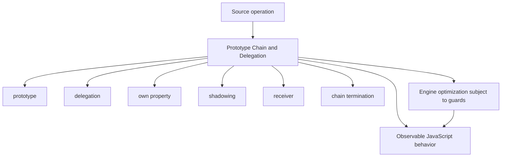
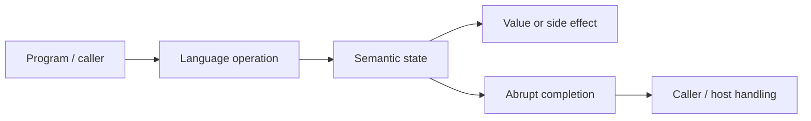
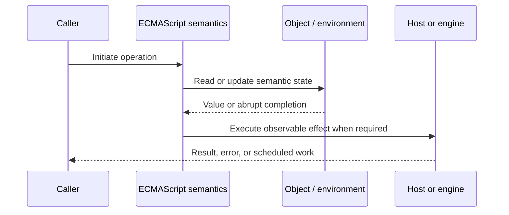
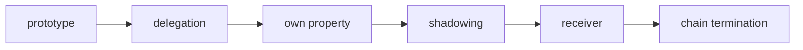

# Prototype Chain and Delegation

## Overview

Every ordinary object has an internal `[[Prototype]]` that is either another object or `null`. Missing-property operations delegate along this chain, enabling behavior sharing without copying methods into each instance.

This note separates the ECMAScript language model from engine implementation choices and host behavior. That distinction matters: specification algorithms define correctness, while engines remain free to optimize as long as observable behavior is preserved.

## Learning Objectives

- Define prototype and distinguish it from delegation
- Trace own property through the relevant ECMAScript operations
- Predict edge cases without relying on engine folklore
- Evaluate memory, performance, security, and API-design trade-offs
- Apply the mechanism safely in production JavaScript

## Prerequisites

- [[01-Computer-Science/00-Orientation/How Computers Run Programs|How Computers Run Programs]]
- [[01-Computer-Science/03-Memory-and-Addressing/Stack and Heap|Stack and Heap]]
- [[01-Computer-Science/03-Memory-and-Addressing/Garbage Collection Models|Garbage Collection Models]]
- [[02-JavaScript/README|JavaScript]]

## Difficulty

`advanced`

## Estimated Time

90–120 minutes for reading and examples; 2–4 hours for exercises and the mini project.

## History

JavaScript's prototype model came from Self and favors object-to-object delegation. Constructor and class syntax layer familiar creation patterns over the same chain.

## Problem It Solves

Prototype reasoning is essential for method sharing, receiver behavior, shadowing, pollution defense, and performance characteristics of property lookup.

## First-Principles Model

1. Property lookup checks the receiver's own properties before following `[[Prototype]]` links.
2. An inherited data property is read with the original receiver preserved.
3. An inherited accessor's getter runs with `this` equal to the original receiver.
4. Assignment may create an own shadowing property, invoke an inherited setter, or fail for non-writable data.
5. `Object.getPrototypeOf` and `Object.setPrototypeOf` reflect the internal link; `.prototype` is an ordinary constructor property.
6. `Object.create(proto)` creates an object whose internal prototype is `proto`.
7. `instanceof` usually tests whether a constructor's current `.prototype` occurs in an object's chain.
8. A chain must be acyclic and ends at `null`.

The useful debugging question is not “what does JavaScript usually do?” but “which abstract operation runs, what state does it read, and what observable result follows?” This framing survives minification, transpilation, optimization, and framework changes.

## Internal Implementation

- Ordinary `[[Get]](P, Receiver)` carries `Receiver` through recursive prototype calls.
- Ordinary `[[Set]]` separates the property owner from the receiver that may receive a new own property.
- Engines optimize stable chains with prototype validity guards and inline caches.
- Changing an object's prototype at runtime invalidates assumptions and is commonly expensive.
- Polluting a widely shared prototype changes behavior for many otherwise unrelated objects.

These are semantic obligations rather than a mandate for a specific physical representation. Connect them to [[01-Computer-Science/08-Languages-and-Computation/Compilers Interpreters and Virtual Machines|Compilers Interpreters and Virtual Machines]], [[01-Computer-Science/03-Memory-and-Addressing/Stack and Heap|Stack and Heap]], and [[01-Computer-Science/03-Memory-and-Addressing/Garbage Collection Models|Garbage Collection Models]]: optimized code may use registers, native frames, compact tables, or heap contexts while preserving the same language-level result.



## Mermaid Diagrams

### Structure



### Sequence / Lifecycle



### Mechanism Detail



## Examples

### Minimal Example

```js
const speaker = {
  speak() { return this.message; }
};
const note = Object.create(speaker);
note.message = "delegated";

console.log(note.speak()); // delegated
console.log(Object.hasOwn(note, "speak")); // false
```

Trace this example before running it. Record binding/receiver/property state at each line, then compare the trace with the actual output.

### Production-Shaped Example

```js
const repositoryBehavior = {
  find(id) {
    if (typeof id !== "string") throw new TypeError("id must be a string");
    return this.storage.get(id);
  }
};

export function createRepository(storage) {
  const repository = Object.create(repositoryBehavior);
  Object.defineProperty(repository, "storage", {
    value: storage,
    enumerable: false
  });
  return repository;
}
```

The production-shaped version validates assumptions, gives failures domain context, and makes lifecycle behavior visible. It still needs tests for malformed input and whichever host runtime deploys it.

## Trade-offs

| Approach | Upside | Downside | When it matters |
| --- | --- | --- | --- |
| Delegation | Shares behavior efficiently | Mutation can affect descendants | Stable common behavior |
| Composition | Explicit capabilities | More forwarding code | Independent behaviors |
| Dynamic prototype change | Powerful adaptation | Performance and reasoning cost | Rare tooling scenarios |

No choice is universally best. Prefer the simplest mechanism that preserves the required semantics, then measure memory and latency under representative workload rather than microbenchmarks alone.

### When to Use

- Use the mechanism when its semantics directly express a stable domain or lifecycle requirement.
- Use it when tests can cover both normal and abrupt completion paths.
- Use it when maintainers can observe and debug the resulting state transitions.

### When Not to Use

- Do not use a clever language feature merely to reduce line count.
- Avoid it when an explicit data structure or named function communicates ownership better.
- Do not depend on undocumented engine optimization behavior for correctness.

## Performance, Memory, and Security

- **Allocation:** Determine whether the pattern creates per-call objects, closures, wrappers, or collections.
- **Reachability:** Long-lived listeners, caches, registries, and suspended computations can retain an entire object graph.
- **Optimization:** Stable shapes and call sites help engines, but optimization tiers and heuristics are not API contracts.
- **Input limits:** Bound depth, size, key count, and work when values cross a trust boundary.
- **Side effects:** Getters, proxies, iterators, coercion hooks, and callbacks can run user code inside apparently simple syntax.
- **Observability:** Emit domain events and timings; never parse engine-specific stack text as a primary protocol.

## Production Practices

- Establish prototypes during object creation.
- Keep shared prototype behavior stable.
- Use `Object.hasOwn` at data boundaries.
- Prefer composition when behaviors vary independently.
- Protect merge paths from prototype pollution.
- Measure before introducing custom delegation frameworks.

At public boundaries, validate first, normalize once, and construct trusted domain values only after validation. Keep errors actionable without logging secrets or entire retained object graphs.

## Exercises

1. Predict the observable result of five edge cases involving **prototype**, then verify them in two engines.
2. Instrument a small example to expose **delegation** and explain every transition from specification operations.
3. Write table-driven tests for the listed common mistakes, including strict-mode and module execution.
4. Compare the first trade-off alternatives with a benchmark and a maintainability review; do not optimize from timing alone.
5. Extend the relevant exercise in [[02-JavaScript/code/README|JavaScript code labs]] with malformed, adversarial, and high-volume inputs.

For every exercise, include tests for success, malformed input, abrupt completion, and cleanup. Explain observed results from first principles rather than merely recording them.

## Mini Project

Implement `get`, `set`, and `instanceOf` approximations that trace owners, receivers, accessors, and chain traversal.

Required deliverables: implementation, automated tests, a Mermaid lifecycle diagram, benchmark methodology, and a short failure-mode analysis.

## Portfolio Project

Build a delegation visualizer that inspects real objects, descriptors, chain guards, and safe handling of hostile keys.

Package it with a stable API, examples, generated documentation, CI checks, changelog discipline, and a production-readiness section covering limits and observability.

## Interview Questions

1. How does `[[Get]]` preserve the receiver?
2. What is the difference between prototype and `.prototype`?
3. How can assignment shadow an inherited property?
4. How does `instanceof` normally work?
5. Why is runtime prototype mutation expensive?
6. How does prototype pollution spread impact?

### Stretch / Staff-Level

1. Design a migration from a codebase that misuses prototype; include compatibility, telemetry, staged rollout, and rollback.
2. Explain which guarantees belong to ECMAScript, which are engine heuristics, and which belong to the browser or Node.js host.
3. Describe a production incident involving this mechanism and the evidence you would collect before proposing a fix.

Strong answers name the controlling abstract operations, distinguish identity from equality or ownership, discuss abrupt completion, and state operational limits.

## Common Mistakes

- **Confusing `obj.__proto__` with `Ctor.prototype`.** Reproduce this case in a focused test before relying on intuition.
- **Using `in` for untrusted record validation.** Reproduce this case in a focused test before relying on intuition.
- **Mutating built-in prototypes in shared applications.** Reproduce this case in a focused test before relying on intuition.
- **Assuming inherited methods bind themselves.** Reproduce this case in a focused test before relying on intuition.
- **Changing prototypes in hot paths.** Reproduce this case in a focused test before relying on intuition.

## Best Practices

- Establish prototypes during object creation.
- Keep shared prototype behavior stable.
- Use `Object.hasOwn` at data boundaries.
- Prefer composition when behaviors vary independently.
- Protect merge paths from prototype pollution.
- Measure before introducing custom delegation frameworks.

## Summary

Every ordinary object has an internal `[[Prototype]]` that is either another object or `null`. Missing-property operations delegate along this chain, enabling behavior sharing without copying methods into each instance. The production rule is to model the semantics precisely, constrain untrusted work, make ownership and cleanup explicit, and treat engine optimization as measured implementation behavior rather than a language guarantee.

## Further Reading

- [ECMAScript Language Specification](https://tc39.es/ecma262/)
- [MDN JavaScript Guide](https://developer.mozilla.org/docs/Web/JavaScript/Guide)
- [[00-References/JavaScript/README|JavaScript References]]
- [[02-JavaScript/code/README|JavaScript code labs]]

## Related Notes

- [[02-JavaScript/03-Objects-and-Metaprogramming/Constructor Functions and New|Constructor Functions and New]]
- [[02-JavaScript/02-Execution-and-Functions/This Binding|This Binding]]
- [[02-JavaScript/code/README|JavaScript code labs]]
- [[01-Computer-Science/00-Orientation/How Computers Run Programs|How Computers Run Programs]]

## Progress Checklist

- [ ] Explained the mechanism from first principles
- [ ] Drew and narrated every Mermaid diagram
- [ ] Predicted the minimal example before executing it
- [ ] Implemented malformed and adversarial tests
- [ ] Documented performance, memory, security, and non-goals
- [ ] Completed the mini project
- [ ] Practiced interview questions aloud
- [ ] Linked prerequisites and dependent topics
