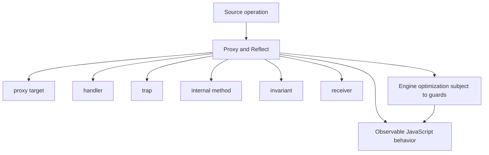
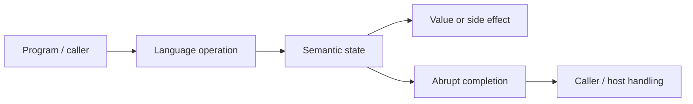
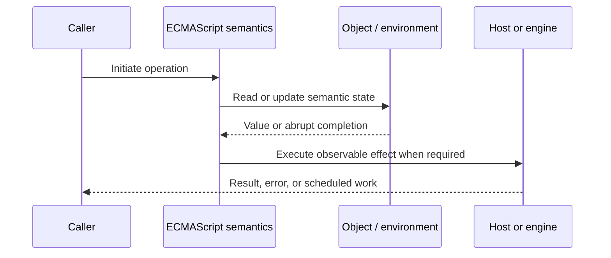
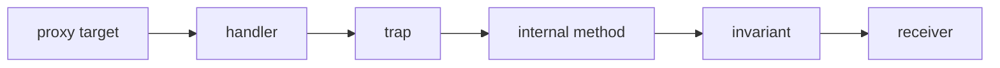

# Proxy and Reflect

## Overview

A Proxy interposes on an object's internal methods through handler traps. Reflect exposes function-shaped operations that closely mirror those internal methods and is the safest default for forwarding behavior.

This note separates the ECMAScript language model from engine implementation choices and host behavior. That distinction matters: specification algorithms define correctness, while engines remain free to optimize as long as observable behavior is preserved.

## Learning Objectives

- Define proxy target and distinguish it from handler
- Trace trap through the relevant ECMAScript operations
- Predict edge cases without relying on engine folklore
- Evaluate memory, performance, security, and API-design trade-offs
- Apply the mechanism safely in production JavaScript

## Prerequisites

- [[01-Computer-Science/00-Orientation/How Computers Run Programs|How Computers Run Programs]]
- [[01-Computer-Science/03-Memory-and-Addressing/Stack and Heap|Stack and Heap]]
- [[01-Computer-Science/03-Memory-and-Addressing/Garbage Collection Models|Garbage Collection Models]]
- [[02-JavaScript/README|JavaScript]]

## Difficulty

`expert`

## Estimated Time

90–120 minutes for reading and examples; 2–4 hours for exercises and the mini project.

## History

ES2015 replaced limited older metaprogramming hooks with a coherent membrane-capable mechanism. Invariants preserve fundamental object guarantees despite interception.

## Problem It Solves

Proxies enable validation, virtualization, access control, and reactivity, but they add identity boundaries, receiver/private-field surprises, invariant failures, and substantial observability/performance complexity.

## First-Principles Model

1. A proxy has a target and handler; revocation can permanently disable all operations.
2. Each trap corresponds to operations such as `[[Get]]`, `[[Set]]`, `[[OwnPropertyKeys]]`, or `[[Call]]`.
3. Missing traps forward to the target.
4. Reflect methods return specification-aligned values and preserve receiver/newTarget parameters.
5. Trap results must obey invariants involving non-configurable properties, extensibility, prototypes, and own keys.
6. `get(target, key, receiver)` should usually use `Reflect.get` so inherited accessors receive the original receiver.
7. A proxy is a distinct identity from its target and therefore differs as a Map key.
8. Private-field access through a proxy commonly fails because the proxy lacks the target's private brand.

The useful debugging question is not “what does JavaScript usually do?” but “which abstract operation runs, what state does it read, and what observable result follows?” This framing survives minification, transpilation, optimization, and framework changes.

## Internal Implementation

- Operations dispatch to proxy exotic internal methods, which fetch and call the relevant handler trap.
- The engine validates trap results against target state after the trap returns.
- Recursive `Reflect` calls can loop if they operate on the same proxy rather than an underlying target.
- Membranes maintain target/proxy identity maps, often in WeakMaps, to preserve graph consistency.
- Proxy-heavy hot paths can defeat inline-cache assumptions; profile actual workloads before adoption.

These are semantic obligations rather than a mandate for a specific physical representation. Connect them to [[01-Computer-Science/08-Languages-and-Computation/Compilers Interpreters and Virtual Machines|Compilers Interpreters and Virtual Machines]], [[01-Computer-Science/03-Memory-and-Addressing/Stack and Heap|Stack and Heap]], and [[01-Computer-Science/03-Memory-and-Addressing/Garbage Collection Models|Garbage Collection Models]]: optimized code may use registers, native frames, compact tables, or heap contexts while preserving the same language-level result.



## Mermaid Diagrams

### Structure



### Sequence / Lifecycle



### Mechanism Detail



## Examples

### Minimal Example

```js
const target = { count: 0 };
const observed = new Proxy(target, {
  set(object, key, value, receiver) {
    if (key === "count" && !Number.isInteger(value)) return false;
    return Reflect.set(object, key, value, receiver);
  }
});

observed.count = 1;
```

Trace this example before running it. Record binding/receiver/property state at each line, then compare the trace with the actual output.

### Production-Shaped Example

```js
export function createAuditedView(target, audit) {
  const revoked = Proxy.revocable(target, {
    get(object, key, receiver) {
      audit({ operation: "get", key: String(key) });
      return Reflect.get(object, key, receiver);
    },
    set(object, key, value, receiver) {
      audit({ operation: "set", key: String(key) });
      return Reflect.set(object, key, value, receiver);
    }
  });
  return Object.freeze({ value: revoked.proxy, close: revoked.revoke });
}
```

The production-shaped version validates assumptions, gives failures domain context, and makes lifecycle behavior visible. It still needs tests for malformed input and whichever host runtime deploys it.

## Trade-offs

| Approach | Upside | Downside | When it matters |
| --- | --- | --- | --- |
| Proxy | Interposes broadly without changing callers | Identity, invariant, and performance costs | Framework boundaries |
| Explicit wrapper | Visible contract and easy typing | Must forward each operation | Application services |
| Descriptor accessor | Small targeted interception | Only known properties | Focused validation |

No choice is universally best. Prefer the simplest mechanism that preserves the required semantics, then measure memory and latency under representative workload rather than microbenchmarks alone.

### When to Use

- Use the mechanism when its semantics directly express a stable domain or lifecycle requirement.
- Use it when tests can cover both normal and abrupt completion paths.
- Use it when maintainers can observe and debug the resulting state transitions.

### When Not to Use

- Do not use a clever language feature merely to reduce line count.
- Avoid it when an explicit data structure or named function communicates ownership better.
- Do not depend on undocumented engine optimization behavior for correctness.

## Performance, Memory, and Security

- **Allocation:** Determine whether the pattern creates per-call objects, closures, wrappers, or collections.
- **Reachability:** Long-lived listeners, caches, registries, and suspended computations can retain an entire object graph.
- **Optimization:** Stable shapes and call sites help engines, but optimization tiers and heuristics are not API contracts.
- **Input limits:** Bound depth, size, key count, and work when values cross a trust boundary.
- **Side effects:** Getters, proxies, iterators, coercion hooks, and callbacks can run user code inside apparently simple syntax.
- **Observability:** Emit domain events and timings; never parse engine-specific stack text as a primary protocol.

## Production Practices

- Use Reflect for default forwarding.
- Preserve one proxy per target in membranes.
- Test sealed and non-configurable targets.
- Provide revocation for authority-bearing views.
- Avoid leaking raw targets around a security membrane.
- Benchmark proxy use in measured hot paths.

At public boundaries, validate first, normalize once, and construct trusted domain values only after validation. Keep errors actionable without logging secrets or entire retained object graphs.

## Exercises

1. Predict the observable result of five edge cases involving **proxy target**, then verify them in two engines.
2. Instrument a small example to expose **handler** and explain every transition from specification operations.
3. Write table-driven tests for the listed common mistakes, including strict-mode and module execution.
4. Compare the first trade-off alternatives with a benchmark and a maintainability review; do not optimize from timing alone.
5. Extend the relevant exercise in [[02-JavaScript/code/README|JavaScript code labs]] with malformed, adversarial, and high-volume inputs.

For every exercise, include tests for success, malformed input, abrupt completion, and cleanup. Explain observed results from first principles rather than merely recording them.

## Mini Project

Implement logging, validation, revocable, and read-only proxies; test descriptors, symbols, arrays, methods, and invariants.

Required deliverables: implementation, automated tests, a Mermaid lifecycle diagram, benchmark methodology, and a short failure-mode analysis.

## Portfolio Project

Build a graph membrane using WeakMap identity preservation, revocation, audit events, and tests against target leakage.

Package it with a stable API, examples, generated documentation, CI checks, changelog discipline, and a production-readiness section covering limits and observability.

## Interview Questions

1. What internal operations can proxies intercept?
2. Why are proxy invariants necessary?
3. Why does receiver matter in `Reflect.get`?
4. Why can private fields fail through proxies?
5. How does a membrane preserve identity?
6. When is an explicit wrapper safer?

### Stretch / Staff-Level

1. Design a migration from a codebase that misuses proxy target; include compatibility, telemetry, staged rollout, and rollback.
2. Explain which guarantees belong to ECMAScript, which are engine heuristics, and which belong to the browser or Node.js host.
3. Describe a production incident involving this mechanism and the evidence you would collect before proposing a fix.

Strong answers name the controlling abstract operations, distinguish identity from equality or ownership, discuss abrupt completion, and state operational limits.

## Common Mistakes

- **Returning incompatible `ownKeys` for a non-extensible target.** Reproduce this case in a focused test before relying on intuition.
- **Forwarding `get` with the target as receiver.** Reproduce this case in a focused test before relying on intuition.
- **Wrapping private-field instances without method adaptation.** Reproduce this case in a focused test before relying on intuition.
- **Assuming proxy and target have equal identity.** Reproduce this case in a focused test before relying on intuition.
- **Using proxies for ordinary business validation that an explicit API would clarify.** Reproduce this case in a focused test before relying on intuition.

## Best Practices

- Use Reflect for default forwarding.
- Preserve one proxy per target in membranes.
- Test sealed and non-configurable targets.
- Provide revocation for authority-bearing views.
- Avoid leaking raw targets around a security membrane.
- Benchmark proxy use in measured hot paths.

## Summary

A Proxy interposes on an object's internal methods through handler traps. Reflect exposes function-shaped operations that closely mirror those internal methods and is the safest default for forwarding behavior. The production rule is to model the semantics precisely, constrain untrusted work, make ownership and cleanup explicit, and treat engine optimization as measured implementation behavior rather than a language guarantee.

## Further Reading

- [ECMAScript Language Specification](https://tc39.es/ecma262/)
- [MDN JavaScript Guide](https://developer.mozilla.org/docs/Web/JavaScript/Guide)
- [[00-References/JavaScript/README|JavaScript References]]
- [[02-JavaScript/code/README|JavaScript code labs]]

## Related Notes

- [[02-JavaScript/03-Objects-and-Metaprogramming/Property Descriptors and Object Integrity|Property Descriptors and Object Integrity]]
- [[02-JavaScript/projects/Reactive State with Proxy/README|Reactive State with Proxy]]
- [[02-JavaScript/code/README|JavaScript code labs]]
- [[01-Computer-Science/00-Orientation/How Computers Run Programs|How Computers Run Programs]]

## Progress Checklist

- [ ] Explained the mechanism from first principles
- [ ] Drew and narrated every Mermaid diagram
- [ ] Predicted the minimal example before executing it
- [ ] Implemented malformed and adversarial tests
- [ ] Documented performance, memory, security, and non-goals
- [ ] Completed the mini project
- [ ] Practiced interview questions aloud
- [ ] Linked prerequisites and dependent topics
