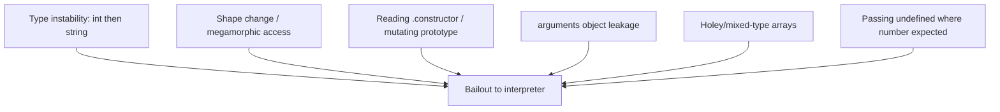
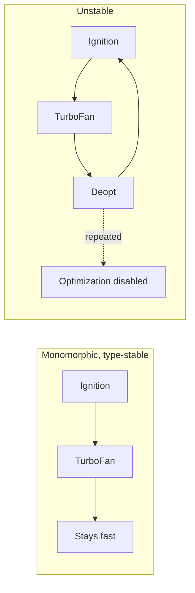
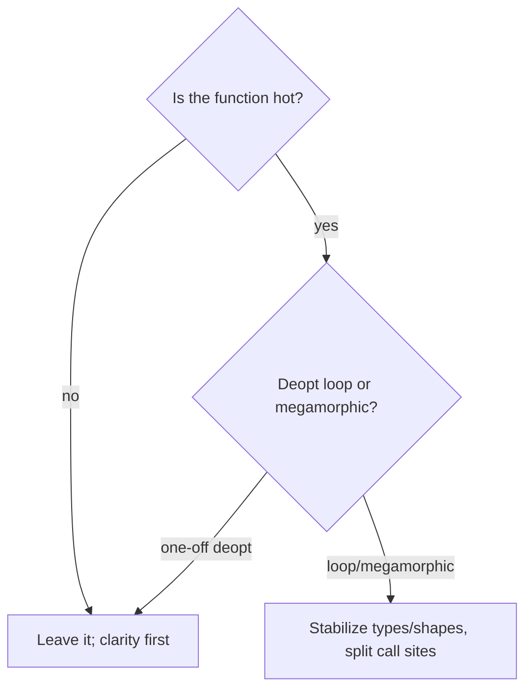

# Deoptimization and Performance Cliffs

## Overview

An optimizing JIT is a **gambler**: it bets that the types and shapes it saw so far will keep holding, emits fast machine code guarded by cheap checks, and wins big when the bet pays off. **Deoptimization** is what happens when the bet loses—a guard fails, and the engine must **abandon the optimized code mid-execution** and fall back to the bytecode interpreter, reconstructing the interpreter's state from the optimized frame. Done once, it's harmless. Done repeatedly (**deopt loops**) or triggered structurally (**megamorphic** call sites, unsupported constructs), it produces a **performance cliff**: code that is 10–100× slower than it looks, with no syntax error to warn you.

This note is the failure-mode companion to [[02-JavaScript/04-Engines-and-Memory/Interpreters JIT and Optimization Tiers|Interpreters JIT and Optimization Tiers]] and [[02-JavaScript/04-Engines-and-Memory/Hidden Classes Shapes and Inline Caches|Hidden Classes Shapes and Inline Caches]]. It teaches you to recognize, measure, and eliminate the patterns that make the JIT bail out.

## Learning Objectives

- Explain what deoptimization is and how state is reconstructed (**deopt / bailout**)
- Distinguish **eager** vs. **lazy** deopt and one-off deopt vs. deopt loops
- Enumerate the common triggers: type instability, shape changes, `arguments` misuse, `try/catch` (historically), holey arrays, mixed types
- Use `--trace-deopt` / `--trace-opt` to find and interpret bailouts
- Refactor hot code to stay optimized and avoid cliffs

## Prerequisites

- [[02-JavaScript/04-Engines-and-Memory/Interpreters JIT and Optimization Tiers|Interpreters JIT and Optimization Tiers]]
- [[02-JavaScript/04-Engines-and-Memory/Hidden Classes Shapes and Inline Caches|Hidden Classes Shapes and Inline Caches]]
- [[02-JavaScript/07-Production-JavaScript/Measuring and Optimizing Performance|Measuring and Optimizing Performance]]

## Difficulty

`advanced`

## Estimated Time

- Reading: 2 hours
- Exercises: 3 hours
- Mini project: 4 hours

## History

Speculative optimization with deopt fallback comes from **Self** and Java **HotSpot**; V8's Crankshaft (2010) and later TurboFan (2017) both rely on it. Early advice ("never use `try/catch` in hot code," "avoid `arguments`") reflected real Crankshaft limitations—many of which **TurboFan later fixed**. This is why deopt guidance must be **version-aware and measured**, not cargo-culted: what was a cliff in 2015 may be flat in 2024.

## Problem It Solves

Deoptimization isn't a bug—it's the **safety mechanism that makes speculation sound**. Without it, the engine couldn't assume "these are always integers" because the assumption could be violated. Understanding it lets you:

- Keep hot paths on the fast tier instead of bouncing to the interpreter.
- Avoid structural cliffs (megamorphic sites) that no amount of warm-up fixes.
- Diagnose "why is this suddenly slow?" with real tooling instead of superstition.

## Internal Implementation

### What a deopt actually does

Optimized code holds values in registers/stack in an optimized layout. When a guard fails, the engine performs a **deopt**: it maps the optimized frame back to the interpreter's expected frame (locals, accumulator, bytecode offset) using **deoptimization metadata** recorded at compile time, then resumes in Ignition at the right bytecode.

```mermaid
sequenceDiagram
    participant Opt as Optimized Code
    participant Guard as Type/Shape Guard
    participant Deopt as Deoptimizer
    participant Ign as Ignition
    Opt->>Guard: check assumption (e.g. isSmi(a))
    alt guard holds
        Guard-->>Opt: continue fast
    else guard fails
        Guard->>Deopt: bail out
        Deopt->>Ign: rebuild interpreter frame, resume at bytecode offset
        Note over Ign: re-collect feedback; may re-optimize later
    end
```

- **Eager deopt**: the guard is checked and fails at that instruction.
- **Lazy deopt**: code is invalidated *because some assumption elsewhere changed* (e.g., a prototype was mutated), so the optimized code is marked invalid and deopts when next entered.

### Deopt loops and blacklisting

If a function is optimized, deopts, gets re-optimized, and deopts again repeatedly, the engine detects the instability and may **stop optimizing it** ("disabled optimization for this function"). Now it runs in the interpreter/baseline forever—the worst cliff.

### Common triggers (measure before trusting any list)



- **Type instability**: a variable/argument that is sometimes a Smi, sometimes a double, sometimes a string.
- **Shape/megamorphic**: a call site seeing 5+ hidden classes (see [[02-JavaScript/04-Engines-and-Memory/Hidden Classes Shapes and Inline Caches|Hidden Classes Shapes and Inline Caches]]).
- **`arguments` misuse**: leaking/reassigning `arguments` can prevent optimization; prefer rest params `(...args)`.
- **Prototype mutation**: changing an object's prototype after the fact invalidates ICs and can force lazy deopt.
- **Holey/mixed arrays**: element-kind transitions (packed→holey, Smi→double→object) generalize to slower code paths.
- **`try/catch`/`try/finally`**: historically deopt-prone; modern TurboFan handles them far better—**verify with your engine version**.

### The "megamorphic" cliff is different

Type-instability deopts are dynamic and recoverable. A **megamorphic** call site is *structural*: the engine simply cannot specialize a site that sees too many shapes, so it uses a generic slow path regardless of warm-up. There's no deopt event—just permanently slower code.

## Mermaid Diagrams

### Cliff vs. stable



### Decision: is this worth fixing?



## Examples

### Minimal Example — a type-instability deopt

```bash
node --allow-natives-syntax --trace-deopt script.js
```

```javascript
function add(a, b) {
  return a + b;
}

for (let i = 0; i < 1e5; i++) add(i, i);   // warms up as integer add
%OptimizeFunctionOnNextCall(add);
add(1, 2);                                  // optimized (Smi + Smi)
add("x", "y");                              // guard fails -> DEOPT (string path)
```

`--trace-deopt` prints a line naming `add`, the bailout reason (e.g., `wrong map` / `not a Smi`), and the bytecode offset.

### Production-Shaped Example — killing a megamorphic cliff

```javascript
// SLOW: one generic function reads .value off many different shapes -> megamorphic.
function sumValues(items) {
  let s = 0;
  for (const it of items) s += it.value; // it: {value}, {value, x}, {a,value}, ...
  return s;
}

// FIX 1: normalize to a single shape at the boundary (monomorphic access).
const norm = items.map((it) => ({ value: Number(it.value) || 0 }));

// FIX 2: if inputs are genuinely heterogeneous, split by type into
// separate, individually-monomorphic loops.
function sumByKind(groups) {
  let s = 0;
  for (const g of groups.circles) s += g.value; // site sees one shape
  for (const g of groups.squares) s += g.value; // different site, one shape
  return s;
}
```

Always confirm the win with a profiler and `--trace-deopt`; see [[02-JavaScript/07-Production-JavaScript/Measuring and Optimizing Performance|Measuring and Optimizing Performance]].

## Trade-offs

| Dimension | Upside | Downside | When it matters |
| --- | --- | --- | --- |
| Speculation + deopt | Fast common case, sound fallback | One-off deopt cost | Every optimized function |
| Type stabilization | Keeps code on fast tier | More normalization code | Hot loops |
| Splitting call sites | Restores monomorphism | Code duplication | Framework/generic code |
| Rest params over `arguments` | Optimizer-friendly, clearer | Minor rewrite | Variadic hot fns |
| Chasing every deopt | (usually none) | Wasted effort, worse readability | Cold code |

### When to Use

- Stabilize types/shapes on **proven-hot** paths identified by a profiler.
- Split megamorphic sites when data is genuinely heterogeneous and hot.

### When Not to Use

- Don't refactor cold code for deopts—it never gets optimized anyway.
- Don't cargo-cult old rules (e.g., "no try/catch") without measuring on your engine version.

## Exercises

1. Trigger a one-off deopt with `--trace-deopt` and read the bailout reason.
2. Create a deopt loop and observe "optimization disabled" being logged.
3. Rewrite a function using `arguments` to use rest params; compare optimization status.
4. Build a megamorphic call site (6 shapes) and show no warm-up recovers speed.
5. Test whether `try/catch` deopts on your current Node version—report the result.

## Mini Project

**Deopt detective.** A Node harness that runs a target module under `--trace-opt --trace-deopt`, parses the output, and produces a ranked report: functions with repeated deopts, their bailout reasons, and source locations. Include a "megamorphic site" heuristic. Store in [[02-JavaScript/code/README|JavaScript code labs]].

## Portfolio Project

Extend the detective into a **performance regression gate** for CI: run representative workloads, fail the build if new deopt loops or megamorphic hot sites appear versus a baseline, and produce an annotated diff. Combine with [[02-JavaScript/04-Engines-and-Memory/Hidden Classes Shapes and Inline Caches|Hidden Classes Shapes and Inline Caches]] linting.

## Interview Questions

1. What is deoptimization and why is it necessary for speculative JITs?
2. Difference between eager and lazy deopt.
3. What is a deopt loop and why is it worse than a single deopt?
4. How does a megamorphic call site differ from a type-instability deopt?
5. Why should performance rules be verified against a specific engine version?

### Stretch / Staff-Level

1. How does the deoptimizer reconstruct interpreter state from optimized frames?
2. How does prototype mutation cause lazy deopt across many functions?

## Common Mistakes

- Treating a single deopt as a problem (it usually isn't).
- Following outdated rules without measuring on the current engine.
- Creating megamorphic sites in "reusable" generic helpers on hot paths.
- Mixing types in variables/arrays inside hot loops.
- Optimizing cold code that never reaches TurboFan.

## Best Practices

- Profile first; only stabilize **hot** functions.
- Keep argument and variable types stable; normalize external data at the boundary.
- Prefer rest parameters over the `arguments` object.
- Split genuinely heterogeneous hot loops into monomorphic ones.
- Re-benchmark performance folklore on your target engine version before applying it.

## Summary

Deoptimization is the safety net that makes speculative JIT compilation correct: when a guard on an assumed type or shape fails, the engine reconstructs interpreter state and falls back. A one-off deopt is fine; **deopt loops** and **megamorphic** call sites create real performance cliffs, sometimes disabling optimization entirely. Fix them by keeping hot paths type-stable and monomorphic, using rest params, and splitting heterogeneous loops—always guided by `--trace-deopt` and a profiler, and always verified against your engine version rather than folklore.

## Further Reading

- [[00-References/JavaScript/README|JavaScript References]]
- V8 blog — *An introduction to speculative optimization in V8*, *TurboFan*
- Vyacheslav Egorov — *What's up with monomorphism?* and deopt write-ups
- [[02-JavaScript/04-Engines-and-Memory/Interpreters JIT and Optimization Tiers|Interpreters JIT and Optimization Tiers]]

## Related Notes

- [[02-JavaScript/04-Engines-and-Memory/Interpreters JIT and Optimization Tiers|Interpreters JIT and Optimization Tiers]]
- [[02-JavaScript/04-Engines-and-Memory/Hidden Classes Shapes and Inline Caches|Hidden Classes Shapes and Inline Caches]]
- [[02-JavaScript/04-Engines-and-Memory/Parsing AST and Bytecode|Parsing AST and Bytecode]]
- [[02-JavaScript/07-Production-JavaScript/Measuring and Optimizing Performance|Measuring and Optimizing Performance]]

## Progress Checklist

- [ ] Explained from first principles
- [ ] Drew at least one Mermaid diagram
- [ ] Implemented a minimal version
- [ ] Documented trade-offs and non-goals
- [ ] Completed exercises
- [ ] Practiced interview questions aloud
- [ ] Linked prerequisites and dependents
