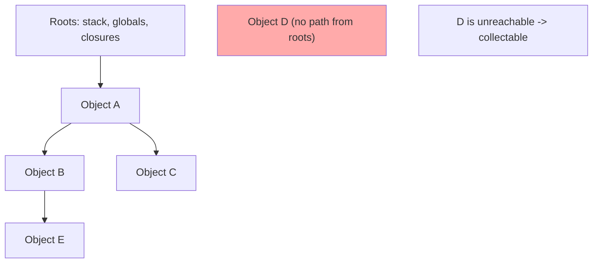
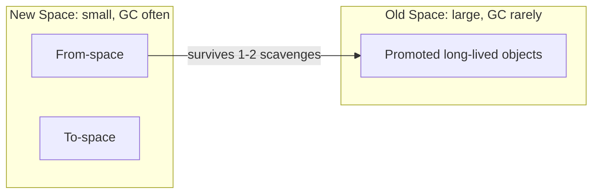
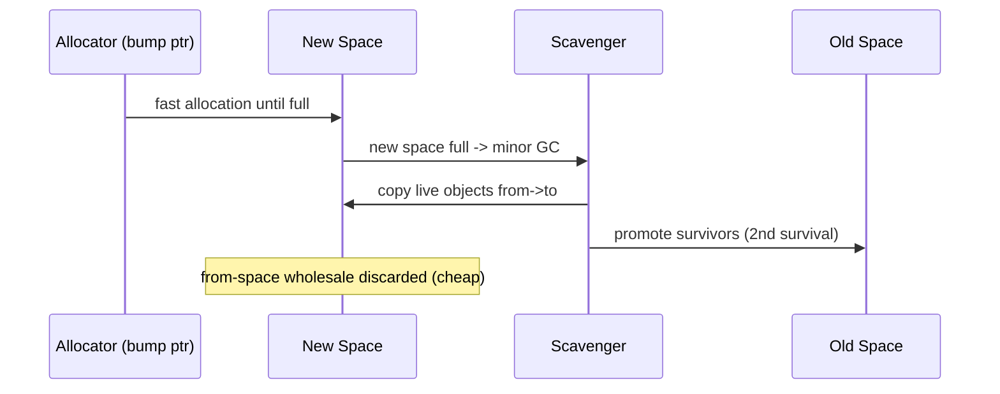
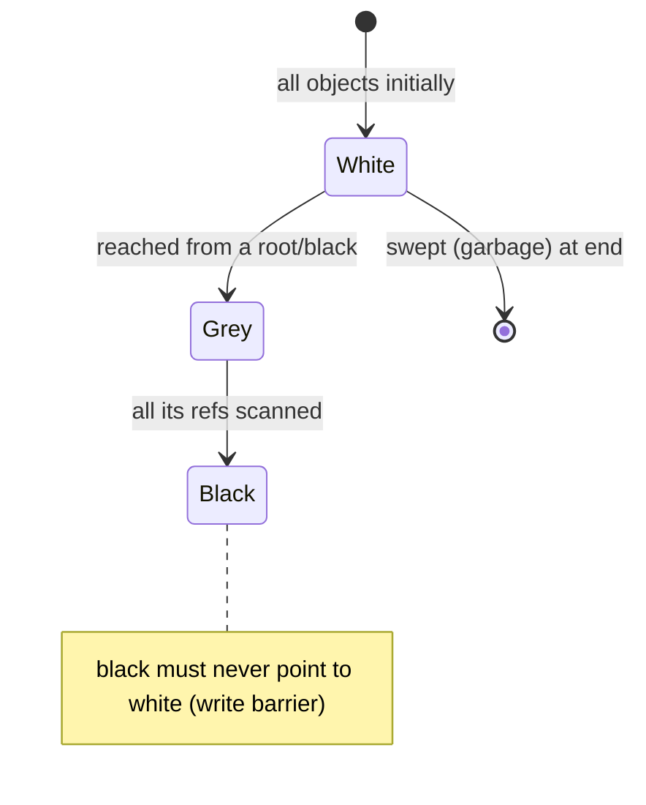
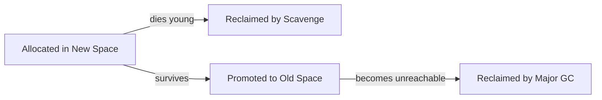

# Garbage Collection in JavaScript

## Overview

JavaScript is a **garbage-collected** language: you never free memory manually. The engine automatically reclaims objects that are no longer **reachable** from a set of **roots** (the stack, globals, and active closures). The critical, non-negotiable idea is: **GC frees the unreachable, not the "unused."** An object you'll never touch again but that is still referenced from a live data structure is, to the collector, alive. This is why "memory leaks" exist even with automatic GC—covered in depth in [[02-JavaScript/04-Engines-and-Memory/Memory Leaks and Retention|Memory Leaks and Retention]].

This note explains **how** modern engines collect: the **generational hypothesis**, V8's **Orinoco** collector (the **Scavenger** for the young generation and **mark-compact** for the old generation), and how these run **incrementally and concurrently** to avoid long pauses. The general theory (reference counting vs. tracing, tri-color marking) lives in [[01-Computer-Science/03-Memory-and-Addressing/Garbage Collection Models|Garbage Collection Models]]; here we specialize it to JavaScript.

GC pauses are a **latency** concern (jank in the browser, tail latency on the server), so understanding GC is as much about *when it runs* as *what it frees*.

## Learning Objectives

- Define reachability, roots, and the garbage collector's actual contract
- Explain the generational hypothesis and why young/old separation is efficient
- Trace a minor (Scavenge) GC and a major (mark-compact) GC in V8
- Understand incremental, concurrent, and parallel GC and how they hide pauses
- Use `WeakRef`, `WeakMap`, and `FinalizationRegistry` correctly and know their caveats

## Prerequisites

- [[02-JavaScript/04-Engines-and-Memory/JavaScript Memory Model|JavaScript Memory Model]]
- [[01-Computer-Science/03-Memory-and-Addressing/Garbage Collection Models|Garbage Collection Models]]
- [[02-JavaScript/03-Objects-and-Metaprogramming/Map Set WeakMap and WeakSet|Map Set WeakMap and WeakSet]]

## Difficulty

`advanced`

## Estimated Time

- Reading: 2–3 hours
- Exercises: 3 hours
- Mini project: 5 hours

## History

Early V8 used a stop-the-world mark-sweep-compact collector that caused visible pauses. From ~2011 onward, V8's **Orinoco** project incrementally added **parallel**, **incremental**, and **concurrent** collection to keep pauses under a few milliseconds. The **generational** design (young "new space," old "old space") reflects the decades-old **generational hypothesis** from Lisp/Smalltalk research: *most objects die young*. `WeakMap`/`WeakSet` landed in ES2015; `WeakRef` and `FinalizationRegistry` in ES2021 to give controlled, GC-aware references.

## Problem It Solves

- **Manual memory management is error-prone**: use-after-free, double-free, and leaks plague C/C++. GC removes whole bug classes (see [[01-Computer-Science/03-Memory-and-Addressing/Memory Safety Fundamentals|Memory Safety Fundamentals]]).
- **But naive GC pauses**: a stop-the-world full heap scan on a 2 GB heap would freeze the UI. Generational + concurrent GC keeps the common case cheap and pauses short.

## Internal Implementation

### Reachability and roots

The collector starts from **roots**—the execution stack, global object, and handles—and traverses every reference. Anything reachable is **live**; everything else is garbage.



### The generational heap (V8)



- **New space** is small (a few MB) and split into two semi-spaces. Allocation is a **bump pointer** (just increment a pointer)—extremely cheap.
- A **minor GC (Scavenge)** copies live young objects from `from-space` to `to-space` (Cheney's algorithm). Dead objects aren't touched—cost is proportional to *survivors*, not garbage. Objects that survive a couple of scavenges are **promoted** to old space.
- **Old space** is collected by an infrequent **major GC**: **mark-sweep-compact** with tri-color marking, done incrementally/concurrently.

### Minor GC (Scavenge) flow



### Major GC: incremental + concurrent + parallel

The old-generation collector uses **tri-color marking** (white=unvisited, grey=to-scan, black=done). To avoid long pauses:

- **Incremental**: marking is split into small chunks interleaved with execution. A **write barrier** records pointer mutations so concurrent changes don't lose objects.
- **Concurrent**: marking (and some sweeping) runs on **background threads** while JS executes.
- **Parallel**: multiple helper threads share the work of a single GC phase.
- **Compaction**: defragments old space by moving objects and fixing pointers, reducing fragmentation.

The result: main-thread pause times often in the low single-digit milliseconds, even for large heaps.

### Weak references

Normal references keep objects alive. **Weak** references don't:

- `WeakMap`/`WeakSet`: keys are held weakly; entries vanish when the key is otherwise unreachable. Ideal for metadata keyed by object without preventing collection.
- `WeakRef`: a manual weak pointer; `.deref()` returns the object or `undefined` if collected.
- `FinalizationRegistry`: schedules a cleanup callback *after* an object is collected—**best-effort, non-deterministic**, not guaranteed to run.

## Mermaid Diagrams

### Tri-color marking state



### Object lifecycle



## Examples

### Minimal Example — observing GC

```bash
node --expose-gc --trace-gc script.js
```

```javascript
function churn() {
  let arr = [];
  for (let i = 0; i < 1e6; i++) arr.push({ i }); // young allocations
  return arr.length; // arr becomes unreachable after return
}
churn();
global.gc(); // force a GC (only with --expose-gc; diagnostics only)
console.log(process.memoryUsage().heapUsed);
```

`--trace-gc` prints `Scavenge` and `Mark-sweep` lines with pause durations and heap sizes.

### Production-Shaped Example — GC-aware caching with WeakMap

```javascript
// Cache derived data keyed by an object WITHOUT preventing that object's collection.
const derivedCache = new WeakMap();

function getExpensiveView(entity) {
  let view = derivedCache.get(entity);
  if (!view) {
    view = buildExpensiveView(entity); // heavy computation
    derivedCache.set(entity, view);
  }
  return view;
}
// When `entity` is no longer referenced elsewhere, both it and its cached
// view become collectable automatically -> no manual eviction, no leak.
```

For a bounded cache with cleanup notification, combine `WeakRef` + `FinalizationRegistry`, but treat finalizers as best-effort—never put critical resource release (file handles, sockets) solely in a finalizer.

## Trade-offs

| Dimension | Upside | Downside | When it matters |
| --- | --- | --- | --- |
| Generational GC | Cheap collection of short-lived objects | Promotion of surviving garbage | Allocation-heavy code |
| Bump-pointer alloc | Near-free allocation | Requires copying collector | Hot allocation loops |
| Incremental/concurrent | Short pauses | Write-barrier overhead, complexity | UI smoothness, tail latency |
| Compaction | Less fragmentation | Must move objects + fix pointers | Long-lived servers |
| WeakMap/WeakRef | No manual eviction | Non-deterministic timing | Caches, metadata |

### When to Use

- Let GC do its job; design to **let objects die young** (short-lived allocations, no lingering references).
- Use `WeakMap` for object-keyed caches/metadata that should not extend lifetime.

### When Not to Use

- Don't rely on `FinalizationRegistry` for deterministic cleanup—use explicit `close()`/`dispose()` and `try/finally`.
- Don't call `global.gc()` in production to "fix" memory; it's a diagnostic, and forcing full GCs harms throughput.

## Exercises

1. Run `--trace-gc` and distinguish Scavenge vs. Mark-sweep events by size/frequency.
2. Write code that keeps objects alive by accident (in a closure/array) and prove it with `heapUsed`.
3. Convert a `Map` cache to `WeakMap` and demonstrate keys are collected.
4. Show that a `FinalizationRegistry` callback timing is non-deterministic.
5. Explain why "cost of a Scavenge is proportional to survivors, not garbage."

## Mini Project

**GC observatory.** Build a Node script that stresses allocation with tunable object lifetimes and logs GC events (via `perf_hooks` `PerformanceObserver` for `gc` entries), then plots pause time and heap size over time. Show how lifetime distribution changes minor vs. major GC frequency. Save to [[02-JavaScript/code/README|JavaScript code labs]].

## Portfolio Project

Build an **in-memory LRU + Weak hybrid cache** library: strong references for the hot N entries, `WeakRef` for the tail, `FinalizationRegistry` for eviction metrics. Include benchmarks of hit rate vs. memory and a written analysis of GC interaction. Cross-link [[02-JavaScript/04-Engines-and-Memory/Memory Leaks and Retention|Memory Leaks and Retention]].

## Interview Questions

1. What does a garbage collector actually free—unused or unreachable objects?
2. Explain the generational hypothesis and how V8 exploits it.
3. Walk through a minor GC (Scavenge). Why is its cost proportional to survivors?
4. How do incremental/concurrent GC and write barriers reduce pause times?
5. When would you use a `WeakMap` vs. a `Map`?

### Stretch / Staff-Level

1. Why is `FinalizationRegistry` unsuitable for releasing OS resources?
2. Describe how compaction fixes fragmentation and what it costs.

## Common Mistakes

- Believing GC frees "unused" memory (it frees **unreachable** memory).
- Using `WeakMap` values expecting them to be weak (only **keys** are weak).
- Relying on finalizers for correctness-critical cleanup.
- Calling `global.gc()` in production or benchmarking without accounting for it.
- Assuming no GC pauses—design for tail latency in real-time paths.

## Best Practices

- Structure code so most objects are **short-lived**; avoid stashing them in long-lived containers.
- Prefer `WeakMap`/`WeakSet` for object-keyed caches and per-object metadata.
- Provide explicit `dispose()`/`close()` for resources; use `try/finally`, not finalizers.
- Monitor GC in production via `perf_hooks`/`--trace-gc` and alert on rising old-space size.
- Reuse buffers/pools for very high-churn hot paths to cut allocation pressure.

## Summary

JavaScript's collector reclaims **unreachable** objects starting from roots. Modern engines use a **generational** heap: a small new space collected cheaply by a copying **Scavenger** (cost ∝ survivors), and a large old space collected infrequently by **incremental, concurrent, parallel mark-compact** to keep pauses tiny. You control GC indirectly by controlling **reachability and object lifetimes**. Weak references let you build caches and metadata without extending lifetimes—but finalization is best-effort, so keep deterministic cleanup explicit.

## Further Reading

- [[00-References/JavaScript/README|JavaScript References]]
- V8 blog — *Orinoco: young generation GC*, *Concurrent marking in V8*
- Jones, Hosking, Moss — *The Garbage Collection Handbook*
- [[01-Computer-Science/03-Memory-and-Addressing/Garbage Collection Models|Garbage Collection Models]]

## Related Notes

- [[02-JavaScript/04-Engines-and-Memory/JavaScript Memory Model|JavaScript Memory Model]]
- [[02-JavaScript/04-Engines-and-Memory/Memory Leaks and Retention|Memory Leaks and Retention]]
- [[02-JavaScript/03-Objects-and-Metaprogramming/Map Set WeakMap and WeakSet|Map Set WeakMap and WeakSet]]
- [[01-Computer-Science/03-Memory-and-Addressing/Memory Safety Fundamentals|Memory Safety Fundamentals]]
- [[06-NodeJS/08-Diagnostics-and-Performance/Memory Limits and Heap Flags|Memory Limits and Heap Flags]] · [[06-NodeJS/README|Node.js]]

## Progress Checklist

- [ ] Explained from first principles
- [ ] Drew at least one Mermaid diagram
- [ ] Implemented a minimal version
- [ ] Documented trade-offs and non-goals
- [ ] Completed exercises
- [ ] Practiced interview questions aloud
- [ ] Linked prerequisites and dependents
