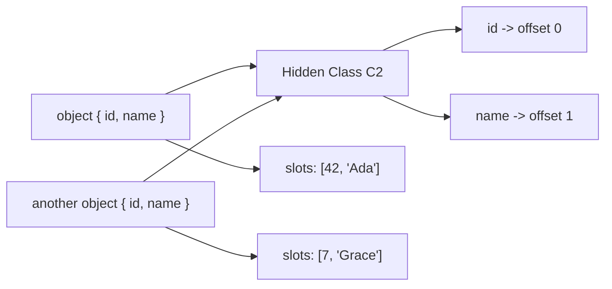
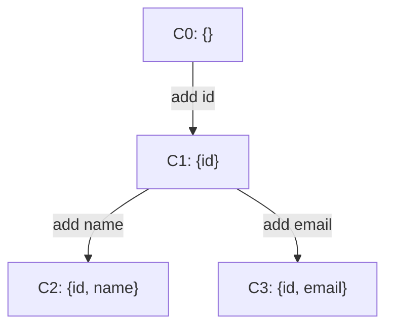
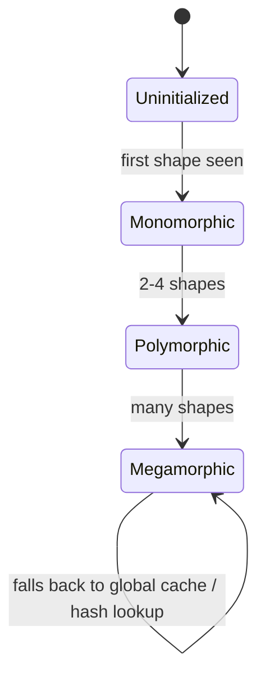
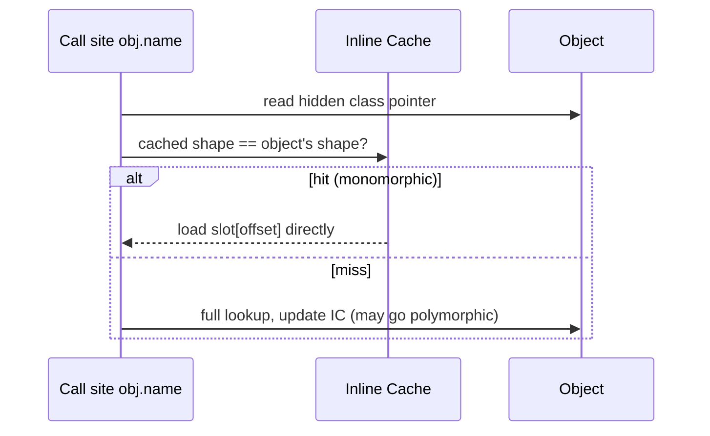
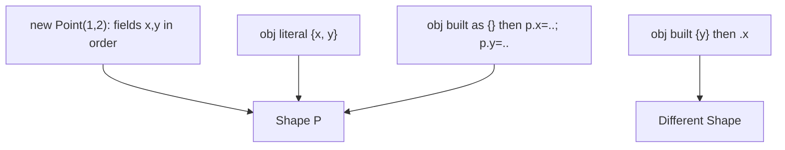

# Hidden Classes Shapes and Inline Caches

## Overview

JavaScript objects are, semantically, **dictionaries**: dynamic bags of string/symbol keys mapped to values. A naive engine would store every object as a hash map and do a hash lookup on every property access—far too slow. Instead, engines observe that programs create **millions of objects with the same structure** (e.g., every `User` has `id` and `name`) and factor that structure out into a shared, immutable descriptor called a **hidden class** (V8's term; SpiderMonkey calls it a **Shape**, JavaScriptCore a **Structure**).

With a hidden class, an object's properties live in a **fixed-offset array** like a C struct, and the hidden class records "property `name` is at offset 1." Property access becomes "load the object's hidden class, check it's the one I expect, then load a fixed offset"—and **inline caches (ICs)** memoize that check at each call site so repeated accesses are almost free.

This is *the* mechanism behind JavaScript's surprising speed, and understanding it explains a huge class of performance advice ("initialize all fields in the constructor," "don't `delete`," "keep arrays packed"). It sits between [[02-JavaScript/03-Objects-and-Metaprogramming/Objects and Property Keys|Objects and Property Keys]] and [[02-JavaScript/04-Engines-and-Memory/Deoptimization and Performance Cliffs|Deoptimization and Performance Cliffs]].

## Learning Objectives

- Explain what a hidden class/shape is and how it makes property access O(1) with a fixed offset
- Describe **transition trees**: how adding properties evolves an object's shape
- Define monomorphic, polymorphic, and megamorphic inline caches and their performance
- Identify code patterns that fragment shapes or blow ICs
- Write object code that stays fast without sacrificing clarity

## Prerequisites

- [[02-JavaScript/03-Objects-and-Metaprogramming/Objects and Property Keys|Objects and Property Keys]]
- [[02-JavaScript/03-Objects-and-Metaprogramming/Prototype Chain and Delegation|Prototype Chain and Delegation]]
- [[02-JavaScript/04-Engines-and-Memory/Interpreters JIT and Optimization Tiers|Interpreters JIT and Optimization Tiers]]

## Difficulty

`advanced`

## Estimated Time

- Reading: 2 hours
- Exercises: 3 hours
- Mini project: 4 hours

## History

The technique originates in the **Self** language (Chambers, Ungar, 1989–91), which introduced **maps** (hidden classes) and **polymorphic inline caches** to make a pure dynamic object language fast. V8 adopted "hidden classes" in 2008; the ideas propagated to every competitive JS engine. They are a direct answer to "how do you make a dictionary-based object model run like structs."

## Problem It Solves

- **Property access speed**: turns a hash lookup into a shape check + fixed-offset load.
- **Memory**: structure metadata (names, offsets, attributes) is stored **once per shape**, not once per object. A million `User` objects share one hidden class.
- **Enabling the JIT**: stable shapes give the optimizer the type information it needs to inline property access and method calls (see [[02-JavaScript/04-Engines-and-Memory/Interpreters JIT and Optimization Tiers|Interpreters JIT and Optimization Tiers]]).

## Internal Implementation

### Shapes and property storage

An object holds a pointer to its **hidden class** plus a **properties store** (in-object slots for the first few properties, then an overflow array). The hidden class maps property name → { offset, attributes }.



Two objects with the same properties **in the same order** share one hidden class.

### Transition trees

Shapes are **immutable**; adding a property creates a *new* shape and a **transition edge** from the old one. Engines cache transitions so that repeatedly building the same shape reuses existing hidden classes.



**Property order matters**: `{a, b}` and `{b, a}` produce *different* shapes and therefore different, incompatible transition paths—this is why consistent initialization order matters.

### Inline caches (ICs)

Each property-access site in bytecode has a feedback slot. The first time `obj.name` runs, the IC records "shape C2 → offset 1." Next time, if the object is still C2, it uses the cached offset directly.



- **Monomorphic** (1 shape): fastest; the optimizer can inline the load.
- **Polymorphic** (2–4 shapes): a small check list; still decent.
- **Megamorphic** (5+): IC gives up and uses a slower generic lookup; optimizer can't specialize.

### Dictionary (slow) mode

If you `delete` properties or add unpredictable keys, the engine may demote an object to **dictionary mode** (a real hash map). Fast for arbitrary mutation, slow for access—and it prevents inline caching entirely.

### Arrays have "element kinds"

V8 tracks packed vs. holey and Smi/double/element kinds (`PACKED_SMI_ELEMENTS`, `PACKED_DOUBLE_ELEMENTS`, `HOLEY_ELEMENTS`, …). Creating holes (`arr[100] = x` on a short array) or mixing types transitions the array to a slower, more general kind—these transitions are **one-way** (they only generalize).

## Mermaid Diagrams

### Access fast path



### Two constructors, two shapes



## Examples

### Minimal Example — same shape vs. different shape

```javascript
function Point(x, y) {
  this.x = x; // always same order
  this.y = y;
}
const a = new Point(1, 2);
const b = new Point(3, 4); // shares hidden class with `a`

// Anti-pattern: conditional / out-of-order property init -> multiple shapes
function Bad(x, y, withZ) {
  this.x = x;
  if (withZ) this.z = 0; // shape fork!
  this.y = y;            // now y lands at different offsets across instances
}
```

### Production-Shaped Example — normalizing shapes at the boundary

```javascript
// Data arrives from an API with inconsistent/optional fields.
// Normalize to ONE canonical shape so downstream hot code stays monomorphic.
function toUser(raw) {
  return {
    id: String(raw.id ?? ""),
    name: String(raw.name ?? ""),
    email: raw.email == null ? "" : String(raw.email), // present ALWAYS, never deleted
    active: Boolean(raw.active),
  };
}

// Hot loop now sees one shape -> monomorphic ICs -> optimizable.
function countActive(users) {
  let n = 0;
  for (let i = 0; i < users.length; i++) {
    if (users[i].active) n++;
  }
  return n;
}

const users = apiResults.map(toUser);
countActive(users);
```

Avoid `delete user.email`; set a sentinel instead so the shape and packed arrays stay stable. Diagnose with `node --allow-natives-syntax` and `%HasFastProperties(obj)`.

## Trade-offs

| Dimension | Upside | Downside | When it matters |
| --- | --- | --- | --- |
| Fixed-offset slots | O(1) property access | Requires stable structure | Hot object access |
| Shared hidden classes | Huge memory savings | Order/optionality fragment shapes | Millions of objects |
| Inline caches | Near-free repeated access | Megamorphic sites are slow | Generic/framework code |
| Dictionary mode | Fast arbitrary mutation | No IC, slow reads | Config bags, sparse maps |
| Packed arrays | SIMD-friendly, fast | Holes/mixed types demote kind | Numeric workloads |

### When to Use

- Use **stable, fully-initialized object shapes** for domain entities in hot paths.
- Use plain objects/`Map` appropriately: `Map` for truly dynamic keys, objects for fixed records.

### When Not to Use

- Don't obsess over shapes for cold, rarely-run code—clarity wins.
- Don't avoid `Map` where it's semantically correct just to chase hidden-class tricks.

## Exercises

1. Create 1,000 objects two ways (consistent vs. random property order) and compare access time.
2. Use `%HasFastProperties` to detect when `delete` demotes an object to dictionary mode.
3. Force a megamorphic call site by passing 6 different shapes to a function; measure the slowdown.
4. Create a holey array and a packed array of the same length; benchmark summation.
5. Explain why `{a:1, b:2}` and `{b:2, a:1}` are different shapes.

## Mini Project

**Shape inspector.** Using Node's `--allow-natives-syntax`, build a utility that reports whether an object has fast properties, prints its (approximate) shape by field order, and warns when two "equivalent" objects have divergent shapes. Add tests that intentionally fragment shapes. Store under [[02-JavaScript/code/README|JavaScript code labs]].

## Portfolio Project

Build a **hot-path linter**: a static + runtime tool that flags constructors with conditional field assignment, `delete` on hot objects, and mixed-type arrays, then reports likely megamorphic call sites from a profiling run. Pair with [[02-JavaScript/04-Engines-and-Memory/Deoptimization and Performance Cliffs|Deoptimization and Performance Cliffs]].

## Interview Questions

1. What is a hidden class/shape and what problem does it solve?
2. Why does property initialization order affect performance?
3. Define monomorphic, polymorphic, and megamorphic inline caches.
4. What is dictionary mode and what triggers it?
5. Why can `delete obj.prop` hurt performance beyond the delete itself?

### Stretch / Staff-Level

1. Explain array element kinds and why transitions are one-way.
2. How do hidden classes interact with the prototype chain for method call ICs?

## Common Mistakes

- Adding properties conditionally or out of order across instances.
- Using `delete` on objects in hot paths (prefer setting to `undefined`/sentinel or using a `Map`).
- Creating sparse/holey arrays unintentionally (`arr[i]` beyond length).
- Mixing integers and doubles/objects in numeric arrays.
- Assuming all objects with the same keys share a shape regardless of construction order.

## Best Practices

- Initialize **all** fields in the constructor, in a **consistent order**, with consistent types.
- Prefer classes / factory functions that produce one canonical shape.
- Use `Map`/`Set` for dynamic key collections instead of mutating object shapes.
- Keep numeric arrays packed and type-consistent; pre-size when you know length.
- Normalize external data to a canonical shape at the boundary before hot loops.

## Summary

Hidden classes (shapes/structures) let engines store dynamic objects like fixed-layout structs, sharing structure metadata across many instances and enabling O(1) fixed-offset property access. Inline caches memoize the shape-check at each access site; staying **monomorphic** keeps them fast, while shape fragmentation pushes sites to **megamorphic** and disables specialization. Practical performance advice—consistent field order, no `delete`, packed arrays, boundary normalization—all follows directly from this one mechanism.

## Further Reading

- [[00-References/JavaScript/README|JavaScript References]]
- V8 blog — *Fast properties in V8* and *Elements kinds in V8*
- Self papers — Chambers & Ungar on maps and polymorphic inline caches
- [[02-JavaScript/04-Engines-and-Memory/Interpreters JIT and Optimization Tiers|Interpreters JIT and Optimization Tiers]]

## Related Notes

- [[02-JavaScript/03-Objects-and-Metaprogramming/Objects and Property Keys|Objects and Property Keys]]
- [[02-JavaScript/03-Objects-and-Metaprogramming/Prototype Chain and Delegation|Prototype Chain and Delegation]]
- [[02-JavaScript/04-Engines-and-Memory/Deoptimization and Performance Cliffs|Deoptimization and Performance Cliffs]]
- [[02-JavaScript/04-Engines-and-Memory/JavaScript Memory Model|JavaScript Memory Model]]
- [[02-JavaScript/07-Production-JavaScript/Measuring and Optimizing Performance|Measuring and Optimizing Performance]]

## Progress Checklist

- [ ] Explained from first principles
- [ ] Drew at least one Mermaid diagram
- [ ] Implemented a minimal version
- [ ] Documented trade-offs and non-goals
- [ ] Completed exercises
- [ ] Practiced interview questions aloud
- [ ] Linked prerequisites and dependents
