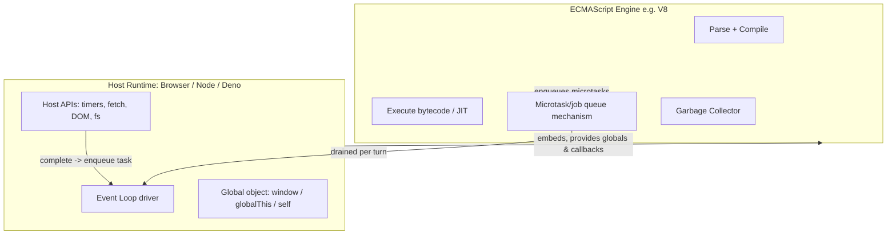
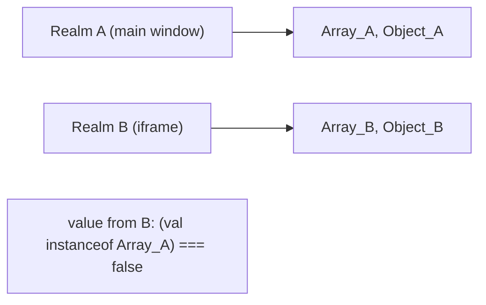
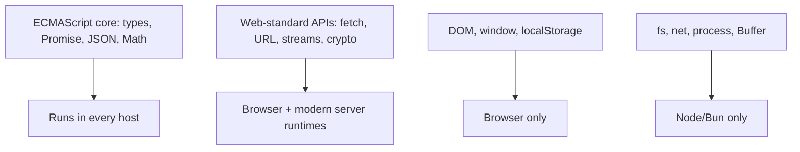

# Host Environments and Web APIs

## Overview

The ECMAScript specification defines a surprisingly small language: syntax, types, objects, functions, `JSON`, `Math`, `Promise`, and the abstract **job queue** mechanism. It defines **no** `setTimeout`, **no** `fetch`, **no** `console`, **no** file system, **no** DOM. Every one of those is provided by a **host environment**—the browser, Node.js, Deno, Bun, a service worker, or an embedded engine. The **engine** (V8, SpiderMonkey, JavaScriptCore) executes ECMAScript; the **host** supplies the outside world through APIs and drives the **event loop**.

Getting this boundary right is essential: it explains why the same JavaScript behaves differently in a browser vs. Node, why `window`/`document` don't exist server-side, why `setTimeout` isn't "part of JavaScript," and where portability ends. This note maps the engine↔host contract, surveys the major **Web APIs**, and draws the line to [[06-NodeJS/02-Event-Loop-and-libuv/libuv Architecture Overview|libuv Architecture Overview]] and [[06-NodeJS/README|Node.js]] for server-specific internals (libuv, streams, `fs`)—which this JavaScript track deliberately hands off.

## Learning Objectives

- Separate the ECMAScript engine from the host runtime and its APIs precisely
- Define realm, global object, and the host's role in driving the event loop
- Identify which capabilities are host-provided (timers, I/O, DOM, `fetch`)
- Compare browser vs. Node vs. Deno/Bun global surfaces and portability
- Write host-agnostic core logic with thin, swappable host adapters

## Prerequisites

- [[02-JavaScript/00-Orientation/ECMAScript Engines and Host Runtimes|ECMAScript Engines and Host Runtimes]]
- [[02-JavaScript/00-Orientation/JavaScript Program Lifecycle|JavaScript Program Lifecycle]]
- [[02-JavaScript/04-Engines-and-Memory/Interpreters JIT and Optimization Tiers|Interpreters JIT and Optimization Tiers]]

## Difficulty

`intermediate`

## Estimated Time

- Reading: 2 hours
- Exercises: 2 hours
- Mini project: 4 hours

## History

Netscape embedded JavaScript in the browser first; the language and the browser API surface were initially inseparable. **ECMAScript** (1997) standardized only the *language*, deliberately leaving host objects out so the same language could power browsers, servers, and embedded scripting. **Node.js** (2009) embedded V8 outside the browser with a different host API (modules, `fs`, `net`) built on **libuv**. **WHATWG/W3C** standardized browser Web APIs; **WinterCG** now works toward a common server-side runtime API (`fetch`, `URL`, `Web Streams`) so Node, Deno, Bun, and edge runtimes converge.

## Problem It Solves

- **Portability boundaries**: knowing what's language vs. host tells you what will run anywhere vs. what needs a shim.
- **Correct mental model of async**: timers and I/O are host machinery feeding the event loop, not language features (see [[02-JavaScript/05-Async-and-Concurrency/Run to Completion and Event Loop|Run to Completion and Event Loop]]).
- **Security & sandboxing**: hosts decide what the untrusted script can touch (network, disk, DOM). The engine enforces language rules; the host enforces capability rules.

## Internal Implementation

### Engine vs. host: the contract



The engine exposes an **embedding API** (V8's `Isolate`, `Context`). The host creates a context, installs global bindings (`console`, `setTimeout`, `fetch`), and calls into the engine to run scripts. When an async op completes, the **host** enqueues a task/callback; the engine runs the ECMAScript **microtask (job) queue** to completion between tasks.

### Realms and the global object

A **realm** is an isolated universe of intrinsics (its own `Object`, `Array`, `Promise`) plus a **global object**. Browsers name it `window` (and `self` in workers); Node historically used `global`; the standard cross-host name is **`globalThis`**. An iframe, a worker, and a Node `vm` context are separate realms—`arr instanceof Array` can be `false` across realms because each has its own `Array`.



### Categories of host APIs

- **Timers & scheduling**: `setTimeout`, `setInterval`, `queueMicrotask`, `requestAnimationFrame` (browser), `setImmediate`/`process.nextTick` (Node).
- **Network**: `fetch`, `WebSocket`, `EventSource`, `XMLHttpRequest` (browser); `fetch`, `http`/`net` (Node).
- **Storage/FS**: `localStorage`, `IndexedDB`, `Cache` (browser); `fs` (Node — handed to [[06-NodeJS/04-Buffers-Streams-and-IO/fs Promises Sync and Streaming|fs Promises Sync and Streaming]]).
- **DOM/UI**: `document`, `window`, events (browser only).
- **Concurrency**: `Worker`, `MessageChannel`, `SharedArrayBuffer` (see [[02-JavaScript/05-Async-and-Concurrency/Web Workers Shared Memory and Atomics|Web Workers Shared Memory and Atomics]]).
- **Encoding/URL**: `TextEncoder`, `URL`, `structuredClone`, `crypto.subtle` — increasingly standardized across hosts (WinterCG).

### Handoff to Node internals

This JavaScript track covers the **event loop as an ECMAScript + host concept** and the *shape* of Web APIs. The concrete Node machinery—**libuv**, the phases of Node's loop (timers, pending, poll, check, close), thread pool, `fs`/`net`/streams internals—is intentionally deferred to [[06-NodeJS/02-Event-Loop-and-libuv/libuv Architecture Overview|libuv Architecture Overview]], [[06-NodeJS/02-Event-Loop-and-libuv/Event Loop Phases|Event Loop Phases]], and [[06-NodeJS/04-Buffers-Streams-and-IO/fs Promises Sync and Streaming|fs Promises Sync and Streaming]]. Browser-specific rendering/timing details live with [[02-JavaScript/05-Async-and-Concurrency/Tasks Microtasks and Rendering|Tasks Microtasks and Rendering]].

## Mermaid Diagrams

### Portability surface



### Same code, two hosts

```mermaid
sequenceDiagram
    participant Code as app.js
    participant Browser
    participant Node
    Code->>Browser: fetch('/api') uses browser networking + CORS
    Code->>Node: fetch('/api') uses undici, no DOM/CORS
    Note over Code: console.log exists in both; document only in browser
```

## Examples

### Minimal Example — feature-detecting the host

```javascript
const isBrowser = typeof window !== "undefined" && typeof document !== "undefined";
const isNode = typeof process !== "undefined" && process.versions?.node != null;
const isDeno = typeof Deno !== "undefined";

// Prefer capability detection over environment detection.
const hasFetch = typeof fetch === "function";
const g = globalThis; // portable global reference in any host
```

### Production-Shaped Example — host-agnostic core with adapters

```javascript
// Core logic depends ONLY on an injected port, not on any host API.
export function createUploader({ httpPost, now, log }) {
  return async function upload(url, data) {
    const start = now();
    try {
      const res = await httpPost(url, data);
      log("upload.ok", { ms: now() - start });
      return res;
    } catch (err) {
      log("upload.fail", { ms: now() - start, err: String(err) });
      throw err;
    }
  };
}

// Browser adapter
const browserUploader = createUploader({
  httpPost: (url, body) => fetch(url, { method: "POST", body }).then((r) => r.json()),
  now: () => performance.now(),
  log: (evt, data) => console.info(evt, data),
});

// Node adapter (swap in undici/native fetch + a logger)
// const nodeUploader = createUploader({ httpPost, now: () => performance.now(), log });
```

This **ports-and-adapters** style keeps business logic testable and portable; host specifics stay at the edges. See [[02-JavaScript/07-Production-JavaScript/API Design and Defensive Programming|API Design and Defensive Programming]].

## Trade-offs

| Dimension | Upside | Downside | When it matters |
| --- | --- | --- | --- |
| ECMAScript-only core | Runs anywhere | Can't do I/O alone | Shared libraries |
| Web-standard APIs | Increasingly cross-host | Not all hosts complete | Isomorphic code |
| Host-specific APIs | Full platform power | Locks code to one runtime | Servers, browser UI |
| Capability detection | Robust, future-proof | More code than `if(isNode)` | Cross-platform libs |
| Ports & adapters | Testable, portable core | Indirection overhead | Reusable business logic |

### When to Use

- Build core logic against **standard/injected** APIs; isolate host specifics behind adapters.
- Use `globalThis` and **capability detection** for cross-host code.

### When Not to Use

- Don't pretend to be portable when you need real host power (DOM, `fs`)—embrace the host explicitly.
- Don't sniff environment strings when a feature check is more robust.

## Exercises

1. List 10 globals and classify each as ECMAScript, Web-standard, browser-only, or Node-only.
2. Write a snippet that runs identically in Node and the browser using only standard APIs.
3. Demonstrate the cross-realm `instanceof` pitfall using an iframe or Node `vm`.
4. Replace an `isNode` check with capability detection and explain the benefit.
5. Identify which parts of Node's event loop belong in [[06-NodeJS/02-Event-Loop-and-libuv/Event Loop Phases|Event Loop Phases]], not here.

## Mini Project

**Isomorphic utility library.** Publish a small library (e.g., a retry+timeout HTTP client) with a pure core and separate browser/Node adapters, plus a test suite that runs the core with a mock host. Document the portability boundary. Store in [[02-JavaScript/code/README|JavaScript code labs]].

## Portfolio Project

Build a **runtime capability explorer**: a page/CLI that probes the current host for available APIs (timers, `fetch`, streams, workers, `crypto.subtle`, storage), reports the realm/global name, and renders a portability matrix across browser/Node/Deno/Bun. Cross-link [[02-JavaScript/00-Orientation/ECMAScript Engines and Host Runtimes|ECMAScript Engines and Host Runtimes]].

## Interview Questions

1. Is `setTimeout` part of JavaScript? Where is it actually defined?
2. Distinguish an engine from a host runtime with examples.
3. What is a realm, and why can `instanceof Array` fail across realms?
4. Which async machinery is ECMAScript's (jobs/microtasks) vs. the host's (tasks/loop)?
5. How would you structure code to run in both browser and Node?

### Stretch / Staff-Level

1. What is WinterCG trying to standardize and why does it matter for edge runtimes?
2. How does the engine's embedding API let a host install globals and drive the loop?

## Common Mistakes

- Believing timers, `fetch`, or `console` are language features.
- Assuming `window`/`document` exist server-side (or `process`/`Buffer` in the browser).
- Cross-realm `instanceof`/`Array.isArray` confusion.
- Hard-coding environment sniffing instead of capability detection.
- Pulling Node-specific internals into portable core logic.

## Best Practices

- Treat the engine↔host split as an architectural boundary; keep core logic host-agnostic.
- Use `globalThis` and capability detection; prefer Web-standard APIs for isomorphism.
- Isolate host APIs behind adapters (ports-and-adapters) for testability.
- Use `Array.isArray` (realm-safe) instead of `instanceof Array` for cross-context values.
- Defer runtime-specific internals to the appropriate track ([[06-NodeJS/README|Node.js]], frontend).

## Summary

ECMAScript defines the language and its job/microtask mechanism; **host environments** (browser, Node, Deno, Bun, workers) embed an engine and supply everything that touches the outside world—timers, networking, DOM, storage—and drive the event loop. Knowing this boundary explains portability, async behavior, realms, and security. Write core logic against standard or injected APIs, isolate host specifics behind adapters, and hand runtime-specific internals like libuv and `fs` to [[06-NodeJS/02-Event-Loop-and-libuv/libuv Architecture Overview|libuv Architecture Overview]] and [[06-NodeJS/README|Node.js]].

## Further Reading

- [[00-References/JavaScript/README|JavaScript References]]
- WHATWG HTML — *Web APIs*, *Event loops*; WinterCG *Minimum Common API*
- MDN — *globalThis*, *Web APIs* index
- [[02-JavaScript/00-Orientation/ECMAScript Engines and Host Runtimes|ECMAScript Engines and Host Runtimes]]

## Related Notes

- [[02-JavaScript/00-Orientation/ECMAScript Engines and Host Runtimes|ECMAScript Engines and Host Runtimes]]
- [[02-JavaScript/05-Async-and-Concurrency/Run to Completion and Event Loop|Run to Completion and Event Loop]]
- [[02-JavaScript/05-Async-and-Concurrency/Tasks Microtasks and Rendering|Tasks Microtasks and Rendering]]
- [[02-JavaScript/05-Async-and-Concurrency/Web Workers Shared Memory and Atomics|Web Workers Shared Memory and Atomics]]
- [[06-NodeJS/02-Event-Loop-and-libuv/Event Loop Phases|Event Loop Phases]] · [[06-NodeJS/06-Concurrency-and-Scaling/worker_threads Model|worker_threads Model]] · [[06-NodeJS/README|Node.js]]

## Progress Checklist

- [ ] Explained from first principles
- [ ] Drew at least one Mermaid diagram
- [ ] Implemented a minimal version
- [ ] Documented trade-offs and non-goals
- [ ] Completed exercises
- [ ] Practiced interview questions aloud
- [ ] Linked prerequisites and dependents
