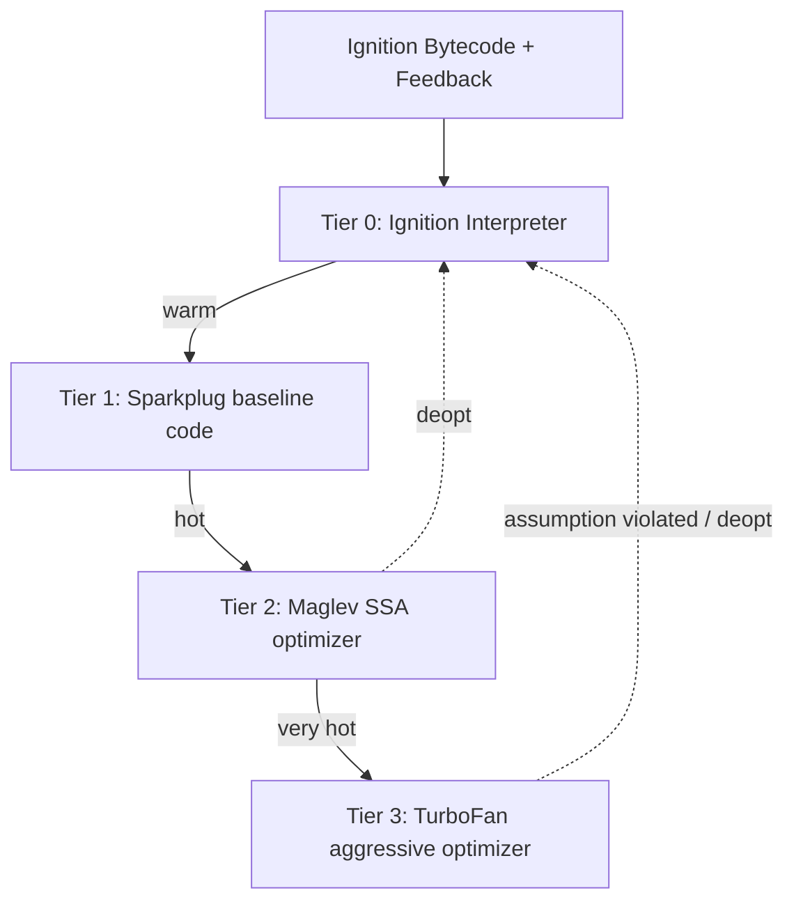
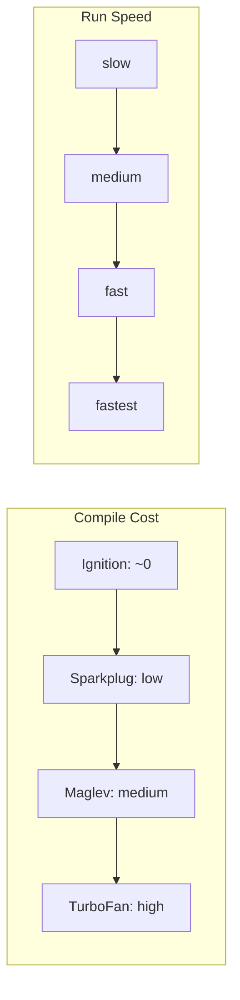
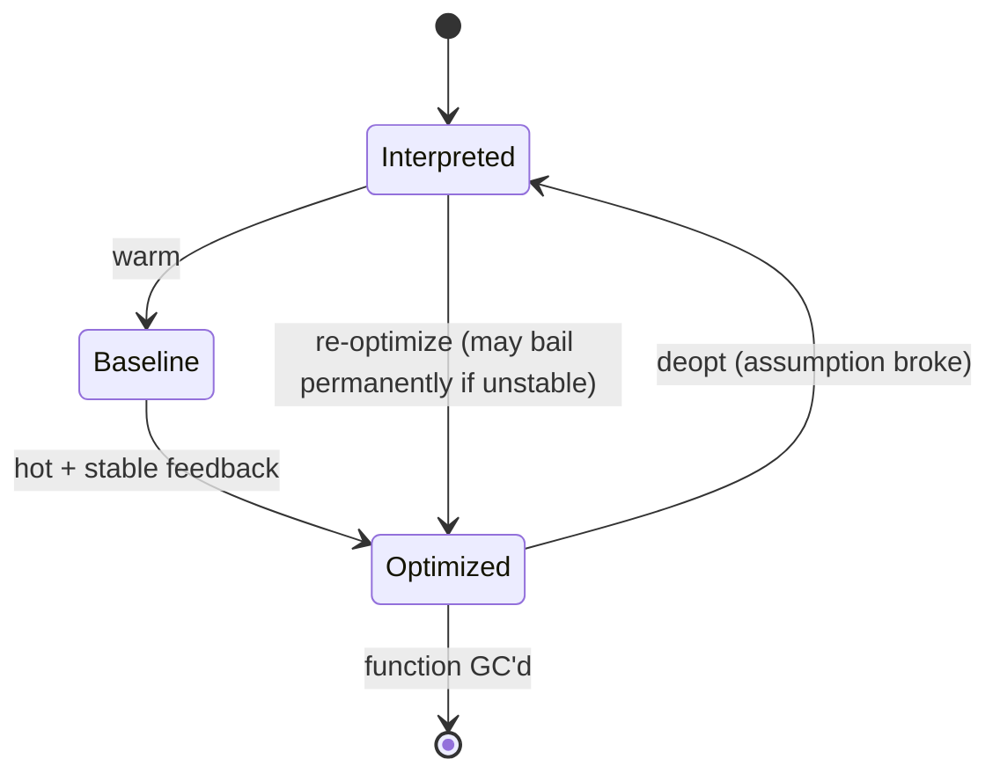

# Interpreters JIT and Optimization Tiers

## Overview

JavaScript is dynamically typed, yet modern engines run hot loops at speeds approaching statically compiled languages. The trick is **tiered, speculative just-in-time (JIT) compilation**: start executing cheaply with a bytecode interpreter, observe the actual types flowing through the program, then compile **type-specialized machine code** for the code that runs often—while keeping a safety net to fall back (**deoptimize**) when an assumption is violated.

This note explains the tier system using **V8's** four-tier model (**Ignition** interpreter → **Sparkplug** baseline → **Maglev** mid-tier → **TurboFan** top-tier) and contrasts it with **SpiderMonkey** (Interpreter → Baseline Interpreter → Baseline JIT → **Warp/IonMonkey**) and **JavaScriptCore** (LLInt → Baseline → DFG → **FTL**). The names differ; the *strategy*—cheap start, speculative specialization, deopt safety net—is shared.

It builds directly on [[02-JavaScript/04-Engines-and-Memory/Parsing AST and Bytecode|Parsing AST and Bytecode]] (which produces the bytecode + feedback vectors JITs consume) and pairs with [[02-JavaScript/04-Engines-and-Memory/Hidden Classes Shapes and Inline Caches|Hidden Classes Shapes and Inline Caches]] and [[02-JavaScript/04-Engines-and-Memory/Deoptimization and Performance Cliffs|Deoptimization and Performance Cliffs]].

## Learning Objectives

- Explain why a **tiered** design beats a single interpreter or a single AOT compiler
- Describe what type feedback is and how it enables **speculative optimization**
- Trace a function's promotion from Ignition to TurboFan and back down via deopt
- Reason about warm-up, on-stack replacement (OSR), and why microbenchmarks lie
- Write code that stays "optimizable" without premature micro-optimization

## Prerequisites

- [[02-JavaScript/04-Engines-and-Memory/Parsing AST and Bytecode|Parsing AST and Bytecode]]
- [[01-Computer-Science/08-Languages-and-Computation/Bytecode and JIT Compilation|Bytecode and JIT Compilation]]
- [[01-Computer-Science/08-Languages-and-Computation/Compilers Interpreters and Virtual Machines|Compilers Interpreters and Virtual Machines]]

## Difficulty

`advanced`

## Estimated Time

- Reading: 2–3 hours
- Exercises: 3 hours
- Mini project: 5 hours

## History

The first fast JavaScript engine, **V8 (2008)**, compiled straight to machine code (no interpreter) with a JIT called **Full-codegen**, later adding the optimizing **Crankshaft**. This produced fast code but used lots of memory and had slow startup. In **2016–2017**, V8 replaced this with **Ignition** (bytecode interpreter) + **TurboFan** (optimizer)—smaller memory, faster startup, better peak. Then came **Sparkplug** (2021, a fast non-optimizing baseline compiler) and **Maglev** (2023, a mid-tier optimizer) to fill the latency gap between "interpreting" and "fully optimized."

The industry converged on **speculative, feedback-driven tiering** because JavaScript's types are only known at runtime. This is the same lineage as Self and Java HotSpot's adaptive optimization.

## Problem It Solves

- **Cold start vs. peak throughput**: pure AOT compilation is slow to start; pure interpretation is slow at steady state. Tiering gets both.
- **Dynamic types**: without knowing types ahead of time, you cannot emit efficient machine code. Feedback lets the engine *assume* the common case and specialize.
- **Memory**: only hot code is expensively compiled; cold code stays as compact bytecode.

## Internal Implementation

### The tier ladder (V8)



- **Ignition** executes bytecode and fills **feedback vectors** (which types each operation saw).
- **Sparkplug** compiles bytecode 1:1 to machine code with no optimization—removes interpreter dispatch overhead, compiles almost instantly. No type feedback needed.
- **Maglev** builds an SSA graph, uses feedback for light speculation, compiles quickly. Good balance for medium-hot code.
- **TurboFan** does aggressive optimizations: inlining, escape analysis, redundancy elimination, range analysis. Expensive to run, produces the fastest code.

### How functions get promoted

Each function has an **invocation counter** and loops have **backedge counters**. When counters cross thresholds, the engine schedules compilation (often on a **background thread** so it doesn't block execution). Long-running loops use **On-Stack Replacement (OSR)**: the engine swaps the currently-executing interpreted loop frame for optimized code *mid-flight*.

### Speculation and type feedback

Consider `a + b`. Ignition records whether operands were **Smi** (small integer), **HeapNumber** (double), **String**, etc. If feedback says "always Smi," TurboFan emits an integer add with a guard: "if either operand isn't a Smi, bail out." That guard is a **deoptimization check**.

```mermaid
sequenceDiagram
    participant Ign as Ignition
    participant FB as Feedback Vector
    participant TF as TurboFan
    participant Opt as Optimized Code
    Ign->>FB: record types for a+b (Smi, Smi)
    Note over Ign: invocation count crosses threshold
    Ign->>TF: request optimization (background)
    TF->>FB: read feedback (assume Smi)
    TF->>Opt: emit int add + guard(isSmi)
    Opt->>Opt: run fast while guard holds
    Opt-->>Ign: deopt if a becomes a string
```

### Why microbenchmarks lie

A benchmark that runs a function 10 times measures Ignition. One that runs it 10 million times measures TurboFan. Neither may match your production heat. **Warm-up** and **polymorphism** dominate; see [[02-JavaScript/07-Production-JavaScript/Measuring and Optimizing Performance|Measuring and Optimizing Performance]].

## Mermaid Diagrams

### Cost/speed of each tier



### Lifecycle with deopt



## Examples

### Minimal Example — forcing and observing optimization

Node.js with native syntax flags:

```bash
node --allow-natives-syntax script.js
```

```javascript
function hot(a, b) {
  return a + b;
}

// Warm it up with consistent types (monomorphic).
for (let i = 0; i < 100000; i++) hot(i, i + 1);

%OptimizeFunctionOnNextCall(hot); // native syntax (test-only)
hot(1, 2);
console.log(%GetOptimizationStatus(hot)); // bitmask: is it optimized?
```

Use `--trace-opt --trace-deopt` to watch promotions and bailouts in the console.

### Production-Shaped Example — keeping a hot path monomorphic

```javascript
// Slow: `process` sees objects of many shapes -> polymorphic/megamorphic -> poor IC.
function process(item) {
  return item.value * 2;
}

// Fast: normalize inputs to ONE shape before the hot loop so feedback stays monomorphic.
function normalize(raw) {
  // Always same property order + types -> one hidden class.
  return { value: Number(raw.value ?? 0), id: String(raw.id ?? "") };
}

const normalized = rawItems.map(normalize);
let sum = 0;
for (let i = 0; i < normalized.length; i++) {
  sum += process(normalized[i]); // monomorphic; TurboFan can inline + specialize
}
```

Shape stability is covered in depth in [[02-JavaScript/04-Engines-and-Memory/Hidden Classes Shapes and Inline Caches|Hidden Classes Shapes and Inline Caches]].

## Trade-offs

| Dimension | Upside | Downside | When it matters |
| --- | --- | --- | --- |
| Interpreter (Ignition) | Instant start, tiny memory | Slow steady state | Cold code, startup |
| Baseline (Sparkplug) | Near-instant compile, no dispatch overhead | No type specialization | Warm-but-not-hot code |
| Optimizer (TurboFan) | Fastest peak throughput | Expensive compile, deopt risk | Tight hot loops |
| Speculation | Turns dynamic types into fast code | Deopt cliffs when types vary | Polymorphic call sites |
| Background compilation | Doesn't block main thread | Uses extra cores/energy | Server + mobile trade-off |

### When to Use

- Let the engine tier naturally; write clear, type-stable code and it will optimize hot paths.
- Pre-warm critical paths in servers (a few iterations before serving traffic) if cold-start latency is a hard SLA.

### When Not to Use

- Don't hand-write "JIT-friendly" contortions in cold code—wasted effort and worse readability.
- Don't rely on native-syntax flags in production; they're test/diagnostic tools only.

## Exercises

1. Use `--trace-opt` to find the invocation count at which a simple function is optimized.
2. Make a function polymorphic by passing 4 different object shapes; observe with `--trace-deopt` / IC state.
3. Trigger OSR by putting a long `for` loop directly in a top-level script and tracing optimization.
4. Compare `Sparkplug`-only (`--no-turbofan`) vs. full tiers timing on a hot loop.
5. Explain why a benchmark of 5 iterations gives misleading results.

## Mini Project

**Tier visualizer.** Write a Node script that takes a target function, runs it with increasing iteration counts, and parses `--trace-opt`/`--trace-deopt` output to print a timeline of which tier the function was in. Output a small table/graph of "iterations vs. tier." Link results into [[02-JavaScript/code/README|JavaScript code labs]].

## Portfolio Project

Build a **"why is my code slow" analyzer**: given a JS module, it runs representative workloads under V8 tracing, detects deopts, megamorphic call sites, and frequent bailouts, then emits an annotated report with source locations and suggested fixes. Combine with [[02-JavaScript/04-Engines-and-Memory/Deoptimization and Performance Cliffs|Deoptimization and Performance Cliffs]].

## Interview Questions

1. Why do modern engines use multiple tiers instead of one great compiler?
2. What is type feedback and where does it come from?
3. Explain On-Stack Replacement and when it triggers.
4. What is speculative optimization and what is the "safety net"?
5. Why can the same function be both fast and slow depending on call-site types?

### Stretch / Staff-Level

1. Compare V8's Maglev tier to SpiderMonkey's Baseline JIT—what niche does a mid-tier fill?
2. How does background/concurrent compilation interact with the main thread and GC pauses?

## Common Mistakes

- Treating JavaScript as "just interpreted" and ignoring warm-up in benchmarks.
- Writing polymorphic hot paths that prevent specialization.
- Chasing deopts in cold code that never gets optimized anyway.
- Assuming optimization is permanent—unstable code can be de-optimized repeatedly or blacklisted.

## Best Practices

- Keep hot functions **monomorphic**: stable argument shapes and types.
- Separate cold setup from hot loops so the optimizer targets the right code.
- Measure with realistic warm-up and inputs; prefer end-to-end profiles over microbenchmarks.
- Avoid changing an object's shape or a variable's type inside a hot path.
- In latency-critical servers, consider warm-up requests before joining the load balancer pool.

## Summary

Engines achieve fast dynamic-language execution through tiered speculative compilation: a bytecode interpreter starts instantly and records type feedback; baseline and optimizing compilers progressively specialize hot code into machine code guarded by assumptions; and deoptimization safely reverts when assumptions break. You get startup *and* peak performance. Your job is to keep hot paths type-stable and monomorphic so the optimizer's speculation stays valid—and to measure with proper warm-up.

## Further Reading

- [[00-References/JavaScript/README|JavaScript References]]
- V8 blog — *Sparkplug*, *Maglev*, and *An introduction to speculative optimization in V8*
- Mozilla — *Warp: Improved JS performance in Firefox*
- [[01-Computer-Science/08-Languages-and-Computation/Bytecode and JIT Compilation|Bytecode and JIT Compilation]]

## Related Notes

- [[02-JavaScript/04-Engines-and-Memory/Parsing AST and Bytecode|Parsing AST and Bytecode]]
- [[02-JavaScript/04-Engines-and-Memory/Hidden Classes Shapes and Inline Caches|Hidden Classes Shapes and Inline Caches]]
- [[02-JavaScript/04-Engines-and-Memory/Deoptimization and Performance Cliffs|Deoptimization and Performance Cliffs]]
- [[02-JavaScript/07-Production-JavaScript/Measuring and Optimizing Performance|Measuring and Optimizing Performance]]
- [[01-Computer-Science/08-Languages-and-Computation/Compilers Interpreters and Virtual Machines|Compilers Interpreters and Virtual Machines]]

## Progress Checklist

- [ ] Explained from first principles
- [ ] Drew at least one Mermaid diagram
- [ ] Implemented a minimal version
- [ ] Documented trade-offs and non-goals
- [ ] Completed exercises
- [ ] Practiced interview questions aloud
- [ ] Linked prerequisites and dependents
