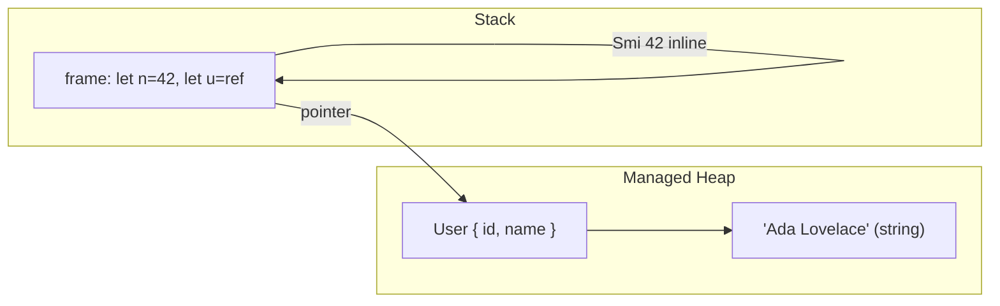
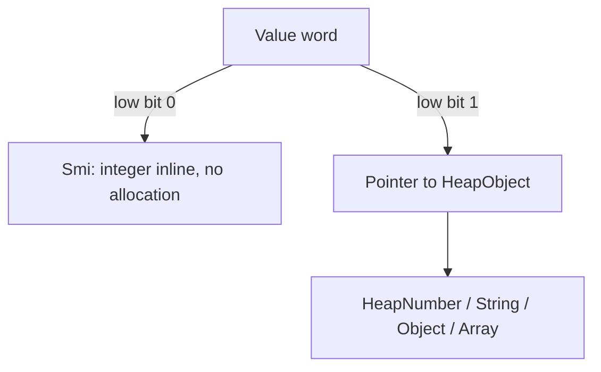
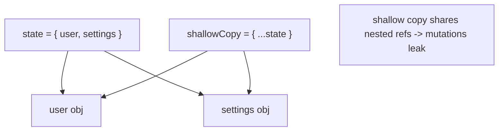
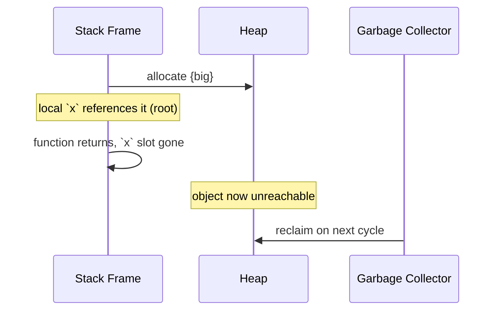

# JavaScript Memory Model

## Overview

JavaScript hides memory from you—there is no `malloc`, no pointers, no `free`. But the illusion has structure, and understanding it is the difference between code that quietly leaks and code that stays flat under load. This note describes **how values are represented and stored**: what lives on the call stack, what lives on the managed heap, how the engine distinguishes a small integer from an object using **tagged pointers**, and what "pass by value" vs. "share a reference" really means at the machine level.

We separate two distinct meanings of "memory model" and this note covers the first:

1. **Representation & allocation** (this note): stack vs. heap, value vs. reference, boxing, tagged values, TypedArrays/ArrayBuffers.
2. **Concurrent memory ordering** (visibility of writes across threads): covered in [[02-JavaScript/05-Async-and-Concurrency/Web Workers Shared Memory and Atomics|Web Workers Shared Memory and Atomics]] and [[01-Computer-Science/05-Concurrency-Fundamentals/Atomics and Memory Ordering|Atomics and Memory Ordering]].

It builds on [[02-JavaScript/01-Values-and-Types/Primitive Values and Objects|Primitive Values and Objects]] and feeds directly into [[02-JavaScript/04-Engines-and-Memory/Garbage Collection in JavaScript|Garbage Collection in JavaScript]] and [[02-JavaScript/04-Engines-and-Memory/Memory Leaks and Retention|Memory Leaks and Retention]].

## Learning Objectives

- Describe what the engine stores on the stack vs. the managed heap
- Explain value semantics for primitives vs. reference sharing for objects—precisely
- Understand tagged pointers / NaN-boxing and why small integers avoid heap allocation
- Reason about `ArrayBuffer`, TypedArrays, and where raw bytes live
- Predict aliasing/mutation bugs and structural sharing behavior

## Prerequisites

- [[02-JavaScript/01-Values-and-Types/Primitive Values and Objects|Primitive Values and Objects]]
- [[02-JavaScript/01-Values-and-Types/Value Copying Sharing and Mutation|Value Copying Sharing and Mutation]]
- [[01-Computer-Science/03-Memory-and-Addressing/Stack and Heap|Stack and Heap]]
- [[01-Computer-Science/03-Memory-and-Addressing/Pointers References and Aliasing|Pointers References and Aliasing]]

## Difficulty

`advanced`

## Estimated Time

- Reading: 2 hours
- Exercises: 2–3 hours
- Mini project: 4 hours

## History

Early JavaScript stored everything as boxed values, which was slow. To make numbers fast, engines adopted **tagged representations** borrowed from Lisp/Smalltalk: encode small integers directly inside a pointer-sized word so they need no heap object. V8 calls these **Smis** (Small Integers). JavaScriptCore uses **NaN-boxing** (packing pointers and integers into the unused bit patterns of IEEE-754 doubles). `ArrayBuffer`/TypedArrays arrived with the WebGL era (2011) to give JavaScript direct, unboxed access to raw binary buffers.

## Problem It Solves

- **Speed**: not every number should be a heap object; tagging lets `let i = 0` be a register-resident integer.
- **Correctness**: developers constantly hit aliasing bugs; a precise mental model prevents "why did my array change?" surprises.
- **Interop & performance**: TypedArrays give predictable, contiguous, unboxed memory for graphics, networking, and WASM—covered in [[01-Computer-Science/01-Information-and-Representation/Endianness and Binary Layout|Endianness and Binary Layout]].

## Internal Implementation

### Stack vs. heap in a managed runtime

The **call stack** holds execution contexts (frames): local variable slots, the return address, and *value slots*. A value slot holds either an **immediate** (a tagged small integer, or a pointer) — not the object itself. **Objects, strings, closures, and arrays live on the managed heap**; the stack slot holds a reference to them.



Note: engines aggressively **register-allocate** locals; "stack" here is the conceptual model, not a guarantee of physical placement.

### Tagged values (Smi vs. HeapObject)

On 64-bit V8 with pointer compression, a value word's low bits tag its type. A **Smi** stores a 31-/32-bit integer inline (shifted, low bit `0`); a **HeapObject** pointer has low bit `1`. So `let x = 5` needs **zero heap allocation**, while `let x = 5.5` (a double outside Smi range) becomes a **HeapNumber** on the heap (unless the engine keeps it in a double register / unboxed field).



### Primitives vs. objects: the semantics

- **Primitives** (`number`, `string`, `boolean`, `undefined`, `null`, `symbol`, `bigint`) are **immutable** and behave with **value semantics**: assignment/argument passing copies the value (or a reference to an immutable value—observationally identical).
- **Objects** are **mutable** and shared by **reference**: assignment copies the *reference*, not the object. Two variables can alias the same heap object.

```javascript
let a = 10;
let b = a;      // copy of value
b++;            // a is still 10

const o1 = { n: 10 };
const o2 = o1;  // copy of REFERENCE
o2.n++;         // o1.n is now 11 (aliasing)
```

"JavaScript is pass-by-value" is technically true: the *value passed* for an object argument is the **reference**, copied by value. Reassigning the parameter doesn't affect the caller; mutating the referenced object does.

### Autoboxing

`"hi".length` works even though `"hi"` is a primitive: the engine transiently wraps it in a `String` object (`ToObject`), reads the property, and discards the wrapper. This is why `new String("hi")` (an object) is a footgun—avoid wrapper objects.

### Raw bytes: ArrayBuffer & TypedArrays

`ArrayBuffer` is a fixed-length block of raw bytes on the heap. **TypedArrays** (`Uint8Array`, `Float64Array`, …) and `DataView` are *views* over a buffer—no per-element boxing, contiguous, cache-friendly. This is the closest JavaScript gets to C arrays and is the foundation for `SharedArrayBuffer` (see the atomics note) and WASM linear memory.

```javascript
const buf = new ArrayBuffer(8);
const f64 = new Float64Array(buf); // one view
const bytes = new Uint8Array(buf); // aliasing view over the SAME bytes
f64[0] = 1.5;
console.log(bytes); // little-endian byte pattern of 1.5
```

## Mermaid Diagrams

### Aliasing and structural sharing



### Lifetime and reachability



## Examples

### Minimal Example — copy vs. share

```javascript
function addTag(obj) {
  obj.tag = "seen";  // mutates caller's object (shared reference)
  obj = { fresh: true }; // reassigns local param only; caller unaffected
  return obj;
}

const original = { id: 1 };
const result = addTag(original);
console.log(original); // { id: 1, tag: 'seen' }
console.log(result);   // { fresh: true }
```

### Production-Shaped Example — immutable updates to avoid aliasing bugs

```javascript
// Shallow spread shares nested objects; deep mutation leaks across "copies".
function updateTheme(state, theme) {
  return {
    ...state,
    settings: { ...state.settings, theme }, // copy the path you change
  };
}

// For large binary payloads, reuse buffers via views instead of copying bytes.
function readHeader(buffer) {
  const view = new DataView(buffer);
  return {
    magic: view.getUint32(0, false),   // big-endian
    length: view.getUint32(4, true),   // little-endian
  };
}
```

Deep vs. shallow copy trade-offs connect to [[02-JavaScript/03-Objects-and-Metaprogramming/JSON Structured Clone and Serialization|JSON Structured Clone and Serialization]] (`structuredClone`).

## Trade-offs

| Dimension | Upside | Downside | When it matters |
| --- | --- | --- | --- |
| Tagged Smi | No allocation for common ints | Overflow to HeapNumber past ~2³¹ | Counters, indices |
| Reference sharing | Cheap passing of big objects | Aliasing bugs | Shared mutable state |
| Immutable updates | Predictable, time-travel-friendly | Allocation/GC pressure | Redux-style state |
| TypedArrays | Unboxed, contiguous, fast | Manual byte/offset management | Binary, graphics, WASM |
| Wrapper objects | (none practical) | Identity/equality surprises | Avoid `new String/Number` |

### When to Use

- Use **immutable update patterns** for shared application state to avoid aliasing bugs.
- Use **TypedArrays/DataView** for binary protocols, hot numeric code, and interop.

### When Not to Use

- Don't deep-clone huge objects on every update if structural sharing suffices.
- Don't use wrapper objects (`new Number(…)`) — ever, in application code.

## Exercises

1. Show three ways aliasing causes a bug and fix each with a copy strategy.
2. Determine experimentally the largest integer that stays a Smi (hint: engine/platform dependent).
3. Write a function that mutates a caller's array and one that doesn't; explain the difference.
4. Create two TypedArray views over one `ArrayBuffer` and demonstrate they alias the same bytes.
5. Explain why `new String("a") === "a"` is `false` but `String("a") === "a"` is `true`.

## Mini Project

**Immutable state store.** Implement a tiny store with `getState`, `setState(updater)`, and structural-sharing updates (only clone the changed path). Add a "mutation detector" (freeze in dev with `Object.freeze`) that throws on accidental mutation. Store in [[02-JavaScript/code/README|JavaScript code labs]].

## Portfolio Project

Build a **binary protocol codec** using `ArrayBuffer`/`DataView`: define a schema (fields, types, endianness), generate encode/decode functions, and benchmark against JSON for size and speed. Document memory characteristics and zero-copy views. Connects to [[01-Computer-Science/01-Information-and-Representation/Endianness and Binary Layout|Endianness and Binary Layout]].

## Interview Questions

1. Is JavaScript pass-by-value or pass-by-reference? Defend your answer precisely.
2. Where do primitives vs. objects live, and what gets copied on assignment?
3. What is a Smi and why does it matter for performance?
4. What is autoboxing and why avoid wrapper objects?
5. How do TypedArrays differ from regular arrays in memory?

### Stretch / Staff-Level

1. Explain NaN-boxing vs. tagged pointers as two strategies for the same problem.
2. How does pointer compression reduce heap size, and what's the trade-off?

## Common Mistakes

- Thinking a shallow spread deep-copies nested objects.
- Assuming numbers never allocate (large doubles become HeapNumbers).
- Using `new String/Number/Boolean` and hitting identity/`typeof` surprises.
- Mutating an object passed as an argument without realizing the caller sees it.
- Confusing this representation model with cross-thread memory ordering.

## Best Practices

- Treat objects as **shared by reference**; copy explicitly when you need isolation.
- Prefer immutable update patterns for shared state; use `structuredClone` for deep copies.
- Use TypedArrays for binary/numeric hot paths; document endianness on every field.
- Freeze critical config objects in development to catch accidental mutation early.
- Keep integer-heavy hot loops within Smi range where feasible.

## Summary

JavaScript's memory model stores primitives with value semantics and objects as references into a managed heap. Engines use tagged values (Smis) so common integers avoid allocation, and TypedArrays/ArrayBuffers provide unboxed, contiguous raw memory for binary and numeric work. Most real bugs come from aliasing: assignment copies references, not objects. Master which operations copy vs. share, and you'll prevent an entire category of correctness and performance problems—and you'll be ready to reason about garbage collection and leaks.

## Further Reading

- [[00-References/JavaScript/README|JavaScript References]]
- V8 blog — *Pointer Compression in V8*, *Smi handling*
- MDN — *Memory Management*, *JavaScript typed arrays*
- [[01-Computer-Science/03-Memory-and-Addressing/Stack and Heap|Stack and Heap]]

## Related Notes

- [[02-JavaScript/01-Values-and-Types/Primitive Values and Objects|Primitive Values and Objects]]
- [[02-JavaScript/01-Values-and-Types/Value Copying Sharing and Mutation|Value Copying Sharing and Mutation]]
- [[02-JavaScript/04-Engines-and-Memory/Garbage Collection in JavaScript|Garbage Collection in JavaScript]]
- [[02-JavaScript/04-Engines-and-Memory/Memory Leaks and Retention|Memory Leaks and Retention]]
- [[02-JavaScript/05-Async-and-Concurrency/Web Workers Shared Memory and Atomics|Web Workers Shared Memory and Atomics]]
- [[01-Computer-Science/03-Memory-and-Addressing/Pointers References and Aliasing|Pointers References and Aliasing]]

## Progress Checklist

- [ ] Explained from first principles
- [ ] Drew at least one Mermaid diagram
- [ ] Implemented a minimal version
- [ ] Documented trade-offs and non-goals
- [ ] Completed exercises
- [ ] Practiced interview questions aloud
- [ ] Linked prerequisites and dependents
