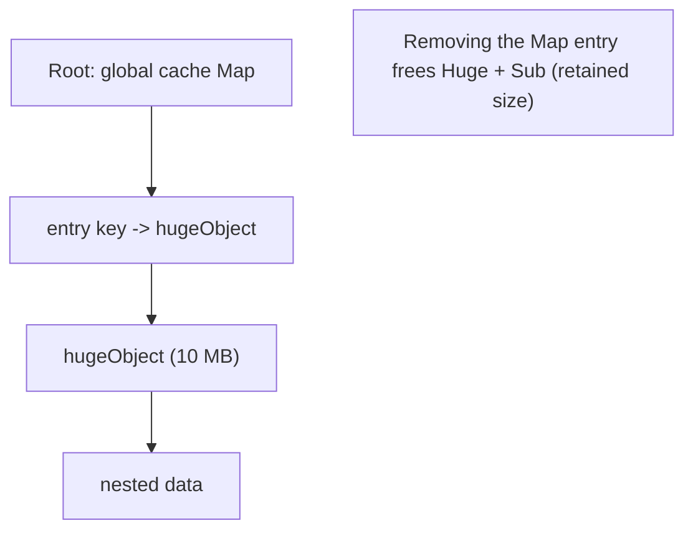
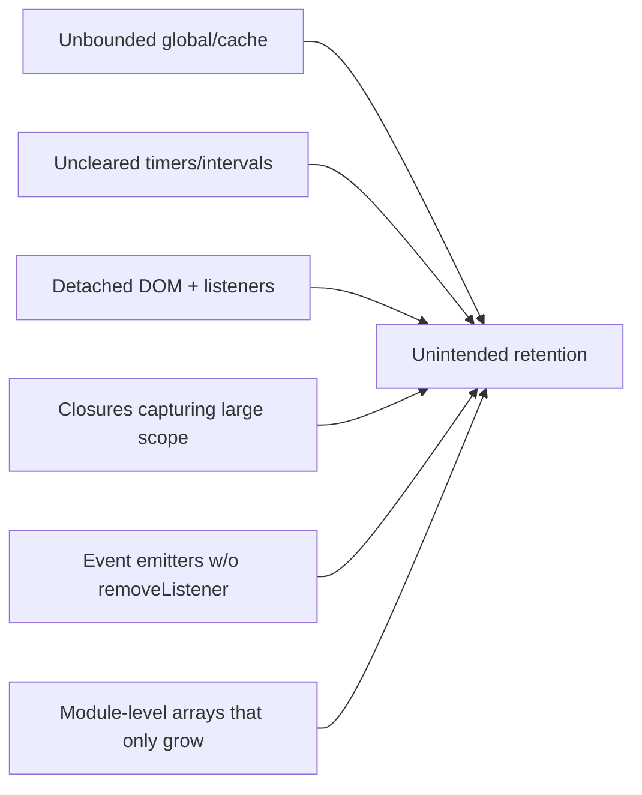
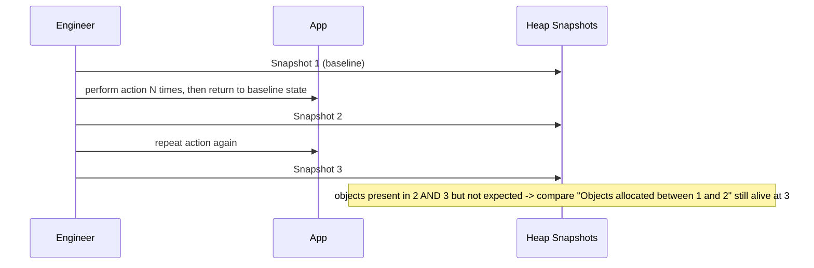
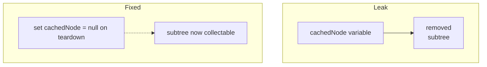
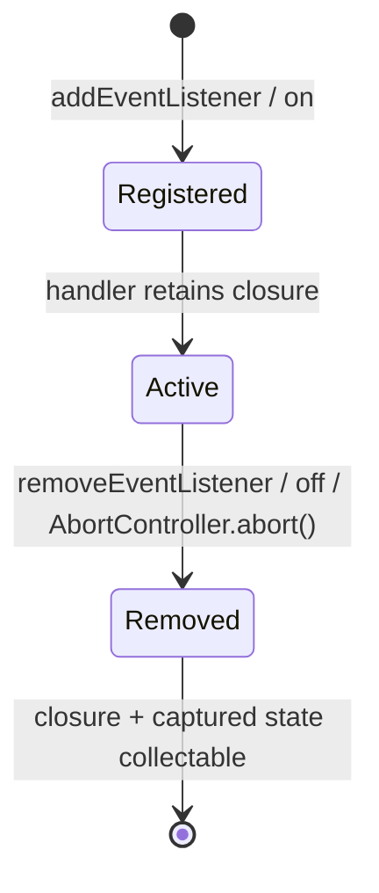

# Memory Leaks and Retention

## Overview

A **memory leak** in a garbage-collected language is not "forgetting to free"—it's **accidentally keeping objects reachable** long after they're useful. The collector faithfully preserves anything on a **retainer path** back to a root, so a single stray reference in a long-lived structure (a global cache, an event listener, a closure) can pin an entire object graph forever. Over hours or days, a leaking server's **old space** grows until GC thrashes and the process is OOM-killed; a leaking SPA slows and crashes the tab.

This note is the practical counterpart to [[02-JavaScript/04-Engines-and-Memory/Garbage Collection in JavaScript|Garbage Collection in JavaScript]]: since GC frees the *unreachable*, leaks are always a **reachability** problem. We catalog the common leak archetypes, show how to find them with **heap snapshots** and **allocation timelines**, and give production patterns to prevent them. Closures ([[02-JavaScript/02-Execution-and-Functions/Closures|Closures]]) and event/listener lifetimes are the usual suspects.

## Learning Objectives

- Define a leak precisely as unintended retention via a retainer path
- Recognize the canonical leak archetypes and their fixes
- Use Chrome DevTools / Node heap snapshots and the three-snapshot technique
- Read a retainer path to find *why* an object is still alive
- Design listener, cache, and closure lifetimes that avoid retention

## Prerequisites

- [[02-JavaScript/04-Engines-and-Memory/Garbage Collection in JavaScript|Garbage Collection in JavaScript]]
- [[02-JavaScript/04-Engines-and-Memory/JavaScript Memory Model|JavaScript Memory Model]]
- [[02-JavaScript/02-Execution-and-Functions/Closures|Closures]]

## Difficulty

`advanced`

## Estimated Time

- Reading: 2 hours
- Exercises: 3 hours
- Mini project: 5 hours

## History

As JavaScript apps moved from page-per-navigation to **long-lived SPAs** and **always-on Node services**, leaks became a first-class operational problem rather than a curiosity that a page reload would fix. Chrome DevTools added **heap snapshots** and **allocation profiling**; Node exposed `v8.getHeapSnapshot()` and `--heapsnapshot-signal`. The `WeakMap`/`WeakRef` primitives (ES2015/ES2021) were added partly to give developers leak-resistant tools.

## Problem It Solves

Understanding retention lets you:

- Keep server RSS flat over days (avoid OOM kills, restarts, and cascading incidents).
- Keep SPAs responsive across long sessions (dashboards, editors, chat).
- Diagnose *the specific reference* keeping memory alive, instead of guessing.

## Internal Implementation

### Retainer paths and dominators

An object is alive if **any** path of references leads to it from a root. Debuggers show the **retainer path** (who points to this object) and the **dominator tree** (the object whose removal would free the most). **Retained size** = memory that would be freed if this object were collected.



### Leak archetypes



1. **Unbounded caches / globals**: a module-level `Map`/array that only ever `set`/`push` and never evicts.
2. **Forgotten timers**: `setInterval` whose callback closes over big state and is never `clearInterval`'d.
3. **Detached DOM nodes**: a JS variable (or listener) still references a removed DOM subtree, so the whole subtree stays alive.
4. **Listeners without teardown**: `emitter.on(...)` / `addEventListener(...)` where the handler (and its closure) is never removed.
5. **Large closure capture**: a small callback that accidentally closes over a huge object because it shares scope.
6. **Promises that never settle**: a pending promise chain can retain its `.then` handlers and captured state indefinitely.

### The three-snapshot technique



Objects that are allocated during an action and **survive** after returning to a steady state—growing snapshot after snapshot—are the leak.

## Mermaid Diagrams

### Fixing detached DOM



### Listener lifecycle



## Examples

### Minimal Example — the classic leak and its fix

```javascript
// LEAK: interval keeps `buffer` (and everything it references) alive forever.
function startLeaky() {
  const buffer = new Array(1e6).fill("data");
  setInterval(() => {
    console.log(buffer.length); // closure retains `buffer`
  }, 1000);
}

// FIXED: keep a handle and clear it; drop the reference on teardown.
function startClean() {
  let buffer = new Array(1e6).fill("data");
  const id = setInterval(() => console.log(buffer.length), 1000);
  return () => {
    clearInterval(id);
    buffer = null; // allow collection
  };
}
const stop = startClean();
// later: stop();
```

### Production-Shaped Example — listeners, AbortController, and bounded caches

```javascript
// 1. Teardown listeners with AbortController (one signal removes many).
function attach(target, controller) {
  const { signal } = controller;
  target.addEventListener("resize", onResize, { signal });
  target.addEventListener("scroll", onScroll, { signal });
}
const controller = new AbortController();
attach(window, controller);
// on unmount: controller.abort(); // removes ALL listeners, frees closures

// 2. Bound the cache; never let it grow forever.
class BoundedCache {
  #map = new Map();
  constructor(max = 1000) { this.max = max; }
  set(k, v) {
    if (this.#map.size >= this.max) {
      this.#map.delete(this.#map.keys().next().value); // evict oldest (FIFO)
    }
    this.#map.set(k, v);
  }
  get(k) { return this.#map.get(k); }
}

// 3. Object-keyed metadata that must not extend lifetime -> WeakMap.
const meta = new WeakMap();
```

Node servers: capture snapshots with `--heapsnapshot-signal=SIGUSR2` and diff in DevTools; alert on rising `heapUsed`/RSS. See [[02-JavaScript/07-Production-JavaScript/Observability and Operational Readiness|Observability and Operational Readiness]].

## Trade-offs

| Dimension | Upside | Downside | When it matters |
| --- | --- | --- | --- |
| WeakMap-keyed data | Auto-collected, no eviction code | Only object keys, non-deterministic | Per-object metadata |
| Bounded cache | Predictable memory ceiling | May evict useful entries | High-cardinality keys |
| AbortController teardown | One signal frees many listeners | Must thread signal everywhere | Component lifecycles |
| Aggressive nulling | Frees promptly | Noise, easy to miss cases | Very large captured state |
| Heap snapshots | Precise root cause | Overhead, size, learning curve | Production incidents |

### When to Use

- Use **bounded/weak caches** for any long-lived process.
- Tie every subscription/listener/timer to an explicit **teardown**.

### When Not to Use

- Don't micro-null every variable in short-lived functions—GC handles those; reserve it for large, long-lived captures.
- Don't reach for `WeakRef` when a simple bounded cache is clearer and deterministic.

## Exercises

1. Reproduce each of the 6 archetypes in a small script and confirm growth via `heapUsed`.
2. Use the three-snapshot technique in DevTools to catch a leak you introduce.
3. Convert a growing `Map` cache to a `BoundedCache` and to a `WeakMap`; compare behavior.
4. Cause a detached-DOM leak in a page and find the retainer path.
5. Show a never-settling promise retaining captured state and fix it with a timeout/abort.

## Mini Project

**Leak hunter CLI.** A Node tool that takes periodic heap snapshots of a target script (via `v8.getHeapSnapshot`), diffs object counts by constructor between snapshots, and prints the top growing types with sample retainer paths. Test it against seeded leaks. Store in [[02-JavaScript/code/README|JavaScript code labs]].

## Portfolio Project

Build a **memory watchdog + dashboard** for a Node service: sample `process.memoryUsage()` and GC stats, auto-capture a heap snapshot when old-space growth crosses a threshold, and surface a diff report. Include an alerting rule and a written postmortem template. Cross-link [[02-JavaScript/07-Production-JavaScript/Observability and Operational Readiness|Observability and Operational Readiness]].

## Interview Questions

1. What is a memory leak in a GC language, precisely?
2. Name four common leak sources in JavaScript and their fixes.
3. What is a retainer path and how do you use it?
4. Explain the three-snapshot technique.
5. How does `AbortController` help prevent listener leaks?

### Stretch / Staff-Level

1. How would you detect a slow leak in a Node service in production without downtime?
2. Why can a single event emitter listener retain megabytes, and how do you find it?

## Common Mistakes

- Assuming GC prevents all leaks (it prevents *unreachable* growth, not *reachable* growth).
- Adding listeners/timers without a teardown path.
- Growing module-level collections with no eviction.
- Capturing large scopes in long-lived closures unintentionally.
- Storing DOM references that outlive the DOM node.

## Best Practices

- Every subscription, listener, timer, and stream gets a paired teardown (prefer `AbortController`).
- Bound all long-lived caches; consider `WeakMap`/`WeakRef` for object-keyed data.
- Null out large, long-lived references when done; scope variables tightly.
- Continuously monitor heap/RSS in production and snapshot on growth thresholds.
- Load-test long-running paths and watch for monotonic memory growth in CI.

## Summary

Leaks in JavaScript are unintended **retention**: objects kept reachable via a retainer path they no longer need. Because GC frees only the unreachable, the fix is always to **break the reference**—clear timers, remove listeners (ideally via `AbortController`), bound caches, drop large captures, and prefer weak references for object-keyed metadata. Diagnose with heap snapshots and the three-snapshot technique, reading retainer paths and dominators to find the exact culprit. In production, monitor heap growth and snapshot automatically before it becomes an outage.

## Further Reading

- [[00-References/JavaScript/README|JavaScript References]]
- Chrome DevTools docs — *Fix memory problems*, *Heap snapshots*
- Node.js docs — *Diagnostics: memory*, `v8.getHeapSnapshot`
- [[02-JavaScript/04-Engines-and-Memory/Garbage Collection in JavaScript|Garbage Collection in JavaScript]]

## Related Notes

- [[02-JavaScript/04-Engines-and-Memory/Garbage Collection in JavaScript|Garbage Collection in JavaScript]]
- [[02-JavaScript/04-Engines-and-Memory/JavaScript Memory Model|JavaScript Memory Model]]
- [[02-JavaScript/02-Execution-and-Functions/Closures|Closures]]
- [[02-JavaScript/05-Async-and-Concurrency/Cancellation Timeouts and AbortController|Cancellation Timeouts and AbortController]]
- [[02-JavaScript/07-Production-JavaScript/Observability and Operational Readiness|Observability and Operational Readiness]]

## Progress Checklist

- [ ] Explained from first principles
- [ ] Drew at least one Mermaid diagram
- [ ] Implemented a minimal version
- [ ] Documented trade-offs and non-goals
- [ ] Completed exercises
- [ ] Practiced interview questions aloud
- [ ] Linked prerequisites and dependents
